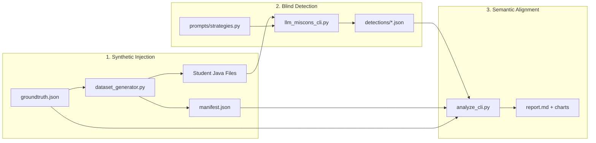

# Architecture Overview

This document describes the system architecture of the **ensemble-eval-cli** research framework.

## High-Level Pipeline



## Core Components

### 1. Data Layer

| File                                          | Purpose                                    |
| --------------------------------------------- | ------------------------------------------ |
| `data/{assignment}/groundtruth.json`          | Notional machine misconception definitions |
| `data/{assignment}/q*.md`                     | Question descriptions                      |
| `authentic_seeded/{assignment}/manifest.json` | Student→misconception mapping              |
| `authentic_seeded/{assignment}/{student}/`    | Generated Java files                       |

### 2. Detection Layer

| File                                        | Purpose                    |
| ------------------------------------------- | -------------------------- |
| `llm_miscons_cli.py`                        | Orchestrates LLM API calls |
| `prompts/strategies.py`                     | 4 prompt architectures     |
| `utils/llm/openrouter.py`                   | OpenRouter SDK wrapper     |
| `detections/{assignment}/{strategy}/*.json` | Raw LLM outputs            |

### 3. Analysis Layer

| File                         | Purpose                                   |
| ---------------------------- | ----------------------------------------- |
| `analyze_cli.py`             | Metrics, visualization, report generation |
| `utils/matching/fuzzy.py`    | Token overlap matching                    |
| `utils/matching/semantic.py` | Embedding-based matching                  |
| `utils/matching/hybrid.py`   | Fused matcher                             |
| `runs/{assignment}/`         | Saved analysis runs                       |

## Data Flow

1. **Ground Truth** → Defines 5 notional machine categories with 8+ misconceptions
2. **Manifest** → Randomly assigns misconceptions to students (40% clean, 60% seeded)
3. **Generation** → GPT-5.1 generates Java code exhibiting each misconception
4. **Detection** → 3 LLMs × 4 strategies analyze each file blindly
5. **Matching** → Fuzzy/semantic/hybrid aligns LLM output to ground truth
6. **Metrics** → Precision, Recall, F1 with bootstrap CIs

## Directory Structure

```
ensemble-eval-cli/
├── data/                    # Ground truth and questions
│   └── a1/
│       ├── groundtruth.json # Misconception taxonomy
│       └── q*.md            # Question prompts
├── authentic_seeded/        # Generated student files
│   └── a1/
│       ├── manifest.json    # Student→misconception map
│       └── {Student_Name}/  # Java files
├── detections/              # LLM detection outputs
│   └── a1/
│       ├── baseline/        # Strategy subdirs
│       ├── taxonomy/
│       ├── cot/
│       └── socratic/
├── runs/                    # Analysis results
│   └── a1/
│       ├── index.json       # Run registry
│       └── run_{id}/        # Individual runs
│           ├── report.md
│           ├── config.json
│           ├── data.json
│           └── assets/      # Charts
├── prompts/                 # Prompt strategies
├── pydantic_models/         # Data models
└── utils/                   # Utilities
    ├── matching/            # Fuzzy/semantic/hybrid
    ├── generators/          # Dataset generation
    └── llm/                 # API clients
```
