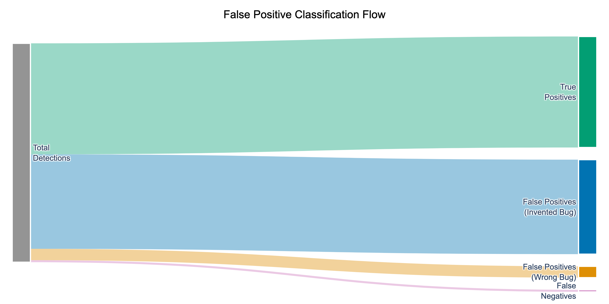

# Mind Over Syntax: Can LLMs Infer CS1 Student Mental Models From Code Alone?

*Draft for internal review (Markdown; will be converted to ACM format). This draft reports results from `runs/v2/run_opus2_main` (label-blind “thinking-only”) and `runs/v2/run_opus2_ablation` (label-aware ablation).*

## Abstract
LLMs are increasingly used in CS1 settings, but most evaluations target functional correctness (grading) rather than the pedagogical task of diagnosing *why* a novice wrote a program a certain way. We study whether LLMs can infer *student mental models*—specifically, notional-machine misconceptions—directly from code evidence. We introduce **TRACER** (Taxonomic Research of Aligned Cognitive Error Recognition), a controlled benchmark and evaluation pipeline that measures **Narrative Fidelity**: whether a model can produce a plausible “student belief” narrative that aligns with a ground-truth misconception narrative *without relying on misconception labels*.

Because real student intent is rarely observable at scale, we construct a synthetic upper-bound benchmark of 1,200 Java CS1 submissions (300 simulated students, 3 assignments × 4 questions) with **18 misconception types seeded into 275 submissions** and **925 clean controls**. Detections are evaluated using a label-blind embedding match between the model’s “student belief” text and ground-truth misconception narratives, with thresholds calibrated via 5-fold stratified cross-validation. In the main (label-blind) evaluation, we obtain **F1=0.694** (precision 0.577, recall 0.872) and **specificity=0.848** on clean code. A label-aware ablation yields near-perfect recall (0.982) but lower precision (0.512) and specificity (0.774), suggesting that requiring narrative justification acts as a calibration constraint. Performance is substantially higher for syntax-visible misconceptions than for logic/state misconceptions, indicating a persistent “visibility gap.” We discuss implications for AI tutoring as hypothesis generation and outline steps needed to validate on authentic student data.

## 1. Introduction
Introductory programming instruction is not just about getting programs to pass tests; it is about helping novices build an accurate mental model of program execution. The *notional machine* framing in computing education describes the explanatory model of how code maps to state changes (du Boulay, 1986; Sorva, 2013). Students’ recurring errors often reflect coherent but incorrect models (e.g., “variables update automatically like spreadsheet cells”).

LLMs can fix code and generate explanations, but a stronger—and riskier—claim is that they can infer what a student was thinking. Our goal is to evaluate this claim precisely and honestly:

> **Can LLMs infer a student’s underlying misconception (mental model) from a CS1 code submission, beyond identifying surface-level bugs?**

We present **TRACER**, a benchmark and evaluation framework for *diagnostic reasoning*, not grading. TRACER evaluates **Narrative Fidelity**: an LLM must describe the student’s belief that plausibly produced the code, and that belief is scored against a ground-truth misconception narrative *without using misconception labels*.

### Research Questions
We structure the study around three research questions:
1. **RQ1 (Narrative Fidelity):** Can LLMs reconstruct a student-belief narrative that matches a ground-truth misconception narrative **without** relying on misconception labels?
2. **RQ2 (Visibility Gap):** Does diagnostic performance degrade for misconceptions that are **logic/state-dependent** (semantic, “invisible”) compared to those that are **syntax-visible** (structural)?
3. **RQ3 (Diagnostic Reliability):** Can simple ensemble methods improve reliability by reducing false positives on clean code while preserving recall?

### Contributions
1. **A controlled, labeled-intent benchmark** of CS1 Java submissions with known misconception narratives (synthetic, intended as an upper bound on performance).
2. **A label-blind narrative evaluation** using semantic embeddings of the model’s “student belief” text matched to ground truth misconception narratives.
3. **A rigorously validated thresholding procedure** (grid search + 5-fold stratified CV) with sensitivity analysis (heatmap) to avoid one-off tuning.
4. Empirical findings on (a) **narrative requirements as a calibration constraint**, (b) a **visibility gap** between structural vs semantic misconceptions, and (c) **ensemble methods** for improved reliability.

## 2. Background and Related Work
### 2.1 Notional Machines and Misconceptions
Notional machines are teaching abstractions of program execution that help novices reason about state, control flow, and data representation (du Boulay, 1986; Sorva, 2013). Misconceptions arise when a student’s implied notional machine diverges from language semantics, often producing systematic error patterns. Diagnosing these misconceptions is pedagogically valuable because interventions can target a specific mistaken belief rather than patching symptoms.

### 2.2 LLMs in CS Education: From Code Correctness to Diagnostic Feedback
Recent work in CS education has studied LLM performance on CS1 tasks and their ability to provide feedback or explanations. However, most evaluations ultimately use correctness-oriented outcomes (test passing, rubric grading, or generic explanation helpfulness). The question we address is narrower but deeper: whether models can recover a student’s *reasoning* (as represented by a misconception narrative) from code evidence.

### 2.3 Why “Narrative Fidelity” Instead of Label Accuracy
Misconception taxonomies use names that students and LLMs do not reliably reproduce. Label accuracy can therefore confound “understanding” with “terminology.” TRACER uses label-blind semantic matching: if a model describes the same belief in different words, it should still be credited; if it only guesses the right label without a coherent narrative, it should not.

## 3. Benchmark Construction: A Controlled Upper Bound on “Student Thinking”
### 3.1 Data Honesty and Motivation
Ground-truth student intent is difficult to obtain: even expert annotators infer intent from artifacts and may disagree. To test capability under controlled conditions, we use a synthetic benchmark where the “student belief” narrative is known because it is explicitly injected during generation. This provides measurement validity at the expense of ecological validity: the benchmark estimates an **upper bound** on performance in realistic settings.

### 3.2 Dataset Overview
We generate 1,200 CS1-style Java submissions:
- **Students:** 300 simulated students (100 per assignment)
- **Assignments:** 3 assignments (A1: variables/math; A2: control flow/loops; A3: arrays/strings)
- **Questions:** 4 questions per assignment → 1,200 submission files
- **Misconceptions:** 18 misconception definitions spanning 10 notional-machine categories
- **Controls:** 925 clean submissions; **Seeded:** 275 submissions with a validated misconception (target was 25% seeded; some seeding attempts fail validation and fall back to clean)

We record pipeline outcomes per assignment (`authentic_seeded/a{1,2,3}/pipeline_stats.json`). In the dataset used for the Opus2 runs, misconception injection fell back to clean submissions for 8 students in A1, 0 in A2, and 17 in A3 (25 total), yielding 275 seeded submissions rather than the intended 300.

### 3.3 The 6-Step Generation and Validation Pipeline
We use a strict pipeline (see `docs/dataset-generation.md`) to ensure that (a) “clean” code is correct, and (b) “seeded” code is compilable but behaviorally incorrect in a way consistent with the injected belief.

1. **Generate correct solution** (persona-aware) for a question.
2. **Compilation guard**: `javac` must succeed (retries on failure).
3. **Correctness guard**: hidden tests must pass (retries on failure).
4. **Misconception injection**: rewrite the solution under a specific “student belief” with explicit action-plan instructions.
5. **Compilable bug guard**: seeded code must compile.
6. **Behavioral divergence guard**: seeded code must fail ≥1 test and differ syntactically from the correct solution; otherwise, retry injection or fall back to a clean submission.

### 3.4 Persona Matrix to Avoid Style Overfitting
To prevent detectors from keying on superficial style, we generate submissions across a 4×3 persona matrix:
- **Coding styles:** minimal, verbose, textbook, messy
- **Cognitive profiles:** procedural, mathematical, cautious

This yields 12 personas per assignment and helps ensure that a misconception can appear in multiple surface forms.

## 4. TRACER Evaluation Framework
### 4.1 Detection Task (What Models Must Output)
For each submission, each model produces zero or more misconception hypotheses with a required *student-belief narrative* and supporting evidence. We evaluate 24 model–strategy combinations (6 model variants × 4 prompting strategies), yielding **28,800** file-level observations (1,200 submissions × 24).

Concretely, this corresponds to **6,600 seeded observations** (275 seeded files × 24) and **22,200 clean observations** (925 clean files × 24), allowing us to measure both misconception recall and over-diagnosis on correct code.

### 4.2 Prompting Strategies
We compare four prompting styles (see `docs/prompts.md`):
1. **Baseline:** “Find the misconception and explain the student belief.”
2. **Taxonomy-guided:** provide notional-machine definitions to ground the space of misconceptions.
3. **Chain-of-thought tracing:** require step-by-step execution reasoning (we do not evaluate chain-of-thought; we evaluate only the narrative field).
4. **Socratic probing:** ask diagnostic questions and then infer the student belief.

### 4.3 Label-Blind Semantic Matching (Narrative Fidelity Metric)
Exact string matching is inappropriate for open-ended narratives. We use semantic embeddings to match each model’s narrative to the closest ground-truth misconception narrative.

**Text used for matching (label-blind main run):**
- **Detection text:** only the model’s `student_belief` narrative (labels and category names excluded).
- **Ground truth text:** only `explanation` + `student_thinking` (misconception name and category excluded).

Embeddings are computed with OpenAI `text-embedding-3-large`, and similarity is cosine distance. Each detection is matched to the ground truth misconception with the highest similarity score.

### 4.4 Thresholding, Noise Filtering, and Null Detection
TRACER includes three key controls to prevent inflated scores:

1. **Null detection recognition (abstention):** models may return “no misconception detected.” We recognize this via a small set of null templates with a semantic similarity threshold (0.80) and treat these as abstentions rather than misconceptions.
2. **Noise floor filtering:** detections with low semantic similarity are often “pedantic” feedback (style, resource closing) rather than misconception narratives. We filter detections with similarity below a calibrated noise floor.
3. **Semantic match threshold:** for retained detections, we apply a calibrated similarity threshold to decide whether to count the best match as a valid prediction.

### 4.5 Rigorous Threshold Calibration (Heatmap + Cross-Validation)
We do not hand-pick thresholds. For each fold in a 5-fold stratified cross-validation (stratified by notional-machine category; seed=42), we:
- Split files into **dev (80%)** and **test (20%)**.
- Run a grid search over **30 configurations**:
  - semantic threshold ∈ {0.55, 0.60, 0.65, 0.70, 0.75, 0.80}
  - noise floor ∈ {0.40, 0.45, 0.50, 0.55, 0.60}
- Select the configuration maximizing dev-set F1 and evaluate it on the held-out test split.

*Figure 1: F1 across the (semantic threshold × noise floor) grid on the main (label-blind) run. The selected configuration is (0.55, 0.60), consistently chosen across folds.*

Across folds, thresholds generalize with minimal dev–test gap:

| Fold | Dev F1 | Test F1 | Dev Specificity | Test Specificity |
| :---: | ---: | ---: | ---: | ---: |
| 1 | 0.691 | 0.707 | 0.851 | 0.837 |
| 2 | 0.691 | 0.708 | 0.851 | 0.840 |
| 3 | 0.692 | 0.705 | 0.845 | 0.864 |
| 4 | 0.705 | 0.651 | 0.850 | 0.842 |
| 5 | 0.694 | 0.700 | 0.846 | 0.859 |

Semantic similarity also meaningfully separates correct vs incorrect matches in the main run: mean similarity is 0.705 (TP) vs 0.648 (FP), with a large effect size (Cliff’s delta 0.616; `runs/v2/run_opus2_main/report.md`).

We report means across folds and include bootstrap confidence intervals (1,000 resamples) as implemented in `utils/statistics.py`.

### 4.6 Evaluation Unit and Confusion Accounting
Each (submission, model, strategy) produces a file-level outcome after collapsing multiple detections to the single highest-confidence (highest similarity) detection:
- Seeded submissions: **TP** (correct misconception), **FP_WRONG** (wrong misconception), or **FN** (no detection).
- Clean submissions: **TN** (no detection) or **FP_CLEAN** (any misconception flagged).

This yields standard precision/recall/F1 on seeded files, and **specificity** on clean files:
\[
\text{Specificity}=\frac{\text{TN}}{\text{TN}+\text{FP\_CLEAN}}
\]

## 5. Results
We organize results around three questions.

### RQ1: Can LLMs Reconstruct Student Thinking Without Label Matching?
In the main (label-blind) evaluation (`run_opus2_main`), aggregated cross-validation performance is:

| Metric (CV mean) | Value |
| :--- | :--- |
| Precision | 0.577 ± 0.029 |
| Recall | 0.872 ± 0.016 |
| F1 | **0.694 ± 0.024** |
| Specificity | **0.848 ± 0.012** |

At the observation level (28,800 file-level decisions): TP=5,305; FP=3,884; FN=775; TN=18,836 (`runs/v2/run_opus2_main/metrics.json`).

Clean-code performance is computed over 22,200 clean observations: TN=18,836 and FP_CLEAN=3,364, yielding specificity 0.848.

| False positive type (main run) | Count | % of FPs |
| :--- | ---: | ---: |
| FP_CLEAN (flagged clean code) | 3,364 | 86.6% |
| FP_WRONG (wrong misconception) | 520 | 13.4% |
| FP_HALLUCINATION (no match) | 0 | 0.0% |

#### Detection Filtering Pipeline
Raw model outputs often include multiple hypotheses per file. TRACER filters and evaluates only substantive narratives:

| Stage | Count | % of Raw |
| :--- | ---: | ---: |
| Raw detections | 29,164 | 100.0% |
| Null-template filtered | 634 | 2.2% |
| Noise floor filtered (<0.60) | 16,819 | 57.7% |
| **Evaluated detections** | **11,711** | **40.2%** |

### RQ1 Ablation: What Happens If We Allow Label Leakage?
We run a label-aware ablation (`run_opus2_ablation`) where misconception labels/categories are included in both detection and ground-truth embedding text. This makes it easier to match by terminology, but it also encourages over-diagnosis on clean code.

| Evaluation Mode | Precision | Recall | F1 | Specificity |
| :--- | ---: | ---: | ---: | ---: |
| **Main (label-blind narrative)** | **0.577** | 0.872 | **0.694** | **0.848** |
| Ablation (label-aware matching) | 0.512 | **0.982** | 0.673 | 0.774 |

In ablation, recall increases sharply, but clean-code false alarms increase: FP_CLEAN rises from 3,364 → 5,014 (specificity drops by 7.4 points).

*Figure 2a: Main run outcome flow. Most false positives are “FP_CLEAN” (over-diagnosis on correct code), not out-of-taxonomy hallucinations.*

*Figure 2b: Ablation outcome flow. Label-aware matching increases detections on clean code (FP_CLEAN), reducing specificity.*

**Interpretation:** Requiring a coherent student-belief narrative (and evaluating it label-blind) acts as a *calibration constraint*: models cannot simply “name a misconception”; they must describe a belief that aligns with a ground-truth misconception narrative.

### RQ2: Is There a Visibility Gap Between Structural vs Semantic Misconceptions?
We observe a consistent drop in performance for misconceptions that are not directly marked by surface syntax and require inference about program state or student intent.

*Figure 3: Structural (syntax-visible) vs semantic (logic/state) performance gap in the main run.*

At the assignment level, performance also varies by conceptual domain:

| Assignment | Focus | Precision | Recall | F1 |
| :--- | :--- | ---: | ---: | ---: |
| a1 | variables/math | 0.504 | 0.771 | 0.610 |
| a2 | loops/control | 0.554 | 0.876 | 0.679 |
| a3 | arrays/strings | 0.686 | 0.971 | 0.804 |

Per-misconception recall highlights remaining “hard cases” in the label-blind evaluation:

*Figure 4: Recall by misconception in the main run. Several semantic/state misconceptions remain substantially below ceiling.*

### RQ3: How Reliable Are Diagnoses, and Can Ensembles Help?
The primary practical risk is false alarms on clean code (precision 0.577). We therefore test simple ensemble voting that requires agreement across independent sources:

| Method | Precision | Recall | F1 |
| :--- | ---: | ---: | ---: |
| Raw (no ensemble) | 0.577 | 0.873 | 0.695 |
| Strategy ensemble (≥2/4) | 0.625 | 0.872 | 0.728 |
| Model ensemble (≥2/6) | **0.682** | 0.864 | **0.762** |

Ensembles substantially improve precision while preserving recall, making the system more viable as a tutoring assistant that proposes *hypotheses* rather than definitive labels.

## 6. Model and Strategy Comparisons (Main Run)
### 6.1 Prompting Strategy Effects

*Figure 5: Strategy comparison across models. In this benchmark, simple baseline/taxonomy prompts outperform Socratic prompting in precision.*

| Strategy | Precision | Recall | F1 |
| :--- | ---: | ---: | ---: |
| baseline | 0.643 | 0.864 | 0.737 |
| taxonomy | 0.630 | 0.885 | 0.736 |
| chain-of-thought | 0.598 | 0.839 | 0.698 |
| socratic | 0.474 | 0.903 | 0.622 |

Across strategies, differences are statistically significant (Cochran’s Q=26.22, p=0.000009; pairwise McNemar tests in `runs/v2/run_opus2_main/report.md`).

### 6.2 Model Family Effects

*Figure 6: Model comparison. Reasoning-enabled variants improve precision and/or F1, particularly for semantic misconceptions.*

| Model | Precision | Recall | F1 |
| :--- | ---: | ---: | ---: |
| claude-haiku-4-5 (reasoning) | **0.776** | 0.880 | **0.825** |
| claude-haiku-4-5 | 0.633 | 0.819 | 0.714 |
| gpt-5.2 (reasoning) | 0.602 | 0.856 | 0.707 |
| gpt-5.2 | 0.594 | 0.846 | 0.698 |
| gemini-3-flash (reasoning) | 0.494 | **0.924** | 0.643 |
| gemini-3-flash | 0.473 | 0.909 | 0.622 |

## 7. Discussion
### 7.1 What These Results Do (and Do Not) Mean
In this controlled benchmark, LLMs can often produce a student-belief narrative that aligns with an injected misconception, even when label terms are removed. This supports a limited but important claim: **models can sometimes infer novice intent beyond grading, at least when the intent is singular, coherent, and expressed in code.**

However, the benchmark is synthetic and therefore optimistic: real students may hold multiple inconsistent misconceptions, may write partially correct code, and may not express intent as cleanly. We therefore interpret scores as an **upper bound** rather than field performance.

### 7.2 The Visibility Gap Suggests “Syntax-Biased” Observation
Performance is near ceiling for misconceptions that produce overt syntactic signatures (e.g., off-by-one, void returns), but drops for misconceptions that require reasoning about invisible state or intent. This suggests current LLM diagnostics behave more like “super-linters” than cognitive modelers for state-heavy misconceptions.

### 7.3 False Positives as Pedagogical Over-Sensitivity
Most false positives are **FP_CLEAN**: the model applies a valid misconception narrative to code that is correct. In tutoring, a mild version of this (“Are you sure you understand why this works?”) may still be useful, but in assessment settings it is problematic. Ensembles and conservative thresholds appear necessary for any deployment.

### 7.4 Practical Implication: Treat Diagnoses as Hypotheses
Given current error patterns, the safest role for this approach is as a *hypothesis generator* for instructors or tutors:
- Require a student-belief narrative (calibrates over-diagnosis).
- Use ensembles to increase precision.
- Present diagnoses with uncertainty and evidence, not as definitive labels.

## 8. Threats to Validity and Ethics
### 8.1 Synthetic Circularity and Ecological Validity
Both the “students” and the evaluators are LLMs (LLM-generated code and LLM diagnostic output). We mitigate this with compilation/testing guards and style diversity, but the setting may still overestimate performance relative to authentic student submissions.

### 8.2 Single-Misconception Assumption
Seeded submissions contain at most one targeted misconception, whereas real code may contain multiple interacting misunderstandings. This simplifies the task.

### 8.3 Metric Dependence on Embeddings and Thresholds
Semantic matching depends on the embedding model and calibrated thresholds. We reduce overfitting risk through 5-fold CV and report threshold sensitivity via a heatmap, but the evaluation is still mediated by embedding geometry.

### 8.4 Ethics
This study uses synthetic data and does not involve human participants. Names are generated and do not correspond to real individuals. The intended use is supportive tutoring and instructor assistance, not automated high-stakes grading.

## 9. Conclusion and Next Steps
TRACER provides a controlled way to test whether LLMs can infer CS1 student mental models from code evidence. In a label-blind evaluation, models achieve F1=0.694 with specificity 0.848, and ensembles improve reliability to F1=0.762. A label-aware ablation shows that label leakage inflates recall while worsening clean-code false alarms, supporting the idea that narrative requirements calibrate diagnostic behavior. The remaining performance gap on semantic/state misconceptions motivates future work incorporating authentic student data, multi-misconception settings, and richer evidence (e.g., execution traces) to better capture “what the student is thinking.”

## References (placeholders; expand for submission)
- du Boulay, B. (1986). Some difficulties of learning to program.
- Sorva, J. (2013). Notional Machines and Introductory Programming Education.
- Additional SIGCSE/ITiCSE/ICER work on LLM feedback and misconception diagnosis (to be added).

## Appendix A (Optional): Threshold Sensitivity in the Label-Aware Ablation
The ablation uses the same threshold grid and selects the same optimal configuration, but the overall scoring landscape shifts because label terms make matching easier and increase over-diagnosis on clean code.

*Figure A1: F1 across the threshold grid in the label-aware ablation (`run_opus2_ablation`).*
