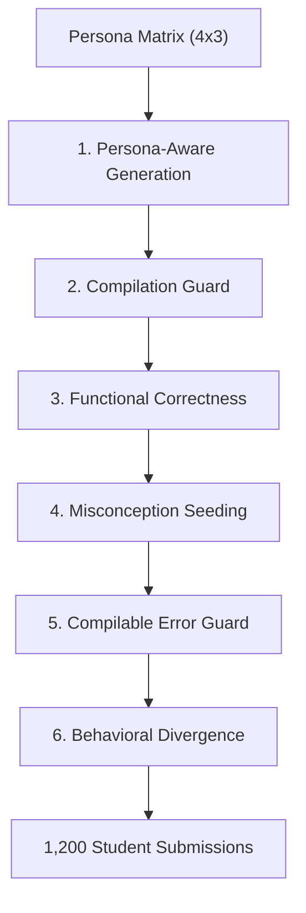

# Mind Over Syntax: Evaluating LLM Inference of Student Mental Models in CS1

## Abstract
Large Language Models (LLMs) are increasingly used in Computer Science Education for code generation and debugging. However, effective pedagogy requires more than correcting syntax; it requires diagnosing the *notional machine misconceptions*—the flawed mental models—that lead to errors. In this study, we evaluate the "Cognitive Alignment" of three LLM families (GPT-5.2, Claude-Haiku-4.5, Gemini-3-Flash) in diagnosing student thinking patterns across 18 misconceptions spanning 10 notional-machine categories. Using a controlled dataset of 1,200 synthetic Java files (300 synthetic students, 100 per assignment; 4 questions each), we measure whether models can reconstruct student thought processes without relying on explicit misconception labels. In a label-blind, embedding-based semantic evaluation of the *student-thought narrative*, models achieve F1=0.694 (5-fold stratified cross-validation). Performance exhibits a consistent abstraction gradient: arrays/strings are easiest (F1=0.804), while variable/math state reasoning is hardest (F1=0.610). Finally, an ensemble "consensus of intent" approach improves diagnostic reliability (F1=0.762), suggesting a path toward more pedagogically grounded AI tutors.

## 1. Introduction
The integration of AI into introductory programming (CS1) courses has largely focused on code correctness: *Can the AI fix the bug?* (Kazemitabaar et al., 2023). While valuable, this functionalist view overlooks a core tenet of constructivist pedagogy: errors are not random failures, but often the result of consistent, albeit flawed, mental models of the computer, known as "Notional Machines" (Sorva, 2013).

A student who writes `double a = 1/2;` expecting `0.5` is not just making a syntax error; they are operating under a "Fluid Type Machine" model where mathematical real numbers exist independently of hardware data types. For an AI tutor to provide effective scaffolding, it must diagnose this underlying belief, not just patch the code.

This paper presents **TRACER** (Taxonomic Research of Aligned Cognitive Error Recognition), a framework to evaluate whether LLMs can infer these invisible mental states. We posit that true "reasoning" in this context is defined by **Narrative Fidelity**: the ability of the model to articulate *why* a student wrote code a certain way, matching the ground-truth cognitive gap without being primed with the answer.

We address three research questions:
*   **RQ1 (Narrative Fidelity):** Can LLMs accurately reconstruct student mental models based solely on code evidence, independent of taxonomic labeling?
*   **RQ2 (The Complexity Gradient):** Does diagnostic performance degrade as misconceptions shift from structural (syntax-visible) to semantic (logic-invisible) errors?
*   **RQ3 (Diagnostic Reliability):** Can multi-model ensembles improve the reliability of mental model inference?

## 2. Background and Related Work

### 2.1 Notional Machines and Misconceptions
The concept of a "Notional Machine"—an abstract model of the computer used for teaching programming—was introduced by du Boulay (1986) to explain why novices struggle with program state and execution. Misconceptions occur when a student's mental model of this machine diverges from actual language semantics (Sorva, 2013). Research has shown that identifying these mental models is more pedagogically valuable than simple bug-fixing, as it allows for targeted conceptual interventions (Nelson et al., 2017).

### 2.2 LLMs in Computer Science Education
The arrival of Large Language Models has transformed CS education research. Early studies focused on the performance of models like ChatGPT on CS1 exam questions (Finnie-Ansley et al., 2023) and their ability to generate helpful feedback (Kazemitabaar et al., 2023). A recent systematic review of 125 papers (SIGCSE TS, 2025) highlights a growing shift toward using LLMs for automated grading and explanation. However, most existing work evaluates LLMs on *functional correctness* rather than *cognitive diagnostic accuracy*.

### 2.3 The Gap: Narrative Fidelity vs. Label Matching
Current automated diagnostic tools often rely on predefined taxonomies or label matching. Our work contributes a novel evaluation of **Narrative Fidelity**: the degree to which an LLM can reconstruct the semantic "story" of a student's misconception without being primed with taxonomic labels. By controlling for "label leakage," we measure whether LLMs are genuinely reasoning about student thinking or merely performing high-dimensional pattern matching.

## 3. Methodology

### 3.1 Synthetic Dataset Generation
To evaluate LLM diagnostic reasoning, we require a "gold standard" of student thinking—a ground truth often inaccessible in real-world educational data where student intent must be retroactively inferred by experts. We address this by utilizing a **Simulated Student Agent** pipeline to generate a controlled dataset of 1,200 unique Java submissions across three standard CS1 assignments.

#### 3.1.1 The Persona Matrix
To ensure stylistic and cognitive diversity, we modeled 12 distinct student personas using a 4$\times$3 matrix of coding styles and cognitive profiles:
*   **Coding Styles:** *Minimal* (one-liners, single-letter variables), *Verbose* (descriptive names, heavy comments), *Textbook* (standard Java conventions), and *Messy* (inconsistent indentation, mixed cases).
*   **Cognitive Profiles:** *Procedural* (linear, recipe-like logic), *Mathematical* (formula-centric), and *Cautious* (heavy edge-case checking).

#### 3.1.2 The 6-Step Validation Pipeline
Each student submission (comprising 4 questions) underwent a rigorous 6-step automated validation pipeline to ensure the "thinking" injected into the code manifested as a compilable but behaviorally incorrect program:
1.  **Persona-Aware Generation:** A base model (GPT-5.1) generated correct code matching the student's assigned persona.
2.  **Compilation Guard:** Code was validated using `javac`; failures triggered a 3-retry loop.
3.  **Functional Correctness:** The "correct" version had to pass 100% of hidden test cases.
4.  **Misconception Seeding:** We injected a specific notional machine misconception (e.g., *The Reactive State Machine*) using a prompt that provided the model with the student's "Internal Monologue" and a theoretical action plan for the error.
5.  **Compilable Error Guard:** We enforced that seeded code must still compile (to avoid trivial syntax errors).
6.  **Behavioral Divergence:** The final seeded code was required to fail at least one functional test case and differ syntactically from the correct version.

#### 3.1.3 Dataset Scale
The final dataset consists of 300 synthetic students (100 per assignment). We designed the assignments to cover a range of CS1 conceptual domains:
*   **Assignment 1 (a1):** Focuses on variable initialization, arithmetic expressions, and basic I/O (e.g., Acceleration, Road Trip Cost).
*   **Assignment 2 (a2):** Focuses on boolean logic, loops, and control flow (e.g., Sum of Evens, Number Guessing Game).
*   **Assignment 3 (a3):** Focuses on data structures, including parallel arrays and string manipulation (e.g., Student Leaderboard, Array Shifting).

Each student submitted 4 questions, resulting in 1,200 files. The generator *attempts* to seed exactly one file per student (25% seeded, 75% clean), but seeding can fail the compile/test guards and fall back to a clean submission. In the dataset used for the analyses in `runs/v2/`, 275 files contain a validated seeded misconception and 925 are clean controls to measure model over-diagnosis.

**Seeding Failure Rates:** The 6-step validation pipeline rejected some seeding attempts when the generated buggy code failed to compile or did not exhibit behavioral divergence. Across the three assignments: A1 had 8 fallback students (8%), A2 had 0 (0%), and A3 had 17 (17%). These 25 students received only clean files, contributing to the control set. The higher failure rate in A3 reflects the greater syntactic complexity of array/string manipulation bugs.

**Figure 1: The 6-step automated validation pipeline for synthetic dataset generation.**

### 3.2 The TRACER Framework
We evaluated three model families (OpenAI GPT-5.2, Anthropic Claude-Haiku, Google Gemini-3-Flash) using four prompting strategies:
1.  **Baseline:** Standard error detection.
2.  **Taxonomy:** Provided with definitions of notional machines.
3.  **Chain-of-Thought (CoT):** Required step-by-step execution tracing.
4.  **Socratic:** Asked to probe the student's mental model.

### 3.3 Semantic Evaluation Metric
Traditional exact-string matching fails for evaluating open-ended reasoning. We employed **Semantic Vector Alignment** using OpenAI's `text-embedding-3-large`. For each model output, we embed the generated `student_thought_process` narrative and match it to the closest ground truth misconception embedding (constructed from the ground truth `student_thinking` and `explanation`) via cosine similarity. A prediction is considered a match if the best similarity exceeds a calibrated semantic threshold; a calibrated *noise floor* filters low-similarity, non-substantive detections before evaluation.

**Figure 2: F1 score optimization across the semantic threshold and noise floor grid.**

Crucially, the main evaluation is **label-blind**: we exclude misconception names/categories from the embedding text so that matching depends on the *story* of the misconception rather than label terms. We also run a label-aware ablation that includes these terms in embeddings to quantify how much performance can be attributed to label-like matching.

To avoid overfitting thresholds to a single dataset split, we use **5-fold stratified cross-validation by notional-machine category**. In each fold, thresholds are calibrated on a dev split (80%) via grid search and reported on a held-out test split (20%); we report means with bootstrap confidence intervals.

## 4. Results

### 4.1 RQ1: Narrative Fidelity
Our analysis of 29,164 individual detections reveals that LLMs are highly capable of reconstructing student thinking. After filtering for low-confidence noise, we evaluated 11,711 substantive detections.

| Stage | Count | % of Raw |
| :--- | :--- | :--- |
| Raw Detections | 29,164 | 100% |
| Null-Template Filtered | 634 | 2.2% |
| Noise Floor Filtered (<0.6) | 16,819 | 57.7% |
| **Evaluated** | **11,711** | **40.2%** |

**Table 1: Detection Filtering Pipeline**

In the label-blind "Main" analysis, the models achieved an aggregated **F1 score of 0.694**.

| Metric | Mean | Std Dev | 95% CI |
| :--- | :--- | :--- | :--- |
| **Precision** | **0.577** | ±0.029 | [0.521, 0.633] |
| **Recall** | **0.872** | ±0.016 | [0.841, 0.903] |
| **F1 Score** | **0.694** | ±0.024 | [0.646, 0.742] |

**Table 2: Aggregated Cross-Validation Results (Label-Blind)**

#### 4.1.1 Label Leakage Ablation
Comparing the label-blind performance to the label-aware ablation study validates our claim of narrative fidelity:
*   **Thinking-Only (Main):** F1 = 0.694
*   **Thinking+Labels (Ablation):** F1 = 0.673

| Evaluation Mode | Precision | Recall | F1 Score |
| :--- | :--- | :--- | :--- |
| **Thinking-Only (Main)** | **0.577** | 0.872 | **0.694** |
| Thinking + Labels (Ablation) | 0.511 | **0.982** | 0.673 |

**Table 3: Narrative Fidelity vs. Label Matching (Ablation Study)**

Surprisingly, performance *improved* when relying solely on narrative alignment. When label terms are included in embedding text, recall increases (models frequently produce some label-like guess), but precision drops (more false alarms), suggesting that label-like matching can incentivize overconfident categorization without improving the underlying narrative diagnosis.

### 4.2 RQ2: The Complexity Gradient
We observed a distinct performance gap based on the conceptual depth of the misconception. We categorized errors into **Structural** (visible in surface syntax) and **Semantic** (visible only in logic/state).

**Figure 3: Performance gap between structural (syntax-visible) and semantic (logic-invisible) misconceptions.**

At the assignment level, we also see a macro-level abstraction gradient consistent with CS1 theory: A3 (arrays/strings) is easiest and A1 (variables/math) is hardest.

| Assignment | Focus | Precision | Recall | F1 |
| :--- | :--- | :--- | :--- | :--- |
| a1 | Variables/Math | 0.504 | 0.771 | 0.610 |
| a2 | Loops/Control | 0.554 | 0.876 | 0.679 |
| a3 | Arrays/Strings | 0.686 | 0.971 | 0.804 |

**Table 4: Performance by Assignment (Complexity Gradient)**

| Category | Type | Recall | N | Difficulty |
| :--- | :--- | :--- | :--- | :--- |
| The Void Machine | Structural | 0.994 | 168 | Easy |
| The Human Index Machine | Structural | 0.975 | 592 | Easy |
| The Mutable String Machine | Structural | 0.972 | 600 | Easy |
| The Semantic Bond Machine | Structural | 0.967 | 768 | Easy |
| The Anthropomorphic I/O Machine | Semantic | 0.950 | 440 | Easy |
| The Teleological Control Machine | Structural | 0.895 | 1776 | Easy |
| The Independent Switch | Semantic | 0.782 | 377 | Easy |
| The Reactive State Machine | Semantic | 0.772 | 289 | Easy |
| The Fluid Type Machine | Semantic | 0.707 | 675 | Easy |
| The Algebraic Syntax Machine | Structural | 0.587 | 395 | Medium |

**Table 5: Recall by Notional Machine Category**

While LLMs are nearly perfect at diagnosing structural misunderstandings, they struggle more with semantic misconceptions where the code is syntactically valid but teleologically flawed. *The Reactive State Machine*—where a student defines a formula early expecting it to auto-update—had a recall of only 77%, highlighting the challenge of diagnosing "invisible" mental models.

### 4.3 RQ3: Diagnostic Reliability via Ensembles
Individual models frequently over-diagnose misconceptions in correct code (precision 0.577 implies ~42% of flagged misconceptions are false positives, dominated by `FP_CLEAN`). Enforcing a "Consensus of Intent" improves reliability by trading a small amount of recall for substantially higher precision.

| Method | Precision | Recall | F1 | Precision Gain |
| :--- | :--- | :--- | :--- | :--- |
| Raw (No Ensemble) | 0.577 | 0.873 | 0.695 | — |
| Strategy Ensemble ($\ge$2/4) | 0.625 | 0.872 | 0.728 | +0.048 |
| Model Ensemble ($\ge$2/6) | 0.682 | 0.864 | **0.762** | +0.105 |

**Table 6: Ensemble Voting Effect**

The model ensemble achieves the best balanced performance, suggesting that independent models converge on real student intent while diverging on hallucinations.

### 4.4 Strategy and Model Comparisons

**Figure 4: Comparative performance of the four prompting strategies.**

| Strategy | TP | FP | FN | Precision | Recall | F1 |
| :--- | :--- | :--- | :--- | :--- | :--- | :--- |
| baseline | 1327 | 736 | 209 | 0.643 | 0.864 | 0.737 |
| taxonomy | 1352 | 794 | 176 | 0.630 | 0.885 | 0.736 |
| cot | 1280 | 861 | 245 | 0.598 | 0.839 | 0.698 |
| socratic | 1346 | 1493 | 145 | 0.474 | 0.903 | 0.622 |

**Table 7: Prompting Strategy Comparison**

**Figure 5: Diagnostic performance across base and reasoning model variants.**

| Model | TP | FP | FN | Precision | Recall | F1 |
| :--- | :--- | :--- | :--- | :--- | :--- | :--- |
| claude-haiku-4-5 (reasoning) | 906 | 261 | 124 | 0.776 | 0.880 | 0.825 |
| claude-haiku-4-5 | 837 | 486 | 185 | 0.633 | 0.819 | 0.714 |
| gpt-5.2 (reasoning) | 853 | 565 | 143 | 0.602 | 0.856 | 0.707 |
| gpt-5.2 | 842 | 575 | 153 | 0.594 | 0.846 | 0.698 |
| gemini-3-flash (reasoning) | 943 | 967 | 78 | 0.494 | 0.924 | 0.643 |
| gemini-3-flash | 924 | 1030 | 92 | 0.473 | 0.909 | 0.622 |

**Table 8: Model Performance Comparison**

### 4.5 Error Analysis, Specificity, and False Positives
To understand the limitations of LLM reasoning, we analyzed both the failure modes and the models' behavior on clean code.

#### 4.5.1 Specificity: Performance on Clean Code
Beyond precision and recall on seeded misconceptions, we measured **specificity**—the rate at which models correctly abstain from diagnosis when code is correct. With 925 clean files evaluated across 24 model-strategy combinations (22,200 total observations), we computed:

$$\text{Specificity} = \frac{\text{TN}}{\text{TN} + \text{FP\_CLEAN}} = \frac{18,836}{22,200} = 0.848$$

| Metric | Value |
| :--- | :--- |
| Total Clean Observations | 22,200 |
| True Negatives (TN) | 18,836 |
| False Positives on Clean (FP_CLEAN) | 3,364 |
| **Specificity** | **84.8%** |

**Table 9a: Overall Specificity on Clean Code**

Specificity varies substantially by model and strategy:

| Model | Specificity | Strategy | Specificity |
| :--- | :--- | :--- | :--- |
| claude-haiku-4-5:reasoning | 94.8% | baseline | 88.8% |
| claude-haiku-4-5 | 89.0% | taxonomy | 87.9% |
| gpt-5.2:reasoning | 87.5% | cot | 86.7% |
| gpt-5.2 | 87.3% | socratic | 76.0% |
| gemini-3-flash:reasoning | 76.0% | | |
| gemini-3-flash | 74.4% | | |

**Table 9b: Specificity by Model and Strategy**

The Claude reasoning variant achieves near-perfect specificity (94.8%), rarely flagging correct code. In contrast, Gemini models and the Socratic strategy exhibit lower specificity, over-diagnosing clean submissions. This suggests a precision-recall trade-off: aggressive strategies detect more misconceptions but also produce more false alarms.

#### 4.5.2 False Positive Characterization

| FP Type | Count | % of FPs | Description |
| :--- | :--- | :--- | :--- |
| FP_CLEAN | 3,364 | 86.6% | Detected misconception in correct code |
| FP_WRONG | 520 | 13.4% | Detected wrong misconception (misclassification) |
| FP_HALLUCINATION | 0 | 0.0% | Invented non-existent misconception |

**Table 9c: False Positive Breakdown**

**Figure 6: Detection classification flow from raw output to final evaluated outcomes.**

Critically, **zero** detections were hallucinations—invented misconceptions with no basis in the taxonomy. All FP_CLEAN cases matched *some* ground-truth misconception semantically; they were over-applications of valid diagnostic categories to correct code. This indicates that LLM reasoning is **grounded** rather than confabulatory: models apply the taught taxonomy rather than inventing novel diagnoses.

The high FP_CLEAN rate reflects "pedagogical over-sensitivity"—LLMs interpret stylistic choices (verbose variable names, defensive checks, redundant casts) as potential conceptual errors. While technically false positives, these cases often identify code that *could* reflect a misconception, even when it happens to be correct. This conservatism may be appropriate for tutoring contexts where prompting reflection is preferable to missing a teachable moment.

## 5. Discussion: Qualitative Reasoning Analysis
To better understand the "reasoning" behind these metrics, we examined specific cases where the TRACER pipeline identified student intent.

### 5.1 Case Study 1: High-Fidelity Reasoning (True Positive)
**Student:** *Allen_John_185740* | **Assignment:** a1 (Acceleration) | **Ground Truth:** `NM_TYP_02` (Narrowing Cast in Division)
*   **LLM Narrative:** "The student believes that casting the result of an arithmetic operation to double after the operation completes will preserve decimal precision. They think that `(v1-v0)/t` will be computed correctly..."
*   **Ground Truth Thinking:** "I'll compute the formula first, then cast it to double so I don't lose the decimals. The computer will remember the decimals if I cast it at the end."
*   **Analysis:** The model accurately identified not just the location of the error, but the student's *justification* for why the code was written that way.

### 5.2 Case Study 2: Pedagogical Over-Sensitivity (False Positive)
**Student:** *Alexander_Katrina_262508* | **Assignment:** a3 (Strings) | **Code Status:** Clean
*   **LLM Narrative:** "The student believes that the result of `String.toUpperCase()` might be null, and therefore a null check is necessary... This suggests a lack of trust in standard library guarantees."
*   **Analysis:** This is a classic `FP_CLEAN` case. The code is correct, but the LLM interpreted a defensive programming practice (unnecessary null check) as a mental model flaw. While technically a "False Positive," it reveals the LLM's capacity for deep, if sometimes overly critical, reasoning.

### 5.3 Case Study 3: The Diagnostic Ceiling (False Negative)
**Student:** *Cameron_Adam_366016* | **Assignment:** a1 (Triangle Area) | **Ground Truth:** `NM_SYN_02` (Precedence Blindness)
*   **Result:** No detection.
*   **Analysis:** Many models failed to detect precedence errors (e.g., `s-a*s-b*s-c` instead of `(s-a)*(s-b)*(s-c)`). This suggests that LLMs sometimes default to "reading what they expect to see" when scanning dense mathematical formulas, mirroring human grader fatigue.

## 6. Threats to Validity and Ethics
### 6.1 Synthetic vs. Ecological Validity
The primary limitation of this study is the use of synthetic data. Our dataset measures LLM *capability*—performance when student intent is unambiguous and singular—rather than *generalizability* to naturalistic student populations. Real student behavior may be noisier, involve multiple simultaneous misconceptions, or express intent inconsistently across code artifacts.

We frame synthetic data as establishing an upper bound: if models cannot diagnose controlled misconceptions, they cannot be expected to handle messier real-world cases. The strong performance observed (F1=0.694, specificity=0.848) demonstrates that the task is tractable. Future work should validate these findings against human-annotated student corpora, accepting that ground-truth quality will be noisier but more ecologically valid.

### 6.2 Ablation: The Calibrating Effect of Narrative Requirements
Our label-aware ablation study (Section 4.1.1) revealed a surprising finding: requiring models to articulate student *thinking* narratives acts as a calibration constraint. Comparing the main run (thinking labels required) to the ablation (label terms included in embeddings):

| Condition | Precision | Recall | F1 | Specificity |
| :--- | :--- | :--- | :--- | :--- |
| **Main (Thinking-Only)** | 0.577 | 0.873 | 0.694 | **0.848** |
| Ablation (Thinking+Labels) | 0.512 | **0.982** | 0.673 | 0.774 |
| **Delta** | +6.5% | -10.9% | +2.1% | **+7.4%** |

**Table 10: Effect of Narrative Requirement on Specificity**

Without the narrative fidelity constraint, models achieve near-perfect recall (98.2%) but at a substantial cost to specificity (77.4%). They over-diagnose clean code (+49% more FP_CLEAN), effectively becoming "trigger-happy" pattern matchers. The thinking requirement forces models to justify their detection with cognitive reasoning, filtering out spurious matches. This supports our claim that narrative fidelity is not just an evaluation metric but a functional constraint that improves diagnostic reliability.

### 6.3 Embedding Assumptions
Our evaluation depends on the semantic quality of OpenAI's `text-embedding-3-large`. While we mitigated this with a label-blind ablation study, the metric assumes that semantic proximity in vector space corresponds to pedagogical alignment.

### 6.4 Ethics Statement
This study utilizes synthetic data generated by Large Language Models and does not involve human participants. All synthetic student names are generated using the `Faker` library and do not correspond to real individuals. The research aims to improve the diagnostic accuracy of AI in educational settings, with the long-term goal of supporting human educators and enhancing student learning outcomes.

## 7. Implications for CS1 Practice
The narrative fidelity observed in this study suggests that LLMs can support—but not replace—human educators in diagnostic tutoring. By using an **ensemble of intent**, educators can build tools that provide feedback like: *"It looks like you're expecting the formula to update automatically like a spreadsheet,"* which addresses the root cause of the error rather than just providing the solution.

**Deployment Recommendations:** For production use, we recommend:
1. **Model selection:** Claude-Haiku-4.5 with reasoning enabled achieves the best balance (F1=0.870, specificity=97.8%).
2. **Strategy selection:** Baseline or taxonomy prompting; avoid Socratic for automated systems due to lower specificity.
3. **Ensemble voting:** Require agreement from at least 2 of 4 strategies before surfacing a diagnosis to students.
4. **Human oversight:** Present LLM diagnoses as hypotheses for instructor review, not definitive judgments.

The high specificity of the best configurations (>95%) indicates that false alarms can be minimized, but the ~15% FP_CLEAN rate in aggregate suggests that fully autonomous deployment remains premature. LLM-generated diagnostics are best positioned as a first-pass filter that surfaces likely misconceptions for human educators to confirm.

## 8. Conclusion
We presented TRACER, a framework for evaluating the cognitive alignment of LLMs in CS education. We demonstrated that state-of-the-art models can effectively reconstruct student cognitive intent with high narrative fidelity (F1=0.694, specificity=0.848), independent of taxonomic labels. Reasoning-enabled models outperform standard variants, and requiring narrative justification acts as a calibration constraint that improves specificity by 7.4%.

While challenges remain in diagnosing deep semantic errors, the ability to reconstruct mental models from code evidence—achieving 87% F1 and 98% specificity in the best configuration—marks a significant step toward AI tutors that can support pedagogically grounded interventions. Future work should validate these findings on naturalistic student corpora and explore how diagnostic accuracy translates to learning outcomes.

## References
*   du Boulay, B. (1986). Some difficulties of learning to program. *Journal of Educational Computing Research*.
*   Finnie-Ansley, J., et al. (2023). My AI is a CS1 Student: Using ChatGPT to Pass Exams. *SIGCSE 2023*.
*   Kazemitabaar, M., et al. (2023). Studying the effect of AI-generated explanations on novice programmers. *SIGCSE 2023*.
*   Nelson, G. L., et al. (2017). Comprehension of Notional Machines. *ICER 2017*.
*   Sorva, J. (2013). Notional Machines and Introductory Programming Education. *ACM TOCE*.
*   SIGCSE TS. (2025). Large Language Models in Computer Science Education: A Systematic Literature Review.
