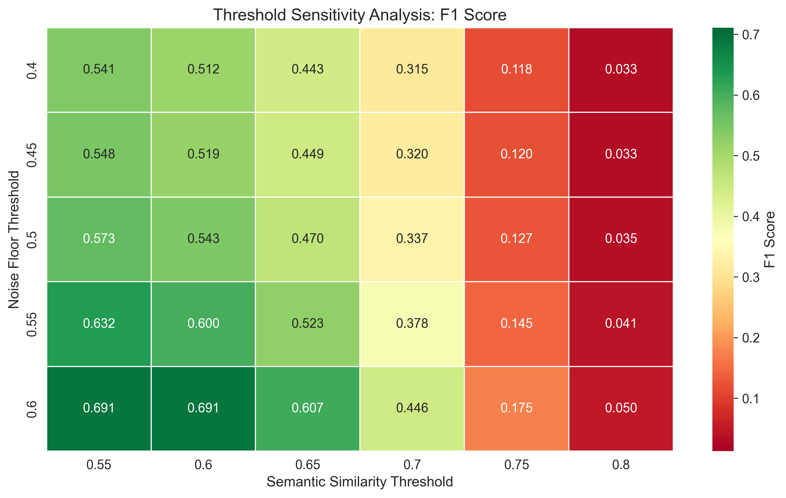

# Mind Over Syntax: Can LLMs Infer CS1 Student Mental Models From Code Alone?

_Condensed draft for advisor review (Markdown; will be converted to ACM format). Targeting ITiCSE 2026 paper limit (≤6 pages + references-only page). Additional figures/tables are moved to `supplementary.md`._

## Abstract

LLMs can now fix code and explain solutions, but a higher-stakes pedagogical question is whether they can infer _why_ a novice wrote code a certain way—i.e., the student’s underlying mental model or misconception—rather than merely grading correctness. We study this question in a controlled setting using **TRACER** (Taxonomic Research of Aligned Cognitive Error Recognition), an evaluation framework for **Narrative Fidelity**: given only a CS1 code submission, an LLM must produce a “student belief” narrative that plausibly generated the code, and that narrative is scored against a ground-truth misconception narrative **without using misconception labels**.

Because authentic student intent is rarely observable at scale, we construct a synthetic upper-bound benchmark of 1,200 Java CS1 submissions with 18 misconception types seeded into 275 submissions and 925 clean controls. Using label-blind semantic matching with thresholds selected by 5-fold stratified cross-validation, the main evaluation obtains **F1=0.695** (precision 0.577, recall 0.873) with **specificity=0.848** on clean code. A label-aware ablation reaches recall 0.982 but worsens specificity (0.774), consistent with label leakage increasing over-diagnosis. We also find a persistent **visibility gap**: misconceptions that require reasoning about invisible state are harder than syntax-visible misconceptions. We discuss implications for safe tutoring (diagnoses as hypotheses) and outline what is needed to validate on authentic student data.

## 1. Introduction

Introductory programming instruction is not just about passing tests; it is about building an accurate mental model of program execution. In computing education, _notional machines_ describe how learners explain code as state changes (du Boulay, 1986; Sorva, 2013). Many recurring errors reflect coherent but incorrect models.

LLMs can debug and generate explanations, but the research question here is narrower and more falsifiable: **can an LLM infer a student’s misconception from code evidence, beyond identifying surface-level bugs?** We propose **TRACER**(Taxonomic Research of Aligned Cognitive Error Recognition), a benchmark and evaluation pipeline for diagnostic reasoning, not grading.

### Research Questions

1. **RQ1 (Narrative Fidelity):** Can LLMs reconstruct a student-belief narrative that matches a ground-truth misconception narrative **without** relying on misconception labels?
2. **RQ2 (Visibility Gap):** Does performance degrade for misconceptions that are **logic/state-dependent** (semantic) compared to those that are **syntax-visible** (structural)?
3. **RQ3 (Diagnostic Reliability):** Can simple ensembles reduce over-diagnosis on clean code while preserving recall?

### Contributions

- **Benchmark:** 1,200 CS1 Java submissions with known injected misconception narratives (synthetic; interpreted as an upper bound).
- **Metric:** a label-blind narrative evaluation (semantic matching of “student belief” narratives to ground truth narratives).
- **Rigor:** threshold calibration via grid search + 5-fold stratified cross-validation (with sensitivity heatmap).
- **Findings:** (i) narrative requirements act as a calibration constraint, (ii) a structural–semantic visibility gap persists, and (iii) ensembles improve reliability.

## 2. Method

### 2.1 Benchmark Construction (Synthetic Upper Bound)

We generate 1,200 CS1-style Java submissions (300 simulated students, 3 assignments × 4 questions). We seed 18 misconception types into 275 submissions and keep 925 clean controls. Seeding targets 25%, but some injections fail validation and fall back to clean (25 total fallbacks across assignments.

Each submission is produced by a strict compilation/testing pipeline: (1) generate a correct solution, (2) compile, (3) pass hidden tests, (4) inject one misconception via a “student belief” rewrite, (5) compile again, (6) fail ≥1 hidden test (behavioral divergence) or fall back to clean. We diversify surface form via a 4×3 persona matrix (4 coding styles × 3 cognitive profiles) to reduce style overfitting.

### 2.2 Diagnostic Task and Experimental Design

For each submission, a model may output zero or more misconception hypotheses, each with a required `student_belief` narrative and evidence. We evaluate 24 model–strategy combinations (6 model variants × 4 prompting strategies), producing 28,800 file-level decisions (1,200 submissions × 24): 6,600 seeded observations and 22,200 clean observations.

### 2.3 Narrative Fidelity Metric (Label-Blind Semantic Matching)

We score each file-level decision by semantically matching the model’s `student_belief` narrative to the closest ground-truth misconception narrative using cosine similarity on `text-embedding-3-large`. In the main run, we **exclude misconception names/categories** from both the detection text and the ground-truth text to avoid label leakage. We treat “no misconception detected” outputs as abstentions using a small set of null templates with similarity ≥0.80.

### 2.4 Threshold Calibration (Heatmap + Cross-Validation)

We calibrate two thresholds (semantic match threshold; noise floor) with a 30-point grid search inside 5-fold stratified cross-validation (seed=42; stratified by notional-machine category). The same configuration (semantic=0.55, noise=0.60) is selected in all folds.

_Figure 1: F1 across the (semantic threshold × noise floor) grid. Thresholds are selected on dev folds and evaluated on held-out folds; the chosen configuration is stable across folds._

## 3. Results

### RQ1: Narrative Fidelity (Main) and Label Leakage (Ablation)

Table 1 reports performance for the main (label-blind) evaluation. At the observation level: TP=5,305; FP=3,884; FN=775; TN=18,836 (28,800 decisions). Most false positives are over-diagnoses on clean code (FP_CLEAN=3,364; 86.6% of all FPs), not out-of-taxonomy hallucinations.

In a label-aware ablation, recall increases sharply (0.982) but specificity drops to 0.774 as clean-code false alarms rise (FP_CLEAN=5,014). This supports the claim that **requiring and scoring a narrative (label-blind)** acts as a calibration constraint: models cannot simply “name a misconception.”

| Setting                         | Precision |    Recall |        F1 | Specificity |
| :------------------------------ | --------: | --------: | --------: | ----------: |
| Main (label-blind narrative)    |     0.577 |     0.873 |     0.695 |   **0.848** |
| Ablation (label-aware matching) |     0.512 | **0.982** |     0.673 |       0.774 |
| Strategy ensemble (≥2/4)        |     0.625 |     0.872 |     0.728 |           — |
| Model ensemble (≥2/6)           | **0.682** |     0.864 | **0.762** |           — |

_Table 1: Main results and two simple ensemble variants (ensemble rows from `runs/v2/run_opus2_main/report.md`)._

### RQ2: Structural vs Semantic “Visibility Gap”

Figure 2 shows a large performance gap between structural (syntax-visible) misconceptions and semantic (logic/state) misconceptions in the main run: the system is substantially better when the misconception leaves an overt surface signature, and worse when diagnosis requires inferring invisible state or intent.

_Figure 2: Structural (syntax-visible) vs semantic (logic/state) performance gap in the main run._

### RQ3: Diagnostic Reliability via Ensembles

Precision in the main run (0.577) implies frequent over-diagnosis on correct submissions. Simple agreement rules improve reliability (Table 1): requiring agreement across prompting strategies improves F1 to 0.728, and requiring agreement across models improves F1 to 0.762 (primarily via precision gains). This makes the approach more plausible as a tutoring assistant that proposes _hypotheses_ rather than definitive labels.

## 4. Discussion, Limitations, and Ethics

### 4.1 What the Results Mean (and Do Not Mean)

In this synthetic upper-bound benchmark, LLMs can often produce a student-belief narrative that aligns with an injected misconception even when label terms are removed. This supports a limited claim: **models can sometimes infer novice intent beyond grading when the intent is singular, coherent, and expressed in code.**

However, the benchmark is optimistic. Real students may hold multiple interacting misconceptions, write partially correct code, and express intent less cleanly. These results should not be interpreted as field performance without validation on authentic data.

### 4.2 Practical Implication: Treat Diagnoses as Hypotheses

Given the high rate of FP_CLEAN errors, the safest near-term role is hypothesis generation for instructors or tutoring systems: require an explicit student-belief narrative, present uncertainty and evidence, and consider ensembles/conservative thresholds to reduce over-diagnosis.

### 4.3 Threats to Validity

Key threats include synthetic circularity (LLM-generated submissions evaluated by LLMs), a single-misconception assumption in seeded files, and dependence on embedding geometry and calibrated thresholds (mitigated via cross-validation and sensitivity analysis).

### 4.4 Ethics

This study uses synthetic data and does not involve human participants. The intended use is supportive tutoring and instructor assistance, not automated high-stakes grading.

## 5. Conclusion

TRACER provides a controlled way to test whether LLMs can infer CS1 student mental models from code evidence. In a label-blind evaluation, Opus2 achieves F1=0.695 with specificity 0.848 on clean code, and ensembles improve reliability to F1=0.762. Performance remains meaningfully lower on semantic/state misconceptions, motivating future work with authentic student data and richer evidence (e.g., execution traces) to better capture what a student is thinking.

## References (partial; expand for submission)

- du Boulay, B. (1986). Some difficulties of learning to program.
- Sorva, J. (2013). Notional Machines and Introductory Programming Education.
