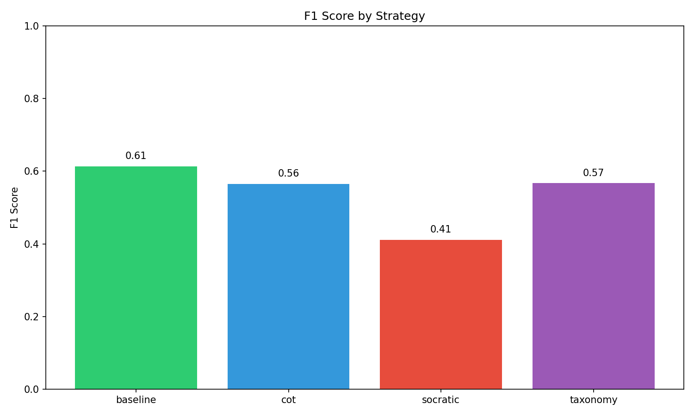
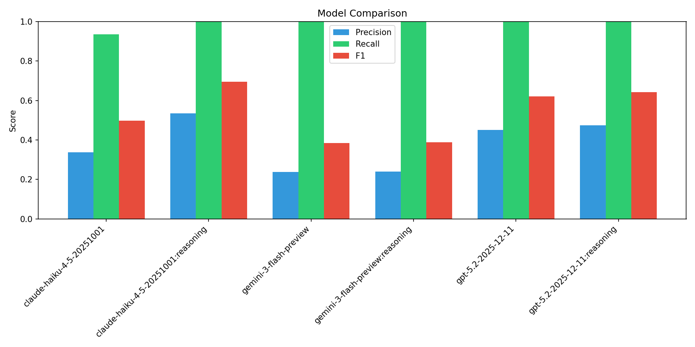
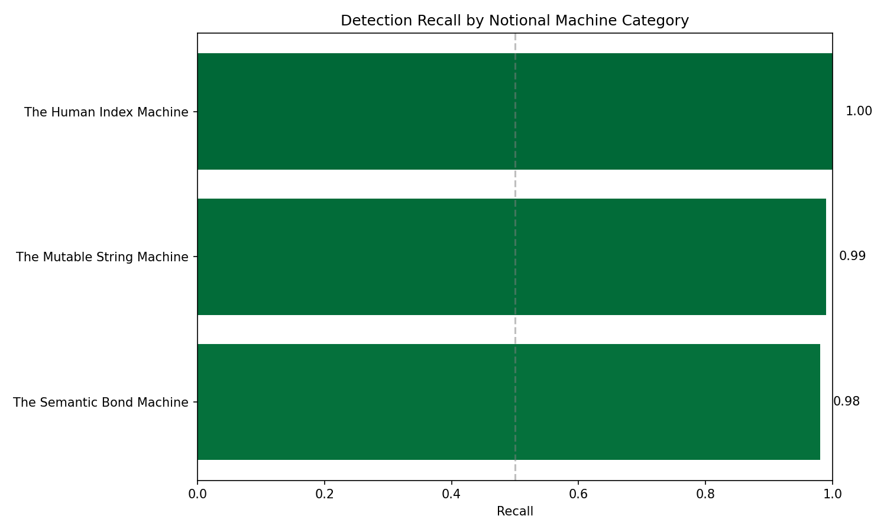
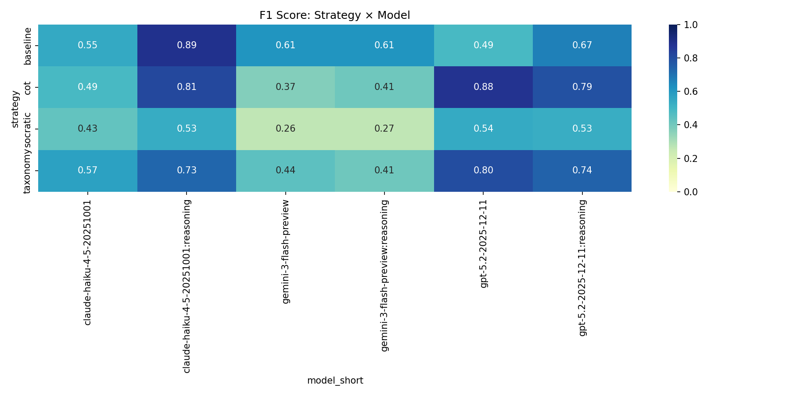
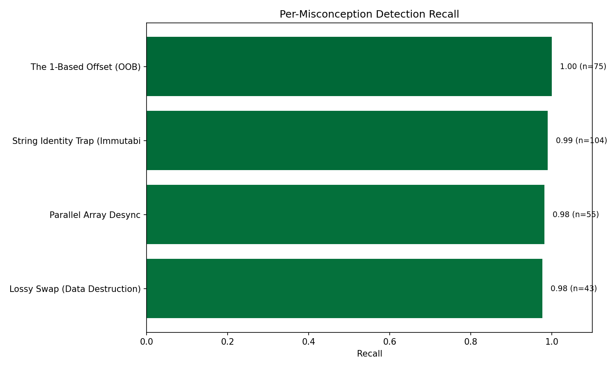
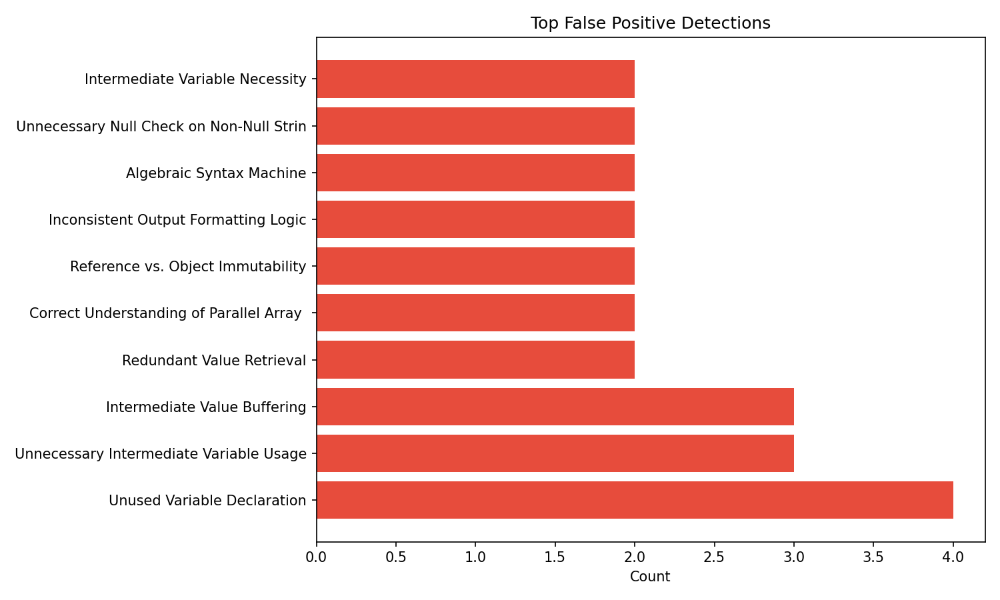

# LLM Misconception Detection: Analysis Report
_Generated: 2025-12-20T23:06:07.391886+00:00_

## Dataset Configuration
- **Students:** 100
- **Questions:** 0
- **Seed:** 1765142264
- **Match Mode:** hybrid

## Overall Metrics
| Metric | Value |
|--------|-------|
| True Positives | 274 |
| False Positives | 516 |
| False Negatives | 3 |
| **Precision** | **0.347** |
| **Recall** | **0.989** |
| **F1 Score** | **0.514** |

## Performance by Strategy
| Strategy | TP | FP | FN | Precision | Recall | F1 |
|----------|----|----|----|-----------| -------|-----|
| baseline | 61 | 77 | 0 | 0.442 | 1.000 | 0.613 |
| cot | 65 | 97 | 3 | 0.401 | 0.956 | 0.565 |
| socratic | 87 | 249 | 0 | 0.259 | 1.000 | 0.411 |
| taxonomy | 61 | 93 | 0 | 0.396 | 1.000 | 0.567 |

## Performance by Model
| Model | TP | FP | FN | Precision | Recall | F1 |
|-------|----|----|----|-----------|--------|-----|
| claude-haiku-4-5-20251001 | 44 | 86 | 3 | 0.338 | 0.936 | 0.497 |
| claude-haiku-4-5-20251001:reasoning | 39 | 34 | 0 | 0.534 | 1.000 | 0.696 |
| gemini-3-flash-preview | 42 | 135 | 0 | 0.237 | 1.000 | 0.384 |
| gemini-3-flash-preview:reasoning | 44 | 139 | 0 | 0.240 | 1.000 | 0.388 |
| gpt-5.2-2025-12-11 | 50 | 61 | 0 | 0.450 | 1.000 | 0.621 |
| gpt-5.2-2025-12-11:reasoning | 55 | 61 | 0 | 0.474 | 1.000 | 0.643 |

## Notional Machine Category Detection (RQ2)

> This table shows which mental model categories are easier/harder for LLMs to detect.

| Category | Recall | N |
|----------|--------|---|
| The Semantic Bond Machine | 0.980 | 98 |
| The Mutable String Machine | 0.990 | 104 |
| The Human Index Machine | 1.000 | 75 |

## Strategy × Model Heatmap

## Per-Misconception Detection Rates
| ID | Name | Category | Recall | N |
|----|------|----------|--------|---|
| NM_MEM_05 | Lossy Swap (Data Destruction) | The Semantic Bond Machine | 0.98 | 43 |
| NM_MEM_01 | Parallel Array Desync | The Semantic Bond Machine | 0.98 | 55 |
| NM_MEM_03 | String Identity Trap (Immutability) | The Mutable String Machin | 0.99 | 104 |
| NM_MEM_04 | The 1-Based Offset (OOB) | The Human Index Machine | 1.00 | 75 |

## False Positive Analysis

