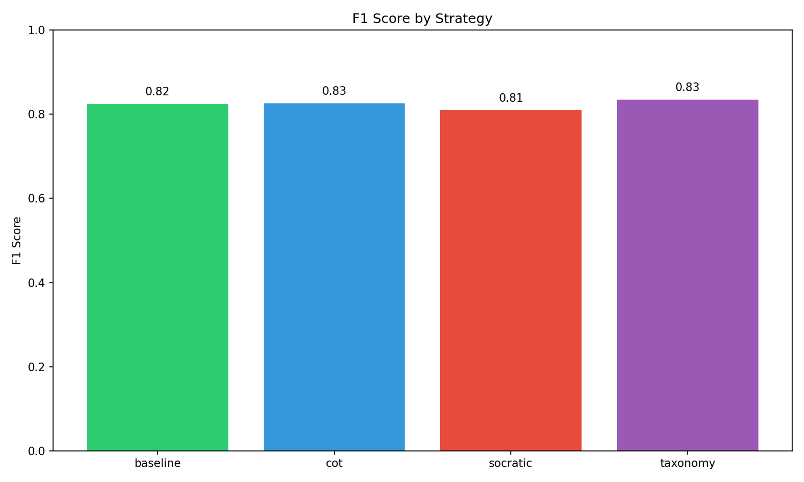
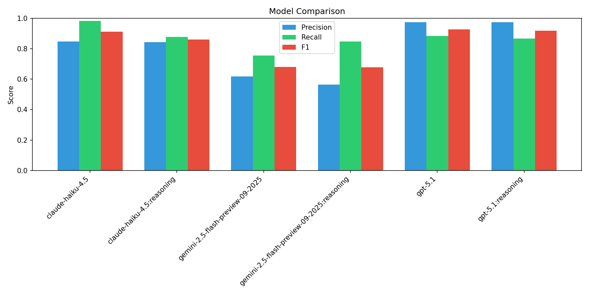
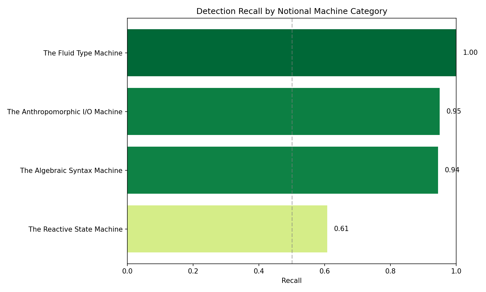
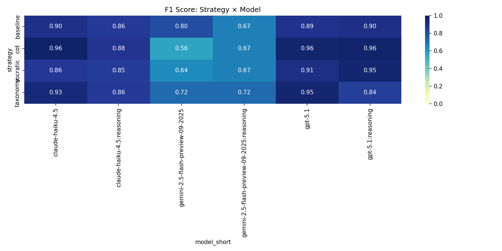
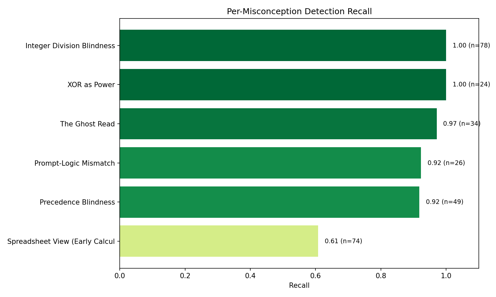
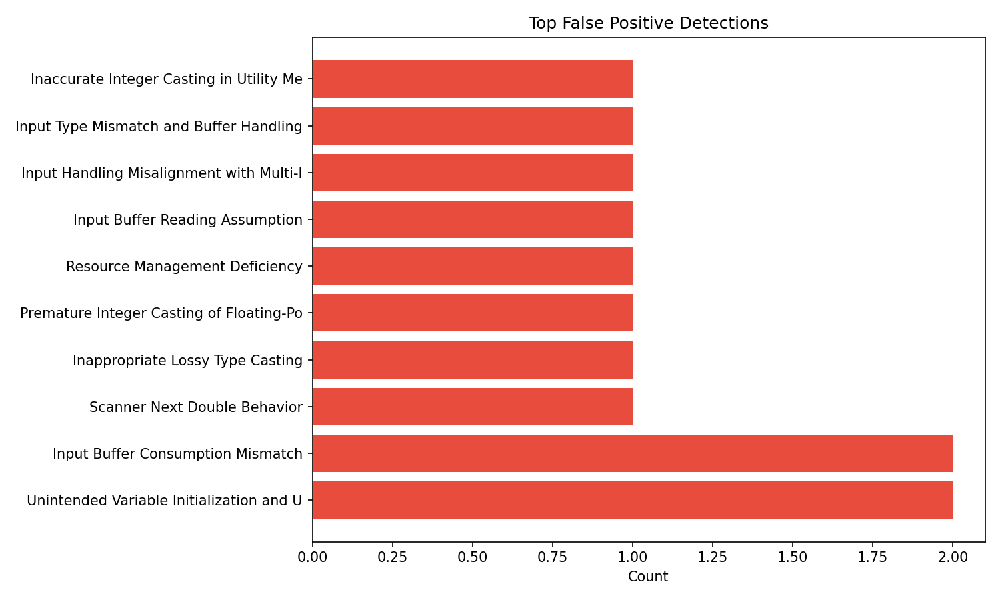

# LLM Misconception Detection: Analysis Report
_Generated: 2025-12-06T18:34:45.698559+00:00_

## Dataset Configuration
- **Students:** 10
- **Questions:** 4
- **Seed:** 1765036611
- **Match Mode:** hybrid

## Overall Metrics
| Metric | Value |
|--------|-------|
| True Positives | 249 |
| False Positives | 71 |
| False Negatives | 36 |
| **Precision** | **0.778** |
| **Recall** | **0.874** |
| **F1 Score** | **0.823** |

## Performance by Strategy
| Strategy | TP | FP | FN | Precision | Recall | F1 |
|----------|----|----|----|-----------| -------|-----|
| baseline | 59 | 15 | 10 | 0.797 | 0.855 | 0.825 |
| cot | 64 | 18 | 9 | 0.780 | 0.877 | 0.826 |
| socratic | 68 | 24 | 8 | 0.739 | 0.895 | 0.810 |
| taxonomy | 58 | 14 | 9 | 0.806 | 0.866 | 0.835 |

## Performance by Model
| Model | TP | FP | FN | Precision | Recall | F1 |
|-------|----|----|----|-----------|--------|-----|
| claude-haiku-4.5 | 56 | 10 | 1 | 0.848 | 0.982 | 0.911 |
| claude-haiku-4.5:reasoning | 43 | 8 | 6 | 0.843 | 0.878 | 0.860 |
| gemini-2.5-flash-preview-09-2025 | 34 | 21 | 11 | 0.618 | 0.756 | 0.680 |
| gemini-2.5-flash-preview-09-2025:reasoning | 39 | 30 | 7 | 0.565 | 0.848 | 0.678 |
| gpt-5.1 | 38 | 1 | 5 | 0.974 | 0.884 | 0.927 |
| gpt-5.1:reasoning | 39 | 1 | 6 | 0.975 | 0.867 | 0.918 |

## Notional Machine Category Detection (RQ2)

> This table shows which mental model categories are easier/harder for LLMs to detect.

| Category | Recall | N |
|----------|--------|---|
| The Reactive State Machine | 0.608 | 74 |
| The Algebraic Syntax Machine | 0.945 | 73 |
| The Anthropomorphic I/O Machine | 0.950 | 60 |
| The Fluid Type Machine | 1.000 | 78 |

## Strategy × Model Heatmap

## Per-Misconception Detection Rates
| ID | Name | Category | Recall | N |
|----|------|----------|--------|---|
| NM_STATE_01 | Spreadsheet View (Early Calculation | The Reactive State Machin | 0.61 | 74 |
| NM_SYN_02 | Precedence Blindness | The Algebraic Syntax Mach | 0.92 | 49 |
| NM_IO_01 | Prompt-Logic Mismatch | The Anthropomorphic I/O M | 0.92 | 26 |
| NM_IO_02 | The Ghost Read | The Anthropomorphic I/O M | 0.97 | 34 |
| NM_SYN_01 | XOR as Power | The Algebraic Syntax Mach | 1.00 | 24 |
| NM_TYP_01 | Integer Division Blindness | The Fluid Type Machine | 1.00 | 78 |

## False Positive Analysis

