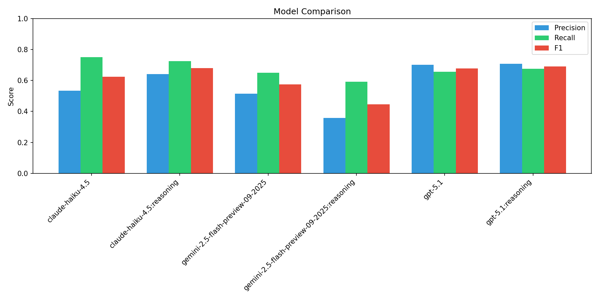
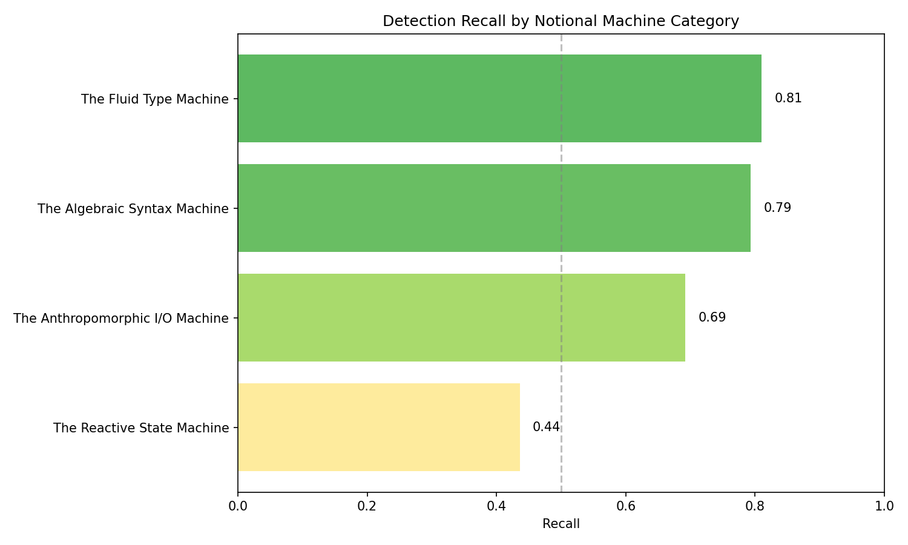
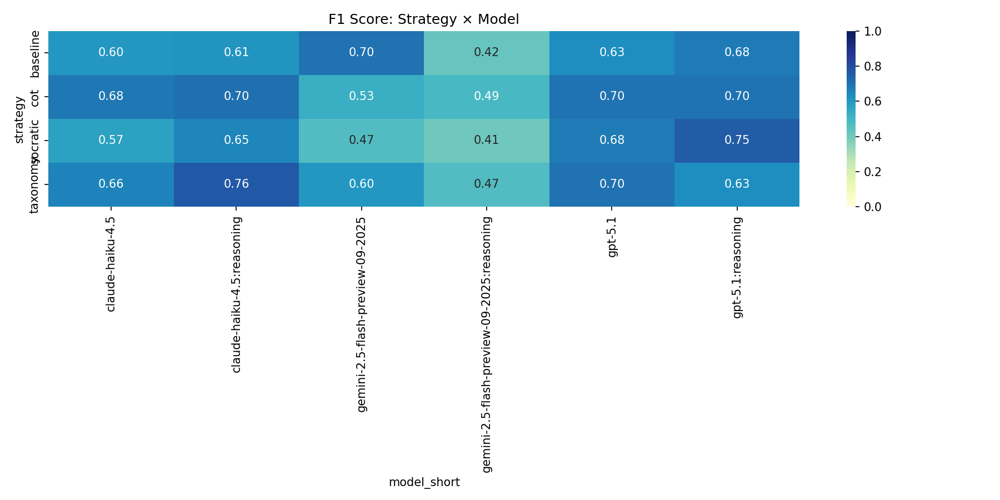
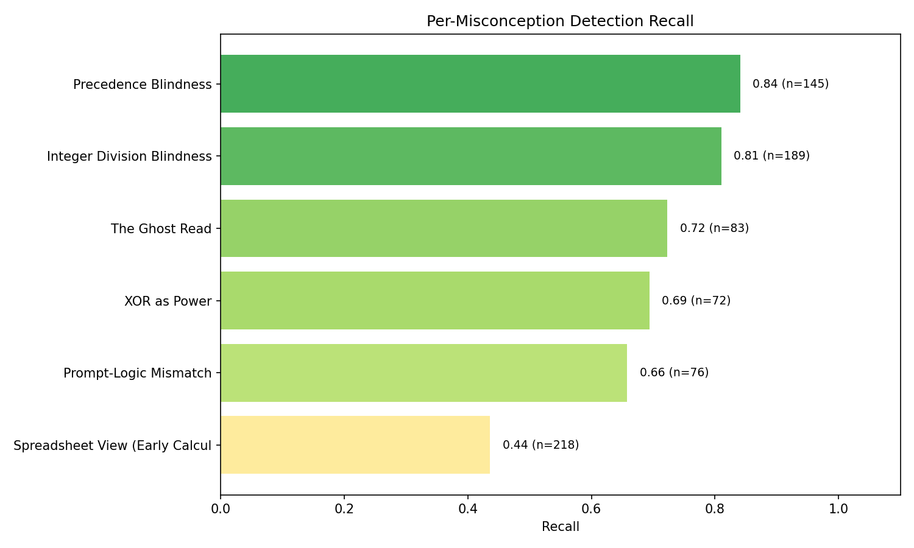
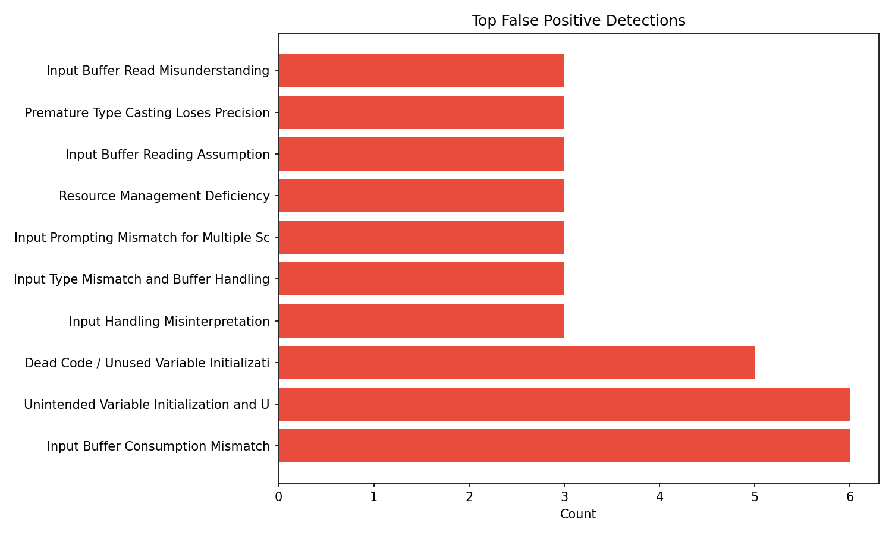

# LLM Misconception Detection: Analysis Report
_Generated: 2025-12-06T18:37:59.095112+00:00_

## Dataset Configuration
- **Students:** 10
- **Questions:** 4
- **Seed:** 1765036611
- **Match Mode:** all

## Overall Metrics
| Metric | Value |
|--------|-------|
| True Positives | 530 |
| False Positives | 430 |
| False Negatives | 253 |
| **Precision** | **0.552** |
| **Recall** | **0.677** |
| **F1 Score** | **0.608** |

## Performance by Strategy
| Strategy | TP | FP | FN | Precision | Recall | F1 |
|----------|----|----|----|-----------| -------|-----|
| baseline | 125 | 97 | 70 | 0.563 | 0.641 | 0.600 |
| cot | 139 | 107 | 59 | 0.565 | 0.702 | 0.626 |
| socratic | 138 | 138 | 63 | 0.500 | 0.687 | 0.579 |
| taxonomy | 128 | 88 | 61 | 0.593 | 0.677 | 0.632 |

## Performance by Model
| Model | TP | FP | FN | Precision | Recall | F1 |
|-------|----|----|----|-----------|--------|-----|
| claude-haiku-4.5 | 106 | 92 | 35 | 0.535 | 0.752 | 0.625 |
| claude-haiku-4.5:reasoning | 98 | 55 | 37 | 0.641 | 0.726 | 0.681 |
| gemini-2.5-flash-preview-09-2025 | 85 | 80 | 46 | 0.515 | 0.649 | 0.574 |
| gemini-2.5-flash-preview-09-2025:reasoning | 74 | 133 | 51 | 0.357 | 0.592 | 0.446 |
| gpt-5.1 | 82 | 35 | 43 | 0.701 | 0.656 | 0.678 |
| gpt-5.1:reasoning | 85 | 35 | 41 | 0.708 | 0.675 | 0.691 |

## Notional Machine Category Detection (RQ2)

> This table shows which mental model categories are easier/harder for LLMs to detect.

| Category | Recall | N |
|----------|--------|---|
| The Reactive State Machine | 0.436 | 218 |
| The Anthropomorphic I/O Machine | 0.692 | 159 |
| The Algebraic Syntax Machine | 0.793 | 217 |
| The Fluid Type Machine | 0.810 | 189 |

## Strategy × Model Heatmap

## Per-Misconception Detection Rates
| ID | Name | Category | Recall | N |
|----|------|----------|--------|---|
| NM_STATE_01 | Spreadsheet View (Early Calculation | The Reactive State Machin | 0.44 | 218 |
| NM_IO_01 | Prompt-Logic Mismatch | The Anthropomorphic I/O M | 0.66 | 76 |
| NM_SYN_01 | XOR as Power | The Algebraic Syntax Mach | 0.69 | 72 |
| NM_IO_02 | The Ghost Read | The Anthropomorphic I/O M | 0.72 | 83 |
| NM_TYP_01 | Integer Division Blindness | The Fluid Type Machine | 0.81 | 189 |
| NM_SYN_02 | Precedence Blindness | The Algebraic Syntax Mach | 0.84 | 145 |

## False Positive Analysis

