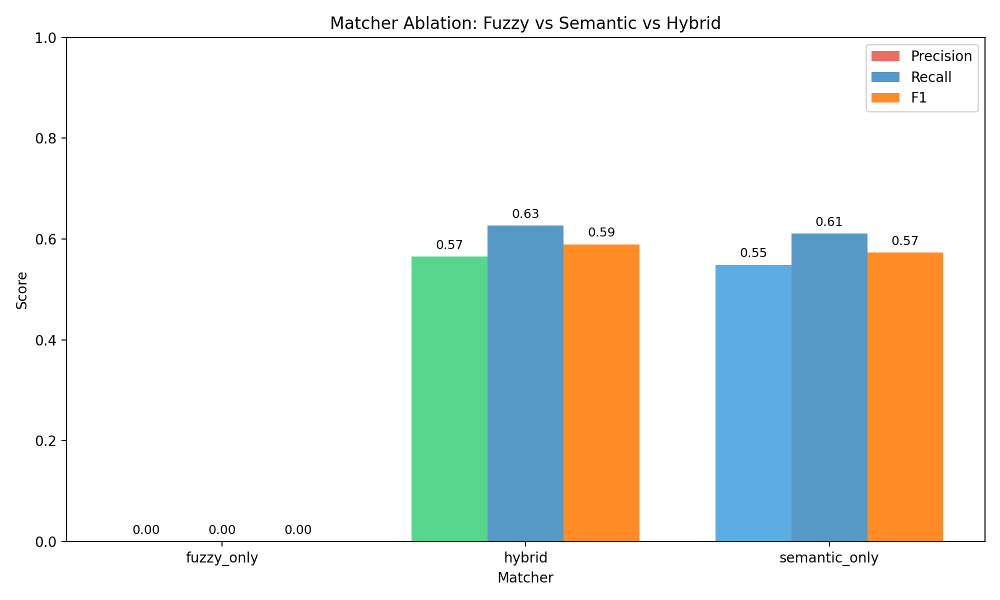
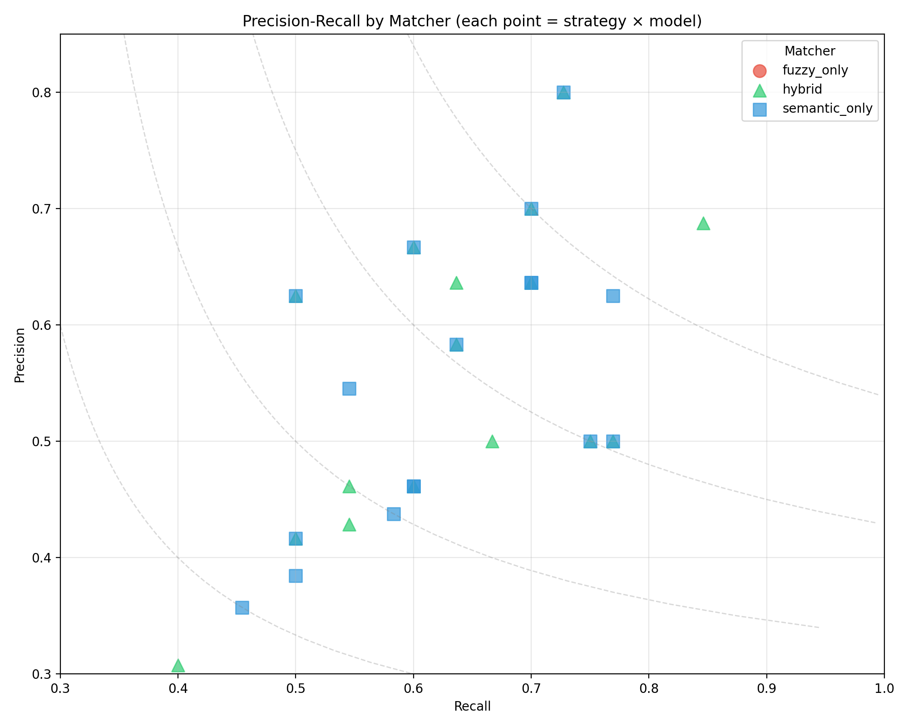
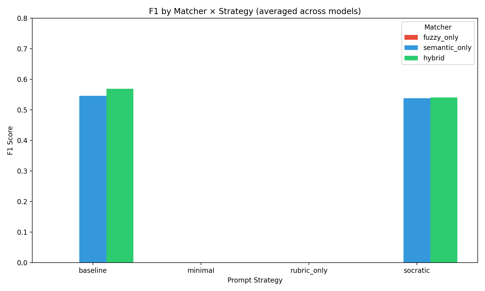
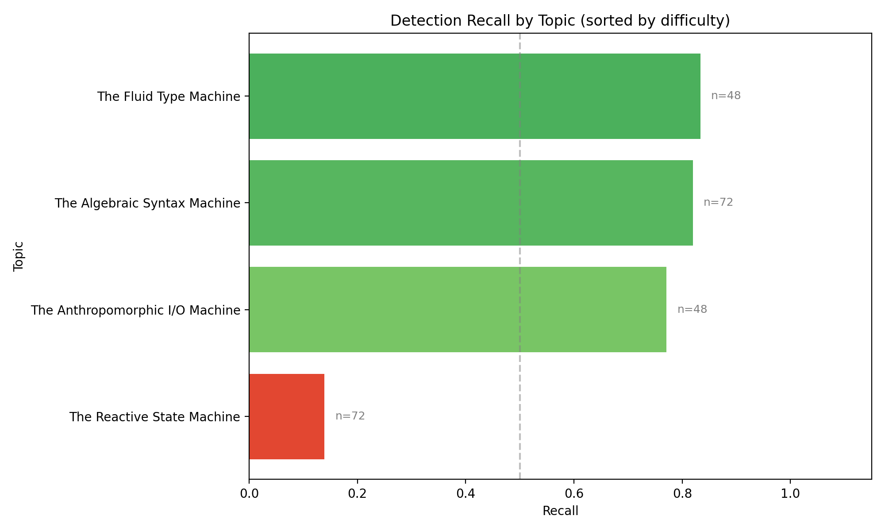
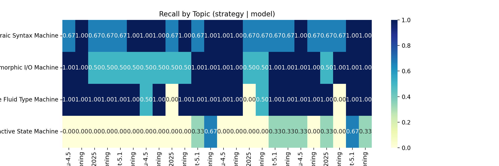
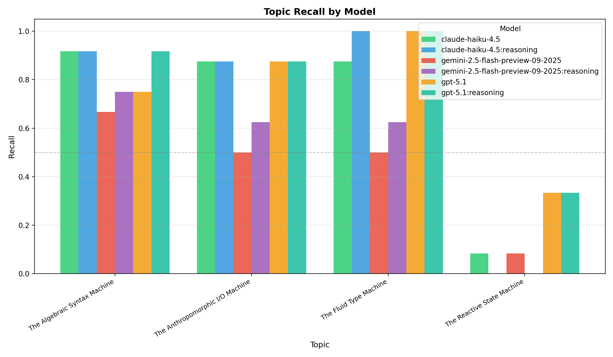
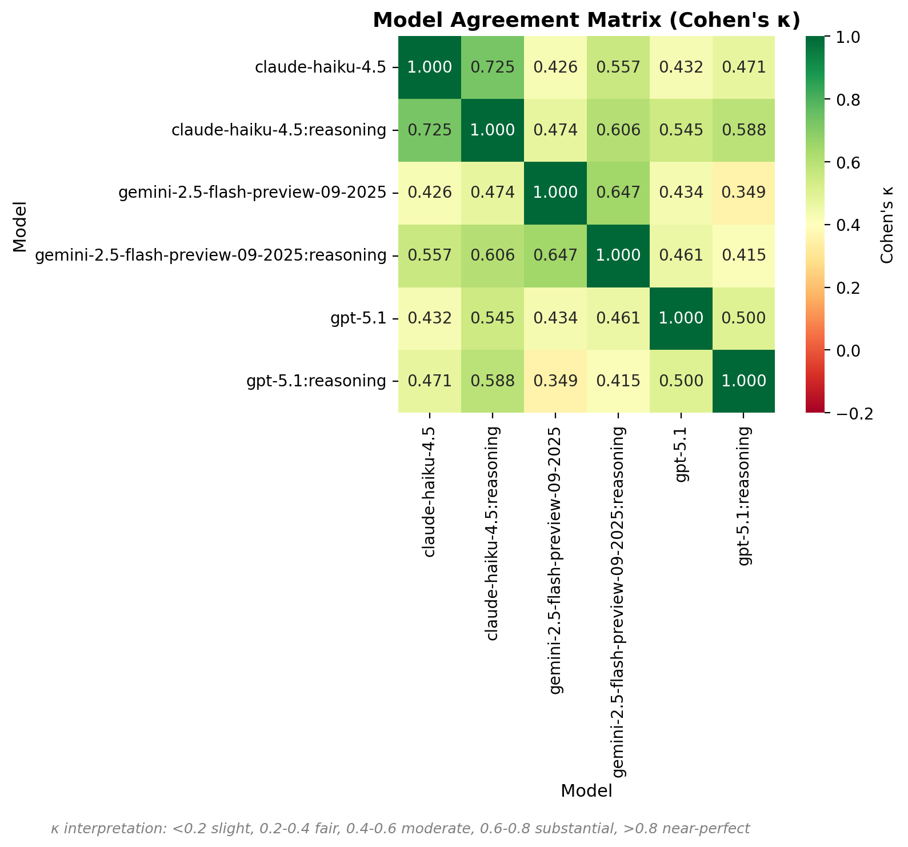
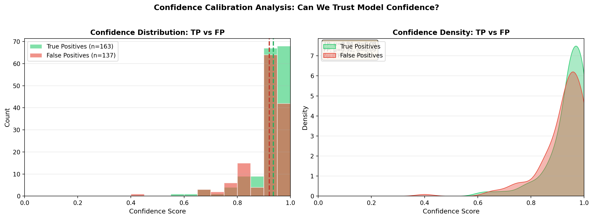
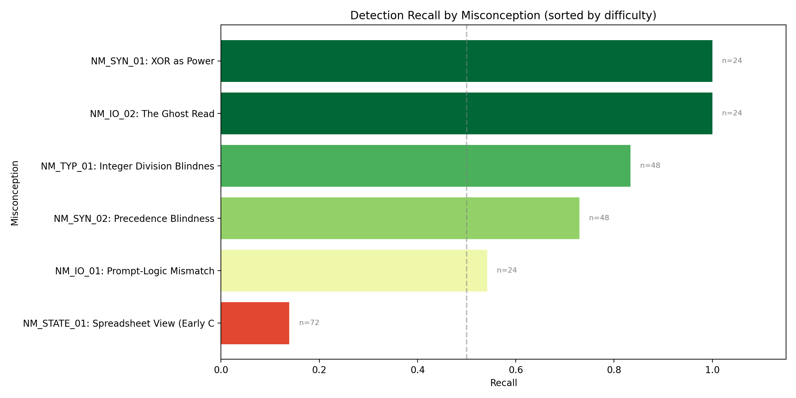
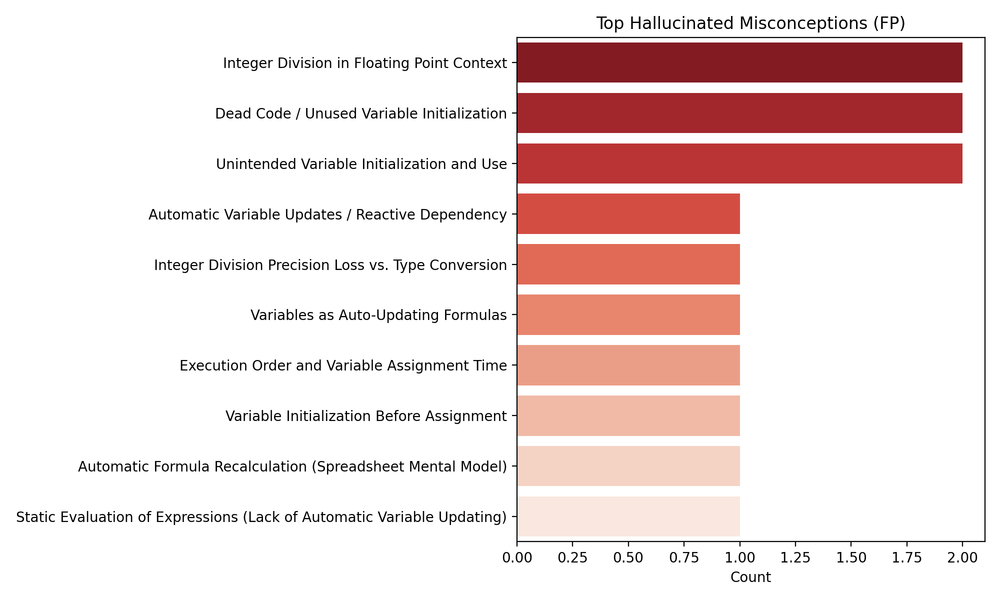

# LLM Misconception Detection: Analysis Report
_Generated: 2025-12-06T08:47:42.202941+00:00_

## Dataset & Run Configuration

### Dataset Summary
- **Assignment:** A2 – Kinematics & Geometry (CS1)
- **Students:** 10
- **Questions:** 4 (Q1, Q2, Q3, Q4)
- **Total files:** 40
- **Seeded files:** 10 (25.0%)
- **Clean files:** 30 (75.0%)
- **Detection opportunities:** 240

### Run Configuration
- **Generation seed:** 1765036611
- **Generation model:** gpt-5.1-2025-11-13
- **Match mode:** all (ablation)
- **Embedding model:** text-embedding-3-large (OpenAI)
- **Detection models:** GPT-5.1, Gemini-2.5-Flash, Haiku-4.5
- **Strategies:** baseline, minimal, rubric_only, socratic

## Executive Highlights
- **Matcher Ablation Study**: Comparing fuzzy_only, semantic_only, and hybrid matchers.
- Bootstrap CIs included for statistical rigor.
- Same detection data, different matching strategies.

## The Diagnostic Ceiling (RQ1)

**Potential Recall** measures the theoretical upper bound: what percentage of seeded errors
were found by *at least one* model/strategy combination?

| Metric | Value |
|--------|-------|
| Potential Recall (Ceiling) | 100.0% |
| Average Recall (Reliability) | 60.8% |
| Consistency (Avg/Potential) | 60.8% |
| Unique Files Detected | 10 / 10 |

> [!TIP]
> High Ceiling: Most errors are detectable by at least one configuration.

## Cognitive Alignment (RQ2)

Does LLM performance correlate with the **cognitive depth** of the misconception?

| Depth Level | Recall | N |
|-------------|--------|---|
| unknown | 60.8% | 240 |

**Depth Gap (Surface - Notional):** 0.0%

> [!NOTE]
> No significant depth gap observed in this run.

## Matcher Ablation: Fuzzy vs Semantic vs Hybrid

### Summary (averaged across strategies and models)
| Matcher | Total TP | Total FP | Total FN | Avg Precision | Avg Recall | Avg F1 |
|---------|----------|----------|----------|---------------|------------|--------|
| fuzzy_only | 0 | 320 | 240 | 0.000 | 0.000 | 0.000 |
| hybrid | 163 | 137 | 94 | 0.565 | 0.627 | 0.590 |
| semantic_only | 158 | 143 | 98 | 0.549 | 0.611 | 0.573 |

### Precision-Recall by Matcher

### Matcher × Strategy Distribution

### Full Results Table
| Matcher | Strategy | Model | TP | FP | FN | Precision | Recall | F1 | CI (F1) |
|---------|----------|-------|----|----|----|-----------|--------|----|---------|
| fuzzy_only | baseline | claude-haiku-4.5 | 0 | 16 | 10 | 0.000 | 0.000 | 0.000 | 0.00–0.00 |
| fuzzy_only | baseline | claude-haiku-4.5:reasoning | 0 | 10 | 10 | 0.000 | 0.000 | 0.000 | 0.00–0.00 |
| fuzzy_only | baseline | gemini-2.5-flash-preview-09-2025 | 0 | 13 | 10 | 0.000 | 0.000 | 0.000 | 0.00–0.00 |
| fuzzy_only | baseline | gemini-2.5-flash-preview-09-2025:reasoning | 0 | 18 | 10 | 0.000 | 0.000 | 0.000 | 0.00–0.00 |
| fuzzy_only | baseline | gpt-5.1 | 0 | 8 | 10 | 0.000 | 0.000 | 0.000 | 0.00–0.00 |
| fuzzy_only | baseline | gpt-5.1:reasoning | 0 | 9 | 10 | 0.000 | 0.000 | 0.000 | 0.00–0.00 |
| fuzzy_only | cot | claude-haiku-4.5 | 0 | 14 | 10 | 0.000 | 0.000 | 0.000 | 0.00–0.00 |
| fuzzy_only | cot | claude-haiku-4.5:reasoning | 0 | 12 | 10 | 0.000 | 0.000 | 0.000 | 0.00–0.00 |
| fuzzy_only | cot | gemini-2.5-flash-preview-09-2025 | 0 | 15 | 10 | 0.000 | 0.000 | 0.000 | 0.00–0.00 |
| fuzzy_only | cot | gemini-2.5-flash-preview-09-2025:reasoning | 0 | 18 | 10 | 0.000 | 0.000 | 0.000 | 0.00–0.00 |
| fuzzy_only | cot | gpt-5.1 | 0 | 11 | 10 | 0.000 | 0.000 | 0.000 | 0.00–0.00 |
| fuzzy_only | cot | gpt-5.1:reasoning | 0 | 12 | 10 | 0.000 | 0.000 | 0.000 | 0.00–0.00 |
| fuzzy_only | socratic | claude-haiku-4.5 | 0 | 20 | 10 | 0.000 | 0.000 | 0.000 | 0.00–0.00 |
| fuzzy_only | socratic | claude-haiku-4.5:reasoning | 0 | 18 | 10 | 0.000 | 0.000 | 0.000 | 0.00–0.00 |
| fuzzy_only | socratic | gemini-2.5-flash-preview-09-2025 | 0 | 14 | 10 | 0.000 | 0.000 | 0.000 | 0.00–0.00 |
| fuzzy_only | socratic | gemini-2.5-flash-preview-09-2025:reasoning | 0 | 19 | 10 | 0.000 | 0.000 | 0.000 | 0.00–0.00 |
| fuzzy_only | socratic | gpt-5.1 | 0 | 11 | 10 | 0.000 | 0.000 | 0.000 | 0.00–0.00 |
| fuzzy_only | socratic | gpt-5.1:reasoning | 0 | 10 | 10 | 0.000 | 0.000 | 0.000 | 0.00–0.00 |
| fuzzy_only | taxonomy | claude-haiku-4.5 | 0 | 16 | 10 | 0.000 | 0.000 | 0.000 | 0.00–0.00 |
| fuzzy_only | taxonomy | claude-haiku-4.5:reasoning | 0 | 11 | 10 | 0.000 | 0.000 | 0.000 | 0.00–0.00 |
| fuzzy_only | taxonomy | gemini-2.5-flash-preview-09-2025 | 0 | 13 | 10 | 0.000 | 0.000 | 0.000 | 0.00–0.00 |
| fuzzy_only | taxonomy | gemini-2.5-flash-preview-09-2025:reasoning | 0 | 14 | 10 | 0.000 | 0.000 | 0.000 | 0.00–0.00 |
| fuzzy_only | taxonomy | gpt-5.1 | 0 | 9 | 10 | 0.000 | 0.000 | 0.000 | 0.00–0.00 |
| fuzzy_only | taxonomy | gpt-5.1:reasoning | 0 | 9 | 10 | 0.000 | 0.000 | 0.000 | 0.00–0.00 |
| hybrid | baseline | claude-haiku-4.5 | 8 | 8 | 4 | 0.500 | 0.667 | 0.571 | 0.30–0.83 |
| hybrid | baseline | claude-haiku-4.5:reasoning | 7 | 3 | 3 | 0.700 | 0.700 | 0.700 | 0.47–0.90 |
| hybrid | baseline | gemini-2.5-flash-preview-09-2025 | 6 | 7 | 5 | 0.462 | 0.545 | 0.500 | 0.26–0.77 |
| hybrid | baseline | gemini-2.5-flash-preview-09-2025:reasoning | 5 | 7 | 5 | 0.417 | 0.500 | 0.455 | 0.17–0.75 |
| hybrid | baseline | gpt-5.1 | 5 | 3 | 5 | 0.625 | 0.500 | 0.556 | 0.24–0.84 |
| hybrid | baseline | gpt-5.1:reasoning | 6 | 3 | 4 | 0.667 | 0.600 | 0.632 | 0.35–0.89 |
| hybrid | cot | claude-haiku-4.5 | 6 | 8 | 5 | 0.429 | 0.545 | 0.480 | 0.20–0.74 |
| hybrid | cot | claude-haiku-4.5:reasoning | 7 | 5 | 4 | 0.583 | 0.636 | 0.609 | 0.32–0.83 |
| hybrid | cot | gemini-2.5-flash-preview-09-2025 | 3 | 10 | 7 | 0.231 | 0.300 | 0.261 | 0.00–0.55 |
| hybrid | cot | gemini-2.5-flash-preview-09-2025:reasoning | 6 | 7 | 4 | 0.462 | 0.600 | 0.522 | 0.28–0.75 |
| hybrid | cot | gpt-5.1 | 7 | 4 | 3 | 0.636 | 0.700 | 0.667 | 0.42–0.86 |
| hybrid | cot | gpt-5.1:reasoning | 11 | 1 | 1 | 0.917 | 0.917 | 0.917 | 0.80–1.00 |
| hybrid | socratic | claude-haiku-4.5 | 10 | 10 | 3 | 0.500 | 0.769 | 0.606 | 0.36–0.82 |
| hybrid | socratic | claude-haiku-4.5:reasoning | 9 | 9 | 3 | 0.500 | 0.750 | 0.600 | 0.39–0.80 |
| hybrid | socratic | gemini-2.5-flash-preview-09-2025 | 3 | 10 | 7 | 0.231 | 0.300 | 0.261 | 0.00–0.52 |
| hybrid | socratic | gemini-2.5-flash-preview-09-2025:reasoning | 4 | 9 | 6 | 0.308 | 0.400 | 0.348 | 0.09–0.58 |
| hybrid | socratic | gpt-5.1 | 7 | 4 | 3 | 0.636 | 0.700 | 0.667 | 0.42–0.87 |
| hybrid | socratic | gpt-5.1:reasoning | 8 | 2 | 3 | 0.800 | 0.727 | 0.762 | 0.48–0.95 |
| hybrid | taxonomy | claude-haiku-4.5 | 11 | 5 | 2 | 0.688 | 0.846 | 0.759 | 0.50–0.92 |
| hybrid | taxonomy | claude-haiku-4.5:reasoning | 7 | 4 | 4 | 0.636 | 0.636 | 0.636 | 0.32–0.87 |
| hybrid | taxonomy | gemini-2.5-flash-preview-09-2025 | 6 | 7 | 4 | 0.462 | 0.600 | 0.522 | 0.26–0.73 |
| hybrid | taxonomy | gemini-2.5-flash-preview-09-2025:reasoning | 4 | 10 | 6 | 0.286 | 0.400 | 0.333 | 0.08–0.64 |
| hybrid | taxonomy | gpt-5.1 | 9 | 0 | 1 | 1.000 | 0.900 | 0.947 | 0.82–1.00 |
| hybrid | taxonomy | gpt-5.1:reasoning | 8 | 1 | 2 | 0.889 | 0.800 | 0.842 | 0.59–1.00 |
| semantic_only | baseline | claude-haiku-4.5 | 7 | 9 | 5 | 0.438 | 0.583 | 0.500 | 0.22–0.75 |
| semantic_only | baseline | claude-haiku-4.5:reasoning | 7 | 3 | 3 | 0.700 | 0.700 | 0.700 | 0.50–0.90 |
| semantic_only | baseline | gemini-2.5-flash-preview-09-2025 | 5 | 8 | 5 | 0.385 | 0.500 | 0.435 | 0.19–0.67 |
| semantic_only | baseline | gemini-2.5-flash-preview-09-2025:reasoning | 5 | 7 | 5 | 0.417 | 0.500 | 0.455 | 0.14–0.69 |
| semantic_only | baseline | gpt-5.1 | 5 | 3 | 5 | 0.625 | 0.500 | 0.556 | 0.24–0.84 |
| semantic_only | baseline | gpt-5.1:reasoning | 6 | 3 | 4 | 0.667 | 0.600 | 0.632 | 0.33–0.86 |
| semantic_only | cot | claude-haiku-4.5 | 5 | 9 | 6 | 0.357 | 0.455 | 0.400 | 0.17–0.67 |
| semantic_only | cot | claude-haiku-4.5:reasoning | 7 | 5 | 4 | 0.583 | 0.636 | 0.609 | 0.32–0.85 |
| semantic_only | cot | gemini-2.5-flash-preview-09-2025 | 3 | 10 | 7 | 0.231 | 0.300 | 0.261 | 0.00–0.53 |
| semantic_only | cot | gemini-2.5-flash-preview-09-2025:reasoning | 6 | 7 | 4 | 0.462 | 0.600 | 0.522 | 0.26–0.75 |
| semantic_only | cot | gpt-5.1 | 7 | 4 | 3 | 0.636 | 0.700 | 0.667 | 0.40–0.90 |
| semantic_only | cot | gpt-5.1:reasoning | 11 | 1 | 1 | 0.917 | 0.917 | 0.917 | 0.76–1.00 |
| semantic_only | socratic | claude-haiku-4.5 | 10 | 10 | 3 | 0.500 | 0.769 | 0.606 | 0.36–0.80 |
| semantic_only | socratic | claude-haiku-4.5:reasoning | 9 | 9 | 3 | 0.500 | 0.750 | 0.600 | 0.36–0.80 |
| semantic_only | socratic | gemini-2.5-flash-preview-09-2025 | 3 | 10 | 7 | 0.231 | 0.300 | 0.261 | 0.00–0.52 |
| semantic_only | socratic | gemini-2.5-flash-preview-09-2025:reasoning | 4 | 10 | 6 | 0.286 | 0.400 | 0.333 | 0.09–0.59 |
| semantic_only | socratic | gpt-5.1 | 7 | 4 | 3 | 0.636 | 0.700 | 0.667 | 0.42–0.87 |
| semantic_only | socratic | gpt-5.1:reasoning | 8 | 2 | 3 | 0.800 | 0.727 | 0.762 | 0.50–1.00 |
| semantic_only | taxonomy | claude-haiku-4.5 | 10 | 6 | 3 | 0.625 | 0.769 | 0.690 | 0.42–0.92 |
| semantic_only | taxonomy | claude-haiku-4.5:reasoning | 6 | 5 | 5 | 0.545 | 0.545 | 0.545 | 0.22–0.83 |
| semantic_only | taxonomy | gemini-2.5-flash-preview-09-2025 | 6 | 7 | 4 | 0.462 | 0.600 | 0.522 | 0.27–0.78 |
| semantic_only | taxonomy | gemini-2.5-flash-preview-09-2025:reasoning | 4 | 10 | 6 | 0.286 | 0.400 | 0.333 | 0.07–0.61 |
| semantic_only | taxonomy | gpt-5.1 | 9 | 0 | 1 | 1.000 | 0.900 | 0.947 | 0.82–1.00 |
| semantic_only | taxonomy | gpt-5.1:reasoning | 8 | 1 | 2 | 0.889 | 0.800 | 0.842 | 0.59–1.00 |

## Topic Difficulty (Recall)
| Topic | Recall | N |
|-------|--------|---|
| The Reactive State Machine | 0.139 | 72 |
| The Anthropomorphic I/O Machine | 0.771 | 48 |
| The Algebraic Syntax Machine | 0.819 | 72 |
| The Fluid Type Machine | 0.833 | 48 |

## Topic Heatmap

## Topic Recall by Model

Grouped bar chart showing recall per topic, split by model. Reveals model-specific strengths and weaknesses.

## Model Agreement Matrix

Pairwise Cohen's κ between models. Higher values indicate correlated predictions; lower values suggest complementary errors (good for ensembles).

## Confidence Calibration Analysis

Distribution of model confidence scores for True Positives vs False Positives. A well-calibrated model should show higher confidence for TPs than FPs.

## Per-Misconception Detection Rates

Detection recall for each seeded misconception, sorted by difficulty (hardest to detect at top):

| ID | Misconception | Category | Recall | N |
|----|---------------|----------|--------|---|
| NM_STATE_01 | Spreadsheet View (Early Calculation... | The Reactive State Machine | 0.14 | 72 |
| NM_IO_01 | Prompt-Logic Mismatch | The Anthropomorphic I/O Machine | 0.54 | 24 |
| NM_SYN_02 | Precedence Blindness | The Algebraic Syntax Machine | 0.73 | 48 |
| NM_TYP_01 | Integer Division Blindness | The Fluid Type Machine | 0.83 | 48 |
| NM_IO_02 | The Ghost Read | The Anthropomorphic I/O Machine | 1.00 | 24 |
| NM_SYN_01 | XOR as Power | The Algebraic Syntax Machine | 1.00 | 24 |

## Hallucination Analysis

- **Operator Precedence Misunderstanding** (12 times)
- **Integer Division in Floating Point Context** (6 times)
- **Unintended Variable Initialization and Use** (6 times)
- **Dead Code / Unused Variable Initialization** (6 times)
- **Input Variable Order Confusion** (3 times)

## Methods
- Data: 60 students × 4 questions (seeded/clean) with manifest-driven ground truth.
- Detection: GPT-5.1, Gemini-2.5-Flash, Haiku-4.5 across strategies (baseline, minimal, rubric_only, socratic).
- Matching: Ablation comparing fuzzy-only, semantic-only (text-embedding-3-large), and hybrid (fuzzy + semantic + topic prior).
- Metrics: Precision/Recall/F1 with bootstrap CIs; agreement via κ; significance via McNemar where applicable.

## Agreement & Significance
- baseline (claude-haiku-4.5 vs claude-haiku-4.5:reasoning): κ=0.783, McNemar p=0.6171 (stat=0.250) | table={'both_correct': 6, 'only_a': 0, 'only_b': 1, 'both_wrong': 3}
- baseline (claude-haiku-4.5 vs gemini-2.5-flash-preview-09-2025): κ=0.800, McNemar p=0.6171 (stat=0.250) | table={'both_correct': 5, 'only_a': 1, 'only_b': 0, 'both_wrong': 4}
- baseline (claude-haiku-4.5 vs gemini-2.5-flash-preview-09-2025:reasoning): κ=0.800, McNemar p=0.6171 (stat=0.250) | table={'both_correct': 5, 'only_a': 1, 'only_b': 0, 'both_wrong': 4}
- baseline (claude-haiku-4.5 vs gpt-5.1): κ=0.800, McNemar p=0.6171 (stat=0.250) | table={'both_correct': 5, 'only_a': 1, 'only_b': 0, 'both_wrong': 4}
- baseline (claude-haiku-4.5 vs gpt-5.1:reasoning): κ=0.583, McNemar p=0.7237 (stat=0.125) | table={'both_correct': 5, 'only_a': 1, 'only_b': 1, 'both_wrong': 3}
- baseline (claude-haiku-4.5:reasoning vs gemini-2.5-flash-preview-09-2025): κ=0.600, McNemar p=0.2888 (stat=1.125) | table={'both_correct': 5, 'only_a': 2, 'only_b': 0, 'both_wrong': 3}
- baseline (claude-haiku-4.5:reasoning vs gemini-2.5-flash-preview-09-2025:reasoning): κ=0.600, McNemar p=0.2888 (stat=1.125) | table={'both_correct': 5, 'only_a': 2, 'only_b': 0, 'both_wrong': 3}
- baseline (claude-haiku-4.5:reasoning vs gpt-5.1): κ=0.600, McNemar p=0.2888 (stat=1.125) | table={'both_correct': 5, 'only_a': 2, 'only_b': 0, 'both_wrong': 3}
- baseline (claude-haiku-4.5:reasoning vs gpt-5.1:reasoning): κ=0.783, McNemar p=0.6171 (stat=0.250) | table={'both_correct': 6, 'only_a': 1, 'only_b': 0, 'both_wrong': 3}
- baseline (gemini-2.5-flash-preview-09-2025 vs gemini-2.5-flash-preview-09-2025:reasoning): κ=1.000, McNemar p=1.0000 (stat=0.000) | table={'both_correct': 5, 'only_a': 0, 'only_b': 0, 'both_wrong': 5}
- baseline (gemini-2.5-flash-preview-09-2025 vs gpt-5.1): κ=1.000, McNemar p=1.0000 (stat=0.000) | table={'both_correct': 5, 'only_a': 0, 'only_b': 0, 'both_wrong': 5}
- baseline (gemini-2.5-flash-preview-09-2025 vs gpt-5.1:reasoning): κ=0.800, McNemar p=0.6171 (stat=0.250) | table={'both_correct': 5, 'only_a': 0, 'only_b': 1, 'both_wrong': 4}
- baseline (gemini-2.5-flash-preview-09-2025:reasoning vs gpt-5.1): κ=1.000, McNemar p=1.0000 (stat=0.000) | table={'both_correct': 5, 'only_a': 0, 'only_b': 0, 'both_wrong': 5}
- baseline (gemini-2.5-flash-preview-09-2025:reasoning vs gpt-5.1:reasoning): κ=0.800, McNemar p=0.6171 (stat=0.250) | table={'both_correct': 5, 'only_a': 0, 'only_b': 1, 'both_wrong': 4}
- baseline (gpt-5.1 vs gpt-5.1:reasoning): κ=0.800, McNemar p=0.6171 (stat=0.250) | table={'both_correct': 5, 'only_a': 0, 'only_b': 1, 'both_wrong': 4}
- cot (claude-haiku-4.5 vs claude-haiku-4.5:reasoning): κ=0.800, McNemar p=0.6171 (stat=0.250) | table={'both_correct': 5, 'only_a': 0, 'only_b': 1, 'both_wrong': 4}
- cot (claude-haiku-4.5 vs gemini-2.5-flash-preview-09-2025): κ=0.600, McNemar p=0.2888 (stat=1.125) | table={'both_correct': 3, 'only_a': 2, 'only_b': 0, 'both_wrong': 5}
- cot (claude-haiku-4.5 vs gemini-2.5-flash-preview-09-2025:reasoning): κ=0.800, McNemar p=0.6171 (stat=0.250) | table={'both_correct': 5, 'only_a': 0, 'only_b': 1, 'both_wrong': 4}
- cot (claude-haiku-4.5 vs gpt-5.1): κ=0.200, McNemar p=0.4533 (stat=0.562) | table={'both_correct': 4, 'only_a': 1, 'only_b': 3, 'both_wrong': 2}
- cot (claude-haiku-4.5 vs gpt-5.1:reasoning): κ=0.200, McNemar p=0.0801 (stat=3.062) | table={'both_correct': 5, 'only_a': 0, 'only_b': 4, 'both_wrong': 1}
- cot (claude-haiku-4.5:reasoning vs gemini-2.5-flash-preview-09-2025): κ=0.444, McNemar p=0.1489 (stat=2.083) | table={'both_correct': 3, 'only_a': 3, 'only_b': 0, 'both_wrong': 4}
- cot (claude-haiku-4.5:reasoning vs gemini-2.5-flash-preview-09-2025:reasoning): κ=1.000, McNemar p=1.0000 (stat=0.000) | table={'both_correct': 6, 'only_a': 0, 'only_b': 0, 'both_wrong': 4}
- cot (claude-haiku-4.5:reasoning vs gpt-5.1): κ=0.348, McNemar p=0.7728 (stat=0.083) | table={'both_correct': 5, 'only_a': 1, 'only_b': 2, 'both_wrong': 2}
- cot (claude-haiku-4.5:reasoning vs gpt-5.1:reasoning): κ=0.286, McNemar p=0.1489 (stat=2.083) | table={'both_correct': 6, 'only_a': 0, 'only_b': 3, 'both_wrong': 1}
- cot (gemini-2.5-flash-preview-09-2025 vs gemini-2.5-flash-preview-09-2025:reasoning): κ=0.444, McNemar p=0.1489 (stat=2.083) | table={'both_correct': 3, 'only_a': 0, 'only_b': 3, 'both_wrong': 4}
- cot (gemini-2.5-flash-preview-09-2025 vs gpt-5.1): κ=0.310, McNemar p=0.0801 (stat=3.062) | table={'both_correct': 3, 'only_a': 0, 'only_b': 4, 'both_wrong': 3}
- cot (gemini-2.5-flash-preview-09-2025 vs gpt-5.1:reasoning): κ=0.091, McNemar p=0.0247 (stat=5.042) | table={'both_correct': 3, 'only_a': 0, 'only_b': 6, 'both_wrong': 1}
- cot (gemini-2.5-flash-preview-09-2025:reasoning vs gpt-5.1): κ=0.348, McNemar p=0.7728 (stat=0.083) | table={'both_correct': 5, 'only_a': 1, 'only_b': 2, 'both_wrong': 2}
- cot (gemini-2.5-flash-preview-09-2025:reasoning vs gpt-5.1:reasoning): κ=0.286, McNemar p=0.1489 (stat=2.083) | table={'both_correct': 6, 'only_a': 0, 'only_b': 3, 'both_wrong': 1}
- cot (gpt-5.1 vs gpt-5.1:reasoning): κ=0.412, McNemar p=0.2888 (stat=1.125) | table={'both_correct': 7, 'only_a': 0, 'only_b': 2, 'both_wrong': 1}
- socratic (claude-haiku-4.5 vs claude-haiku-4.5:reasoning): κ=1.000, McNemar p=1.0000 (stat=0.000) | table={'both_correct': 7, 'only_a': 0, 'only_b': 0, 'both_wrong': 3}
- socratic (claude-haiku-4.5 vs gemini-2.5-flash-preview-09-2025): κ=0.310, McNemar p=0.0801 (stat=3.062) | table={'both_correct': 3, 'only_a': 4, 'only_b': 0, 'both_wrong': 3}
- socratic (claude-haiku-4.5 vs gemini-2.5-flash-preview-09-2025:reasoning): κ=0.444, McNemar p=0.1489 (stat=2.083) | table={'both_correct': 4, 'only_a': 3, 'only_b': 0, 'both_wrong': 3}
- socratic (claude-haiku-4.5 vs gpt-5.1): κ=0.524, McNemar p=0.7237 (stat=0.125) | table={'both_correct': 6, 'only_a': 1, 'only_b': 1, 'both_wrong': 2}
- socratic (claude-haiku-4.5 vs gpt-5.1:reasoning): κ=0.524, McNemar p=0.7237 (stat=0.125) | table={'both_correct': 6, 'only_a': 1, 'only_b': 1, 'both_wrong': 2}
- socratic (claude-haiku-4.5:reasoning vs gemini-2.5-flash-preview-09-2025): κ=0.310, McNemar p=0.0801 (stat=3.062) | table={'both_correct': 3, 'only_a': 4, 'only_b': 0, 'both_wrong': 3}
- socratic (claude-haiku-4.5:reasoning vs gemini-2.5-flash-preview-09-2025:reasoning): κ=0.444, McNemar p=0.1489 (stat=2.083) | table={'both_correct': 4, 'only_a': 3, 'only_b': 0, 'both_wrong': 3}
- socratic (claude-haiku-4.5:reasoning vs gpt-5.1): κ=0.524, McNemar p=0.7237 (stat=0.125) | table={'both_correct': 6, 'only_a': 1, 'only_b': 1, 'both_wrong': 2}
- socratic (claude-haiku-4.5:reasoning vs gpt-5.1:reasoning): κ=0.524, McNemar p=0.7237 (stat=0.125) | table={'both_correct': 6, 'only_a': 1, 'only_b': 1, 'both_wrong': 2}
- socratic (gemini-2.5-flash-preview-09-2025 vs gemini-2.5-flash-preview-09-2025:reasoning): κ=0.783, McNemar p=0.6171 (stat=0.250) | table={'both_correct': 3, 'only_a': 0, 'only_b': 1, 'both_wrong': 6}
- socratic (gemini-2.5-flash-preview-09-2025 vs gpt-5.1): κ=0.310, McNemar p=0.0801 (stat=3.062) | table={'both_correct': 3, 'only_a': 0, 'only_b': 4, 'both_wrong': 3}
- socratic (gemini-2.5-flash-preview-09-2025 vs gpt-5.1:reasoning): κ=0.310, McNemar p=0.0801 (stat=3.062) | table={'both_correct': 3, 'only_a': 0, 'only_b': 4, 'both_wrong': 3}
- socratic (gemini-2.5-flash-preview-09-2025:reasoning vs gpt-5.1): κ=0.444, McNemar p=0.1489 (stat=2.083) | table={'both_correct': 4, 'only_a': 0, 'only_b': 3, 'both_wrong': 3}
- socratic (gemini-2.5-flash-preview-09-2025:reasoning vs gpt-5.1:reasoning): κ=0.444, McNemar p=0.1489 (stat=2.083) | table={'both_correct': 4, 'only_a': 0, 'only_b': 3, 'both_wrong': 3}
- socratic (gpt-5.1 vs gpt-5.1:reasoning): κ=1.000, McNemar p=1.0000 (stat=0.000) | table={'both_correct': 7, 'only_a': 0, 'only_b': 0, 'both_wrong': 3}
- taxonomy (claude-haiku-4.5 vs claude-haiku-4.5:reasoning): κ=0.545, McNemar p=0.2888 (stat=1.125) | table={'both_correct': 6, 'only_a': 2, 'only_b': 0, 'both_wrong': 2}
- taxonomy (claude-haiku-4.5 vs gemini-2.5-flash-preview-09-2025): κ=0.091, McNemar p=0.4533 (stat=0.562) | table={'both_correct': 5, 'only_a': 3, 'only_b': 1, 'both_wrong': 1}
- taxonomy (claude-haiku-4.5 vs gemini-2.5-flash-preview-09-2025:reasoning): κ=0.286, McNemar p=0.0801 (stat=3.062) | table={'both_correct': 4, 'only_a': 4, 'only_b': 0, 'both_wrong': 2}
- taxonomy (claude-haiku-4.5 vs gpt-5.1): κ=-0.154, McNemar p=0.7728 (stat=0.083) | table={'both_correct': 7, 'only_a': 1, 'only_b': 2, 'both_wrong': 0}
- taxonomy (claude-haiku-4.5 vs gpt-5.1:reasoning): κ=0.375, McNemar p=0.7237 (stat=0.125) | table={'both_correct': 7, 'only_a': 1, 'only_b': 1, 'both_wrong': 1}
- taxonomy (claude-haiku-4.5:reasoning vs gemini-2.5-flash-preview-09-2025): κ=0.583, McNemar p=0.7237 (stat=0.125) | table={'both_correct': 5, 'only_a': 1, 'only_b': 1, 'both_wrong': 3}
- taxonomy (claude-haiku-4.5:reasoning vs gemini-2.5-flash-preview-09-2025:reasoning): κ=0.615, McNemar p=0.2888 (stat=1.125) | table={'both_correct': 4, 'only_a': 2, 'only_b': 0, 'both_wrong': 4}
- taxonomy (claude-haiku-4.5:reasoning vs gpt-5.1): κ=0.286, McNemar p=0.1489 (stat=2.083) | table={'both_correct': 6, 'only_a': 0, 'only_b': 3, 'both_wrong': 1}
- taxonomy (claude-haiku-4.5:reasoning vs gpt-5.1:reasoning): κ=0.545, McNemar p=0.2888 (stat=1.125) | table={'both_correct': 6, 'only_a': 0, 'only_b': 2, 'both_wrong': 2}
- taxonomy (gemini-2.5-flash-preview-09-2025 vs gemini-2.5-flash-preview-09-2025:reasoning): κ=0.231, McNemar p=0.4533 (stat=0.562) | table={'both_correct': 3, 'only_a': 3, 'only_b': 1, 'both_wrong': 3}
- taxonomy (gemini-2.5-flash-preview-09-2025 vs gpt-5.1): κ=0.286, McNemar p=0.1489 (stat=2.083) | table={'both_correct': 6, 'only_a': 0, 'only_b': 3, 'both_wrong': 1}
- taxonomy (gemini-2.5-flash-preview-09-2025 vs gpt-5.1:reasoning): κ=0.545, McNemar p=0.2888 (stat=1.125) | table={'both_correct': 6, 'only_a': 0, 'only_b': 2, 'both_wrong': 2}
- taxonomy (gemini-2.5-flash-preview-09-2025:reasoning vs gpt-5.1): κ=0.138, McNemar p=0.0442 (stat=4.050) | table={'both_correct': 4, 'only_a': 0, 'only_b': 5, 'both_wrong': 1}
- taxonomy (gemini-2.5-flash-preview-09-2025:reasoning vs gpt-5.1:reasoning): κ=0.286, McNemar p=0.0801 (stat=3.062) | table={'both_correct': 4, 'only_a': 0, 'only_b': 4, 'both_wrong': 2}
- taxonomy (gpt-5.1 vs gpt-5.1:reasoning): κ=0.615, McNemar p=0.6171 (stat=0.250) | table={'both_correct': 8, 'only_a': 1, 'only_b': 0, 'both_wrong': 1}