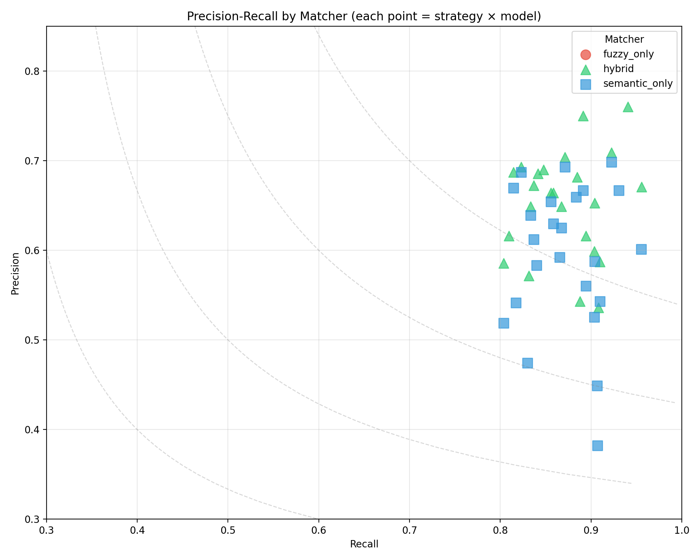
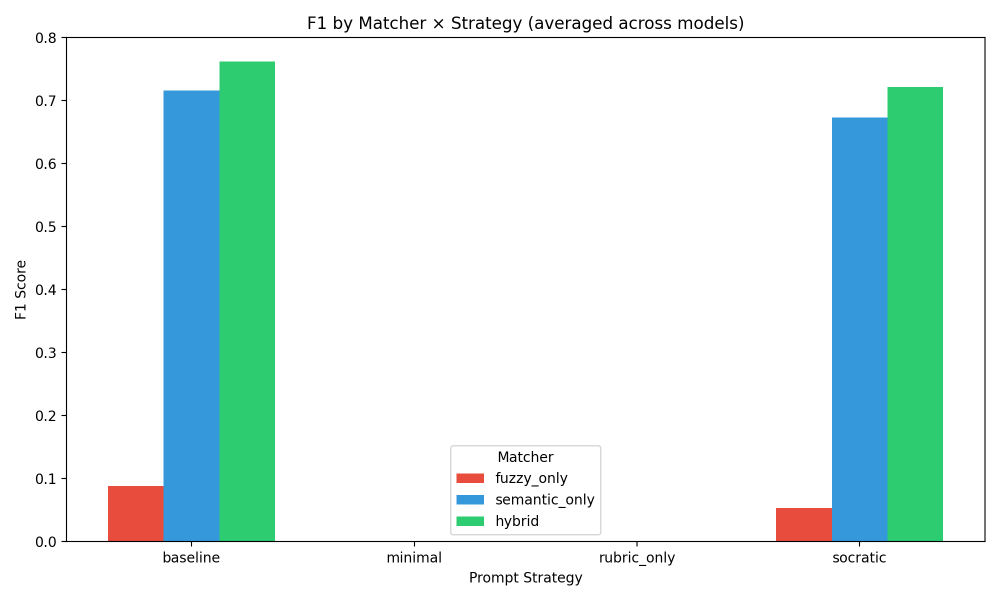
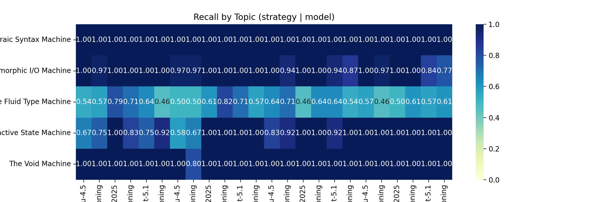
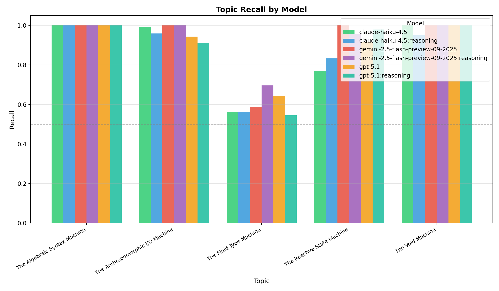
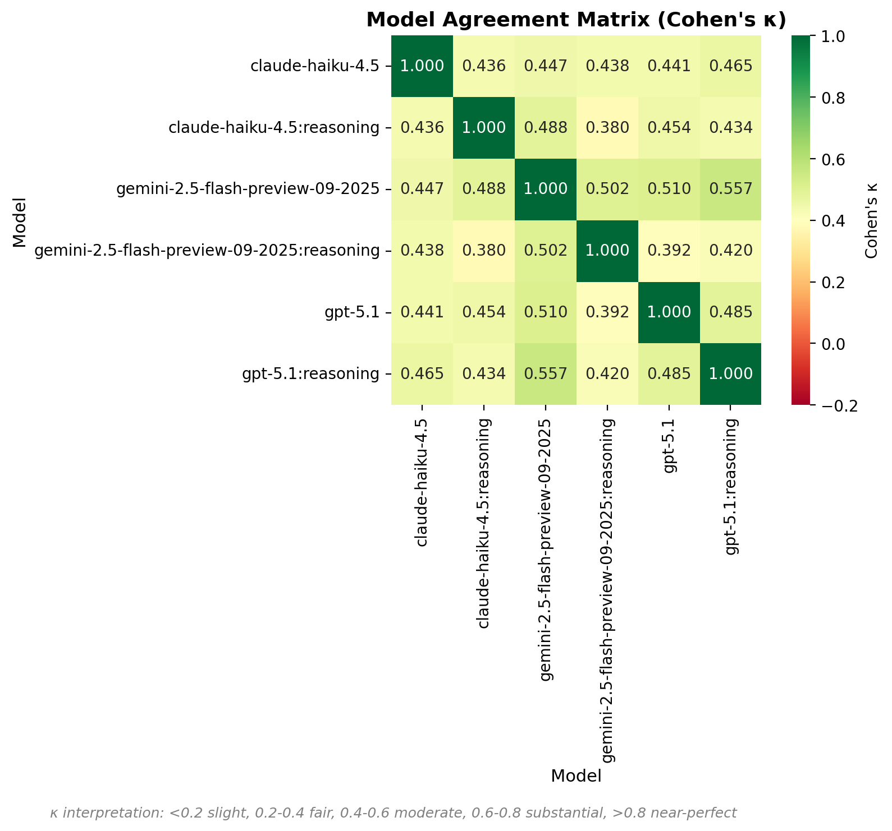
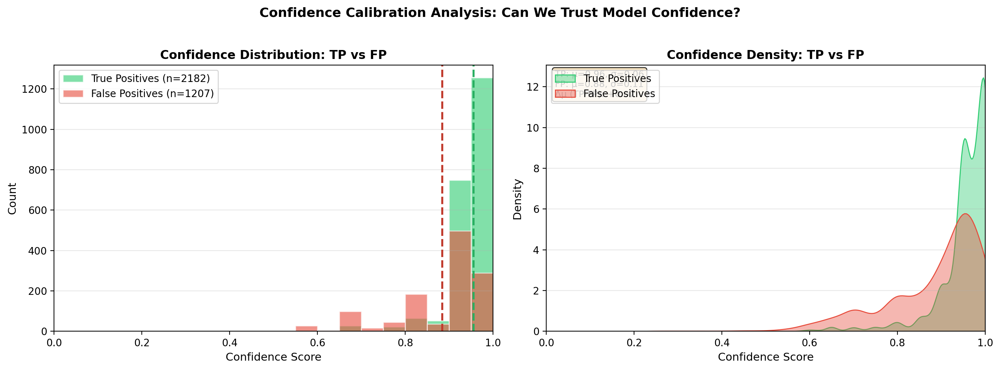
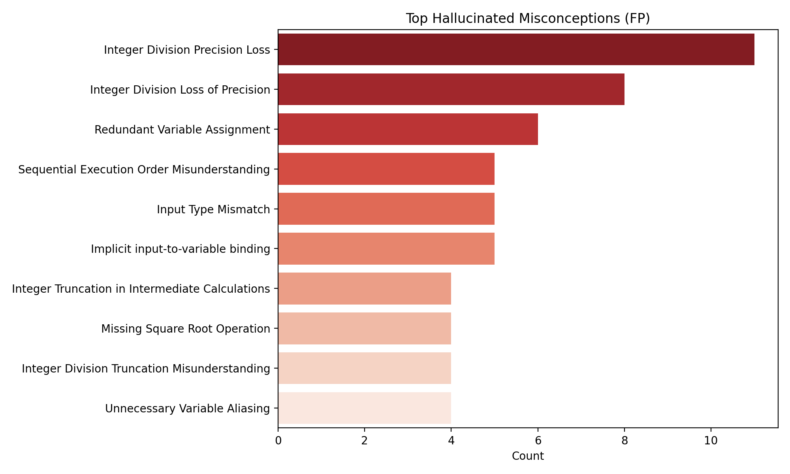

# LLM Misconception Detection: Analysis Report
_Generated: 2025-12-07T00:27:28.388542+00:00_

## Dataset & Run Configuration

### Dataset Summary
- **Assignment:** A2 – Kinematics & Geometry (CS1)
- **Students:** 99
- **Questions:** 4 (Q1, Q2, Q3, Q4)
- **Total files:** 396
- **Seeded files:** 95 (24.0%)
- **Clean files:** 301 (76.0%)
- **Detection opportunities:** 2280

### Run Configuration
- **Generation seed:** 1765081374
- **Generation model:** gpt-5.1-2025-11-13
- **Match mode:** all (ablation)
- **Embedding model:** text-embedding-3-large (OpenAI)
- **Detection models:** GPT-5.1, Gemini-2.5-Flash, Haiku-4.5
- **Strategies:** baseline, minimal, rubric_only, socratic

## Executive Highlights
- **Matcher Ablation Study**: Comparing fuzzy_only, semantic_only, and hybrid matchers.
- Bootstrap CIs included for statistical rigor.
- Same detection data, different matching strategies.

## The Diagnostic Ceiling (RQ1)

**Potential Recall** measures the theoretical upper bound: what percentage of seeded errors
were found by *at least one* model/strategy combination?

| Metric | Value |
|--------|-------|
| Potential Recall (Ceiling) | 100.0% |
| Average Recall (Reliability) | 86.0% |
| Consistency (Avg/Potential) | 86.0% |
| Unique Files Detected | 95 / 95 |

> [!TIP]
> High Ceiling: Most errors are detectable by at least one configuration.

## Cognitive Alignment (RQ2)

Does LLM performance correlate with the **cognitive depth** of the misconception?

| Depth Level | Recall | N |
|-------------|--------|---|
| unknown | 86.0% | 2280 |

**Depth Gap (Surface - Notional):** 0.0%

> [!NOTE]
> No significant depth gap observed in this run.

## Matcher Ablation: Fuzzy vs Semantic vs Hybrid

### Summary (averaged across strategies and models)
| Matcher | Total TP | Total FP | Total FN | Avg Precision | Avg Recall | Avg F1 |
|---------|----------|----------|----------|---------------|------------|--------|
| fuzzy_only | 304 | 5940 | 1977 | 0.050 | 0.133 | 0.071 |
| hybrid | 2182 | 1207 | 320 | 0.651 | 0.871 | 0.744 |
| semantic_only | 2178 | 1600 | 316 | 0.594 | 0.872 | 0.703 |

### Precision-Recall by Matcher

### Matcher × Strategy Distribution

### Full Results Table
| Matcher | Strategy | Model | TP | FP | FN | Precision | Recall | F1 | CI (F1) |
|---------|----------|-------|----|----|----|-----------|--------|----|---------|
| fuzzy_only | baseline | claude-haiku-4.5 | 21 | 267 | 74 | 0.073 | 0.221 | 0.110 | 0.07–0.15 |
| fuzzy_only | baseline | claude-haiku-4.5:reasoning | 22 | 158 | 73 | 0.122 | 0.232 | 0.160 | 0.10–0.22 |
| fuzzy_only | baseline | gemini-2.5-flash-preview-09-2025 | 21 | 225 | 74 | 0.085 | 0.221 | 0.123 | 0.07–0.17 |
| fuzzy_only | baseline | gemini-2.5-flash-preview-09-2025:reasoning | 9 | 318 | 86 | 0.028 | 0.095 | 0.043 | 0.02–0.08 |
| fuzzy_only | baseline | gpt-5.1 | 6 | 171 | 89 | 0.034 | 0.063 | 0.044 | 0.01–0.09 |
| fuzzy_only | baseline | gpt-5.1:reasoning | 7 | 171 | 88 | 0.039 | 0.074 | 0.051 | 0.02–0.09 |
| fuzzy_only | cot | claude-haiku-4.5 | 19 | 208 | 76 | 0.084 | 0.200 | 0.118 | 0.07–0.17 |
| fuzzy_only | cot | claude-haiku-4.5:reasoning | 17 | 188 | 78 | 0.083 | 0.179 | 0.113 | 0.07–0.16 |
| fuzzy_only | cot | gemini-2.5-flash-preview-09-2025 | 17 | 244 | 78 | 0.065 | 0.179 | 0.096 | 0.06–0.14 |
| fuzzy_only | cot | gemini-2.5-flash-preview-09-2025:reasoning | 13 | 344 | 82 | 0.036 | 0.137 | 0.058 | 0.03–0.09 |
| fuzzy_only | cot | gpt-5.1 | 3 | 175 | 92 | 0.017 | 0.032 | 0.022 | 0.00–0.05 |
| fuzzy_only | cot | gpt-5.1:reasoning | 4 | 165 | 91 | 0.024 | 0.042 | 0.030 | 0.01–0.06 |
| fuzzy_only | socratic | claude-haiku-4.5 | 21 | 606 | 74 | 0.033 | 0.221 | 0.058 | 0.04–0.08 |
| fuzzy_only | socratic | claude-haiku-4.5:reasoning | 20 | 313 | 75 | 0.060 | 0.211 | 0.093 | 0.05–0.14 |
| fuzzy_only | socratic | gemini-2.5-flash-preview-09-2025 | 13 | 292 | 82 | 0.043 | 0.137 | 0.065 | 0.04–0.09 |
| fuzzy_only | socratic | gemini-2.5-flash-preview-09-2025:reasoning | 11 | 399 | 84 | 0.027 | 0.116 | 0.044 | 0.02–0.07 |
| fuzzy_only | socratic | gpt-5.1 | 2 | 198 | 93 | 0.010 | 0.021 | 0.014 | 0.00–0.03 |
| fuzzy_only | socratic | gpt-5.1:reasoning | 7 | 190 | 88 | 0.036 | 0.074 | 0.048 | 0.01–0.08 |
| fuzzy_only | taxonomy | claude-haiku-4.5 | 17 | 356 | 78 | 0.046 | 0.179 | 0.073 | 0.04–0.10 |
| fuzzy_only | taxonomy | claude-haiku-4.5:reasoning | 21 | 163 | 74 | 0.114 | 0.221 | 0.151 | 0.09–0.21 |
| fuzzy_only | taxonomy | gemini-2.5-flash-preview-09-2025 | 12 | 220 | 83 | 0.052 | 0.126 | 0.073 | 0.03–0.11 |
| fuzzy_only | taxonomy | gemini-2.5-flash-preview-09-2025:reasoning | 15 | 285 | 81 | 0.050 | 0.156 | 0.076 | 0.04–0.11 |
| fuzzy_only | taxonomy | gpt-5.1 | 4 | 140 | 91 | 0.028 | 0.042 | 0.033 | 0.00–0.08 |
| fuzzy_only | taxonomy | gpt-5.1:reasoning | 2 | 144 | 93 | 0.014 | 0.021 | 0.017 | 0.00–0.04 |
| hybrid | baseline | claude-haiku-4.5 | 84 | 63 | 17 | 0.571 | 0.832 | 0.677 | 0.60–0.75 |
| hybrid | baseline | claude-haiku-4.5:reasoning | 85 | 39 | 16 | 0.685 | 0.842 | 0.756 | 0.68–0.83 |
| hybrid | baseline | gemini-2.5-flash-preview-09-2025 | 95 | 30 | 6 | 0.760 | 0.941 | 0.841 | 0.78–0.89 |
| hybrid | baseline | gemini-2.5-flash-preview-09-2025:reasoning | 94 | 50 | 10 | 0.653 | 0.904 | 0.758 | 0.70–0.82 |
| hybrid | baseline | gpt-5.1 | 88 | 37 | 13 | 0.704 | 0.871 | 0.779 | 0.70–0.85 |
| hybrid | baseline | gpt-5.1:reasoning | 89 | 40 | 16 | 0.690 | 0.848 | 0.761 | 0.68–0.84 |
| hybrid | cot | claude-haiku-4.5 | 82 | 58 | 20 | 0.586 | 0.804 | 0.678 | 0.59–0.75 |
| hybrid | cot | claude-haiku-4.5:reasoning | 85 | 53 | 20 | 0.616 | 0.810 | 0.700 | 0.62–0.77 |
| hybrid | cot | gemini-2.5-flash-preview-09-2025 | 90 | 30 | 11 | 0.750 | 0.891 | 0.814 | 0.75–0.88 |
| hybrid | cot | gemini-2.5-flash-preview-09-2025:reasoning | 108 | 53 | 5 | 0.671 | 0.956 | 0.788 | 0.73–0.84 |
| hybrid | cot | gpt-5.1 | 95 | 39 | 8 | 0.709 | 0.922 | 0.802 | 0.74–0.87 |
| hybrid | cot | gpt-5.1:reasoning | 92 | 43 | 12 | 0.681 | 0.885 | 0.770 | 0.69–0.84 |
| hybrid | socratic | claude-haiku-4.5 | 119 | 103 | 12 | 0.536 | 0.908 | 0.674 | 0.61–0.74 |
| hybrid | socratic | claude-haiku-4.5:reasoning | 103 | 69 | 11 | 0.599 | 0.904 | 0.720 | 0.64–0.78 |
| hybrid | socratic | gemini-2.5-flash-preview-09-2025 | 89 | 45 | 15 | 0.664 | 0.856 | 0.748 | 0.67–0.82 |
| hybrid | socratic | gemini-2.5-flash-preview-09-2025:reasoning | 101 | 71 | 10 | 0.587 | 0.910 | 0.714 | 0.65–0.77 |
| hybrid | socratic | gpt-5.1 | 85 | 46 | 13 | 0.649 | 0.867 | 0.742 | 0.67–0.81 |
| hybrid | socratic | gpt-5.1:reasoning | 85 | 46 | 17 | 0.649 | 0.833 | 0.730 | 0.65–0.81 |
| hybrid | taxonomy | claude-haiku-4.5 | 95 | 80 | 12 | 0.543 | 0.888 | 0.674 | 0.61–0.74 |
| hybrid | taxonomy | claude-haiku-4.5:reasoning | 82 | 40 | 16 | 0.672 | 0.837 | 0.745 | 0.67–0.82 |
| hybrid | taxonomy | gemini-2.5-flash-preview-09-2025 | 85 | 43 | 14 | 0.664 | 0.859 | 0.749 | 0.67–0.82 |
| hybrid | taxonomy | gemini-2.5-flash-preview-09-2025:reasoning | 93 | 58 | 11 | 0.616 | 0.894 | 0.729 | 0.66–0.80 |
| hybrid | taxonomy | gpt-5.1 | 79 | 35 | 17 | 0.693 | 0.823 | 0.752 | 0.68–0.83 |
| hybrid | taxonomy | gpt-5.1:reasoning | 79 | 36 | 18 | 0.687 | 0.814 | 0.745 | 0.66–0.82 |
| semantic_only | baseline | claude-haiku-4.5 | 83 | 92 | 17 | 0.474 | 0.830 | 0.604 | 0.52–0.67 |
| semantic_only | baseline | claude-haiku-4.5:reasoning | 84 | 60 | 16 | 0.583 | 0.840 | 0.689 | 0.60–0.75 |
| semantic_only | baseline | gemini-2.5-flash-preview-09-2025 | 94 | 47 | 7 | 0.667 | 0.931 | 0.777 | 0.72–0.84 |
| semantic_only | baseline | gemini-2.5-flash-preview-09-2025:reasoning | 94 | 66 | 10 | 0.588 | 0.904 | 0.712 | 0.65–0.77 |
| semantic_only | baseline | gpt-5.1 | 88 | 39 | 13 | 0.693 | 0.871 | 0.772 | 0.70–0.85 |
| semantic_only | baseline | gpt-5.1:reasoning | 89 | 47 | 15 | 0.654 | 0.856 | 0.742 | 0.67–0.81 |
| semantic_only | cot | claude-haiku-4.5 | 82 | 76 | 20 | 0.519 | 0.804 | 0.631 | 0.56–0.72 |
| semantic_only | cot | claude-haiku-4.5:reasoning | 85 | 72 | 19 | 0.541 | 0.817 | 0.651 | 0.58–0.73 |
| semantic_only | cot | gemini-2.5-flash-preview-09-2025 | 90 | 45 | 11 | 0.667 | 0.891 | 0.763 | 0.69–0.83 |
| semantic_only | cot | gemini-2.5-flash-preview-09-2025:reasoning | 107 | 71 | 5 | 0.601 | 0.955 | 0.738 | 0.68–0.79 |
| semantic_only | cot | gpt-5.1 | 95 | 41 | 8 | 0.699 | 0.922 | 0.795 | 0.73–0.85 |
| semantic_only | cot | gpt-5.1:reasoning | 91 | 47 | 12 | 0.659 | 0.883 | 0.755 | 0.68–0.83 |
| semantic_only | socratic | claude-haiku-4.5 | 117 | 189 | 12 | 0.382 | 0.907 | 0.538 | 0.47–0.60 |
| semantic_only | socratic | claude-haiku-4.5:reasoning | 103 | 93 | 11 | 0.526 | 0.904 | 0.665 | 0.60–0.74 |
| semantic_only | socratic | gemini-2.5-flash-preview-09-2025 | 90 | 62 | 14 | 0.592 | 0.865 | 0.703 | 0.63–0.78 |
| semantic_only | socratic | gemini-2.5-flash-preview-09-2025:reasoning | 101 | 85 | 10 | 0.543 | 0.910 | 0.680 | 0.62–0.74 |
| semantic_only | socratic | gpt-5.1 | 85 | 51 | 13 | 0.625 | 0.867 | 0.726 | 0.66–0.79 |
| semantic_only | socratic | gpt-5.1:reasoning | 85 | 48 | 17 | 0.639 | 0.833 | 0.723 | 0.64–0.80 |
| semantic_only | taxonomy | claude-haiku-4.5 | 97 | 119 | 10 | 0.449 | 0.907 | 0.601 | 0.53–0.66 |
| semantic_only | taxonomy | claude-haiku-4.5:reasoning | 82 | 52 | 16 | 0.612 | 0.837 | 0.707 | 0.63–0.78 |
| semantic_only | taxonomy | gemini-2.5-flash-preview-09-2025 | 85 | 50 | 14 | 0.630 | 0.859 | 0.726 | 0.65–0.80 |
| semantic_only | taxonomy | gemini-2.5-flash-preview-09-2025:reasoning | 93 | 73 | 11 | 0.560 | 0.894 | 0.689 | 0.63–0.76 |
| semantic_only | taxonomy | gpt-5.1 | 79 | 36 | 17 | 0.687 | 0.823 | 0.749 | 0.67–0.83 |
| semantic_only | taxonomy | gpt-5.1:reasoning | 79 | 39 | 18 | 0.669 | 0.814 | 0.735 | 0.66–0.82 |

## Topic Difficulty (Recall)
| Topic | Recall | N |
|-------|--------|---|
| The Fluid Type Machine | 0.600 | 672 |
| The Reactive State Machine | 0.910 | 288 |
| The Anthropomorphic I/O Machine | 0.968 | 744 |
| The Void Machine | 0.992 | 120 |
| The Algebraic Syntax Machine | 1.000 | 456 |

## Topic Heatmap

## Topic Recall by Model

Grouped bar chart showing recall per topic, split by model. Reveals model-specific strengths and weaknesses.

## Model Agreement Matrix

Pairwise Cohen's κ between models. Higher values indicate correlated predictions; lower values suggest complementary errors (good for ensembles).

## Confidence Calibration Analysis

Distribution of model confidence scores for True Positives vs False Positives. A well-calibrated model should show higher confidence for TPs than FPs.

## Per-Misconception Detection Rates

Detection recall for each seeded misconception, sorted by difficulty (hardest to detect at top):

| ID | Misconception | Category | Recall | N |
|----|---------------|----------|--------|---|
| NM_TYP_02 | Narrowing Cast in Division | The Fluid Type Machine | 0.41 | 408 |
| NM_TYP_01 | Integer Division Blindness | The Fluid Type Machine | 0.90 | 264 |
| NM_STATE_01 | Spreadsheet View (Early Calculation... | The Reactive State Machine | 0.91 | 288 |
| NM_IO_02 | The Ghost Read | The Anthropomorphic I/O Machine | 0.97 | 696 |
| NM_API_01 | The Void Assumption | The Void Machine | 0.99 | 120 |
| NM_IO_01 | Prompt-Logic Mismatch | The Anthropomorphic I/O Machine | 1.00 | 48 |
| NM_SYN_01 | XOR as Power | The Algebraic Syntax Machine | 1.00 | 144 |
| NM_SYN_02 | Precedence Blindness | The Algebraic Syntax Machine | 1.00 | 312 |

## Hallucination Analysis

- **Tautological Conditional Logic** (63 times)
- **Redundant Conditional Logic** (47 times)
- **Redundant Variable Assignment** (41 times)
- **Implicit input-to-variable binding** (36 times)
- **Integer Division Precision Loss** (32 times)

## Methods
- Data: 60 students × 4 questions (seeded/clean) with manifest-driven ground truth.
- Detection: GPT-5.1, Gemini-2.5-Flash, Haiku-4.5 across strategies (baseline, minimal, rubric_only, socratic).
- Matching: Ablation comparing fuzzy-only, semantic-only (text-embedding-3-large), and hybrid (fuzzy + semantic + topic prior).
- Metrics: Precision/Recall/F1 with bootstrap CIs; agreement via κ; significance via McNemar where applicable.

## Agreement & Significance
- baseline (claude-haiku-4.5 vs claude-haiku-4.5:reasoning): κ=0.230, McNemar p=0.9131 (stat=0.012) | table={'both_correct': 68, 'only_a': 10, 'only_b': 11, 'both_wrong': 6}
- baseline (claude-haiku-4.5 vs gemini-2.5-flash-preview-09-2025): κ=0.281, McNemar p=0.0067 (stat=7.350) | table={'both_correct': 76, 'only_a': 2, 'only_b': 13, 'both_wrong': 4}
- baseline (claude-haiku-4.5 vs gemini-2.5-flash-preview-09-2025:reasoning): κ=0.445, McNemar p=0.0714 (stat=3.250) | table={'both_correct': 75, 'only_a': 3, 'only_b': 10, 'both_wrong': 7}
- baseline (claude-haiku-4.5 vs gpt-5.1): κ=0.605, McNemar p=0.2684 (stat=1.225) | table={'both_correct': 75, 'only_a': 3, 'only_b': 7, 'both_wrong': 10}
- baseline (claude-haiku-4.5 vs gpt-5.1:reasoning): κ=0.597, McNemar p=0.8802 (stat=0.023) | table={'both_correct': 73, 'only_a': 5, 'only_b': 6, 'both_wrong': 11}
- baseline (claude-haiku-4.5:reasoning vs gemini-2.5-flash-preview-09-2025): κ=0.399, McNemar p=0.0061 (stat=7.521) | table={'both_correct': 78, 'only_a': 1, 'only_b': 11, 'both_wrong': 5}
- baseline (claude-haiku-4.5:reasoning vs gemini-2.5-flash-preview-09-2025:reasoning): κ=0.470, McNemar p=0.1124 (stat=2.521) | table={'both_correct': 76, 'only_a': 3, 'only_b': 9, 'both_wrong': 7}
- baseline (claude-haiku-4.5:reasoning vs gpt-5.1): κ=0.391, McNemar p=0.5186 (stat=0.417) | table={'both_correct': 73, 'only_a': 6, 'only_b': 9, 'both_wrong': 7}
- baseline (claude-haiku-4.5:reasoning vs gpt-5.1:reasoning): κ=0.399, McNemar p=0.9005 (stat=0.016) | table={'both_correct': 71, 'only_a': 8, 'only_b': 8, 'both_wrong': 8}
- baseline (gemini-2.5-flash-preview-09-2025 vs gemini-2.5-flash-preview-09-2025:reasoning): κ=0.186, McNemar p=0.3123 (stat=1.021) | table={'both_correct': 81, 'only_a': 8, 'only_b': 4, 'both_wrong': 2}
- baseline (gemini-2.5-flash-preview-09-2025 vs gpt-5.1): κ=0.136, McNemar p=0.0933 (stat=2.817) | table={'both_correct': 78, 'only_a': 11, 'only_b': 4, 'both_wrong': 2}
- baseline (gemini-2.5-flash-preview-09-2025 vs gpt-5.1:reasoning): κ=0.499, McNemar p=0.0027 (stat=9.025) | table={'both_correct': 79, 'only_a': 10, 'only_b': 0, 'both_wrong': 6}
- baseline (gemini-2.5-flash-preview-09-2025:reasoning vs gpt-5.1): κ=0.556, McNemar p=0.4047 (stat=0.694) | table={'both_correct': 79, 'only_a': 6, 'only_b': 3, 'both_wrong': 7}
- baseline (gemini-2.5-flash-preview-09-2025:reasoning vs gpt-5.1:reasoning): κ=0.381, McNemar p=0.1416 (stat=2.161) | table={'both_correct': 75, 'only_a': 10, 'only_b': 4, 'both_wrong': 6}
- baseline (gpt-5.1 vs gpt-5.1:reasoning): κ=0.553, McNemar p=0.4510 (stat=0.568) | table={'both_correct': 75, 'only_a': 7, 'only_b': 4, 'both_wrong': 9}
- cot (claude-haiku-4.5 vs claude-haiku-4.5:reasoning): κ=0.493, McNemar p=0.9005 (stat=0.016) | table={'both_correct': 67, 'only_a': 8, 'only_b': 8, 'both_wrong': 12}
- cot (claude-haiku-4.5 vs gemini-2.5-flash-preview-09-2025): κ=0.431, McNemar p=0.0282 (stat=4.817) | table={'both_correct': 72, 'only_a': 3, 'only_b': 12, 'both_wrong': 8}
- cot (claude-haiku-4.5 vs gemini-2.5-flash-preview-09-2025:reasoning): κ=0.257, McNemar p=0.0004 (stat=12.368) | table={'both_correct': 74, 'only_a': 1, 'only_b': 16, 'both_wrong': 4}
- cot (claude-haiku-4.5 vs gpt-5.1): κ=0.350, McNemar p=0.0040 (stat=8.266) | table={'both_correct': 73, 'only_a': 2, 'only_b': 14, 'both_wrong': 6}
- cot (claude-haiku-4.5 vs gpt-5.1:reasoning): κ=0.406, McNemar p=0.0608 (stat=3.516) | table={'both_correct': 71, 'only_a': 4, 'only_b': 12, 'both_wrong': 8}
- cot (claude-haiku-4.5:reasoning vs gemini-2.5-flash-preview-09-2025): κ=0.355, McNemar p=0.0393 (stat=4.250) | table={'both_correct': 71, 'only_a': 4, 'only_b': 13, 'both_wrong': 7}
- cot (claude-haiku-4.5:reasoning vs gemini-2.5-flash-preview-09-2025:reasoning): κ=0.257, McNemar p=0.0004 (stat=12.368) | table={'both_correct': 74, 'only_a': 1, 'only_b': 16, 'both_wrong': 4}
- cot (claude-haiku-4.5:reasoning vs gpt-5.1): κ=0.432, McNemar p=0.0021 (stat=9.446) | table={'both_correct': 74, 'only_a': 1, 'only_b': 13, 'both_wrong': 7}
- cot (claude-haiku-4.5:reasoning vs gpt-5.1:reasoning): κ=0.480, McNemar p=0.0450 (stat=4.018) | table={'both_correct': 72, 'only_a': 3, 'only_b': 11, 'both_wrong': 9}
- cot (gemini-2.5-flash-preview-09-2025 vs gemini-2.5-flash-preview-09-2025:reasoning): κ=0.461, McNemar p=0.0518 (stat=3.781) | table={'both_correct': 83, 'only_a': 1, 'only_b': 7, 'both_wrong': 4}
- cot (gemini-2.5-flash-preview-09-2025 vs gpt-5.1): κ=0.708, McNemar p=0.2636 (stat=1.250) | table={'both_correct': 83, 'only_a': 1, 'only_b': 4, 'both_wrong': 7}
- cot (gemini-2.5-flash-preview-09-2025 vs gpt-5.1:reasoning): κ=0.753, McNemar p=0.8231 (stat=0.050) | table={'both_correct': 81, 'only_a': 3, 'only_b': 2, 'both_wrong': 9}
- cot (gemini-2.5-flash-preview-09-2025:reasoning vs gpt-5.1): κ=0.424, McNemar p=0.3447 (stat=0.893) | table={'both_correct': 85, 'only_a': 5, 'only_b': 2, 'both_wrong': 3}
- cot (gemini-2.5-flash-preview-09-2025:reasoning vs gpt-5.1:reasoning): κ=0.555, McNemar p=0.0140 (stat=6.036) | table={'both_correct': 83, 'only_a': 7, 'only_b': 0, 'both_wrong': 5}
- cot (gpt-5.1 vs gpt-5.1:reasoning): κ=0.666, McNemar p=0.1530 (stat=2.042) | table={'both_correct': 82, 'only_a': 5, 'only_b': 1, 'both_wrong': 7}
- socratic (claude-haiku-4.5 vs claude-haiku-4.5:reasoning): κ=0.555, McNemar p=0.8676 (stat=0.028) | table={'both_correct': 79, 'only_a': 4, 'only_b': 5, 'both_wrong': 7}
- socratic (claude-haiku-4.5 vs gemini-2.5-flash-preview-09-2025): κ=0.526, McNemar p=0.4510 (stat=0.568) | table={'both_correct': 76, 'only_a': 7, 'only_b': 4, 'both_wrong': 8}
- socratic (claude-haiku-4.5 vs gemini-2.5-flash-preview-09-2025:reasoning): κ=0.589, McNemar p=0.5959 (stat=0.281) | table={'both_correct': 80, 'only_a': 3, 'only_b': 5, 'both_wrong': 7}
- socratic (claude-haiku-4.5 vs gpt-5.1): κ=0.401, McNemar p=0.8897 (stat=0.019) | table={'both_correct': 76, 'only_a': 7, 'only_b': 6, 'both_wrong': 6}
- socratic (claude-haiku-4.5 vs gpt-5.1:reasoning): κ=0.312, McNemar p=0.2751 (stat=1.191) | table={'both_correct': 72, 'only_a': 11, 'only_b': 6, 'both_wrong': 6}
- socratic (claude-haiku-4.5:reasoning vs gemini-2.5-flash-preview-09-2025): κ=0.467, McNemar p=0.3123 (stat=1.021) | table={'both_correct': 76, 'only_a': 8, 'only_b': 4, 'both_wrong': 7}
- socratic (claude-haiku-4.5:reasoning vs gemini-2.5-flash-preview-09-2025:reasoning): κ=0.304, McNemar p=0.8897 (stat=0.019) | table={'both_correct': 78, 'only_a': 6, 'only_b': 7, 'both_wrong': 4}
- socratic (claude-haiku-4.5:reasoning vs gpt-5.1): κ=0.428, McNemar p=0.6650 (stat=0.188) | table={'both_correct': 77, 'only_a': 7, 'only_b': 5, 'both_wrong': 6}
- socratic (claude-haiku-4.5:reasoning vs gpt-5.1:reasoning): κ=0.252, McNemar p=0.1949 (stat=1.681) | table={'both_correct': 72, 'only_a': 12, 'only_b': 6, 'both_wrong': 5}
- socratic (gemini-2.5-flash-preview-09-2025 vs gemini-2.5-flash-preview-09-2025:reasoning): κ=0.588, McNemar p=0.1336 (stat=2.250) | table={'both_correct': 78, 'only_a': 2, 'only_b': 7, 'both_wrong': 8}
- socratic (gemini-2.5-flash-preview-09-2025 vs gpt-5.1): κ=0.581, McNemar p=0.6353 (stat=0.225) | table={'both_correct': 76, 'only_a': 4, 'only_b': 6, 'both_wrong': 9}
- socratic (gemini-2.5-flash-preview-09-2025 vs gpt-5.1:reasoning): κ=0.549, McNemar p=0.6650 (stat=0.188) | table={'both_correct': 73, 'only_a': 7, 'only_b': 5, 'both_wrong': 10}
- socratic (gemini-2.5-flash-preview-09-2025:reasoning vs gpt-5.1): κ=0.260, McNemar p=0.5186 (stat=0.417) | table={'both_correct': 76, 'only_a': 9, 'only_b': 6, 'both_wrong': 4}
- socratic (gemini-2.5-flash-preview-09-2025:reasoning vs gpt-5.1:reasoning): κ=0.360, McNemar p=0.0933 (stat=2.817) | table={'both_correct': 74, 'only_a': 11, 'only_b': 4, 'both_wrong': 6}
- socratic (gpt-5.1 vs gpt-5.1:reasoning): κ=0.448, McNemar p=0.3496 (stat=0.875) | table={'both_correct': 73, 'only_a': 9, 'only_b': 5, 'both_wrong': 8}
- taxonomy (claude-haiku-4.5 vs claude-haiku-4.5:reasoning): κ=0.666, McNemar p=0.2159 (stat=1.531) | table={'both_correct': 77, 'only_a': 6, 'only_b': 2, 'both_wrong': 10}
- taxonomy (claude-haiku-4.5 vs gemini-2.5-flash-preview-09-2025): κ=0.555, McNemar p=0.6353 (stat=0.225) | table={'both_correct': 77, 'only_a': 6, 'only_b': 4, 'both_wrong': 8}
- taxonomy (claude-haiku-4.5 vs gemini-2.5-flash-preview-09-2025:reasoning): κ=0.555, McNemar p=0.8676 (stat=0.028) | table={'both_correct': 79, 'only_a': 4, 'only_b': 5, 'both_wrong': 7}
- taxonomy (claude-haiku-4.5 vs gpt-5.1): κ=0.474, McNemar p=0.2120 (stat=1.558) | table={'both_correct': 74, 'only_a': 9, 'only_b': 4, 'both_wrong': 8}
- taxonomy (claude-haiku-4.5 vs gpt-5.1:reasoning): κ=0.450, McNemar p=0.1416 (stat=2.161) | table={'both_correct': 73, 'only_a': 10, 'only_b': 4, 'both_wrong': 8}
- taxonomy (claude-haiku-4.5:reasoning vs gemini-2.5-flash-preview-09-2025): κ=0.604, McNemar p=0.6353 (stat=0.225) | table={'both_correct': 75, 'only_a': 4, 'only_b': 6, 'both_wrong': 10}
- taxonomy (claude-haiku-4.5:reasoning vs gemini-2.5-flash-preview-09-2025:reasoning): κ=0.614, McNemar p=0.1336 (stat=2.250) | table={'both_correct': 77, 'only_a': 2, 'only_b': 7, 'both_wrong': 9}
- taxonomy (claude-haiku-4.5:reasoning vs gpt-5.1): κ=0.523, McNemar p=0.8897 (stat=0.019) | table={'both_correct': 72, 'only_a': 7, 'only_b': 6, 'both_wrong': 10}
- taxonomy (claude-haiku-4.5:reasoning vs gpt-5.1:reasoning): κ=0.427, McNemar p=0.7077 (stat=0.141) | table={'both_correct': 70, 'only_a': 9, 'only_b': 7, 'both_wrong': 9}
- taxonomy (gemini-2.5-flash-preview-09-2025 vs gemini-2.5-flash-preview-09-2025:reasoning): κ=0.586, McNemar p=0.4047 (stat=0.694) | table={'both_correct': 78, 'only_a': 3, 'only_b': 6, 'both_wrong': 8}
- taxonomy (gemini-2.5-flash-preview-09-2025 vs gpt-5.1): κ=0.423, McNemar p=0.5186 (stat=0.417) | table={'both_correct': 72, 'only_a': 9, 'only_b': 6, 'both_wrong': 8}
- taxonomy (gemini-2.5-flash-preview-09-2025 vs gpt-5.1:reasoning): κ=0.326, McNemar p=0.4094 (stat=0.681) | table={'both_correct': 70, 'only_a': 11, 'only_b': 7, 'both_wrong': 7}
- taxonomy (gemini-2.5-flash-preview-09-2025:reasoning vs gpt-5.1): κ=0.501, McNemar p=0.1124 (stat=2.521) | table={'both_correct': 75, 'only_a': 9, 'only_b': 3, 'both_wrong': 8}
- taxonomy (gemini-2.5-flash-preview-09-2025:reasoning vs gpt-5.1:reasoning): κ=0.476, McNemar p=0.0714 (stat=3.250) | table={'both_correct': 74, 'only_a': 10, 'only_b': 3, 'both_wrong': 8}
- taxonomy (gpt-5.1 vs gpt-5.1:reasoning): κ=0.405, McNemar p=0.9035 (stat=0.015) | table={'both_correct': 69, 'only_a': 9, 'only_b': 8, 'both_wrong': 9}