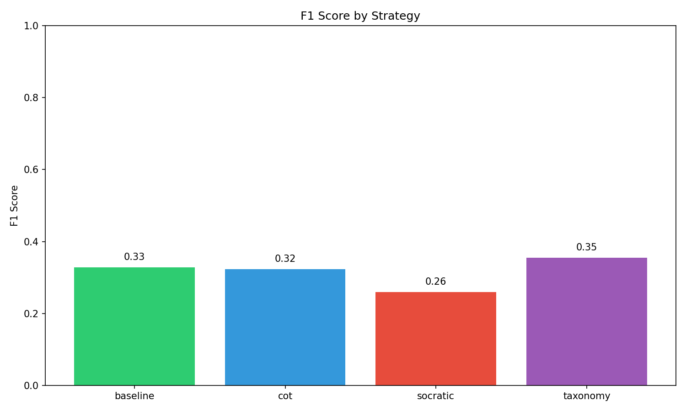
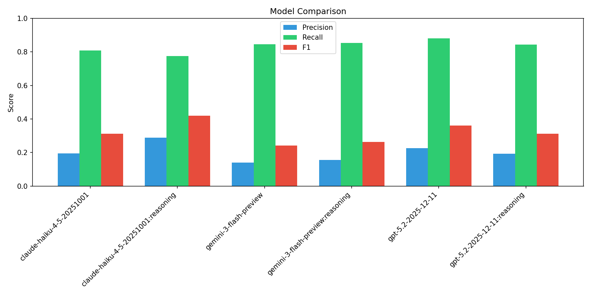
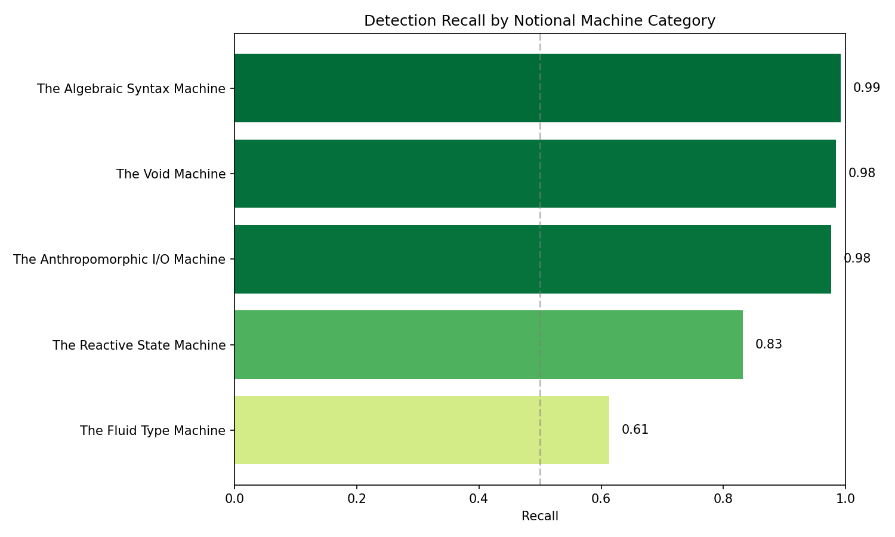
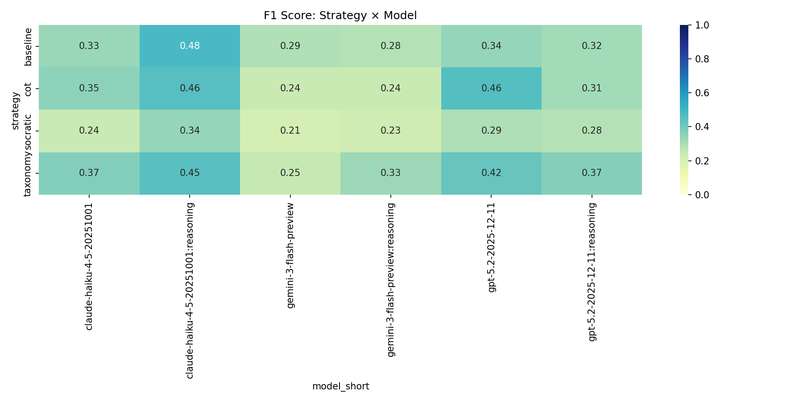
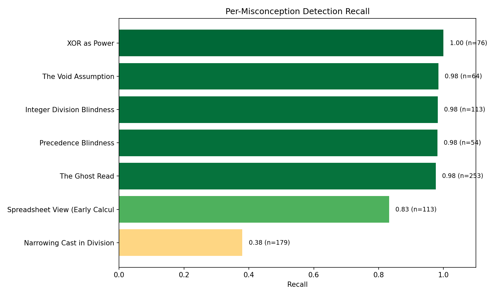
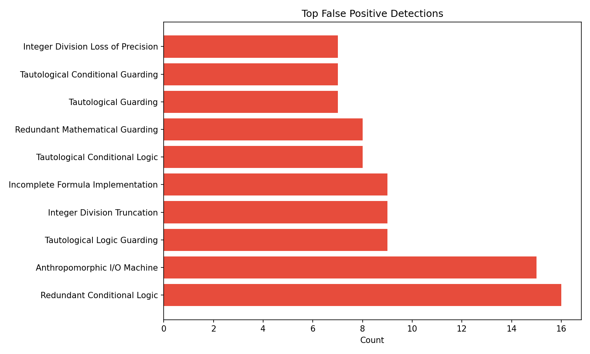

# LLM Misconception Detection: Analysis Report
_Generated: 2025-12-21T05:04:14.724905+00:00_

## Dataset Configuration
- **Students:** 100
- **Questions:** 0
- **Seed:** 1765081374
- **Match Mode:** hybrid

## Overall Metrics
| Metric | Value |
|--------|-------|
| True Positives | 712 |
| False Positives | 3048 |
| False Negatives | 140 |
| **Precision** | **0.189** |
| **Recall** | **0.836** |
| **F1 Score** | **0.309** |

## Performance by Strategy
| Strategy | TP | FP | FN | Precision | Recall | F1 |
|----------|----|----|----|-----------| -------|-----|
| baseline | 153 | 586 | 41 | 0.207 | 0.789 | 0.328 |
| cot | 175 | 699 | 36 | 0.200 | 0.829 | 0.323 |
| socratic | 210 | 1166 | 28 | 0.153 | 0.882 | 0.260 |
| taxonomy | 174 | 597 | 35 | 0.226 | 0.833 | 0.355 |

## Performance by Model
| Model | TP | FP | FN | Precision | Recall | F1 |
|-------|----|----|----|-----------|--------|-----|
| claude-haiku-4-5-20251001 | 118 | 490 | 28 | 0.194 | 0.808 | 0.313 |
| claude-haiku-4-5-20251001:reasoning | 100 | 247 | 29 | 0.288 | 0.775 | 0.420 |
| gemini-3-flash-preview | 110 | 668 | 20 | 0.141 | 0.846 | 0.242 |
| gemini-3-flash-preview:reasoning | 116 | 627 | 20 | 0.156 | 0.853 | 0.264 |
| gpt-5.2-2025-12-11 | 139 | 475 | 19 | 0.226 | 0.880 | 0.360 |
| gpt-5.2-2025-12-11:reasoning | 129 | 541 | 24 | 0.193 | 0.843 | 0.313 |

## Notional Machine Category Detection (RQ2)

> This table shows which mental model categories are easier/harder for LLMs to detect.

| Category | Recall | N |
|----------|--------|---|
| The Fluid Type Machine | 0.613 | 292 |
| The Reactive State Machine | 0.832 | 113 |
| The Anthropomorphic I/O Machine | 0.976 | 253 |
| The Void Machine | 0.984 | 64 |
| The Algebraic Syntax Machine | 0.992 | 130 |

## Strategy × Model Heatmap

## Per-Misconception Detection Rates
| ID | Name | Category | Recall | N |
|----|------|----------|--------|---|
| NM_TYP_02 | Narrowing Cast in Division | The Fluid Type Machine | 0.38 | 179 |
| NM_STATE_01 | Spreadsheet View (Early Calculation | The Reactive State Machin | 0.83 | 113 |
| NM_IO_02 | The Ghost Read | The Anthropomorphic I/O M | 0.98 | 253 |
| NM_SYN_02 | Precedence Blindness | The Algebraic Syntax Mach | 0.98 | 54 |
| NM_TYP_01 | Integer Division Blindness | The Fluid Type Machine | 0.98 | 113 |
| NM_API_01 | The Void Assumption | The Void Machine | 0.98 | 64 |
| NM_SYN_01 | XOR as Power | The Algebraic Syntax Mach | 1.00 | 76 |

## False Positive Analysis

