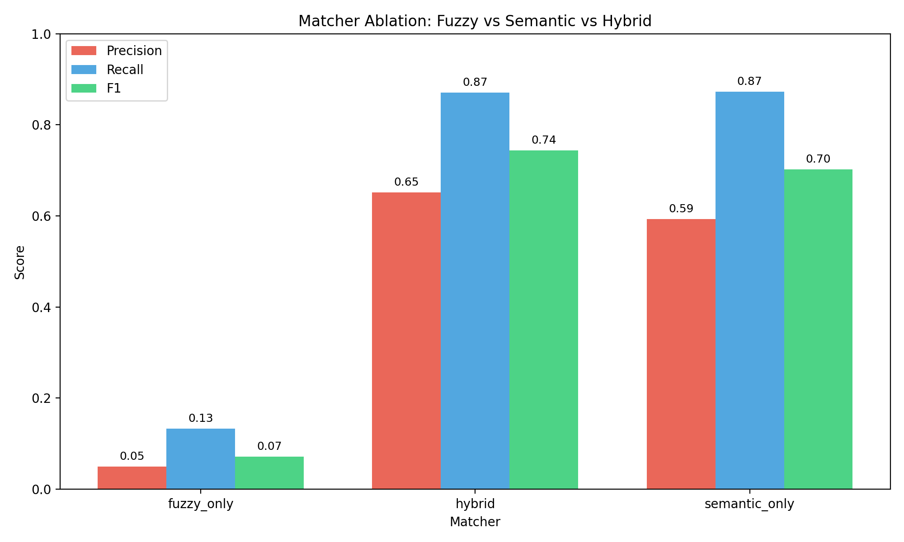
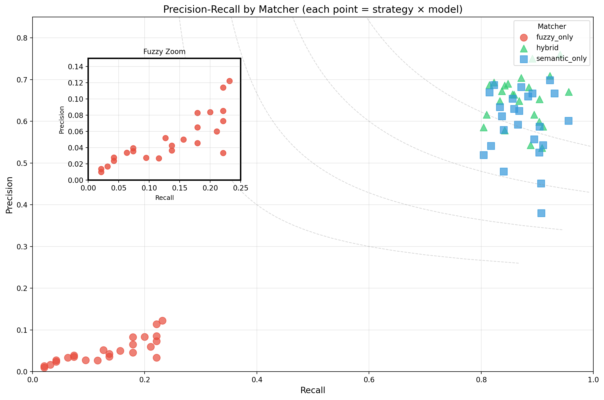
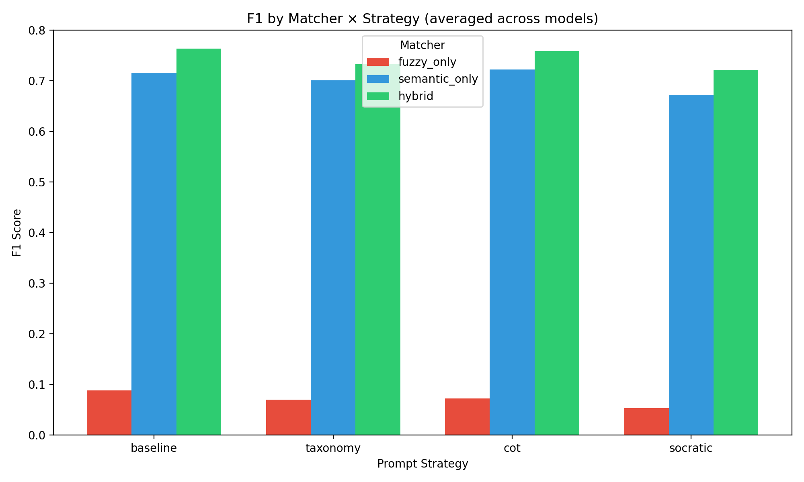
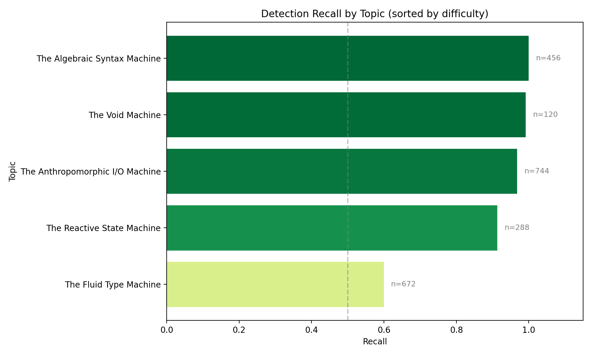
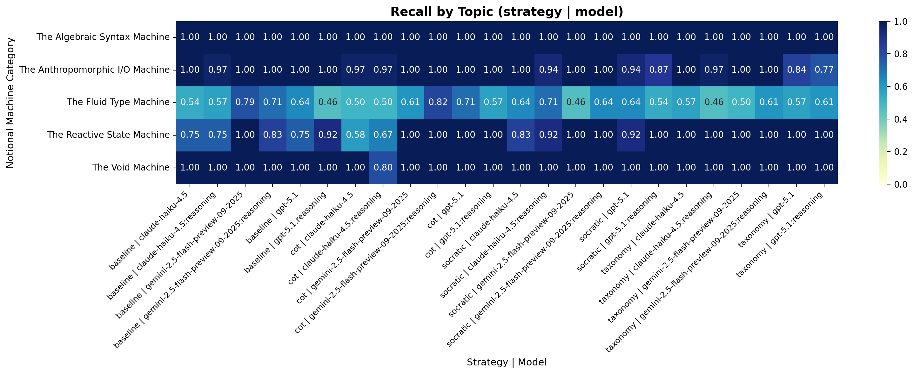
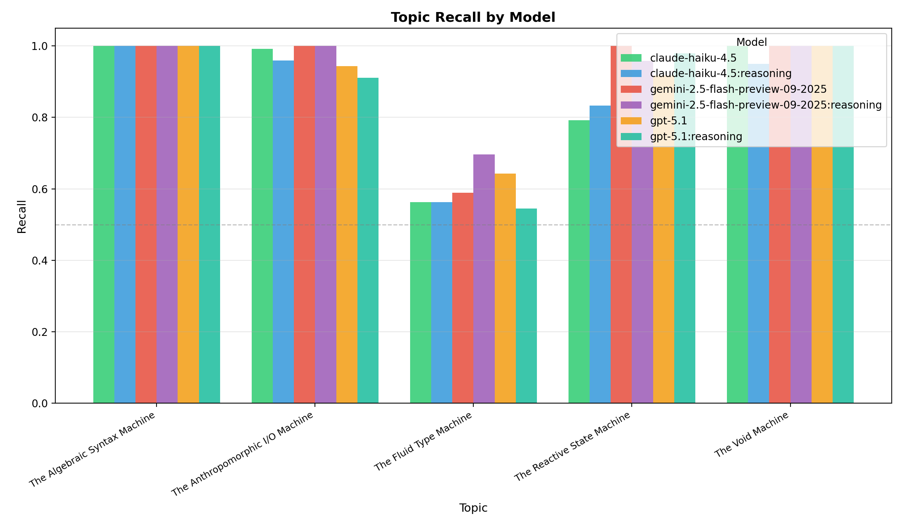
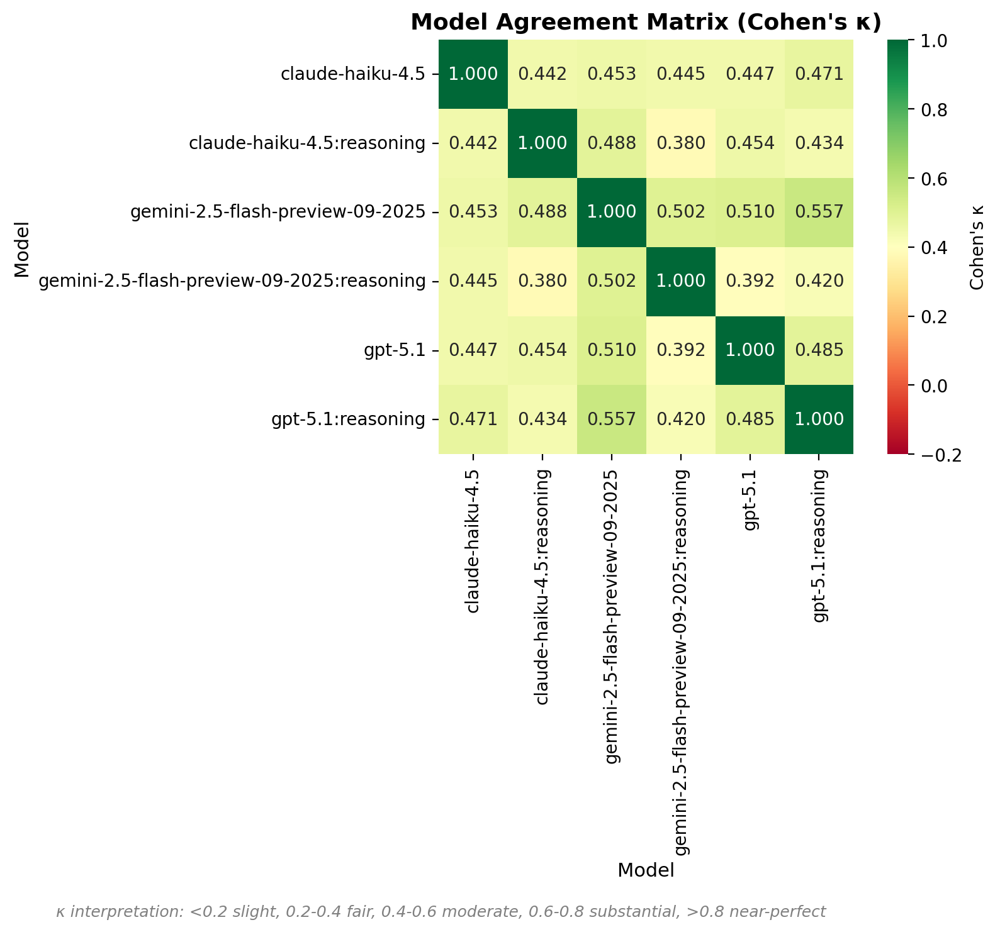
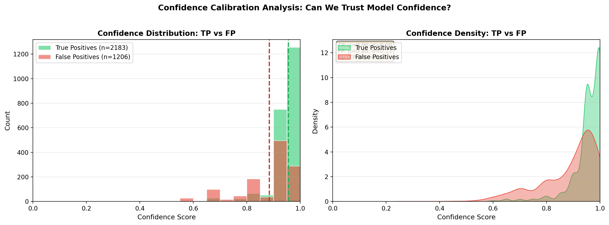
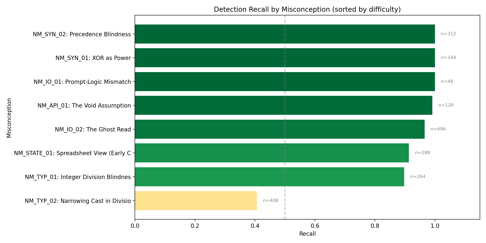
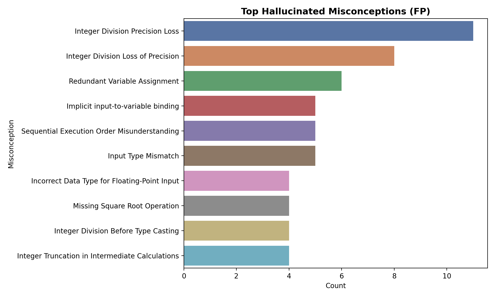

# LLM Misconception Detection: Analysis Report
_Generated: 2025-12-07T08:19:43.497823+00:00_

## Dataset & Run Configuration

### Dataset Summary
- **Assignment:** A1 – Kinematics & Geometry (CS1)
- **Students:** 99
- **Questions:** 4 (Q1, Q2, Q3, Q4)
- **Total files:** 396
- **Seeded files:** 95 (24.0%)
- **Clean files:** 301 (76.0%)
- **Detection opportunities:** 2280

### Run Configuration
- **Generation seed:** 1765081374
- **Generation model:** gpt-5.1-2025-11-13
- **Match mode:** all (ablation)
- **Embedding model:** text-embedding-3-large (OpenAI)
- **Detection models:** GPT-5.1, Gemini-2.5-Flash, Haiku-4.5
- **Strategies:** baseline, taxonomy, cot, socratic

## Executive Highlights
- **Matcher Ablation Study**: Comparing fuzzy_only, semantic_only, and hybrid matchers.
- Bootstrap CIs included for statistical rigor.
- Same detection data, different matching strategies.

## Model Leaderboard

> Ranking by average F1 across all matchers and strategies.

| Rank | Model | Avg F1 | Best Config (F1) | Worst Config (F1) |
|------|-------|--------|------------------|-------------------|
| 1 | gemini-2.5-flash-preview-09-2025 | 0.540 | hybrid / baseline (0.84) | fuzzy_only / socratic (0.07) |
| 2 | gpt-5.1 | 0.519 | hybrid / cot (0.80) | fuzzy_only / socratic (0.01) |
| 3 | claude-haiku-4.5:reasoning | 0.512 | hybrid / baseline (0.76) | fuzzy_only / socratic (0.09) |
| 4 | gpt-5.1:reasoning | 0.509 | hybrid / cot (0.77) | fuzzy_only / taxonomy (0.02) |
| 5 | gemini-2.5-flash-preview-09-2025:reasoning | 0.502 | hybrid / cot (0.79) | fuzzy_only / baseline (0.04) |
| 6 | claude-haiku-4.5 | 0.454 | hybrid / baseline (0.69) | fuzzy_only / socratic (0.06) |

## The Diagnostic Ceiling (RQ1)

**Potential Recall** measures the theoretical upper bound: what percentage of seeded errors
were found by *at least one* model/strategy combination?

| Metric | Value |
|--------|-------|
| Potential Recall (Ceiling) | 100.0% |
| Average Recall (Reliability) | 86.0% |
| Consistency (Avg/Potential) | 86.0% |
| Unique Files Detected | 95 / 95 |

> [!TIP]
> High Ceiling: Most errors are detectable by at least one configuration.

## Matcher Ablation: Fuzzy vs Semantic vs Hybrid

### Summary (averaged across strategies and models)
| Matcher | Total TP | Total FP | Total FN | Avg Precision | Avg Recall | Avg F1 |
|---------|----------|----------|----------|---------------|------------|--------|
| fuzzy_only | 304 | 5940 | 1977 | 0.050 | 0.133 | 0.071 |
| hybrid | 2183 | 1206 | 319 | 0.652 | 0.871 | 0.744 |
| semantic_only | 2179 | 1605 | 315 | 0.593 | 0.872 | 0.703 |

### Precision-Recall by Matcher

### Matcher × Strategy Distribution

## Topic Difficulty (Recall)
| Topic | Recall | N |
|-------|--------|---|
| The Fluid Type Machine | 0.600 | 672 |
| The Reactive State Machine | 0.913 | 288 |
| The Anthropomorphic I/O Machine | 0.968 | 744 |
| The Void Machine | 0.992 | 120 |
| The Algebraic Syntax Machine | 1.000 | 456 |

## Topic Heatmap

## Topic Recall by Model

Grouped bar chart showing recall per topic, split by model. Reveals model-specific strengths and weaknesses.

## Model Agreement Matrix

Pairwise Cohen's κ between models. Higher values indicate correlated predictions; lower values suggest complementary errors (good for ensembles).

## Confidence Calibration Analysis

Distribution of model confidence scores for True Positives vs False Positives. A well-calibrated model should show higher confidence for TPs than FPs.

## Per-Misconception Detection Rates

Detection recall for each seeded misconception, sorted by difficulty (hardest to detect at top):

| ID | Misconception | Category | Recall | N |
|----|---------------|----------|--------|---|
| NM_TYP_02 | Narrowing Cast in Division | The Fluid Type Machine | 0.41 | 408 |
| NM_TYP_01 | Integer Division Blindness | The Fluid Type Machine | 0.90 | 264 |
| NM_STATE_01 | Spreadsheet View (Early Calculation... | The Reactive State Machine | 0.91 | 288 |
| NM_IO_02 | The Ghost Read | The Anthropomorphic I/O Machine | 0.97 | 696 |
| NM_API_01 | The Void Assumption | The Void Machine | 0.99 | 120 |
| NM_IO_01 | Prompt-Logic Mismatch | The Anthropomorphic I/O Machine | 1.00 | 48 |
| NM_SYN_01 | XOR as Power | The Algebraic Syntax Machine | 1.00 | 144 |
| NM_SYN_02 | Precedence Blindness | The Algebraic Syntax Machine | 1.00 | 312 |

## Hallucination Analysis

- **Tautological Conditional Logic** (63 times)
- **Redundant Conditional Logic** (47 times)
- **Redundant Variable Assignment** (41 times)
- **Implicit input-to-variable binding** (36 times)
- **Integer Division Precision Loss** (32 times)

## Methods
- Data: 60 students × 4 questions (seeded/clean) with manifest-driven ground truth.
- Detection: GPT-5.1, Gemini-2.5-Flash, Haiku-4.5 across strategies (baseline, taxonomy, cot, socratic).
- Matching: Ablation comparing fuzzy-only, semantic-only (text-embedding-3-large), and hybrid (fuzzy + semantic + topic prior).
- Metrics: Precision/Recall/F1 with bootstrap CIs; agreement via κ; significance via McNemar where applicable.

## Agreement & Significance

### Cohen's Kappa (Inter-Model Agreement)

| Strategy | Model A | Model B | Cohen's κ | Interpretation |
|----------|---------|---------|-----------|----------------|
| baseline | claude-haiku-4.5 | claude-haiku-4.5:reasoning | 0.248 | Fair |
| baseline | claude-haiku-4.5 | gemini-2.5-flash-preview-09-2025 | 0.299 | Fair |
| baseline | claude-haiku-4.5 | gemini-2.5-flash-preview-09-2025:reasoning | 0.470 | Moderate |
| baseline | claude-haiku-4.5 | gpt-5.1 | 0.634 | Substantial |
| baseline | claude-haiku-4.5 | gpt-5.1:reasoning | 0.624 | Substantial |
| baseline | claude-haiku-4.5:reasoning | gemini-2.5-flash-preview-09-2025 | 0.399 | Fair |
| baseline | claude-haiku-4.5:reasoning | gemini-2.5-flash-preview-09-2025:reasoning | 0.470 | Moderate |
| baseline | claude-haiku-4.5:reasoning | gpt-5.1 | 0.391 | Fair |
| baseline | claude-haiku-4.5:reasoning | gpt-5.1:reasoning | 0.399 | Fair |
| baseline | gemini-2.5-flash-preview-09-2025 | gemini-2.5-flash-preview-09-2025:reasoning | 0.186 | Slight |
| baseline | gemini-2.5-flash-preview-09-2025 | gpt-5.1 | 0.136 | Slight |
| baseline | gemini-2.5-flash-preview-09-2025 | gpt-5.1:reasoning | 0.499 | Moderate |
| baseline | gemini-2.5-flash-preview-09-2025:reasoning | gpt-5.1 | 0.556 | Moderate |
| baseline | gemini-2.5-flash-preview-09-2025:reasoning | gpt-5.1:reasoning | 0.381 | Fair |
| baseline | gpt-5.1 | gpt-5.1:reasoning | 0.553 | Moderate |
| cot | claude-haiku-4.5 | claude-haiku-4.5:reasoning | 0.493 | Moderate |
| cot | claude-haiku-4.5 | gemini-2.5-flash-preview-09-2025 | 0.431 | Moderate |
| cot | claude-haiku-4.5 | gemini-2.5-flash-preview-09-2025:reasoning | 0.257 | Fair |
| cot | claude-haiku-4.5 | gpt-5.1 | 0.350 | Fair |
| cot | claude-haiku-4.5 | gpt-5.1:reasoning | 0.406 | Moderate |
| cot | claude-haiku-4.5:reasoning | gemini-2.5-flash-preview-09-2025 | 0.355 | Fair |
| cot | claude-haiku-4.5:reasoning | gemini-2.5-flash-preview-09-2025:reasoning | 0.257 | Fair |
| cot | claude-haiku-4.5:reasoning | gpt-5.1 | 0.432 | Moderate |
| cot | claude-haiku-4.5:reasoning | gpt-5.1:reasoning | 0.480 | Moderate |
| cot | gemini-2.5-flash-preview-09-2025 | gemini-2.5-flash-preview-09-2025:reasoning | 0.461 | Moderate |
| cot | gemini-2.5-flash-preview-09-2025 | gpt-5.1 | 0.708 | Substantial |
| cot | gemini-2.5-flash-preview-09-2025 | gpt-5.1:reasoning | 0.753 | Substantial |
| cot | gemini-2.5-flash-preview-09-2025:reasoning | gpt-5.1 | 0.424 | Moderate |
| cot | gemini-2.5-flash-preview-09-2025:reasoning | gpt-5.1:reasoning | 0.555 | Moderate |
| cot | gpt-5.1 | gpt-5.1:reasoning | 0.666 | Substantial |
| socratic | claude-haiku-4.5 | claude-haiku-4.5:reasoning | 0.555 | Moderate |
| socratic | claude-haiku-4.5 | gemini-2.5-flash-preview-09-2025 | 0.526 | Moderate |
| socratic | claude-haiku-4.5 | gemini-2.5-flash-preview-09-2025:reasoning | 0.589 | Moderate |
| socratic | claude-haiku-4.5 | gpt-5.1 | 0.401 | Moderate |
| socratic | claude-haiku-4.5 | gpt-5.1:reasoning | 0.312 | Fair |
| socratic | claude-haiku-4.5:reasoning | gemini-2.5-flash-preview-09-2025 | 0.467 | Moderate |
| socratic | claude-haiku-4.5:reasoning | gemini-2.5-flash-preview-09-2025:reasoning | 0.304 | Fair |
| socratic | claude-haiku-4.5:reasoning | gpt-5.1 | 0.428 | Moderate |
| socratic | claude-haiku-4.5:reasoning | gpt-5.1:reasoning | 0.252 | Fair |
| socratic | gemini-2.5-flash-preview-09-2025 | gemini-2.5-flash-preview-09-2025:reasoning | 0.588 | Moderate |
| socratic | gemini-2.5-flash-preview-09-2025 | gpt-5.1 | 0.581 | Moderate |
| socratic | gemini-2.5-flash-preview-09-2025 | gpt-5.1:reasoning | 0.549 | Moderate |
| socratic | gemini-2.5-flash-preview-09-2025:reasoning | gpt-5.1 | 0.260 | Fair |
| socratic | gemini-2.5-flash-preview-09-2025:reasoning | gpt-5.1:reasoning | 0.360 | Fair |
| socratic | gpt-5.1 | gpt-5.1:reasoning | 0.448 | Moderate |
| taxonomy | claude-haiku-4.5 | claude-haiku-4.5:reasoning | 0.666 | Substantial |
| taxonomy | claude-haiku-4.5 | gemini-2.5-flash-preview-09-2025 | 0.555 | Moderate |
| taxonomy | claude-haiku-4.5 | gemini-2.5-flash-preview-09-2025:reasoning | 0.555 | Moderate |
| taxonomy | claude-haiku-4.5 | gpt-5.1 | 0.474 | Moderate |
| taxonomy | claude-haiku-4.5 | gpt-5.1:reasoning | 0.450 | Moderate |
| taxonomy | claude-haiku-4.5:reasoning | gemini-2.5-flash-preview-09-2025 | 0.604 | Substantial |
| taxonomy | claude-haiku-4.5:reasoning | gemini-2.5-flash-preview-09-2025:reasoning | 0.614 | Substantial |
| taxonomy | claude-haiku-4.5:reasoning | gpt-5.1 | 0.523 | Moderate |
| taxonomy | claude-haiku-4.5:reasoning | gpt-5.1:reasoning | 0.427 | Moderate |
| taxonomy | gemini-2.5-flash-preview-09-2025 | gemini-2.5-flash-preview-09-2025:reasoning | 0.586 | Moderate |
| taxonomy | gemini-2.5-flash-preview-09-2025 | gpt-5.1 | 0.423 | Moderate |
| taxonomy | gemini-2.5-flash-preview-09-2025 | gpt-5.1:reasoning | 0.326 | Fair |
| taxonomy | gemini-2.5-flash-preview-09-2025:reasoning | gpt-5.1 | 0.501 | Moderate |
| taxonomy | gemini-2.5-flash-preview-09-2025:reasoning | gpt-5.1:reasoning | 0.476 | Moderate |
| taxonomy | gpt-5.1 | gpt-5.1:reasoning | 0.405 | Moderate |

### McNemar's Test (Significance of Differences)

| Strategy | Model A | Model B | χ² Stat | p-value | Significant? | Both✓ | A only | B only | Both✗ |
|----------|---------|---------|---------|---------|--------------|-------|--------|--------|-------|
| baseline | claude-haiku-4.5 | claude-haiku-4.5:reasoning | 0.01 | 0.9110 | No | 69 | 10 | 10 | 6 |
| baseline | claude-haiku-4.5 | gemini-2.5-flash-preview-09-2025 | 6.45 | 0.0111 | Yes | 77 | 2 | 12 | 4 |
| baseline | claude-haiku-4.5 | gemini-2.5-flash-preview-09-2025:reasoning | 2.52 | 0.1124 | No | 76 | 3 | 9 | 7 |
| baseline | claude-haiku-4.5 | gpt-5.1 | 0.69 | 0.4047 | No | 76 | 3 | 6 | 10 |
| baseline | claude-haiku-4.5 | gpt-5.1:reasoning | 0.03 | 0.8744 | No | 74 | 5 | 5 | 11 |
| baseline | claude-haiku-4.5:reasoning | gemini-2.5-flash-preview-09-2025 | 7.52 | 0.0061 | Yes | 78 | 1 | 11 | 5 |
| baseline | claude-haiku-4.5:reasoning | gemini-2.5-flash-preview-09-2025:reasoning | 2.52 | 0.1124 | No | 76 | 3 | 9 | 7 |
| baseline | claude-haiku-4.5:reasoning | gpt-5.1 | 0.42 | 0.5186 | No | 73 | 6 | 9 | 7 |
| baseline | claude-haiku-4.5:reasoning | gpt-5.1:reasoning | 0.02 | 0.9005 | No | 71 | 8 | 8 | 8 |
| baseline | gemini-2.5-flash-preview-09-2025 | gemini-2.5-flash-preview-09-2025:reasoning | 1.02 | 0.3123 | No | 81 | 8 | 4 | 2 |
| baseline | gemini-2.5-flash-preview-09-2025 | gpt-5.1 | 2.82 | 0.0933 | No | 78 | 11 | 4 | 2 |
| baseline | gemini-2.5-flash-preview-09-2025 | gpt-5.1:reasoning | 9.03 | 0.0027 | Yes | 79 | 10 | 0 | 6 |
| baseline | gemini-2.5-flash-preview-09-2025:reasoning | gpt-5.1 | 0.69 | 0.4047 | No | 79 | 6 | 3 | 7 |
| baseline | gemini-2.5-flash-preview-09-2025:reasoning | gpt-5.1:reasoning | 2.16 | 0.1416 | No | 75 | 10 | 4 | 6 |
| baseline | gpt-5.1 | gpt-5.1:reasoning | 0.57 | 0.4510 | No | 75 | 7 | 4 | 9 |
| cot | claude-haiku-4.5 | claude-haiku-4.5:reasoning | 0.02 | 0.9005 | No | 67 | 8 | 8 | 12 |
| cot | claude-haiku-4.5 | gemini-2.5-flash-preview-09-2025 | 4.82 | 0.0282 | Yes | 72 | 3 | 12 | 8 |
| cot | claude-haiku-4.5 | gemini-2.5-flash-preview-09-2025:reasoning | 12.37 | 0.0004 | Yes | 74 | 1 | 16 | 4 |
| cot | claude-haiku-4.5 | gpt-5.1 | 8.27 | 0.0040 | Yes | 73 | 2 | 14 | 6 |
| cot | claude-haiku-4.5 | gpt-5.1:reasoning | 3.52 | 0.0608 | No | 71 | 4 | 12 | 8 |
| cot | claude-haiku-4.5:reasoning | gemini-2.5-flash-preview-09-2025 | 4.25 | 0.0393 | Yes | 71 | 4 | 13 | 7 |
| cot | claude-haiku-4.5:reasoning | gemini-2.5-flash-preview-09-2025:reasoning | 12.37 | 0.0004 | Yes | 74 | 1 | 16 | 4 |
| cot | claude-haiku-4.5:reasoning | gpt-5.1 | 9.45 | 0.0021 | Yes | 74 | 1 | 13 | 7 |
| cot | claude-haiku-4.5:reasoning | gpt-5.1:reasoning | 4.02 | 0.0450 | Yes | 72 | 3 | 11 | 9 |
| cot | gemini-2.5-flash-preview-09-2025 | gemini-2.5-flash-preview-09-2025:reasoning | 3.78 | 0.0518 | No | 83 | 1 | 7 | 4 |
| cot | gemini-2.5-flash-preview-09-2025 | gpt-5.1 | 1.25 | 0.2636 | No | 83 | 1 | 4 | 7 |
| cot | gemini-2.5-flash-preview-09-2025 | gpt-5.1:reasoning | 0.05 | 0.8231 | No | 81 | 3 | 2 | 9 |
| cot | gemini-2.5-flash-preview-09-2025:reasoning | gpt-5.1 | 0.89 | 0.3447 | No | 85 | 5 | 2 | 3 |
| cot | gemini-2.5-flash-preview-09-2025:reasoning | gpt-5.1:reasoning | 6.04 | 0.0140 | Yes | 83 | 7 | 0 | 5 |
| cot | gpt-5.1 | gpt-5.1:reasoning | 2.04 | 0.1530 | No | 82 | 5 | 1 | 7 |
| socratic | claude-haiku-4.5 | claude-haiku-4.5:reasoning | 0.03 | 0.8676 | No | 79 | 4 | 5 | 7 |
| socratic | claude-haiku-4.5 | gemini-2.5-flash-preview-09-2025 | 0.57 | 0.4510 | No | 76 | 7 | 4 | 8 |
| socratic | claude-haiku-4.5 | gemini-2.5-flash-preview-09-2025:reasoning | 0.28 | 0.5959 | No | 80 | 3 | 5 | 7 |
| socratic | claude-haiku-4.5 | gpt-5.1 | 0.02 | 0.8897 | No | 76 | 7 | 6 | 6 |
| socratic | claude-haiku-4.5 | gpt-5.1:reasoning | 1.19 | 0.2751 | No | 72 | 11 | 6 | 6 |
| socratic | claude-haiku-4.5:reasoning | gemini-2.5-flash-preview-09-2025 | 1.02 | 0.3123 | No | 76 | 8 | 4 | 7 |
| socratic | claude-haiku-4.5:reasoning | gemini-2.5-flash-preview-09-2025:reasoning | 0.02 | 0.8897 | No | 78 | 6 | 7 | 4 |
| socratic | claude-haiku-4.5:reasoning | gpt-5.1 | 0.19 | 0.6650 | No | 77 | 7 | 5 | 6 |
| socratic | claude-haiku-4.5:reasoning | gpt-5.1:reasoning | 1.68 | 0.1949 | No | 72 | 12 | 6 | 5 |
| socratic | gemini-2.5-flash-preview-09-2025 | gemini-2.5-flash-preview-09-2025:reasoning | 2.25 | 0.1336 | No | 78 | 2 | 7 | 8 |
| socratic | gemini-2.5-flash-preview-09-2025 | gpt-5.1 | 0.23 | 0.6353 | No | 76 | 4 | 6 | 9 |
| socratic | gemini-2.5-flash-preview-09-2025 | gpt-5.1:reasoning | 0.19 | 0.6650 | No | 73 | 7 | 5 | 10 |
| socratic | gemini-2.5-flash-preview-09-2025:reasoning | gpt-5.1 | 0.42 | 0.5186 | No | 76 | 9 | 6 | 4 |
| socratic | gemini-2.5-flash-preview-09-2025:reasoning | gpt-5.1:reasoning | 2.82 | 0.0933 | No | 74 | 11 | 4 | 6 |
| socratic | gpt-5.1 | gpt-5.1:reasoning | 0.88 | 0.3496 | No | 73 | 9 | 5 | 8 |
| taxonomy | claude-haiku-4.5 | claude-haiku-4.5:reasoning | 1.53 | 0.2159 | No | 77 | 6 | 2 | 10 |
| taxonomy | claude-haiku-4.5 | gemini-2.5-flash-preview-09-2025 | 0.23 | 0.6353 | No | 77 | 6 | 4 | 8 |
| taxonomy | claude-haiku-4.5 | gemini-2.5-flash-preview-09-2025:reasoning | 0.03 | 0.8676 | No | 79 | 4 | 5 | 7 |
| taxonomy | claude-haiku-4.5 | gpt-5.1 | 1.56 | 0.2120 | No | 74 | 9 | 4 | 8 |
| taxonomy | claude-haiku-4.5 | gpt-5.1:reasoning | 2.16 | 0.1416 | No | 73 | 10 | 4 | 8 |
| taxonomy | claude-haiku-4.5:reasoning | gemini-2.5-flash-preview-09-2025 | 0.23 | 0.6353 | No | 75 | 4 | 6 | 10 |
| taxonomy | claude-haiku-4.5:reasoning | gemini-2.5-flash-preview-09-2025:reasoning | 2.25 | 0.1336 | No | 77 | 2 | 7 | 9 |
| taxonomy | claude-haiku-4.5:reasoning | gpt-5.1 | 0.02 | 0.8897 | No | 72 | 7 | 6 | 10 |
| taxonomy | claude-haiku-4.5:reasoning | gpt-5.1:reasoning | 0.14 | 0.7077 | No | 70 | 9 | 7 | 9 |
| taxonomy | gemini-2.5-flash-preview-09-2025 | gemini-2.5-flash-preview-09-2025:reasoning | 0.69 | 0.4047 | No | 78 | 3 | 6 | 8 |
| taxonomy | gemini-2.5-flash-preview-09-2025 | gpt-5.1 | 0.42 | 0.5186 | No | 72 | 9 | 6 | 8 |
| taxonomy | gemini-2.5-flash-preview-09-2025 | gpt-5.1:reasoning | 0.68 | 0.4094 | No | 70 | 11 | 7 | 7 |
| taxonomy | gemini-2.5-flash-preview-09-2025:reasoning | gpt-5.1 | 2.52 | 0.1124 | No | 75 | 9 | 3 | 8 |
| taxonomy | gemini-2.5-flash-preview-09-2025:reasoning | gpt-5.1:reasoning | 3.25 | 0.0714 | No | 74 | 10 | 3 | 8 |
| taxonomy | gpt-5.1 | gpt-5.1:reasoning | 0.01 | 0.9035 | No | 69 | 9 | 8 | 9 |

## Full Results Table

| Matcher | Strategy | Model | TP | FP | FN | Precision | Recall | F1 | CI (F1) |
|---------|----------|-------|----|----|----|-----------|--------|----|---------|
| fuzzy_only | baseline | claude-haiku-4.5 | 21 | 267 | 74 | 0.073 | 0.221 | 0.110 | 0.07–0.15 |
| fuzzy_only | baseline | claude-haiku-4.5:reasoning | 22 | 158 | 73 | 0.122 | 0.232 | 0.160 | 0.10–0.22 |
| fuzzy_only | baseline | gemini-2.5-flash-preview-09-2025 | 21 | 225 | 74 | 0.085 | 0.221 | 0.123 | 0.07–0.17 |
| fuzzy_only | baseline | gemini-2.5-flash-preview-09-2025:reasoning | 9 | 318 | 86 | 0.028 | 0.095 | 0.043 | 0.02–0.08 |
| fuzzy_only | baseline | gpt-5.1 | 6 | 171 | 89 | 0.034 | 0.063 | 0.044 | 0.01–0.09 |
| fuzzy_only | baseline | gpt-5.1:reasoning | 7 | 171 | 88 | 0.039 | 0.074 | 0.051 | 0.02–0.09 |
| fuzzy_only | cot | claude-haiku-4.5 | 19 | 208 | 76 | 0.084 | 0.200 | 0.118 | 0.07–0.17 |
| fuzzy_only | cot | claude-haiku-4.5:reasoning | 17 | 188 | 78 | 0.083 | 0.179 | 0.113 | 0.07–0.16 |
| fuzzy_only | cot | gemini-2.5-flash-preview-09-2025 | 17 | 244 | 78 | 0.065 | 0.179 | 0.096 | 0.06–0.14 |
| fuzzy_only | cot | gemini-2.5-flash-preview-09-2025:reasoning | 13 | 344 | 82 | 0.036 | 0.137 | 0.058 | 0.03–0.09 |
| fuzzy_only | cot | gpt-5.1 | 3 | 175 | 92 | 0.017 | 0.032 | 0.022 | 0.00–0.05 |
| fuzzy_only | cot | gpt-5.1:reasoning | 4 | 165 | 91 | 0.024 | 0.042 | 0.030 | 0.01–0.06 |
| fuzzy_only | socratic | claude-haiku-4.5 | 21 | 606 | 74 | 0.033 | 0.221 | 0.058 | 0.04–0.08 |
| fuzzy_only | socratic | claude-haiku-4.5:reasoning | 20 | 313 | 75 | 0.060 | 0.211 | 0.093 | 0.05–0.14 |
| fuzzy_only | socratic | gemini-2.5-flash-preview-09-2025 | 13 | 292 | 82 | 0.043 | 0.137 | 0.065 | 0.04–0.09 |
| fuzzy_only | socratic | gemini-2.5-flash-preview-09-2025:reasoning | 11 | 399 | 84 | 0.027 | 0.116 | 0.044 | 0.02–0.07 |
| fuzzy_only | socratic | gpt-5.1 | 2 | 198 | 93 | 0.010 | 0.021 | 0.014 | 0.00–0.03 |
| fuzzy_only | socratic | gpt-5.1:reasoning | 7 | 190 | 88 | 0.036 | 0.074 | 0.048 | 0.01–0.08 |
| fuzzy_only | taxonomy | claude-haiku-4.5 | 17 | 356 | 78 | 0.046 | 0.179 | 0.073 | 0.04–0.10 |
| fuzzy_only | taxonomy | claude-haiku-4.5:reasoning | 21 | 163 | 74 | 0.114 | 0.221 | 0.151 | 0.09–0.21 |
| fuzzy_only | taxonomy | gemini-2.5-flash-preview-09-2025 | 12 | 220 | 83 | 0.052 | 0.126 | 0.073 | 0.03–0.11 |
| fuzzy_only | taxonomy | gemini-2.5-flash-preview-09-2025:reasoning | 15 | 285 | 81 | 0.050 | 0.156 | 0.076 | 0.04–0.11 |
| fuzzy_only | taxonomy | gpt-5.1 | 4 | 140 | 91 | 0.028 | 0.042 | 0.033 | 0.00–0.08 |
| fuzzy_only | taxonomy | gpt-5.1:reasoning | 2 | 144 | 93 | 0.014 | 0.021 | 0.017 | 0.00–0.04 |
| hybrid | baseline | claude-haiku-4.5 | 85 | 62 | 16 | 0.578 | 0.842 | 0.685 | 0.61–0.76 |
| hybrid | baseline | claude-haiku-4.5:reasoning | 85 | 39 | 16 | 0.685 | 0.842 | 0.756 | 0.68–0.83 |
| hybrid | baseline | gemini-2.5-flash-preview-09-2025 | 95 | 30 | 6 | 0.760 | 0.941 | 0.841 | 0.78–0.89 |
| hybrid | baseline | gemini-2.5-flash-preview-09-2025:reasoning | 94 | 50 | 10 | 0.653 | 0.904 | 0.758 | 0.70–0.82 |
| hybrid | baseline | gpt-5.1 | 88 | 37 | 13 | 0.704 | 0.871 | 0.779 | 0.70–0.85 |
| hybrid | baseline | gpt-5.1:reasoning | 89 | 40 | 16 | 0.690 | 0.848 | 0.761 | 0.68–0.84 |
| hybrid | cot | claude-haiku-4.5 | 82 | 58 | 20 | 0.586 | 0.804 | 0.678 | 0.59–0.75 |
| hybrid | cot | claude-haiku-4.5:reasoning | 85 | 53 | 20 | 0.616 | 0.810 | 0.700 | 0.62–0.77 |
| hybrid | cot | gemini-2.5-flash-preview-09-2025 | 90 | 30 | 11 | 0.750 | 0.891 | 0.814 | 0.75–0.88 |
| hybrid | cot | gemini-2.5-flash-preview-09-2025:reasoning | 108 | 53 | 5 | 0.671 | 0.956 | 0.788 | 0.73–0.84 |
| hybrid | cot | gpt-5.1 | 95 | 39 | 8 | 0.709 | 0.922 | 0.802 | 0.74–0.87 |
| hybrid | cot | gpt-5.1:reasoning | 92 | 43 | 12 | 0.681 | 0.885 | 0.770 | 0.69–0.84 |
| hybrid | socratic | claude-haiku-4.5 | 119 | 103 | 12 | 0.536 | 0.908 | 0.674 | 0.61–0.74 |
| hybrid | socratic | claude-haiku-4.5:reasoning | 103 | 69 | 11 | 0.599 | 0.904 | 0.720 | 0.64–0.78 |
| hybrid | socratic | gemini-2.5-flash-preview-09-2025 | 89 | 45 | 15 | 0.664 | 0.856 | 0.748 | 0.67–0.82 |
| hybrid | socratic | gemini-2.5-flash-preview-09-2025:reasoning | 101 | 71 | 10 | 0.587 | 0.910 | 0.714 | 0.65–0.77 |
| hybrid | socratic | gpt-5.1 | 85 | 46 | 13 | 0.649 | 0.867 | 0.742 | 0.67–0.81 |
| hybrid | socratic | gpt-5.1:reasoning | 85 | 46 | 17 | 0.649 | 0.833 | 0.730 | 0.65–0.81 |
| hybrid | taxonomy | claude-haiku-4.5 | 95 | 80 | 12 | 0.543 | 0.888 | 0.674 | 0.61–0.74 |
| hybrid | taxonomy | claude-haiku-4.5:reasoning | 82 | 40 | 16 | 0.672 | 0.837 | 0.745 | 0.67–0.82 |
| hybrid | taxonomy | gemini-2.5-flash-preview-09-2025 | 85 | 43 | 14 | 0.664 | 0.859 | 0.749 | 0.67–0.82 |
| hybrid | taxonomy | gemini-2.5-flash-preview-09-2025:reasoning | 93 | 58 | 11 | 0.616 | 0.894 | 0.729 | 0.66–0.80 |
| hybrid | taxonomy | gpt-5.1 | 79 | 35 | 17 | 0.693 | 0.823 | 0.752 | 0.68–0.83 |
| hybrid | taxonomy | gpt-5.1:reasoning | 79 | 36 | 18 | 0.687 | 0.814 | 0.745 | 0.66–0.82 |
| semantic_only | baseline | claude-haiku-4.5 | 84 | 91 | 16 | 0.480 | 0.840 | 0.611 | 0.53–0.68 |
| semantic_only | baseline | claude-haiku-4.5:reasoning | 84 | 61 | 16 | 0.579 | 0.840 | 0.686 | 0.60–0.74 |
| semantic_only | baseline | gemini-2.5-flash-preview-09-2025 | 94 | 47 | 7 | 0.667 | 0.931 | 0.777 | 0.72–0.84 |
| semantic_only | baseline | gemini-2.5-flash-preview-09-2025:reasoning | 94 | 66 | 10 | 0.588 | 0.904 | 0.712 | 0.65–0.77 |
| semantic_only | baseline | gpt-5.1 | 88 | 41 | 13 | 0.682 | 0.871 | 0.765 | 0.69–0.84 |
| semantic_only | baseline | gpt-5.1:reasoning | 89 | 47 | 15 | 0.654 | 0.856 | 0.742 | 0.67–0.81 |
| semantic_only | cot | claude-haiku-4.5 | 82 | 76 | 20 | 0.519 | 0.804 | 0.631 | 0.56–0.72 |
| semantic_only | cot | claude-haiku-4.5:reasoning | 85 | 72 | 19 | 0.541 | 0.817 | 0.651 | 0.58–0.73 |
| semantic_only | cot | gemini-2.5-flash-preview-09-2025 | 90 | 45 | 11 | 0.667 | 0.891 | 0.763 | 0.69–0.83 |
| semantic_only | cot | gemini-2.5-flash-preview-09-2025:reasoning | 107 | 71 | 5 | 0.601 | 0.955 | 0.738 | 0.68–0.79 |
| semantic_only | cot | gpt-5.1 | 95 | 41 | 8 | 0.699 | 0.922 | 0.795 | 0.73–0.85 |
| semantic_only | cot | gpt-5.1:reasoning | 91 | 47 | 12 | 0.659 | 0.883 | 0.755 | 0.68–0.83 |
| semantic_only | socratic | claude-haiku-4.5 | 117 | 191 | 12 | 0.380 | 0.907 | 0.535 | 0.47–0.60 |
| semantic_only | socratic | claude-haiku-4.5:reasoning | 103 | 93 | 11 | 0.526 | 0.904 | 0.665 | 0.60–0.74 |
| semantic_only | socratic | gemini-2.5-flash-preview-09-2025 | 90 | 62 | 14 | 0.592 | 0.865 | 0.703 | 0.63–0.78 |
| semantic_only | socratic | gemini-2.5-flash-preview-09-2025:reasoning | 101 | 85 | 10 | 0.543 | 0.910 | 0.680 | 0.62–0.74 |
| semantic_only | socratic | gpt-5.1 | 85 | 51 | 13 | 0.625 | 0.867 | 0.726 | 0.66–0.79 |
| semantic_only | socratic | gpt-5.1:reasoning | 85 | 49 | 17 | 0.634 | 0.833 | 0.720 | 0.64–0.80 |
| semantic_only | taxonomy | claude-haiku-4.5 | 97 | 118 | 10 | 0.451 | 0.907 | 0.602 | 0.53–0.66 |
| semantic_only | taxonomy | claude-haiku-4.5:reasoning | 82 | 52 | 16 | 0.612 | 0.837 | 0.707 | 0.63–0.78 |
| semantic_only | taxonomy | gemini-2.5-flash-preview-09-2025 | 85 | 50 | 14 | 0.630 | 0.859 | 0.726 | 0.65–0.80 |
| semantic_only | taxonomy | gemini-2.5-flash-preview-09-2025:reasoning | 93 | 74 | 11 | 0.557 | 0.894 | 0.686 | 0.62–0.76 |
| semantic_only | taxonomy | gpt-5.1 | 79 | 36 | 17 | 0.687 | 0.823 | 0.749 | 0.67–0.83 |
| semantic_only | taxonomy | gpt-5.1:reasoning | 79 | 39 | 18 | 0.669 | 0.814 | 0.735 | 0.66–0.82 |