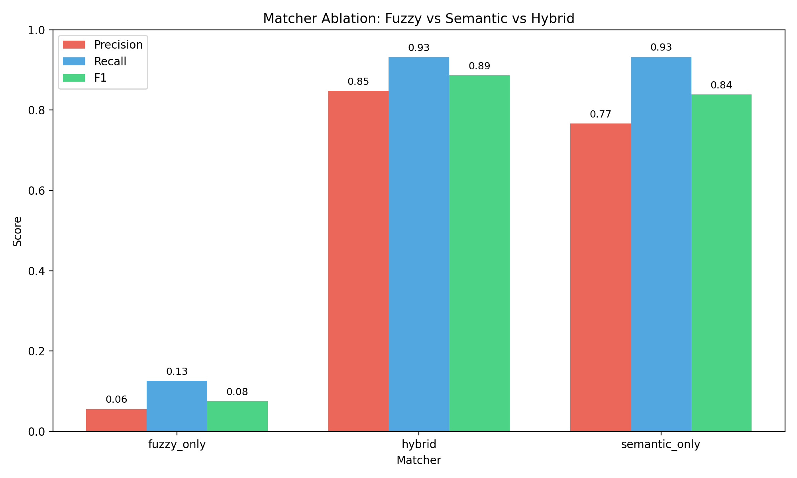
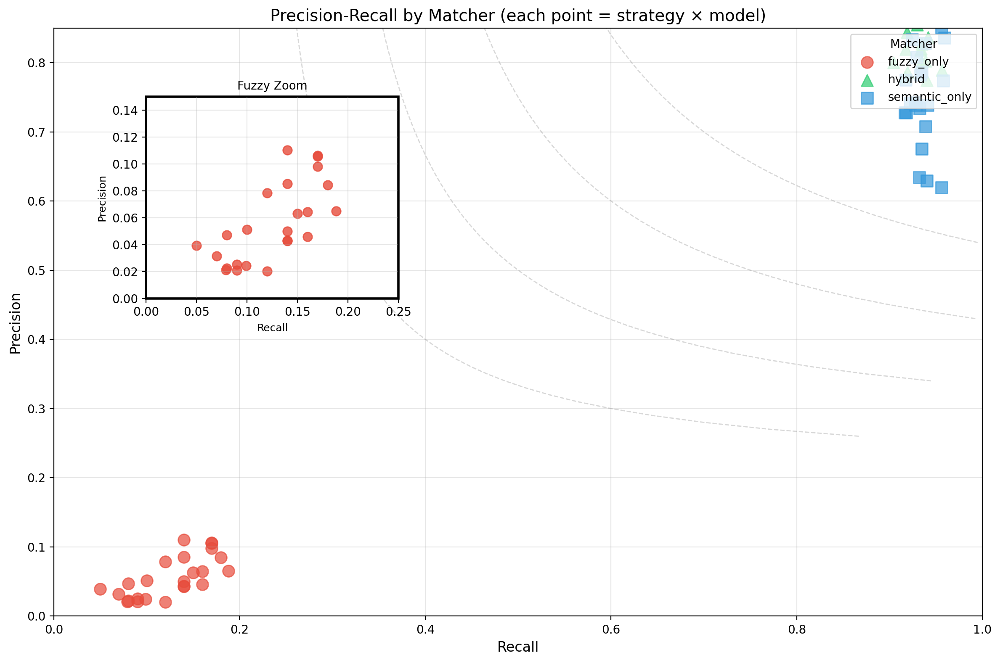
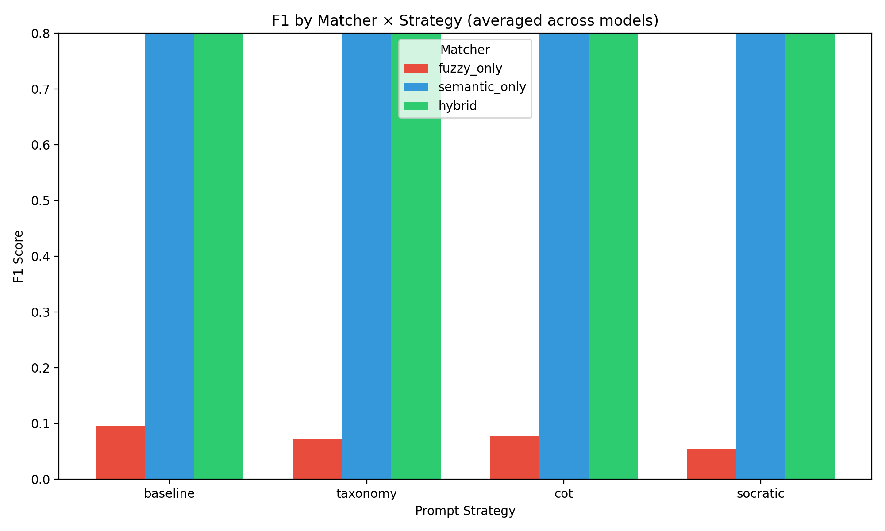
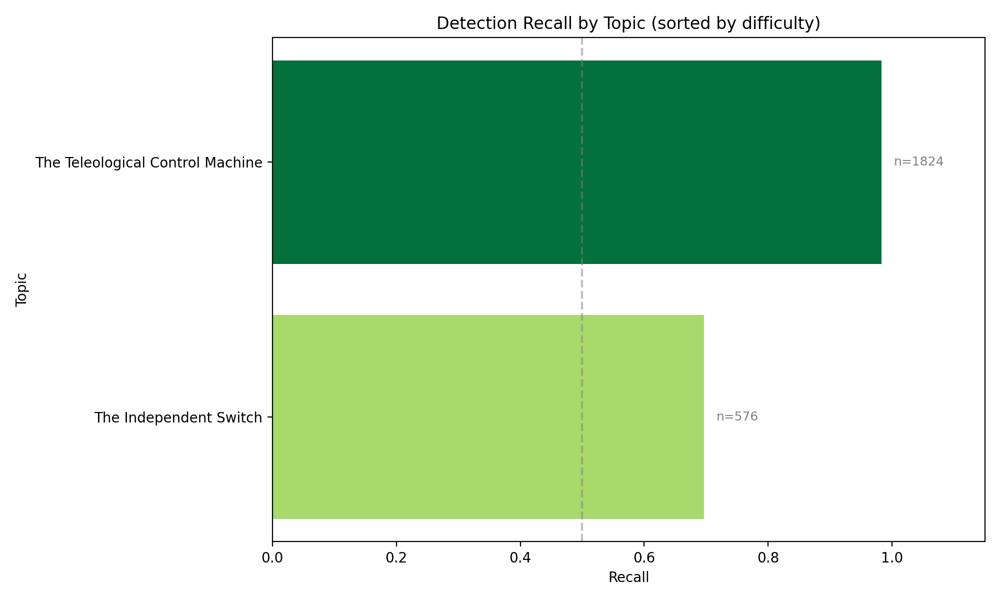
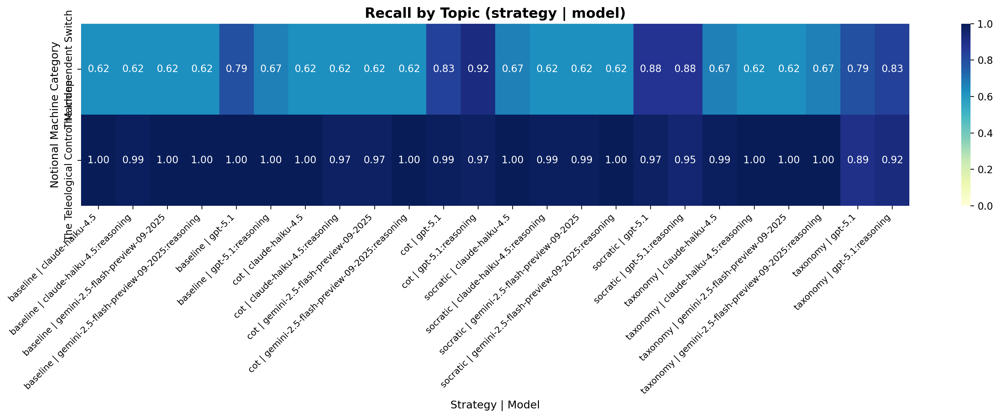
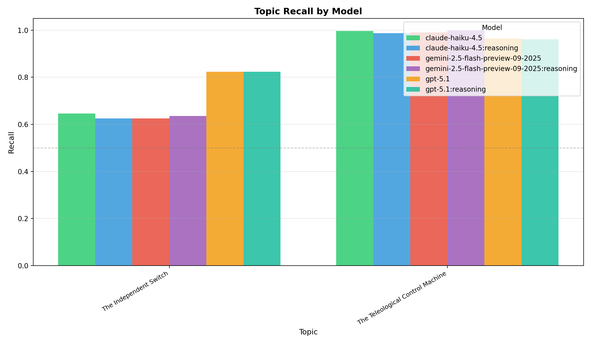
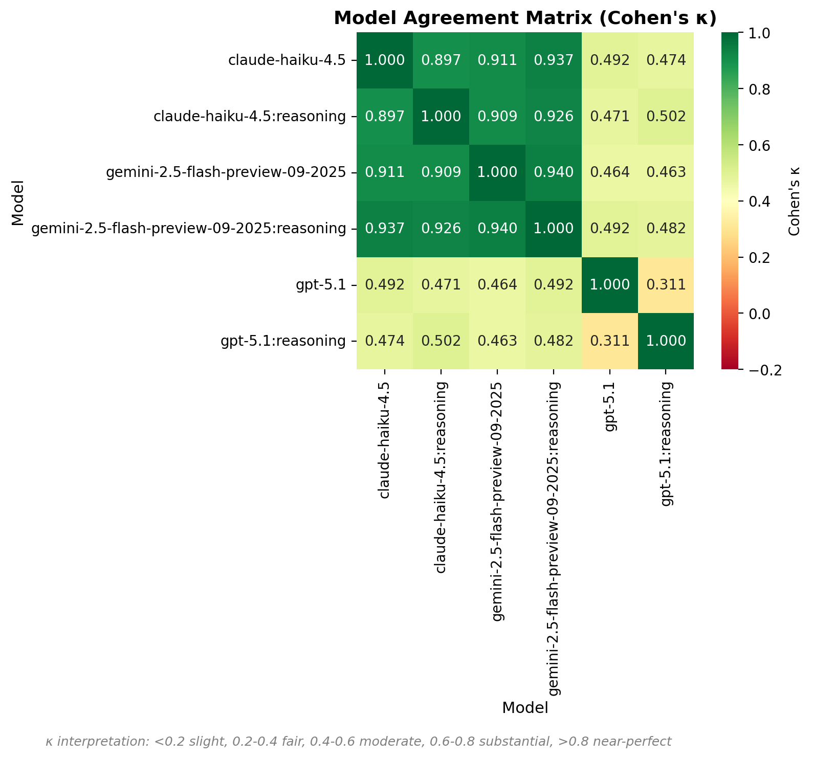
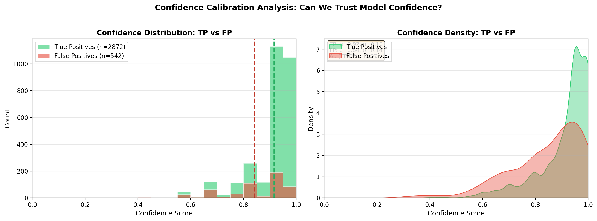
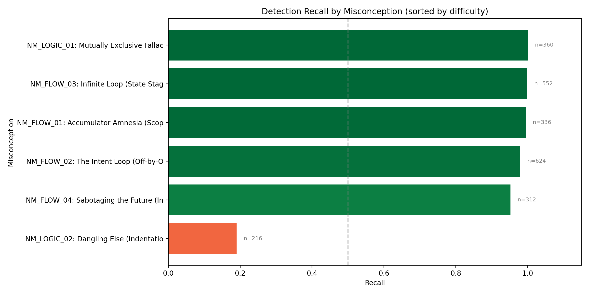
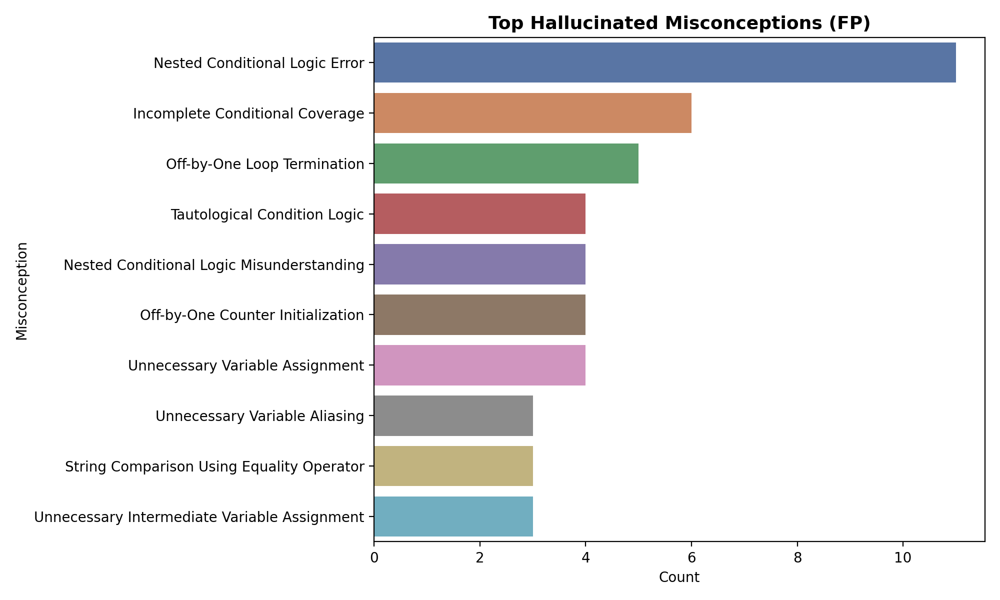

# LLM Misconception Detection: Analysis Report
_Generated: 2025-12-07T11:40:31.523755+00:00_

## Dataset & Run Configuration

### Dataset Summary
- **Assignment:** A1 – Kinematics & Geometry (CS1)
- **Students:** 100
- **Questions:** 4 (Q1, Q2, Q3, Q4)
- **Total files:** 400
- **Seeded files:** 100 (25.0%)
- **Clean files:** 300 (75.0%)
- **Detection opportunities:** 2400

### Run Configuration
- **Generation seed:** 1765128549
- **Generation model:** gpt-5.1-2025-11-13
- **Match mode:** all (ablation)
- **Embedding model:** text-embedding-3-large (OpenAI)
- **Detection models:** GPT-5.1, Gemini-2.5-Flash, Haiku-4.5
- **Strategies:** baseline, taxonomy, cot, socratic

## Executive Highlights
- **Matcher Ablation Study**: Comparing fuzzy_only, semantic_only, and hybrid matchers.
- Bootstrap CIs included for statistical rigor.
- Same detection data, different matching strategies.

## Model Leaderboard

> Ranking by average F1 across all matchers and strategies.

| Rank | Model | Avg F1 | Best Config (F1) | Worst Config (F1) |
|------|-------|--------|------------------|-------------------|
| 1 | gpt-5.1 | 0.635 | hybrid / cot (0.92) | fuzzy_only / socratic (0.07) |
| 2 | gpt-5.1:reasoning | 0.633 | hybrid / cot (0.94) | fuzzy_only / taxonomy (0.04) |
| 3 | claude-haiku-4.5:reasoning | 0.597 | hybrid / taxonomy (0.90) | fuzzy_only / cot (0.04) |
| 4 | gemini-2.5-flash-preview-09-2025 | 0.586 | hybrid / baseline (0.87) | fuzzy_only / socratic (0.07) |
| 5 | gemini-2.5-flash-preview-09-2025:reasoning | 0.582 | hybrid / taxonomy (0.89) | fuzzy_only / taxonomy (0.03) |
| 6 | claude-haiku-4.5 | 0.569 | hybrid / cot (0.91) | fuzzy_only / socratic (0.03) |

## The Diagnostic Ceiling (RQ1)

**Potential Recall** measures the theoretical upper bound: what percentage of seeded errors
were found by *at least one* model/strategy combination?

| Metric | Value |
|--------|-------|
| Potential Recall (Ceiling) | 100.0% |
| Average Recall (Reliability) | 91.4% |
| Consistency (Avg/Potential) | 91.4% |
| Unique Files Detected | 100 / 100 |

> [!TIP]
> High Ceiling: Most errors are detectable by at least one configuration.

## Matcher Ablation: Fuzzy vs Semantic vs Hybrid

### Summary (averaged across strategies and models)
| Matcher | Total TP | Total FP | Total FN | Avg Precision | Avg Recall | Avg F1 |
|---------|----------|----------|----------|---------------|------------|--------|
| fuzzy_only | 303 | 6141 | 2100 | 0.056 | 0.126 | 0.075 |
| hybrid | 2872 | 542 | 206 | 0.847 | 0.932 | 0.887 |
| semantic_only | 2853 | 955 | 202 | 0.767 | 0.933 | 0.839 |

### Precision-Recall by Matcher

### Matcher × Strategy Distribution

## Topic Difficulty (Recall)
| Topic | Recall | N |
|-------|--------|---|
| The Independent Switch | 0.696 | 576 |
| The Teleological Control Machine | 0.983 | 1824 |

## Topic Heatmap

## Topic Recall by Model

Grouped bar chart showing recall per topic, split by model. Reveals model-specific strengths and weaknesses.

## Model Agreement Matrix

Pairwise Cohen's κ between models. Higher values indicate correlated predictions; lower values suggest complementary errors (good for ensembles).

## Confidence Calibration Analysis

Distribution of model confidence scores for True Positives vs False Positives. A well-calibrated model should show higher confidence for TPs than FPs.

## Per-Misconception Detection Rates

Detection recall for each seeded misconception, sorted by difficulty (hardest to detect at top):

| ID | Misconception | Category | Recall | N |
|----|---------------|----------|--------|---|
| NM_LOGIC_02 | Dangling Else (Indentation Trap) | The Independent Switch | 0.19 | 216 |
| NM_FLOW_04 | Sabotaging the Future (Inner Loop M... | The Teleological Control Machine | 0.95 | 312 |
| NM_FLOW_02 | The Intent Loop (Off-by-One) | The Teleological Control Machine | 0.98 | 624 |
| NM_FLOW_01 | Accumulator Amnesia (Scope Error) | The Teleological Control Machine | 0.99 | 336 |
| NM_FLOW_03 | Infinite Loop (State Stagnation) | The Teleological Control Machine | 1.00 | 552 |
| NM_LOGIC_01 | Mutually Exclusive Fallacy | The Independent Switch | 1.00 | 360 |

## Hallucination Analysis

- **Off-by-One Loop Boundary Error** (80 times)
- **Redundant Conditional Logic** (55 times)
- **Unnecessary Variable Aliasing** (43 times)
- **String Comparison Using Equality Operator** (37 times)
- **Redundant Variable Assignment** (35 times)

## Methods
- Data: 60 students × 4 questions (seeded/clean) with manifest-driven ground truth.
- Detection: GPT-5.1, Gemini-2.5-Flash, Haiku-4.5 across strategies (baseline, taxonomy, cot, socratic).
- Matching: Ablation comparing fuzzy-only, semantic-only (text-embedding-3-large), and hybrid (fuzzy + semantic + topic prior).
- Metrics: Precision/Recall/F1 with bootstrap CIs; agreement via κ; significance via McNemar where applicable.

## Agreement & Significance

### Cohen's Kappa (Inter-Model Agreement)

| Strategy | Model A | Model B | Cohen's κ | Interpretation |
|----------|---------|---------|-----------|----------------|
| baseline | claude-haiku-4.5 | claude-haiku-4.5:reasoning | 0.942 | Almost Perfect |
| baseline | claude-haiku-4.5 | gemini-2.5-flash-preview-09-2025 | 1.000 | Almost Perfect |
| baseline | claude-haiku-4.5 | gemini-2.5-flash-preview-09-2025:reasoning | 1.000 | Almost Perfect |
| baseline | claude-haiku-4.5 | gpt-5.1 | 0.695 | Substantial |
| baseline | claude-haiku-4.5 | gpt-5.1:reasoning | 0.936 | Almost Perfect |
| baseline | claude-haiku-4.5:reasoning | gemini-2.5-flash-preview-09-2025 | 0.942 | Almost Perfect |
| baseline | claude-haiku-4.5:reasoning | gemini-2.5-flash-preview-09-2025:reasoning | 0.942 | Almost Perfect |
| baseline | claude-haiku-4.5:reasoning | gpt-5.1 | 0.643 | Substantial |
| baseline | claude-haiku-4.5:reasoning | gpt-5.1:reasoning | 0.878 | Almost Perfect |
| baseline | gemini-2.5-flash-preview-09-2025 | gemini-2.5-flash-preview-09-2025:reasoning | 1.000 | Almost Perfect |
| baseline | gemini-2.5-flash-preview-09-2025 | gpt-5.1 | 0.695 | Substantial |
| baseline | gemini-2.5-flash-preview-09-2025 | gpt-5.1:reasoning | 0.936 | Almost Perfect |
| baseline | gemini-2.5-flash-preview-09-2025:reasoning | gpt-5.1 | 0.695 | Substantial |
| baseline | gemini-2.5-flash-preview-09-2025:reasoning | gpt-5.1:reasoning | 0.936 | Almost Perfect |
| baseline | gpt-5.1 | gpt-5.1:reasoning | 0.754 | Substantial |
| cot | claude-haiku-4.5 | claude-haiku-4.5:reasoning | 0.889 | Almost Perfect |
| cot | claude-haiku-4.5 | gemini-2.5-flash-preview-09-2025 | 0.889 | Almost Perfect |
| cot | claude-haiku-4.5 | gemini-2.5-flash-preview-09-2025:reasoning | 1.000 | Almost Perfect |
| cot | claude-haiku-4.5 | gpt-5.1 | 0.542 | Moderate |
| cot | claude-haiku-4.5 | gpt-5.1:reasoning | 0.267 | Fair |
| cot | claude-haiku-4.5:reasoning | gemini-2.5-flash-preview-09-2025 | 0.796 | Substantial |
| cot | claude-haiku-4.5:reasoning | gemini-2.5-flash-preview-09-2025:reasoning | 0.889 | Almost Perfect |
| cot | claude-haiku-4.5:reasoning | gpt-5.1 | 0.463 | Moderate |
| cot | claude-haiku-4.5:reasoning | gpt-5.1:reasoning | 0.363 | Fair |
| cot | gemini-2.5-flash-preview-09-2025 | gemini-2.5-flash-preview-09-2025:reasoning | 0.889 | Almost Perfect |
| cot | gemini-2.5-flash-preview-09-2025 | gpt-5.1 | 0.463 | Moderate |
| cot | gemini-2.5-flash-preview-09-2025 | gpt-5.1:reasoning | 0.221 | Fair |
| cot | gemini-2.5-flash-preview-09-2025:reasoning | gpt-5.1 | 0.542 | Moderate |
| cot | gemini-2.5-flash-preview-09-2025:reasoning | gpt-5.1:reasoning | 0.267 | Fair |
| cot | gpt-5.1 | gpt-5.1:reasoning | -0.047 | Slight |
| socratic | claude-haiku-4.5 | claude-haiku-4.5:reasoning | 0.878 | Almost Perfect |
| socratic | claude-haiku-4.5 | gemini-2.5-flash-preview-09-2025 | 0.878 | Almost Perfect |
| socratic | claude-haiku-4.5 | gemini-2.5-flash-preview-09-2025:reasoning | 0.936 | Almost Perfect |
| socratic | claude-haiku-4.5 | gpt-5.1 | 0.426 | Moderate |
| socratic | claude-haiku-4.5 | gpt-5.1:reasoning | 0.352 | Fair |
| socratic | claude-haiku-4.5:reasoning | gemini-2.5-flash-preview-09-2025 | 0.889 | Almost Perfect |
| socratic | claude-haiku-4.5:reasoning | gemini-2.5-flash-preview-09-2025:reasoning | 0.942 | Almost Perfect |
| socratic | claude-haiku-4.5:reasoning | gpt-5.1 | 0.500 | Moderate |
| socratic | claude-haiku-4.5:reasoning | gpt-5.1:reasoning | 0.423 | Moderate |
| socratic | gemini-2.5-flash-preview-09-2025 | gemini-2.5-flash-preview-09-2025:reasoning | 0.942 | Almost Perfect |
| socratic | gemini-2.5-flash-preview-09-2025 | gpt-5.1 | 0.357 | Fair |
| socratic | gemini-2.5-flash-preview-09-2025 | gpt-5.1:reasoning | 0.295 | Fair |
| socratic | gemini-2.5-flash-preview-09-2025:reasoning | gpt-5.1 | 0.389 | Fair |
| socratic | gemini-2.5-flash-preview-09-2025:reasoning | gpt-5.1:reasoning | 0.322 | Fair |
| socratic | gpt-5.1 | gpt-5.1:reasoning | 0.292 | Fair |
| taxonomy | claude-haiku-4.5 | claude-haiku-4.5:reasoning | 0.878 | Almost Perfect |
| taxonomy | claude-haiku-4.5 | gemini-2.5-flash-preview-09-2025 | 0.878 | Almost Perfect |
| taxonomy | claude-haiku-4.5 | gemini-2.5-flash-preview-09-2025:reasoning | 0.807 | Almost Perfect |
| taxonomy | claude-haiku-4.5 | gpt-5.1 | 0.390 | Fair |
| taxonomy | claude-haiku-4.5 | gpt-5.1:reasoning | 0.360 | Fair |
| taxonomy | claude-haiku-4.5:reasoning | gemini-2.5-flash-preview-09-2025 | 1.000 | Almost Perfect |
| taxonomy | claude-haiku-4.5:reasoning | gemini-2.5-flash-preview-09-2025:reasoning | 0.936 | Almost Perfect |
| taxonomy | claude-haiku-4.5:reasoning | gpt-5.1 | 0.390 | Fair |
| taxonomy | claude-haiku-4.5:reasoning | gpt-5.1:reasoning | 0.360 | Fair |
| taxonomy | gemini-2.5-flash-preview-09-2025 | gemini-2.5-flash-preview-09-2025:reasoning | 0.936 | Almost Perfect |
| taxonomy | gemini-2.5-flash-preview-09-2025 | gpt-5.1 | 0.390 | Fair |
| taxonomy | gemini-2.5-flash-preview-09-2025 | gpt-5.1:reasoning | 0.360 | Fair |
| taxonomy | gemini-2.5-flash-preview-09-2025:reasoning | gpt-5.1 | 0.419 | Moderate |
| taxonomy | gemini-2.5-flash-preview-09-2025:reasoning | gpt-5.1:reasoning | 0.390 | Fair |
| taxonomy | gpt-5.1 | gpt-5.1:reasoning | 0.265 | Fair |

### McNemar's Test (Significance of Differences)

| Strategy | Model A | Model B | χ² Stat | p-value | Significant? | Both✓ | A only | B only | Both✗ |
|----------|---------|---------|---------|---------|--------------|-------|--------|--------|-------|
| baseline | claude-haiku-4.5 | claude-haiku-4.5:reasoning | 0.25 | 0.6171 | No | 90 | 1 | 0 | 9 |
| baseline | claude-haiku-4.5 | gemini-2.5-flash-preview-09-2025 | 0.00 | 1.0000 | No | 91 | 0 | 0 | 9 |
| baseline | claude-haiku-4.5 | gemini-2.5-flash-preview-09-2025:reasoning | 0.00 | 1.0000 | No | 91 | 0 | 0 | 9 |
| baseline | claude-haiku-4.5 | gpt-5.1 | 3.06 | 0.0801 | No | 91 | 0 | 4 | 5 |
| baseline | claude-haiku-4.5 | gpt-5.1:reasoning | 0.25 | 0.6171 | No | 91 | 0 | 1 | 8 |
| baseline | claude-haiku-4.5:reasoning | gemini-2.5-flash-preview-09-2025 | 0.25 | 0.6171 | No | 90 | 0 | 1 | 9 |
| baseline | claude-haiku-4.5:reasoning | gemini-2.5-flash-preview-09-2025:reasoning | 0.25 | 0.6171 | No | 90 | 0 | 1 | 9 |
| baseline | claude-haiku-4.5:reasoning | gpt-5.1 | 4.05 | 0.0442 | Yes | 90 | 0 | 5 | 5 |
| baseline | claude-haiku-4.5:reasoning | gpt-5.1:reasoning | 1.12 | 0.2888 | No | 90 | 0 | 2 | 8 |
| baseline | gemini-2.5-flash-preview-09-2025 | gemini-2.5-flash-preview-09-2025:reasoning | 0.00 | 1.0000 | No | 91 | 0 | 0 | 9 |
| baseline | gemini-2.5-flash-preview-09-2025 | gpt-5.1 | 3.06 | 0.0801 | No | 91 | 0 | 4 | 5 |
| baseline | gemini-2.5-flash-preview-09-2025 | gpt-5.1:reasoning | 0.25 | 0.6171 | No | 91 | 0 | 1 | 8 |
| baseline | gemini-2.5-flash-preview-09-2025:reasoning | gpt-5.1 | 3.06 | 0.0801 | No | 91 | 0 | 4 | 5 |
| baseline | gemini-2.5-flash-preview-09-2025:reasoning | gpt-5.1:reasoning | 0.25 | 0.6171 | No | 91 | 0 | 1 | 8 |
| baseline | gpt-5.1 | gpt-5.1:reasoning | 2.08 | 0.1489 | No | 92 | 3 | 0 | 5 |
| cot | claude-haiku-4.5 | claude-haiku-4.5:reasoning | 1.12 | 0.2888 | No | 89 | 2 | 0 | 9 |
| cot | claude-haiku-4.5 | gemini-2.5-flash-preview-09-2025 | 1.12 | 0.2888 | No | 89 | 2 | 0 | 9 |
| cot | claude-haiku-4.5 | gemini-2.5-flash-preview-09-2025:reasoning | 0.00 | 1.0000 | No | 91 | 0 | 0 | 9 |
| cot | claude-haiku-4.5 | gpt-5.1 | 2.04 | 0.1530 | No | 90 | 1 | 5 | 4 |
| cot | claude-haiku-4.5 | gpt-5.1:reasoning | 2.25 | 0.1336 | No | 89 | 2 | 7 | 2 |
| cot | claude-haiku-4.5:reasoning | gemini-2.5-flash-preview-09-2025 | 0.06 | 0.8026 | No | 87 | 2 | 2 | 9 |
| cot | claude-haiku-4.5:reasoning | gemini-2.5-flash-preview-09-2025:reasoning | 1.12 | 0.2888 | No | 89 | 0 | 2 | 9 |
| cot | claude-haiku-4.5:reasoning | gpt-5.1 | 3.78 | 0.0518 | No | 88 | 1 | 7 | 4 |
| cot | claude-haiku-4.5:reasoning | gpt-5.1:reasoning | 4.69 | 0.0303 | Yes | 88 | 1 | 8 | 3 |
| cot | gemini-2.5-flash-preview-09-2025 | gemini-2.5-flash-preview-09-2025:reasoning | 1.12 | 0.2888 | No | 89 | 0 | 2 | 9 |
| cot | gemini-2.5-flash-preview-09-2025 | gpt-5.1 | 3.78 | 0.0518 | No | 88 | 1 | 7 | 4 |
| cot | gemini-2.5-flash-preview-09-2025 | gpt-5.1:reasoning | 3.84 | 0.0500 | No | 87 | 2 | 9 | 2 |
| cot | gemini-2.5-flash-preview-09-2025:reasoning | gpt-5.1 | 2.04 | 0.1530 | No | 90 | 1 | 5 | 4 |
| cot | gemini-2.5-flash-preview-09-2025:reasoning | gpt-5.1:reasoning | 2.25 | 0.1336 | No | 89 | 2 | 7 | 2 |
| cot | gpt-5.1 | gpt-5.1:reasoning | 0.03 | 0.8676 | No | 91 | 4 | 5 | 0 |
| socratic | claude-haiku-4.5 | claude-haiku-4.5:reasoning | 1.12 | 0.2888 | No | 90 | 2 | 0 | 8 |
| socratic | claude-haiku-4.5 | gemini-2.5-flash-preview-09-2025 | 1.12 | 0.2888 | No | 90 | 2 | 0 | 8 |
| socratic | claude-haiku-4.5 | gemini-2.5-flash-preview-09-2025:reasoning | 0.25 | 0.6171 | No | 91 | 1 | 0 | 8 |
| socratic | claude-haiku-4.5 | gpt-5.1 | 0.89 | 0.3447 | No | 90 | 2 | 5 | 3 |
| socratic | claude-haiku-4.5 | gpt-5.1:reasoning | 0.03 | 0.8676 | No | 88 | 4 | 5 | 3 |
| socratic | claude-haiku-4.5:reasoning | gemini-2.5-flash-preview-09-2025 | 0.12 | 0.7237 | No | 89 | 1 | 1 | 9 |
| socratic | claude-haiku-4.5:reasoning | gemini-2.5-flash-preview-09-2025:reasoning | 0.25 | 0.6171 | No | 90 | 0 | 1 | 9 |
| socratic | claude-haiku-4.5:reasoning | gpt-5.1 | 2.89 | 0.0890 | No | 89 | 1 | 6 | 4 |
| socratic | claude-haiku-4.5:reasoning | gpt-5.1:reasoning | 0.69 | 0.4047 | No | 87 | 3 | 6 | 4 |
| socratic | gemini-2.5-flash-preview-09-2025 | gemini-2.5-flash-preview-09-2025:reasoning | 0.25 | 0.6171 | No | 90 | 0 | 1 | 9 |
| socratic | gemini-2.5-flash-preview-09-2025 | gpt-5.1 | 2.25 | 0.1336 | No | 88 | 2 | 7 | 3 |
| socratic | gemini-2.5-flash-preview-09-2025 | gpt-5.1:reasoning | 0.57 | 0.4510 | No | 86 | 4 | 7 | 3 |
| socratic | gemini-2.5-flash-preview-09-2025:reasoning | gpt-5.1 | 1.53 | 0.2159 | No | 89 | 2 | 6 | 3 |
| socratic | gemini-2.5-flash-preview-09-2025:reasoning | gpt-5.1:reasoning | 0.23 | 0.6353 | No | 87 | 4 | 6 | 3 |
| socratic | gpt-5.1 | gpt-5.1:reasoning | 0.28 | 0.5959 | No | 90 | 5 | 3 | 2 |
| taxonomy | claude-haiku-4.5 | claude-haiku-4.5:reasoning | 0.12 | 0.7237 | No | 90 | 1 | 1 | 8 |
| taxonomy | claude-haiku-4.5 | gemini-2.5-flash-preview-09-2025 | 0.12 | 0.7237 | No | 90 | 1 | 1 | 8 |
| taxonomy | claude-haiku-4.5 | gemini-2.5-flash-preview-09-2025:reasoning | 0.08 | 0.7728 | No | 90 | 1 | 2 | 7 |
| taxonomy | claude-haiku-4.5 | gpt-5.1 | 1.02 | 0.3123 | No | 83 | 8 | 4 | 5 |
| taxonomy | claude-haiku-4.5 | gpt-5.1:reasoning | 0.02 | 0.8802 | No | 85 | 6 | 5 | 4 |
| taxonomy | claude-haiku-4.5:reasoning | gemini-2.5-flash-preview-09-2025 | 0.00 | 1.0000 | No | 91 | 0 | 0 | 9 |
| taxonomy | claude-haiku-4.5:reasoning | gemini-2.5-flash-preview-09-2025:reasoning | 0.25 | 0.6171 | No | 91 | 0 | 1 | 8 |
| taxonomy | claude-haiku-4.5:reasoning | gpt-5.1 | 1.02 | 0.3123 | No | 83 | 8 | 4 | 5 |
| taxonomy | claude-haiku-4.5:reasoning | gpt-5.1:reasoning | 0.02 | 0.8802 | No | 85 | 6 | 5 | 4 |
| taxonomy | gemini-2.5-flash-preview-09-2025 | gemini-2.5-flash-preview-09-2025:reasoning | 0.25 | 0.6171 | No | 91 | 0 | 1 | 8 |
| taxonomy | gemini-2.5-flash-preview-09-2025 | gpt-5.1 | 1.02 | 0.3123 | No | 83 | 8 | 4 | 5 |
| taxonomy | gemini-2.5-flash-preview-09-2025 | gpt-5.1:reasoning | 0.02 | 0.8802 | No | 85 | 6 | 5 | 4 |
| taxonomy | gemini-2.5-flash-preview-09-2025:reasoning | gpt-5.1 | 1.84 | 0.1748 | No | 84 | 8 | 3 | 5 |
| taxonomy | gemini-2.5-flash-preview-09-2025:reasoning | gpt-5.1:reasoning | 0.23 | 0.6353 | No | 86 | 6 | 4 | 4 |
| taxonomy | gpt-5.1 | gpt-5.1:reasoning | 0.42 | 0.5186 | No | 81 | 6 | 9 | 4 |

## Full Results Table

| Matcher | Strategy | Model | TP | FP | FN | Precision | Recall | F1 | CI (F1) |
|---------|----------|-------|----|----|----|-----------|--------|----|---------|
| fuzzy_only | baseline | claude-haiku-4.5 | 14 | 310 | 86 | 0.043 | 0.140 | 0.066 | 0.04–0.10 |
| fuzzy_only | baseline | claude-haiku-4.5:reasoning | 17 | 156 | 83 | 0.098 | 0.170 | 0.125 | 0.07–0.18 |
| fuzzy_only | baseline | gemini-2.5-flash-preview-09-2025 | 16 | 232 | 84 | 0.065 | 0.160 | 0.092 | 0.06–0.13 |
| fuzzy_only | baseline | gemini-2.5-flash-preview-09-2025:reasoning | 8 | 349 | 92 | 0.022 | 0.080 | 0.035 | 0.01–0.06 |
| fuzzy_only | baseline | gpt-5.1 | 17 | 143 | 83 | 0.106 | 0.170 | 0.131 | 0.08–0.19 |
| fuzzy_only | baseline | gpt-5.1:reasoning | 17 | 144 | 83 | 0.106 | 0.170 | 0.130 | 0.08–0.19 |
| fuzzy_only | cot | claude-haiku-4.5 | 15 | 223 | 85 | 0.063 | 0.150 | 0.089 | 0.05–0.13 |
| fuzzy_only | cot | claude-haiku-4.5:reasoning | 7 | 214 | 93 | 0.032 | 0.070 | 0.044 | 0.02–0.07 |
| fuzzy_only | cot | gemini-2.5-flash-preview-09-2025 | 19 | 273 | 82 | 0.065 | 0.188 | 0.097 | 0.05–0.14 |
| fuzzy_only | cot | gemini-2.5-flash-preview-09-2025:reasoning | 9 | 348 | 91 | 0.025 | 0.090 | 0.039 | 0.02–0.06 |
| fuzzy_only | cot | gpt-5.1 | 14 | 150 | 86 | 0.085 | 0.140 | 0.106 | 0.06–0.16 |
| fuzzy_only | cot | gpt-5.1:reasoning | 12 | 141 | 88 | 0.078 | 0.120 | 0.095 | 0.05–0.14 |
| fuzzy_only | socratic | claude-haiku-4.5 | 12 | 576 | 88 | 0.020 | 0.120 | 0.035 | 0.01–0.05 |
| fuzzy_only | socratic | claude-haiku-4.5:reasoning | 14 | 313 | 86 | 0.043 | 0.140 | 0.066 | 0.04–0.10 |
| fuzzy_only | socratic | gemini-2.5-flash-preview-09-2025 | 16 | 332 | 84 | 0.046 | 0.160 | 0.071 | 0.04–0.11 |
| fuzzy_only | socratic | gemini-2.5-flash-preview-09-2025:reasoning | 9 | 423 | 91 | 0.021 | 0.090 | 0.034 | 0.02–0.06 |
| fuzzy_only | socratic | gpt-5.1 | 10 | 185 | 90 | 0.051 | 0.100 | 0.068 | 0.03–0.11 |
| fuzzy_only | socratic | gpt-5.1:reasoning | 8 | 162 | 92 | 0.047 | 0.080 | 0.059 | 0.02–0.09 |
| fuzzy_only | taxonomy | claude-haiku-4.5 | 10 | 400 | 91 | 0.024 | 0.099 | 0.039 | 0.02–0.07 |
| fuzzy_only | taxonomy | claude-haiku-4.5:reasoning | 18 | 195 | 82 | 0.085 | 0.180 | 0.115 | 0.07–0.17 |
| fuzzy_only | taxonomy | gemini-2.5-flash-preview-09-2025 | 14 | 266 | 86 | 0.050 | 0.140 | 0.074 | 0.04–0.11 |
| fuzzy_only | taxonomy | gemini-2.5-flash-preview-09-2025:reasoning | 8 | 371 | 93 | 0.021 | 0.079 | 0.033 | 0.01–0.06 |
| fuzzy_only | taxonomy | gpt-5.1 | 14 | 113 | 86 | 0.110 | 0.140 | 0.123 | 0.06–0.18 |
| fuzzy_only | taxonomy | gpt-5.1:reasoning | 5 | 122 | 95 | 0.039 | 0.050 | 0.044 | 0.02–0.09 |
| hybrid | baseline | claude-haiku-4.5 | 129 | 32 | 9 | 0.801 | 0.935 | 0.863 | 0.81–0.92 |
| hybrid | baseline | claude-haiku-4.5:reasoning | 110 | 16 | 10 | 0.873 | 0.917 | 0.894 | 0.82–0.95 |
| hybrid | baseline | gemini-2.5-flash-preview-09-2025 | 100 | 22 | 9 | 0.820 | 0.917 | 0.866 | 0.81–0.93 |
| hybrid | baseline | gemini-2.5-flash-preview-09-2025:reasoning | 126 | 28 | 9 | 0.818 | 0.933 | 0.872 | 0.82–0.93 |
| hybrid | baseline | gpt-5.1 | 110 | 14 | 5 | 0.887 | 0.957 | 0.921 | 0.88–0.96 |
| hybrid | baseline | gpt-5.1:reasoning | 106 | 18 | 8 | 0.855 | 0.930 | 0.891 | 0.83–0.94 |
| hybrid | cot | claude-haiku-4.5 | 127 | 15 | 9 | 0.894 | 0.934 | 0.914 | 0.87–0.95 |
| hybrid | cot | claude-haiku-4.5:reasoning | 124 | 23 | 11 | 0.844 | 0.919 | 0.879 | 0.82–0.93 |
| hybrid | cot | gemini-2.5-flash-preview-09-2025 | 104 | 26 | 11 | 0.800 | 0.904 | 0.849 | 0.78–0.91 |
| hybrid | cot | gemini-2.5-flash-preview-09-2025:reasoning | 129 | 27 | 9 | 0.827 | 0.935 | 0.878 | 0.82–0.93 |
| hybrid | cot | gpt-5.1 | 118 | 15 | 5 | 0.887 | 0.959 | 0.922 | 0.88–0.96 |
| hybrid | cot | gpt-5.1:reasoning | 123 | 11 | 4 | 0.918 | 0.969 | 0.943 | 0.91–0.97 |
| hybrid | socratic | claude-haiku-4.5 | 176 | 47 | 8 | 0.789 | 0.957 | 0.865 | 0.82–0.91 |
| hybrid | socratic | claude-haiku-4.5:reasoning | 141 | 31 | 10 | 0.820 | 0.934 | 0.873 | 0.82–0.92 |
| hybrid | socratic | gemini-2.5-flash-preview-09-2025 | 114 | 31 | 10 | 0.786 | 0.919 | 0.848 | 0.79–0.90 |
| hybrid | socratic | gemini-2.5-flash-preview-09-2025:reasoning | 138 | 34 | 9 | 0.802 | 0.939 | 0.865 | 0.81–0.92 |
| hybrid | socratic | gpt-5.1 | 116 | 19 | 5 | 0.859 | 0.959 | 0.906 | 0.86–0.94 |
| hybrid | socratic | gpt-5.1:reasoning | 108 | 10 | 7 | 0.915 | 0.939 | 0.927 | 0.88–0.96 |
| hybrid | taxonomy | claude-haiku-4.5 | 141 | 41 | 9 | 0.775 | 0.940 | 0.849 | 0.80–0.90 |
| hybrid | taxonomy | claude-haiku-4.5:reasoning | 117 | 17 | 9 | 0.873 | 0.929 | 0.900 | 0.84–0.94 |
| hybrid | taxonomy | gemini-2.5-flash-preview-09-2025 | 99 | 28 | 9 | 0.780 | 0.917 | 0.843 | 0.78–0.90 |
| hybrid | taxonomy | gemini-2.5-flash-preview-09-2025:reasoning | 128 | 25 | 8 | 0.837 | 0.941 | 0.886 | 0.83–0.94 |
| hybrid | taxonomy | gpt-5.1 | 91 | 6 | 13 | 0.938 | 0.875 | 0.905 | 0.85–0.95 |
| hybrid | taxonomy | gpt-5.1:reasoning | 97 | 6 | 10 | 0.942 | 0.907 | 0.924 | 0.88–0.96 |
| semantic_only | baseline | claude-haiku-4.5 | 129 | 62 | 9 | 0.675 | 0.935 | 0.784 | 0.73–0.84 |
| semantic_only | baseline | claude-haiku-4.5:reasoning | 110 | 22 | 9 | 0.833 | 0.924 | 0.876 | 0.82–0.93 |
| semantic_only | baseline | gemini-2.5-flash-preview-09-2025 | 100 | 29 | 9 | 0.775 | 0.917 | 0.840 | 0.77–0.90 |
| semantic_only | baseline | gemini-2.5-flash-preview-09-2025:reasoning | 126 | 35 | 9 | 0.783 | 0.933 | 0.851 | 0.78–0.90 |
| semantic_only | baseline | gpt-5.1 | 108 | 19 | 5 | 0.850 | 0.956 | 0.900 | 0.85–0.94 |
| semantic_only | baseline | gpt-5.1:reasoning | 105 | 25 | 8 | 0.808 | 0.929 | 0.864 | 0.80–0.91 |
| semantic_only | cot | claude-haiku-4.5 | 124 | 45 | 9 | 0.734 | 0.932 | 0.821 | 0.76–0.87 |
| semantic_only | cot | claude-haiku-4.5:reasoning | 123 | 46 | 11 | 0.728 | 0.918 | 0.812 | 0.75–0.87 |
| semantic_only | cot | gemini-2.5-flash-preview-09-2025 | 106 | 37 | 9 | 0.741 | 0.922 | 0.822 | 0.75–0.89 |
| semantic_only | cot | gemini-2.5-flash-preview-09-2025:reasoning | 129 | 35 | 9 | 0.787 | 0.935 | 0.854 | 0.79–0.91 |
| semantic_only | cot | gpt-5.1 | 117 | 23 | 5 | 0.836 | 0.959 | 0.893 | 0.85–0.94 |
| semantic_only | cot | gpt-5.1:reasoning | 123 | 15 | 4 | 0.891 | 0.969 | 0.928 | 0.89–0.96 |
| semantic_only | socratic | claude-haiku-4.5 | 174 | 107 | 8 | 0.619 | 0.956 | 0.752 | 0.69–0.81 |
| semantic_only | socratic | claude-haiku-4.5:reasoning | 137 | 79 | 10 | 0.634 | 0.932 | 0.755 | 0.70–0.81 |
| semantic_only | socratic | gemini-2.5-flash-preview-09-2025 | 116 | 41 | 9 | 0.739 | 0.928 | 0.823 | 0.76–0.87 |
| semantic_only | socratic | gemini-2.5-flash-preview-09-2025:reasoning | 138 | 57 | 9 | 0.708 | 0.939 | 0.807 | 0.75–0.86 |
| semantic_only | socratic | gpt-5.1 | 113 | 33 | 5 | 0.774 | 0.958 | 0.856 | 0.81–0.90 |
| semantic_only | socratic | gpt-5.1:reasoning | 106 | 22 | 7 | 0.828 | 0.938 | 0.880 | 0.83–0.92 |
| semantic_only | taxonomy | claude-haiku-4.5 | 141 | 83 | 9 | 0.629 | 0.940 | 0.754 | 0.69–0.81 |
| semantic_only | taxonomy | claude-haiku-4.5:reasoning | 115 | 40 | 9 | 0.742 | 0.927 | 0.824 | 0.76–0.88 |
| semantic_only | taxonomy | gemini-2.5-flash-preview-09-2025 | 99 | 37 | 9 | 0.728 | 0.917 | 0.811 | 0.74–0.87 |
| semantic_only | taxonomy | gemini-2.5-flash-preview-09-2025:reasoning | 127 | 45 | 8 | 0.738 | 0.941 | 0.827 | 0.76–0.88 |
| semantic_only | taxonomy | gpt-5.1 | 91 | 9 | 13 | 0.910 | 0.875 | 0.892 | 0.84–0.94 |
| semantic_only | taxonomy | gpt-5.1:reasoning | 96 | 9 | 10 | 0.914 | 0.906 | 0.910 | 0.86–0.95 |