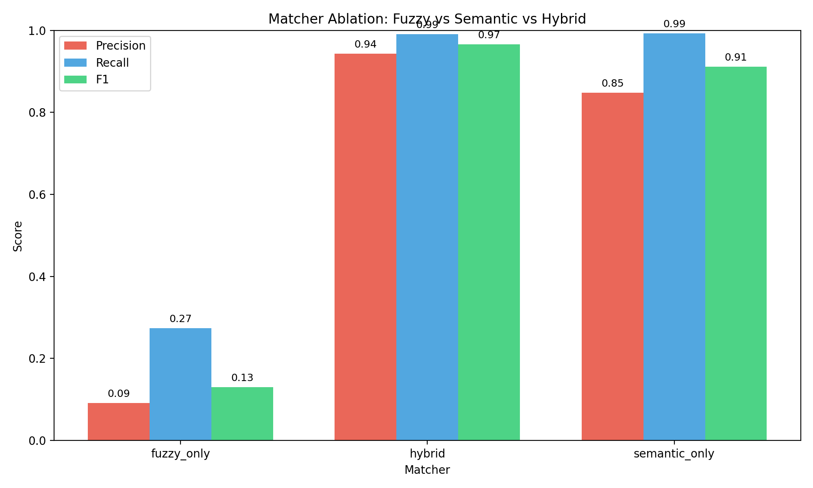
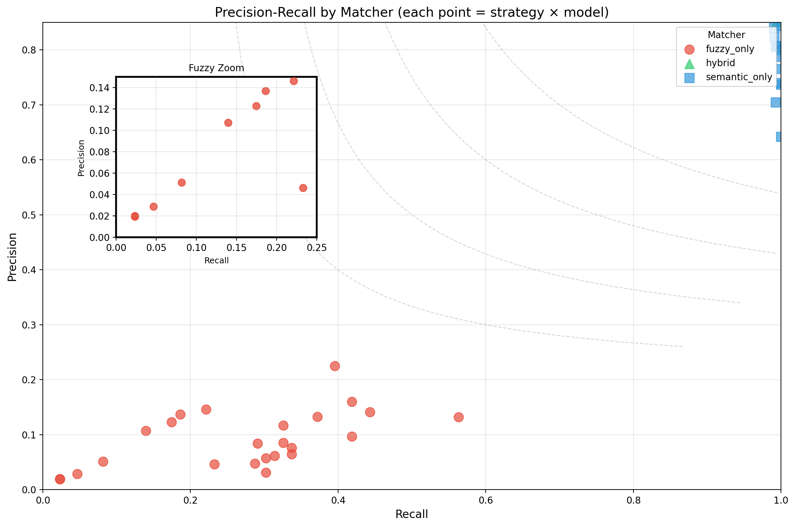
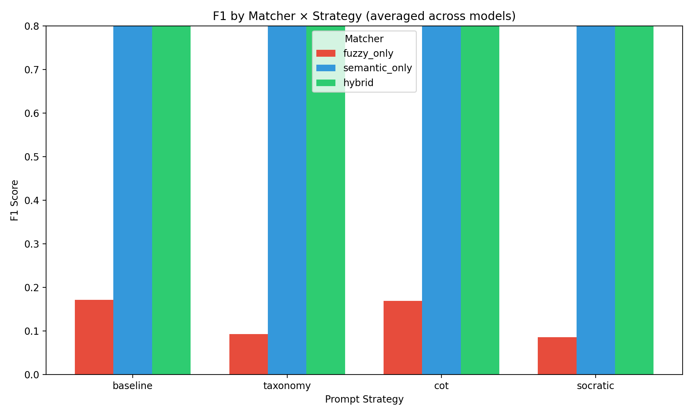
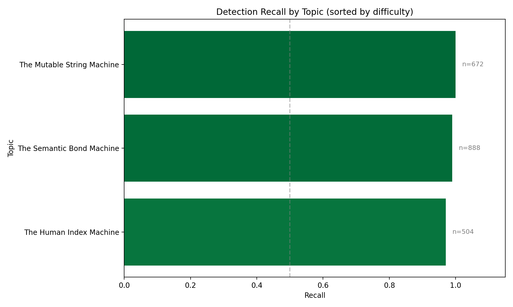
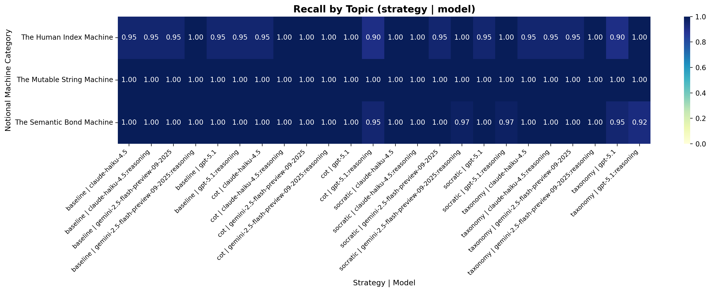
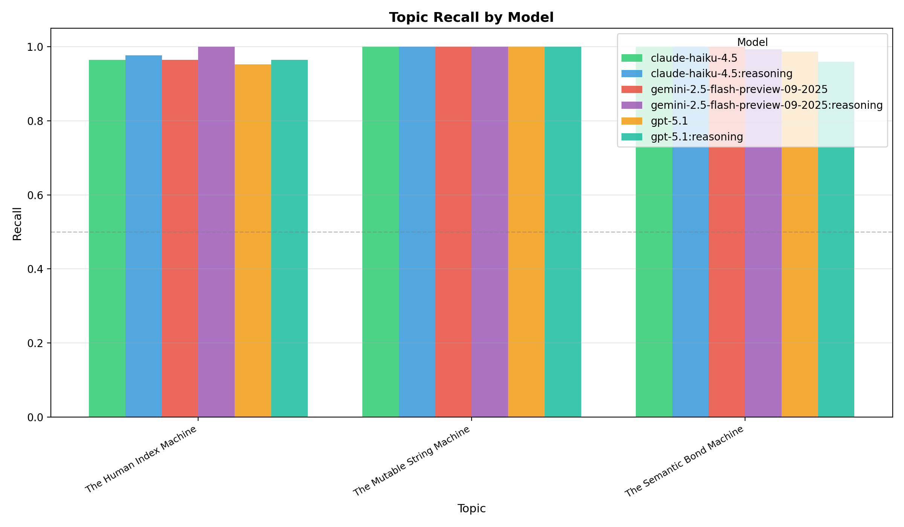
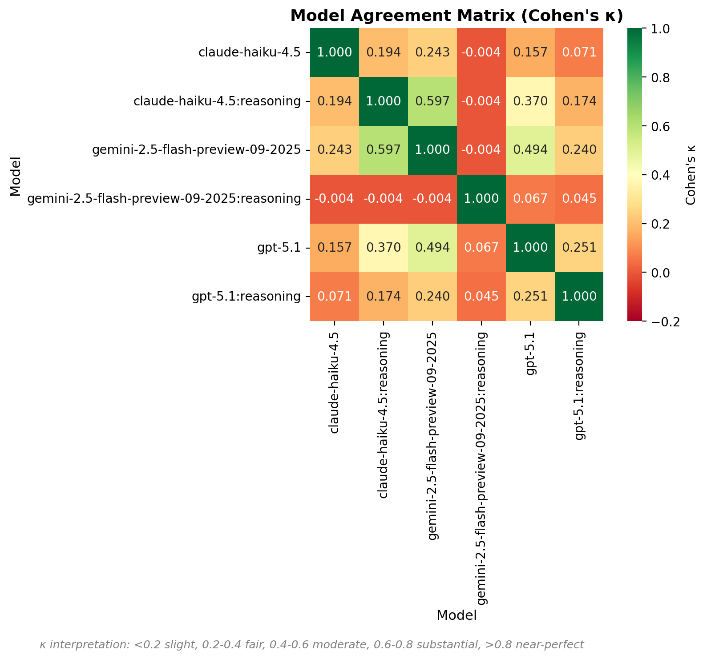
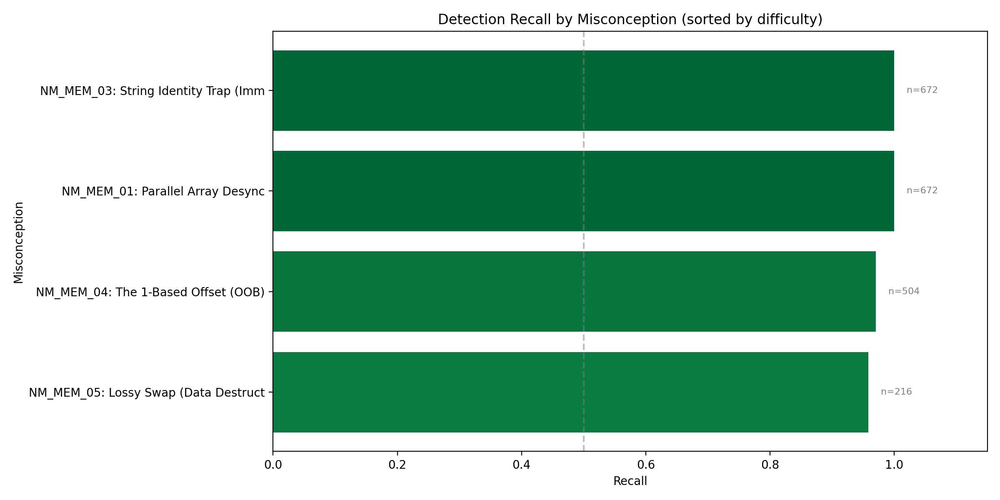
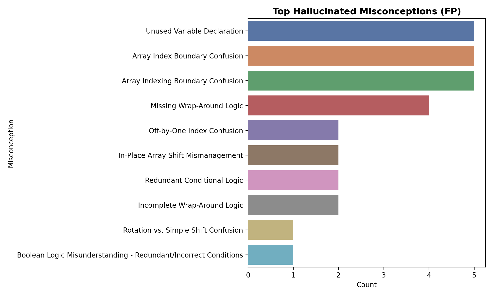

# LLM Misconception Detection: Analysis Report
_Generated: 2025-12-07T16:27:45.300762+00:00_

## Dataset & Run Configuration

### Dataset Summary
- **Assignment:** A1 – Kinematics & Geometry (CS1)
- **Students:** 100
- **Questions:** 4 (Q1, Q2, Q3, Q4)
- **Total files:** 400
- **Seeded files:** 86 (21.5%)
- **Clean files:** 314 (78.5%)
- **Detection opportunities:** 2064

### Run Configuration
- **Generation seed:** 1765142264
- **Generation model:** gpt-5.1-2025-11-13
- **Match mode:** all (ablation)
- **Embedding model:** text-embedding-3-large (OpenAI)
- **Detection models:** GPT-5.1, Gemini-2.5-Flash, Haiku-4.5
- **Strategies:** baseline, taxonomy, cot, socratic

## Executive Highlights
- **Matcher Ablation Study**: Comparing fuzzy_only, semantic_only, and hybrid matchers.
- Bootstrap CIs included for statistical rigor.
- Same detection data, different matching strategies.

## Model Leaderboard

> Ranking by average F1 across all matchers and strategies.

| Rank | Model | Avg F1 | Best Config (F1) | Worst Config (F1) |
|------|-------|--------|------------------|-------------------|
| 1 | claude-haiku-4.5:reasoning | 0.690 | hybrid / baseline (0.98) | fuzzy_only / socratic (0.12) |
| 2 | gemini-2.5-flash-preview-09-2025 | 0.683 | hybrid / socratic (0.98) | fuzzy_only / baseline (0.13) |
| 3 | gpt-5.1 | 0.679 | hybrid / cot (0.99) | fuzzy_only / taxonomy (0.02) |
| 4 | gpt-5.1:reasoning | 0.676 | hybrid / socratic (0.99) | fuzzy_only / taxonomy (0.02) |
| 5 | claude-haiku-4.5 | 0.649 | hybrid / cot (0.97) | fuzzy_only / socratic (0.06) |
| 6 | gemini-2.5-flash-preview-09-2025:reasoning | 0.639 | hybrid / cot (0.97) | fuzzy_only / baseline (0.08) |

## The Diagnostic Ceiling (RQ1)

**Potential Recall** measures the theoretical upper bound: what percentage of seeded errors
were found by *at least one* model/strategy combination?

| Metric | Value |
|--------|-------|
| Potential Recall (Ceiling) | 100.0% |
| Average Recall (Reliability) | 98.8% |
| Consistency (Avg/Potential) | 98.8% |
| Unique Files Detected | 86 / 86 |

> [!TIP]
> High Ceiling: Most errors are detectable by at least one configuration.

## Matcher Ablation: Fuzzy vs Semantic vs Hybrid

### Summary (averaged across strategies and models)
| Matcher | Total TP | Total FP | Total FN | Avg Precision | Avg Recall | Avg F1 |
|---------|----------|----------|----------|---------------|------------|--------|
| fuzzy_only | 566 | 6401 | 1502 | 0.091 | 0.273 | 0.130 |
| hybrid | 2904 | 200 | 24 | 0.943 | 0.991 | 0.966 |
| semantic_only | 2891 | 635 | 19 | 0.848 | 0.992 | 0.912 |

### Precision-Recall by Matcher

### Matcher × Strategy Distribution

## Topic Difficulty (Recall)
| Topic | Recall | N |
|-------|--------|---|
| The Human Index Machine | 0.970 | 504 |
| The Semantic Bond Machine | 0.990 | 888 |
| The Mutable String Machine | 1.000 | 672 |

## Topic Heatmap

## Topic Recall by Model

Grouped bar chart showing recall per topic, split by model. Reveals model-specific strengths and weaknesses.

## Model Agreement Matrix

Pairwise Cohen's κ between models. Higher values indicate correlated predictions; lower values suggest complementary errors (good for ensembles).

## Confidence Calibration Analysis

Distribution of model confidence scores for True Positives vs False Positives. A well-calibrated model should show higher confidence for TPs than FPs.

## Per-Misconception Detection Rates

Detection recall for each seeded misconception, sorted by difficulty (hardest to detect at top):

| ID | Misconception | Category | Recall | N |
|----|---------------|----------|--------|---|
| NM_MEM_05 | Lossy Swap (Data Destruction) | The Semantic Bond Machine | 0.96 | 216 |
| NM_MEM_04 | The 1-Based Offset (OOB) | The Human Index Machine | 0.97 | 504 |
| NM_MEM_01 | Parallel Array Desync | The Semantic Bond Machine | 1.00 | 672 |
| NM_MEM_03 | String Identity Trap (Immutability) | The Mutable String Machine | 1.00 | 672 |

## Hallucination Analysis

- **Assuming String methods mutate the original object** (35 times)
- **One-Based Array Indexing** (26 times)
- **Missing Wrap-Around Logic** (25 times)
- **Unused Variable Declaration** (20 times)
- **String Immutability and Method Side Effects** (20 times)

## Methods
- Data: 60 students × 4 questions (seeded/clean) with manifest-driven ground truth.
- Detection: GPT-5.1, Gemini-2.5-Flash, Haiku-4.5 across strategies (baseline, taxonomy, cot, socratic).
- Matching: Ablation comparing fuzzy-only, semantic-only (text-embedding-3-large), and hybrid (fuzzy + semantic + topic prior).
- Metrics: Precision/Recall/F1 with bootstrap CIs; agreement via κ; significance via McNemar where applicable.

## Agreement & Significance

### Cohen's Kappa (Inter-Model Agreement)

| Strategy | Model A | Model B | Cohen's κ | Interpretation |
|----------|---------|---------|-----------|----------------|
| baseline | claude-haiku-4.5 | claude-haiku-4.5:reasoning | -0.012 | Slight |
| baseline | claude-haiku-4.5 | gemini-2.5-flash-preview-09-2025 | -0.012 | Slight |
| baseline | claude-haiku-4.5 | gemini-2.5-flash-preview-09-2025:reasoning | 0.000 | Slight |
| baseline | claude-haiku-4.5 | gpt-5.1 | -0.012 | Slight |
| baseline | claude-haiku-4.5 | gpt-5.1:reasoning | -0.012 | Slight |
| baseline | claude-haiku-4.5:reasoning | gemini-2.5-flash-preview-09-2025 | 1.000 | Almost Perfect |
| baseline | claude-haiku-4.5:reasoning | gemini-2.5-flash-preview-09-2025:reasoning | 0.000 | Slight |
| baseline | claude-haiku-4.5:reasoning | gpt-5.1 | 1.000 | Almost Perfect |
| baseline | claude-haiku-4.5:reasoning | gpt-5.1:reasoning | 1.000 | Almost Perfect |
| baseline | gemini-2.5-flash-preview-09-2025 | gemini-2.5-flash-preview-09-2025:reasoning | 0.000 | Slight |
| baseline | gemini-2.5-flash-preview-09-2025 | gpt-5.1 | 1.000 | Almost Perfect |
| baseline | gemini-2.5-flash-preview-09-2025 | gpt-5.1:reasoning | 1.000 | Almost Perfect |
| baseline | gemini-2.5-flash-preview-09-2025:reasoning | gpt-5.1 | 0.000 | Slight |
| baseline | gemini-2.5-flash-preview-09-2025:reasoning | gpt-5.1:reasoning | 0.000 | Slight |
| baseline | gpt-5.1 | gpt-5.1:reasoning | 1.000 | Almost Perfect |
| cot | claude-haiku-4.5 | claude-haiku-4.5:reasoning | 0.000 | Slight |
| cot | claude-haiku-4.5 | gemini-2.5-flash-preview-09-2025 | 0.000 | Slight |
| cot | claude-haiku-4.5 | gemini-2.5-flash-preview-09-2025:reasoning | 0.000 | Slight |
| cot | claude-haiku-4.5 | gpt-5.1 | 0.000 | Slight |
| cot | claude-haiku-4.5 | gpt-5.1:reasoning | 0.389 | Fair |
| cot | claude-haiku-4.5:reasoning | gemini-2.5-flash-preview-09-2025 | 1.000 | Almost Perfect |
| cot | claude-haiku-4.5:reasoning | gemini-2.5-flash-preview-09-2025:reasoning | 1.000 | Almost Perfect |
| cot | claude-haiku-4.5:reasoning | gpt-5.1 | 1.000 | Almost Perfect |
| cot | claude-haiku-4.5:reasoning | gpt-5.1:reasoning | 0.000 | Slight |
| cot | gemini-2.5-flash-preview-09-2025 | gemini-2.5-flash-preview-09-2025:reasoning | 1.000 | Almost Perfect |
| cot | gemini-2.5-flash-preview-09-2025 | gpt-5.1 | 1.000 | Almost Perfect |
| cot | gemini-2.5-flash-preview-09-2025 | gpt-5.1:reasoning | 0.000 | Slight |
| cot | gemini-2.5-flash-preview-09-2025:reasoning | gpt-5.1 | 1.000 | Almost Perfect |
| cot | gemini-2.5-flash-preview-09-2025:reasoning | gpt-5.1:reasoning | 0.000 | Slight |
| cot | gpt-5.1 | gpt-5.1:reasoning | 0.000 | Slight |
| socratic | claude-haiku-4.5 | claude-haiku-4.5:reasoning | 1.000 | Almost Perfect |
| socratic | claude-haiku-4.5 | gemini-2.5-flash-preview-09-2025 | 0.000 | Slight |
| socratic | claude-haiku-4.5 | gemini-2.5-flash-preview-09-2025:reasoning | 0.000 | Slight |
| socratic | claude-haiku-4.5 | gpt-5.1 | 0.000 | Slight |
| socratic | claude-haiku-4.5 | gpt-5.1:reasoning | 0.000 | Slight |
| socratic | claude-haiku-4.5:reasoning | gemini-2.5-flash-preview-09-2025 | 0.000 | Slight |
| socratic | claude-haiku-4.5:reasoning | gemini-2.5-flash-preview-09-2025:reasoning | 0.000 | Slight |
| socratic | claude-haiku-4.5:reasoning | gpt-5.1 | 0.000 | Slight |
| socratic | claude-haiku-4.5:reasoning | gpt-5.1:reasoning | 0.000 | Slight |
| socratic | gemini-2.5-flash-preview-09-2025 | gemini-2.5-flash-preview-09-2025:reasoning | -0.012 | Slight |
| socratic | gemini-2.5-flash-preview-09-2025 | gpt-5.1 | 1.000 | Almost Perfect |
| socratic | gemini-2.5-flash-preview-09-2025 | gpt-5.1:reasoning | -0.012 | Slight |
| socratic | gemini-2.5-flash-preview-09-2025:reasoning | gpt-5.1 | -0.012 | Slight |
| socratic | gemini-2.5-flash-preview-09-2025:reasoning | gpt-5.1:reasoning | -0.012 | Slight |
| socratic | gpt-5.1 | gpt-5.1:reasoning | -0.012 | Slight |
| taxonomy | claude-haiku-4.5 | claude-haiku-4.5:reasoning | -0.012 | Slight |
| taxonomy | claude-haiku-4.5 | gemini-2.5-flash-preview-09-2025 | -0.012 | Slight |
| taxonomy | claude-haiku-4.5 | gemini-2.5-flash-preview-09-2025:reasoning | 0.000 | Slight |
| taxonomy | claude-haiku-4.5 | gpt-5.1 | -0.019 | Slight |
| taxonomy | claude-haiku-4.5 | gpt-5.1:reasoning | -0.018 | Slight |
| taxonomy | claude-haiku-4.5:reasoning | gemini-2.5-flash-preview-09-2025 | 1.000 | Almost Perfect |
| taxonomy | claude-haiku-4.5:reasoning | gemini-2.5-flash-preview-09-2025:reasoning | 0.000 | Slight |
| taxonomy | claude-haiku-4.5:reasoning | gpt-5.1 | 0.389 | Fair |
| taxonomy | claude-haiku-4.5:reasoning | gpt-5.1:reasoning | -0.018 | Slight |
| taxonomy | gemini-2.5-flash-preview-09-2025 | gemini-2.5-flash-preview-09-2025:reasoning | 0.000 | Slight |
| taxonomy | gemini-2.5-flash-preview-09-2025 | gpt-5.1 | 0.389 | Fair |
| taxonomy | gemini-2.5-flash-preview-09-2025 | gpt-5.1:reasoning | -0.018 | Slight |
| taxonomy | gemini-2.5-flash-preview-09-2025:reasoning | gpt-5.1 | 0.000 | Slight |
| taxonomy | gemini-2.5-flash-preview-09-2025:reasoning | gpt-5.1:reasoning | 0.000 | Slight |
| taxonomy | gpt-5.1 | gpt-5.1:reasoning | 0.554 | Moderate |

### McNemar's Test (Significance of Differences)

| Strategy | Model A | Model B | χ² Stat | p-value | Significant? | Both✓ | A only | B only | Both✗ |
|----------|---------|---------|---------|---------|--------------|-------|--------|--------|-------|
| baseline | claude-haiku-4.5 | claude-haiku-4.5:reasoning | 0.12 | 0.7237 | No | 84 | 1 | 1 | 0 |
| baseline | claude-haiku-4.5 | gemini-2.5-flash-preview-09-2025 | 0.12 | 0.7237 | No | 84 | 1 | 1 | 0 |
| baseline | claude-haiku-4.5 | gemini-2.5-flash-preview-09-2025:reasoning | 0.25 | 0.6171 | No | 85 | 0 | 1 | 0 |
| baseline | claude-haiku-4.5 | gpt-5.1 | 0.12 | 0.7237 | No | 84 | 1 | 1 | 0 |
| baseline | claude-haiku-4.5 | gpt-5.1:reasoning | 0.12 | 0.7237 | No | 84 | 1 | 1 | 0 |
| baseline | claude-haiku-4.5:reasoning | gemini-2.5-flash-preview-09-2025 | 0.00 | 1.0000 | No | 85 | 0 | 0 | 1 |
| baseline | claude-haiku-4.5:reasoning | gemini-2.5-flash-preview-09-2025:reasoning | 0.25 | 0.6171 | No | 85 | 0 | 1 | 0 |
| baseline | claude-haiku-4.5:reasoning | gpt-5.1 | 0.00 | 1.0000 | No | 85 | 0 | 0 | 1 |
| baseline | claude-haiku-4.5:reasoning | gpt-5.1:reasoning | 0.00 | 1.0000 | No | 85 | 0 | 0 | 1 |
| baseline | gemini-2.5-flash-preview-09-2025 | gemini-2.5-flash-preview-09-2025:reasoning | 0.25 | 0.6171 | No | 85 | 0 | 1 | 0 |
| baseline | gemini-2.5-flash-preview-09-2025 | gpt-5.1 | 0.00 | 1.0000 | No | 85 | 0 | 0 | 1 |
| baseline | gemini-2.5-flash-preview-09-2025 | gpt-5.1:reasoning | 0.00 | 1.0000 | No | 85 | 0 | 0 | 1 |
| baseline | gemini-2.5-flash-preview-09-2025:reasoning | gpt-5.1 | 0.25 | 0.6171 | No | 85 | 1 | 0 | 0 |
| baseline | gemini-2.5-flash-preview-09-2025:reasoning | gpt-5.1:reasoning | 0.25 | 0.6171 | No | 85 | 1 | 0 | 0 |
| baseline | gpt-5.1 | gpt-5.1:reasoning | 0.00 | 1.0000 | No | 85 | 0 | 0 | 1 |
| cot | claude-haiku-4.5 | claude-haiku-4.5:reasoning | 0.25 | 0.6171 | No | 85 | 0 | 1 | 0 |
| cot | claude-haiku-4.5 | gemini-2.5-flash-preview-09-2025 | 0.25 | 0.6171 | No | 85 | 0 | 1 | 0 |
| cot | claude-haiku-4.5 | gemini-2.5-flash-preview-09-2025:reasoning | 0.25 | 0.6171 | No | 85 | 0 | 1 | 0 |
| cot | claude-haiku-4.5 | gpt-5.1 | 0.25 | 0.6171 | No | 85 | 0 | 1 | 0 |
| cot | claude-haiku-4.5 | gpt-5.1:reasoning | 2.08 | 0.1489 | No | 82 | 3 | 0 | 1 |
| cot | claude-haiku-4.5:reasoning | gemini-2.5-flash-preview-09-2025 | 0.00 | 1.0000 | No | 86 | 0 | 0 | 0 |
| cot | claude-haiku-4.5:reasoning | gemini-2.5-flash-preview-09-2025:reasoning | 0.00 | 1.0000 | No | 86 | 0 | 0 | 0 |
| cot | claude-haiku-4.5:reasoning | gpt-5.1 | 0.00 | 1.0000 | No | 86 | 0 | 0 | 0 |
| cot | claude-haiku-4.5:reasoning | gpt-5.1:reasoning | 3.06 | 0.0801 | No | 82 | 4 | 0 | 0 |
| cot | gemini-2.5-flash-preview-09-2025 | gemini-2.5-flash-preview-09-2025:reasoning | 0.00 | 1.0000 | No | 86 | 0 | 0 | 0 |
| cot | gemini-2.5-flash-preview-09-2025 | gpt-5.1 | 0.00 | 1.0000 | No | 86 | 0 | 0 | 0 |
| cot | gemini-2.5-flash-preview-09-2025 | gpt-5.1:reasoning | 3.06 | 0.0801 | No | 82 | 4 | 0 | 0 |
| cot | gemini-2.5-flash-preview-09-2025:reasoning | gpt-5.1 | 0.00 | 1.0000 | No | 86 | 0 | 0 | 0 |
| cot | gemini-2.5-flash-preview-09-2025:reasoning | gpt-5.1:reasoning | 3.06 | 0.0801 | No | 82 | 4 | 0 | 0 |
| cot | gpt-5.1 | gpt-5.1:reasoning | 3.06 | 0.0801 | No | 82 | 4 | 0 | 0 |
| socratic | claude-haiku-4.5 | claude-haiku-4.5:reasoning | 0.00 | 1.0000 | No | 86 | 0 | 0 | 0 |
| socratic | claude-haiku-4.5 | gemini-2.5-flash-preview-09-2025 | 0.25 | 0.6171 | No | 85 | 1 | 0 | 0 |
| socratic | claude-haiku-4.5 | gemini-2.5-flash-preview-09-2025:reasoning | 0.25 | 0.6171 | No | 85 | 1 | 0 | 0 |
| socratic | claude-haiku-4.5 | gpt-5.1 | 0.25 | 0.6171 | No | 85 | 1 | 0 | 0 |
| socratic | claude-haiku-4.5 | gpt-5.1:reasoning | 0.25 | 0.6171 | No | 85 | 1 | 0 | 0 |
| socratic | claude-haiku-4.5:reasoning | gemini-2.5-flash-preview-09-2025 | 0.25 | 0.6171 | No | 85 | 1 | 0 | 0 |
| socratic | claude-haiku-4.5:reasoning | gemini-2.5-flash-preview-09-2025:reasoning | 0.25 | 0.6171 | No | 85 | 1 | 0 | 0 |
| socratic | claude-haiku-4.5:reasoning | gpt-5.1 | 0.25 | 0.6171 | No | 85 | 1 | 0 | 0 |
| socratic | claude-haiku-4.5:reasoning | gpt-5.1:reasoning | 0.25 | 0.6171 | No | 85 | 1 | 0 | 0 |
| socratic | gemini-2.5-flash-preview-09-2025 | gemini-2.5-flash-preview-09-2025:reasoning | 0.12 | 0.7237 | No | 84 | 1 | 1 | 0 |
| socratic | gemini-2.5-flash-preview-09-2025 | gpt-5.1 | 0.00 | 1.0000 | No | 85 | 0 | 0 | 1 |
| socratic | gemini-2.5-flash-preview-09-2025 | gpt-5.1:reasoning | 0.12 | 0.7237 | No | 84 | 1 | 1 | 0 |
| socratic | gemini-2.5-flash-preview-09-2025:reasoning | gpt-5.1 | 0.12 | 0.7237 | No | 84 | 1 | 1 | 0 |
| socratic | gemini-2.5-flash-preview-09-2025:reasoning | gpt-5.1:reasoning | 0.12 | 0.7237 | No | 84 | 1 | 1 | 0 |
| socratic | gpt-5.1 | gpt-5.1:reasoning | 0.12 | 0.7237 | No | 84 | 1 | 1 | 0 |
| taxonomy | claude-haiku-4.5 | claude-haiku-4.5:reasoning | 0.12 | 0.7237 | No | 84 | 1 | 1 | 0 |
| taxonomy | claude-haiku-4.5 | gemini-2.5-flash-preview-09-2025 | 0.12 | 0.7237 | No | 84 | 1 | 1 | 0 |
| taxonomy | claude-haiku-4.5 | gemini-2.5-flash-preview-09-2025:reasoning | 0.25 | 0.6171 | No | 85 | 0 | 1 | 0 |
| taxonomy | claude-haiku-4.5 | gpt-5.1 | 1.25 | 0.2636 | No | 81 | 4 | 1 | 0 |
| taxonomy | claude-haiku-4.5 | gpt-5.1:reasoning | 0.56 | 0.4533 | No | 82 | 3 | 1 | 0 |
| taxonomy | claude-haiku-4.5:reasoning | gemini-2.5-flash-preview-09-2025 | 0.00 | 1.0000 | No | 85 | 0 | 0 | 1 |
| taxonomy | claude-haiku-4.5:reasoning | gemini-2.5-flash-preview-09-2025:reasoning | 0.25 | 0.6171 | No | 85 | 0 | 1 | 0 |
| taxonomy | claude-haiku-4.5:reasoning | gpt-5.1 | 2.08 | 0.1489 | No | 82 | 3 | 0 | 1 |
| taxonomy | claude-haiku-4.5:reasoning | gpt-5.1:reasoning | 0.56 | 0.4533 | No | 82 | 3 | 1 | 0 |
| taxonomy | gemini-2.5-flash-preview-09-2025 | gemini-2.5-flash-preview-09-2025:reasoning | 0.25 | 0.6171 | No | 85 | 0 | 1 | 0 |
| taxonomy | gemini-2.5-flash-preview-09-2025 | gpt-5.1 | 2.08 | 0.1489 | No | 82 | 3 | 0 | 1 |
| taxonomy | gemini-2.5-flash-preview-09-2025 | gpt-5.1:reasoning | 0.56 | 0.4533 | No | 82 | 3 | 1 | 0 |
| taxonomy | gemini-2.5-flash-preview-09-2025:reasoning | gpt-5.1 | 3.06 | 0.0801 | No | 82 | 4 | 0 | 0 |
| taxonomy | gemini-2.5-flash-preview-09-2025:reasoning | gpt-5.1:reasoning | 2.08 | 0.1489 | No | 83 | 3 | 0 | 0 |
| taxonomy | gpt-5.1 | gpt-5.1:reasoning | 0.08 | 0.7728 | No | 81 | 1 | 2 | 2 |

## Full Results Table

| Matcher | Strategy | Model | TP | FP | FN | Precision | Recall | F1 | CI (F1) |
|---------|----------|-------|----|----|----|-----------|--------|----|---------|
| fuzzy_only | baseline | claude-haiku-4.5 | 49 | 321 | 38 | 0.132 | 0.563 | 0.214 | 0.16–0.26 |
| fuzzy_only | baseline | claude-haiku-4.5:reasoning | 34 | 117 | 52 | 0.225 | 0.395 | 0.287 | 0.21–0.36 |
| fuzzy_only | baseline | gemini-2.5-flash-preview-09-2025 | 25 | 272 | 61 | 0.084 | 0.291 | 0.131 | 0.08–0.18 |
| fuzzy_only | baseline | gemini-2.5-flash-preview-09-2025:reasoning | 20 | 413 | 66 | 0.046 | 0.233 | 0.077 | 0.04–0.11 |
| fuzzy_only | baseline | gpt-5.1 | 15 | 107 | 71 | 0.123 | 0.174 | 0.144 | 0.08–0.21 |
| fuzzy_only | baseline | gpt-5.1:reasoning | 19 | 111 | 67 | 0.146 | 0.221 | 0.176 | 0.11–0.25 |
| fuzzy_only | cot | claude-haiku-4.5 | 39 | 237 | 49 | 0.141 | 0.443 | 0.214 | 0.15–0.27 |
| fuzzy_only | cot | claude-haiku-4.5:reasoning | 36 | 189 | 50 | 0.160 | 0.419 | 0.232 | 0.17–0.31 |
| fuzzy_only | cot | gemini-2.5-flash-preview-09-2025 | 32 | 209 | 54 | 0.133 | 0.372 | 0.196 | 0.14–0.25 |
| fuzzy_only | cot | gemini-2.5-flash-preview-09-2025:reasoning | 26 | 425 | 60 | 0.058 | 0.302 | 0.097 | 0.06–0.13 |
| fuzzy_only | cot | gpt-5.1 | 16 | 101 | 70 | 0.137 | 0.186 | 0.158 | 0.09–0.23 |
| fuzzy_only | cot | gpt-5.1:reasoning | 12 | 100 | 74 | 0.107 | 0.140 | 0.121 | 0.06–0.19 |
| fuzzy_only | socratic | claude-haiku-4.5 | 26 | 801 | 60 | 0.031 | 0.302 | 0.057 | 0.04–0.08 |
| fuzzy_only | socratic | claude-haiku-4.5:reasoning | 29 | 352 | 57 | 0.076 | 0.337 | 0.124 | 0.08–0.16 |
| fuzzy_only | socratic | gemini-2.5-flash-preview-09-2025 | 36 | 336 | 50 | 0.097 | 0.419 | 0.157 | 0.11–0.21 |
| fuzzy_only | socratic | gemini-2.5-flash-preview-09-2025:reasoning | 25 | 501 | 62 | 0.048 | 0.287 | 0.082 | 0.05–0.11 |
| fuzzy_only | socratic | gpt-5.1 | 7 | 130 | 79 | 0.051 | 0.081 | 0.063 | 0.03–0.11 |
| fuzzy_only | socratic | gpt-5.1:reasoning | 4 | 135 | 82 | 0.029 | 0.047 | 0.036 | 0.01–0.07 |
| fuzzy_only | taxonomy | claude-haiku-4.5 | 29 | 419 | 57 | 0.065 | 0.337 | 0.109 | 0.07–0.15 |
| fuzzy_only | taxonomy | claude-haiku-4.5:reasoning | 28 | 212 | 58 | 0.117 | 0.326 | 0.172 | 0.12–0.23 |
| fuzzy_only | taxonomy | gemini-2.5-flash-preview-09-2025 | 28 | 301 | 58 | 0.085 | 0.326 | 0.135 | 0.09–0.19 |
| fuzzy_only | taxonomy | gemini-2.5-flash-preview-09-2025:reasoning | 27 | 412 | 59 | 0.062 | 0.314 | 0.103 | 0.07–0.14 |
| fuzzy_only | taxonomy | gpt-5.1 | 2 | 98 | 84 | 0.020 | 0.023 | 0.022 | 0.00–0.05 |
| fuzzy_only | taxonomy | gpt-5.1:reasoning | 2 | 102 | 84 | 0.019 | 0.023 | 0.021 | 0.00–0.05 |
| hybrid | baseline | claude-haiku-4.5 | 150 | 12 | 1 | 0.926 | 0.993 | 0.958 | 0.92–0.99 |
| hybrid | baseline | claude-haiku-4.5:reasoning | 109 | 4 | 1 | 0.965 | 0.991 | 0.978 | 0.95–1.00 |
| hybrid | baseline | gemini-2.5-flash-preview-09-2025 | 102 | 5 | 1 | 0.953 | 0.990 | 0.971 | 0.94–1.00 |
| hybrid | baseline | gemini-2.5-flash-preview-09-2025:reasoning | 128 | 9 | 0 | 0.934 | 1.000 | 0.966 | 0.94–0.99 |
| hybrid | baseline | gpt-5.1 | 94 | 2 | 1 | 0.979 | 0.989 | 0.984 | 0.96–1.00 |
| hybrid | baseline | gpt-5.1:reasoning | 98 | 2 | 1 | 0.980 | 0.990 | 0.985 | 0.96–1.00 |
| hybrid | cot | claude-haiku-4.5 | 151 | 9 | 1 | 0.944 | 0.993 | 0.968 | 0.94–0.99 |
| hybrid | cot | claude-haiku-4.5:reasoning | 141 | 9 | 0 | 0.940 | 1.000 | 0.969 | 0.94–0.99 |
| hybrid | cot | gemini-2.5-flash-preview-09-2025 | 98 | 6 | 0 | 0.942 | 1.000 | 0.970 | 0.95–0.99 |
| hybrid | cot | gemini-2.5-flash-preview-09-2025:reasoning | 130 | 8 | 0 | 0.942 | 1.000 | 0.970 | 0.95–0.99 |
| hybrid | cot | gpt-5.1 | 100 | 2 | 0 | 0.980 | 1.000 | 0.990 | 0.97–1.00 |
| hybrid | cot | gpt-5.1:reasoning | 95 | 4 | 4 | 0.960 | 0.960 | 0.960 | 0.92–0.99 |
| hybrid | socratic | claude-haiku-4.5 | 214 | 21 | 0 | 0.911 | 1.000 | 0.953 | 0.93–0.97 |
| hybrid | socratic | claude-haiku-4.5:reasoning | 155 | 21 | 0 | 0.881 | 1.000 | 0.937 | 0.91–0.96 |
| hybrid | socratic | gemini-2.5-flash-preview-09-2025 | 107 | 4 | 1 | 0.964 | 0.991 | 0.977 | 0.95–1.00 |
| hybrid | socratic | gemini-2.5-flash-preview-09-2025:reasoning | 132 | 20 | 1 | 0.868 | 0.992 | 0.926 | 0.89–0.95 |
| hybrid | socratic | gpt-5.1 | 104 | 3 | 1 | 0.972 | 0.990 | 0.981 | 0.96–1.00 |
| hybrid | socratic | gpt-5.1:reasoning | 107 | 2 | 1 | 0.982 | 0.991 | 0.986 | 0.97–1.00 |
| hybrid | taxonomy | claude-haiku-4.5 | 154 | 27 | 1 | 0.851 | 0.994 | 0.917 | 0.88–0.95 |
| hybrid | taxonomy | claude-haiku-4.5:reasoning | 131 | 9 | 1 | 0.936 | 0.992 | 0.963 | 0.93–0.99 |
| hybrid | taxonomy | gemini-2.5-flash-preview-09-2025 | 99 | 4 | 1 | 0.961 | 0.990 | 0.975 | 0.95–1.00 |
| hybrid | taxonomy | gemini-2.5-flash-preview-09-2025:reasoning | 125 | 14 | 0 | 0.899 | 1.000 | 0.947 | 0.92–0.97 |
| hybrid | taxonomy | gpt-5.1 | 89 | 1 | 4 | 0.989 | 0.957 | 0.973 | 0.94–0.99 |
| hybrid | taxonomy | gpt-5.1:reasoning | 91 | 2 | 3 | 0.978 | 0.968 | 0.973 | 0.95–0.99 |
| semantic_only | baseline | claude-haiku-4.5 | 148 | 40 | 0 | 0.787 | 1.000 | 0.881 | 0.83–0.91 |
| semantic_only | baseline | claude-haiku-4.5:reasoning | 106 | 14 | 1 | 0.883 | 0.991 | 0.934 | 0.90–0.96 |
| semantic_only | baseline | gemini-2.5-flash-preview-09-2025 | 102 | 12 | 1 | 0.895 | 0.990 | 0.940 | 0.90–0.97 |
| semantic_only | baseline | gemini-2.5-flash-preview-09-2025:reasoning | 128 | 32 | 0 | 0.800 | 1.000 | 0.889 | 0.84–0.92 |
| semantic_only | baseline | gpt-5.1 | 94 | 6 | 1 | 0.940 | 0.989 | 0.964 | 0.93–0.99 |
| semantic_only | baseline | gpt-5.1:reasoning | 96 | 8 | 1 | 0.923 | 0.990 | 0.955 | 0.92–0.98 |
| semantic_only | cot | claude-haiku-4.5 | 153 | 37 | 1 | 0.805 | 0.994 | 0.890 | 0.85–0.93 |
| semantic_only | cot | claude-haiku-4.5:reasoning | 143 | 18 | 0 | 0.888 | 1.000 | 0.941 | 0.91–0.97 |
| semantic_only | cot | gemini-2.5-flash-preview-09-2025 | 100 | 14 | 0 | 0.877 | 1.000 | 0.935 | 0.89–0.97 |
| semantic_only | cot | gemini-2.5-flash-preview-09-2025:reasoning | 129 | 24 | 0 | 0.843 | 1.000 | 0.915 | 0.87–0.94 |
| semantic_only | cot | gpt-5.1 | 100 | 5 | 0 | 0.952 | 1.000 | 0.976 | 0.95–1.00 |
| semantic_only | cot | gpt-5.1:reasoning | 95 | 7 | 1 | 0.931 | 0.990 | 0.960 | 0.93–0.99 |
| semantic_only | socratic | claude-haiku-4.5 | 208 | 116 | 0 | 0.642 | 1.000 | 0.782 | 0.73–0.83 |
| semantic_only | socratic | claude-haiku-4.5:reasoning | 159 | 56 | 0 | 0.740 | 1.000 | 0.850 | 0.80–0.89 |
| semantic_only | socratic | gemini-2.5-flash-preview-09-2025 | 107 | 23 | 1 | 0.823 | 0.991 | 0.899 | 0.85–0.94 |
| semantic_only | socratic | gemini-2.5-flash-preview-09-2025:reasoning | 131 | 55 | 1 | 0.704 | 0.992 | 0.824 | 0.78–0.87 |
| semantic_only | socratic | gpt-5.1 | 101 | 12 | 1 | 0.894 | 0.990 | 0.940 | 0.90–0.97 |
| semantic_only | socratic | gpt-5.1:reasoning | 104 | 6 | 1 | 0.945 | 0.990 | 0.967 | 0.94–0.99 |
| semantic_only | taxonomy | claude-haiku-4.5 | 154 | 55 | 0 | 0.737 | 1.000 | 0.848 | 0.81–0.89 |
| semantic_only | taxonomy | claude-haiku-4.5:reasoning | 130 | 31 | 1 | 0.807 | 0.992 | 0.890 | 0.85–0.93 |
| semantic_only | taxonomy | gemini-2.5-flash-preview-09-2025 | 100 | 19 | 1 | 0.840 | 0.990 | 0.909 | 0.86–0.95 |
| semantic_only | taxonomy | gemini-2.5-flash-preview-09-2025:reasoning | 124 | 38 | 0 | 0.765 | 1.000 | 0.867 | 0.82–0.91 |
| semantic_only | taxonomy | gpt-5.1 | 88 | 4 | 4 | 0.957 | 0.957 | 0.957 | 0.92–0.99 |
| semantic_only | taxonomy | gpt-5.1:reasoning | 91 | 3 | 3 | 0.968 | 0.968 | 0.968 | 0.94–0.99 |