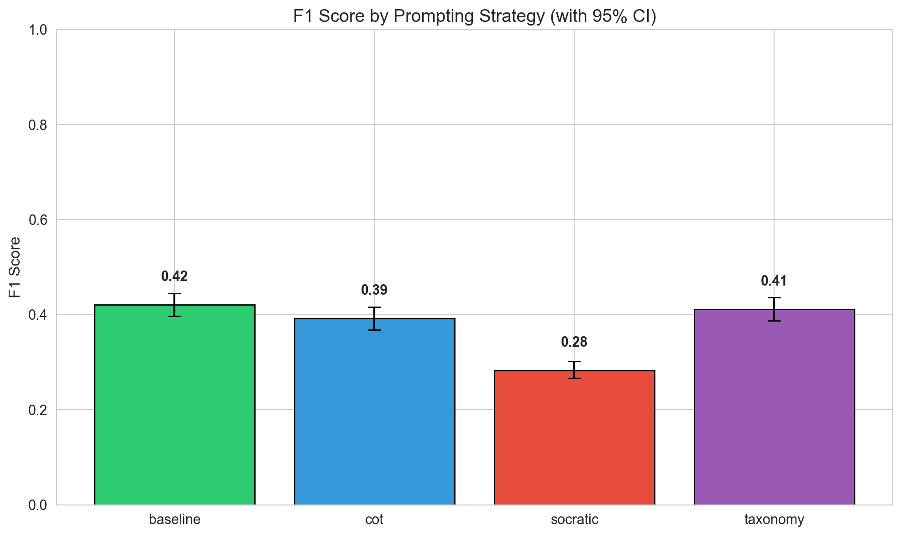
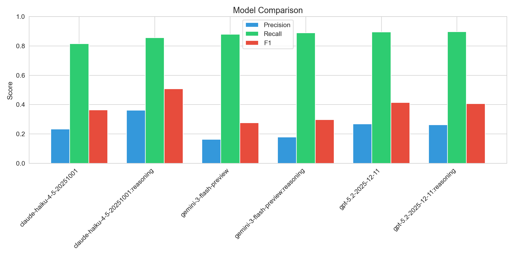
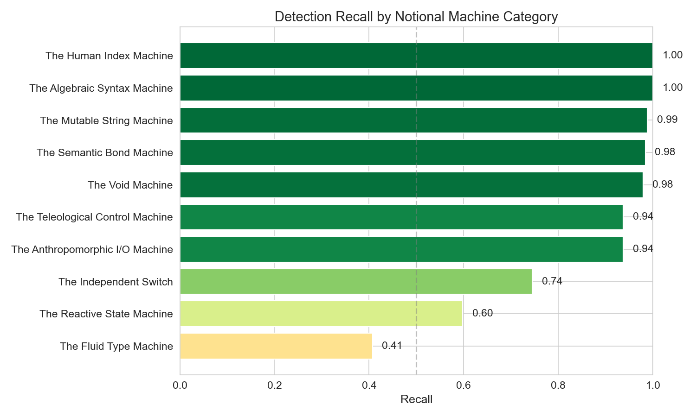
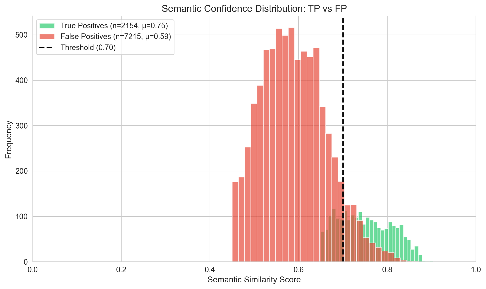
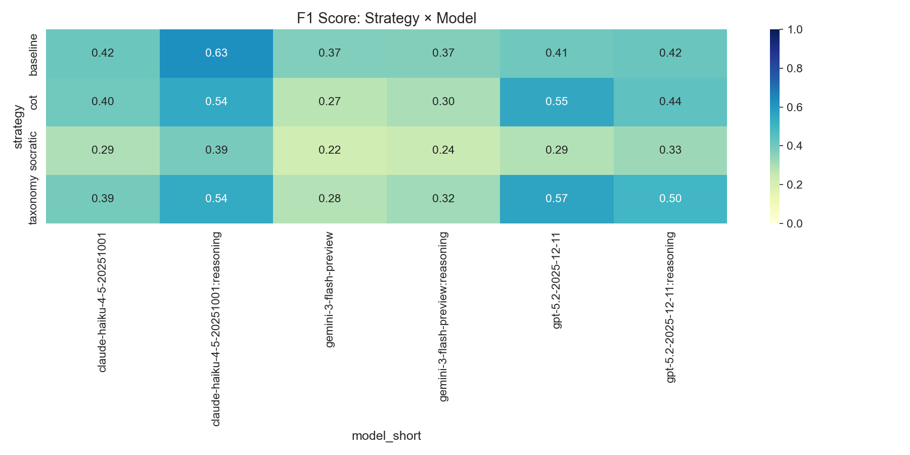
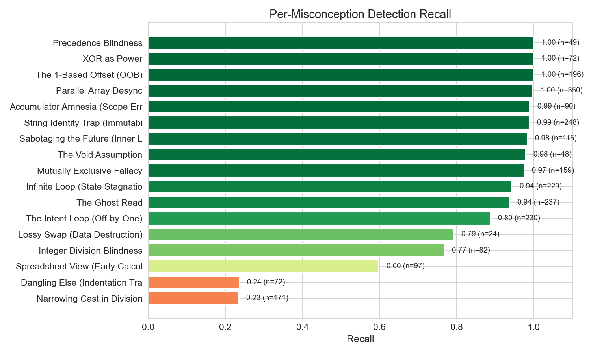
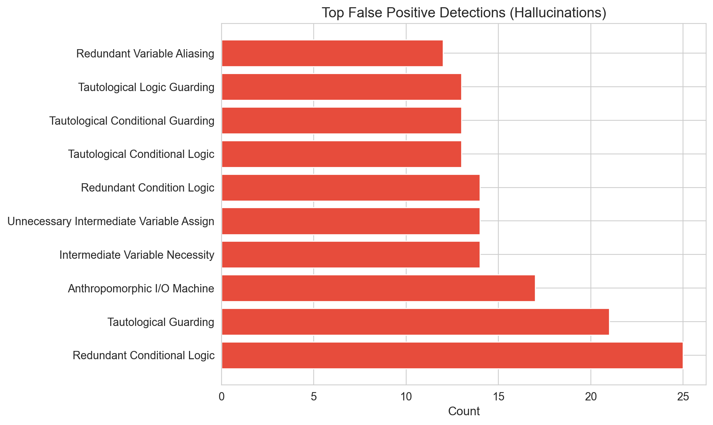

# Multi-Assignment LLM Misconception Detection Report
_Generated: 2025-12-22T22:18:00.813745+00:00_

## Executive Summary

This report evaluates LLM cognitive alignment with CS education theory by measuring
whether models can identify *student mental models* (Notional Machines), not just surface-level bugs.

**Key Finding:** Semantic embedding matching reveals the gap between detecting *what* is wrong
versus understanding *why* the student thought it was right.

---

## Dataset Summary
- **Total Students:** 300
- **Assignments:** a1 (Variables), a2 (Loops), a3 (Arrays)
- **Semantic Threshold:** Cosine Similarity ≥ 0.65
- **Noise Floor:** Detections with score < 0.45 are filtered as 'pedantic'
- **Seeds:** 1765081374,1765128549,1765142264

## Overall Metrics (with 95% Confidence Intervals)

| Metric | Value | 95% CI | Std Error |
|--------|-------|--------|-----------|
| True Positives | 2154 | — | — |
| False Positives | 7215 | — | — |
| False Negatives | 315 | — | — |
| **Precision** | **0.230** | [0.222, 0.238] | 0.0043 |
| **Recall** | **0.872** | [0.859, 0.885] | 0.0067 |
| **F1 Score** | **0.364** | [0.352, 0.375] | 0.0056 |

## Cross-Assignment Comparison (RQ1: Complexity Gradient)

> Does LLM performance degrade as conceptual complexity increases?

| Assignment | Focus | TP | FP | FN | Precision | Recall | F1 |
|------------|-------|----|----|----|-----------| -------|-----|
| a1 | Variables/Math | 551 | 3162 | 205 | 0.148 | 0.729 | 0.247 |
| a2 | Loops/Control | 794 | 2349 | 101 | 0.253 | 0.887 | 0.393 |
| a3 | Arrays/Strings | 809 | 1704 | 9 | 0.322 | 0.989 | 0.486 |

## Performance by Prompting Strategy

| Strategy | TP | FP | FN | Precision | Recall | F1 |
|----------|----|----|----|-----------| -------|-----|
| baseline | 500 | 1293 | 82 | 0.279 | 0.859 | 0.421 |
| cot | 530 | 1549 | 93 | 0.255 | 0.851 | 0.392 |
| socratic | 591 | 2918 | 70 | 0.168 | 0.894 | 0.283 |
| taxonomy | 533 | 1455 | 70 | 0.268 | 0.884 | 0.411 |

### Statistical Significance (McNemar's Test)

> Paired comparison since the same student code is analyzed by all strategies.

| Comparison | χ² | p-value | Significant? | Interpretation |
|------------|-----|---------|--------------|----------------|
| baseline vs cot | 8.86 | 0.0029 | ✓ Yes | baseline wins 45 cases, cot wins 20 cases (statist |
| baseline vs socratic | 0.07 | 0.7979 | ✗ No | baseline wins 32 cases, socratic wins 29 cases (no |
| baseline vs taxonomy | 0.68 | 0.4094 | ✗ No | baseline wins 32 cases, taxonomy wins 40 cases (no |
| cot vs socratic | 6.12 | 0.0133 | ✓ Yes | cot wins 25 cases, socratic wins 47 cases (statist |
| cot vs taxonomy | 12.05 | 0.0005 | ✓ Yes | cot wins 26 cases, taxonomy wins 59 cases (statist |
| socratic vs taxonomy | 1.69 | 0.1930 | ✗ No | socratic wins 24 cases, taxonomy wins 35 cases (no |

### Omnibus Test (Cochran's Q)

- **Q Statistic:** 12.68
- **Degrees of Freedom:** 3
- **p-value:** 0.005375
- **Conclusion:** Significant differences exist between strategies

## Performance by Model

| Model | TP | FP | FN | Precision | Recall | F1 |
|-------|----|----|----|-----------|--------|-----|
| claude-haiku-4-5-20251001 | 350 | 1147 | 79 | 0.234 | 0.816 | 0.363 |
| claude-haiku-4-5-20251001:reasoning | 330 | 584 | 55 | 0.361 | 0.857 | 0.508 |
| gemini-3-flash-preview | 335 | 1711 | 46 | 0.164 | 0.879 | 0.276 |
| gemini-3-flash-preview:reasoning | 346 | 1585 | 43 | 0.179 | 0.889 | 0.298 |
| gpt-5.2-2025-12-11 | 394 | 1071 | 46 | 0.269 | 0.895 | 0.414 |
| gpt-5.2-2025-12-11:reasoning | 399 | 1117 | 46 | 0.263 | 0.897 | 0.407 |

## Notional Machine Category Detection (RQ2)

> Which mental model categories are easier/harder for LLMs to detect?
> This is the core finding: Surface errors (Syntax) vs Deep errors (State).

| Category | Recall | N | Difficulty |
|----------|--------|---|------------|
|  | 0.000 | 0 | **Hard** |
| The Fluid Type Machine | 0.407 | 253 | **Hard** |
| The Reactive State Machine | 0.598 | 97 | Medium |
| The Independent Switch | 0.745 | 231 | Easy |
| The Anthropomorphic I/O Machine | 0.937 | 237 | Easy |
| The Teleological Control Machine | 0.937 | 664 | Easy |
| The Void Machine | 0.979 | 48 | Easy |
| The Semantic Bond Machine | 0.984 | 374 | Easy |
| The Mutable String Machine | 0.988 | 248 | Easy |
| The Algebraic Syntax Machine | 1.000 | 121 | Easy |
| The Human Index Machine | 1.000 | 196 | Easy |

## Semantic Alignment Analysis (The 'Understanding' Metric)

> How confident is the semantic match? Higher scores = LLM truly understood the mental model.

| Metric | True Positives | False Positives |
|--------|----------------|-----------------|
| Count | 2154 | 7215 |
| Mean Score | 0.750 | 0.590 |
| Std Dev | 0.059 | 0.074 |
| Median | 0.745 | 0.585 |

### Score Separation Test (Mann-Whitney U)

- **U Statistic:** 14784044.00
- **p-value:** 0.000000
- **Interpretation:** TP scores significantly higher than FP scores

- **Effect Size (Cliff's Delta):** 0.903 (Large)

## Strategy × Model Heatmap

## Per-Misconception Detection Rates

| ID | Name | Category | Recall | N |
|----|------|----------|--------|---|
| NM_TYP_02 | Narrowing Cast in Division | The Fluid Type Machine | 0.23 | 171 |
| NM_LOGIC_02 | Dangling Else (Indentation Trap) | The Independent Switch | 0.24 | 72 |
| NM_STATE_01 | Spreadsheet View (Early Calculation | The Reactive State Machin | 0.60 | 97 |
| NM_TYP_01 | Integer Division Blindness | The Fluid Type Machine | 0.77 | 82 |
| NM_MEM_05 | Lossy Swap (Data Destruction) | The Semantic Bond Machine | 0.79 | 24 |
| NM_FLOW_02 | The Intent Loop (Off-by-One) | The Teleological Control  | 0.89 | 230 |
| NM_IO_02 | The Ghost Read | The Anthropomorphic I/O M | 0.94 | 237 |
| NM_FLOW_03 | Infinite Loop (State Stagnation) | The Teleological Control  | 0.94 | 229 |
| NM_LOGIC_01 | Mutually Exclusive Fallacy | The Independent Switch | 0.97 | 159 |
| NM_API_01 | The Void Assumption | The Void Machine | 0.98 | 48 |
| NM_FLOW_04 | Sabotaging the Future (Inner Loop M | The Teleological Control  | 0.98 | 115 |
| NM_MEM_03 | String Identity Trap (Immutability) | The Mutable String Machin | 0.99 | 248 |
| NM_FLOW_01 | Accumulator Amnesia (Scope Error) | The Teleological Control  | 0.99 | 90 |
| NM_MEM_01 | Parallel Array Desync | The Semantic Bond Machine | 1.00 | 350 |
| NM_MEM_04 | The 1-Based Offset (OOB) | The Human Index Machine | 1.00 | 196 |
| NM_SYN_01 | XOR as Power | The Algebraic Syntax Mach | 1.00 | 72 |
| NM_SYN_02 | Precedence Blindness | The Algebraic Syntax Mach | 1.00 | 49 |

## Detection Filtering Pipeline

> Shows how many detections were filtered at each stage before evaluation.

| Stage | Count | % of Raw |
|-------|-------|----------|
| Raw Detections | 9843 | 100% |
| Null-Template Filtered | 0 | 0.0% |
| Noise Floor Filtered (< 0.45) | 474 | 4.8% |
| **Evaluated Detections** | **9369** | **95.2%** |

> **Note:** 'Noise Floor Filtered' detections are pedantic observations (e.g., 'didn't close Scanner')
> that have low semantic similarity to any ground truth misconception and are not counted as hallucinations.

## False Positive Analysis (Hallucinations)

> These are misconceptions the LLM 'invented' that don't match any ground truth.
> Note: Only detections above the noise floor are counted here.

---

## Methodology Notes

- **Semantic Matching:** Uses OpenAI `text-embedding-3-large` to embed both LLM explanations and ground truth student thinking.
- **Match Threshold:** Cosine similarity ≥ 0.65 required for a True Positive.
- **Noise Floor:** Detections with similarity < 0.45 are filtered as 'pedantic' noise, not counted as hallucinations.
- **Bootstrap CI:** 1000 resamples with replacement for confidence intervals.
- **McNemar's Test:** Paired comparison with continuity correction.
