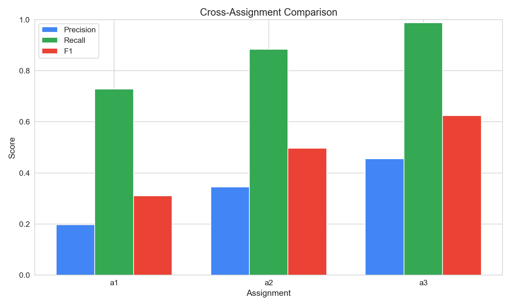
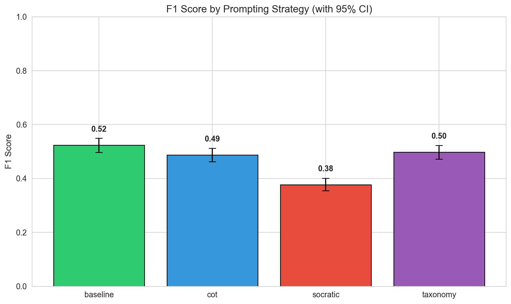
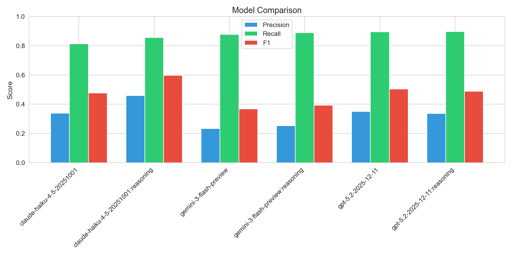
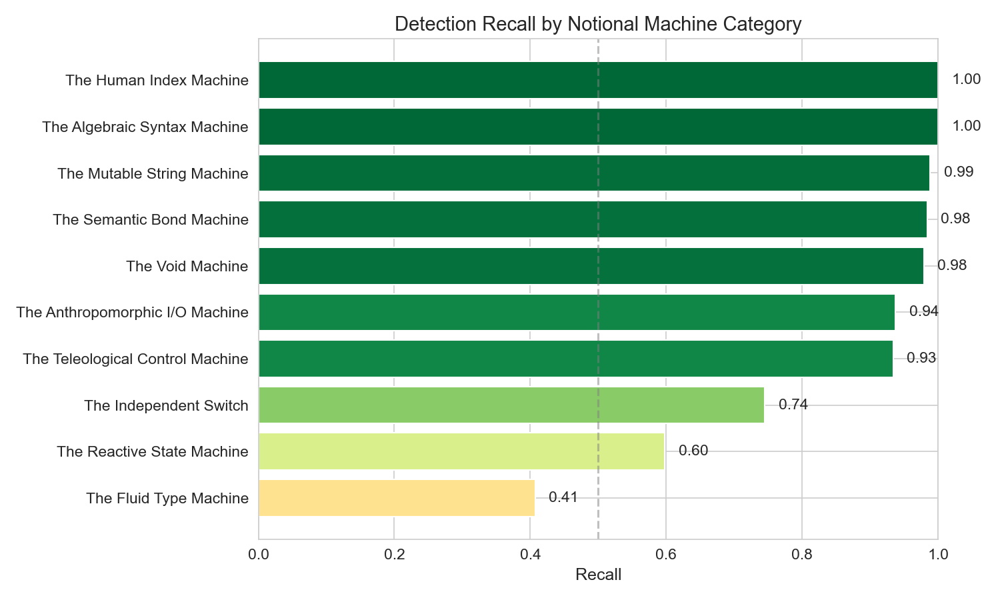
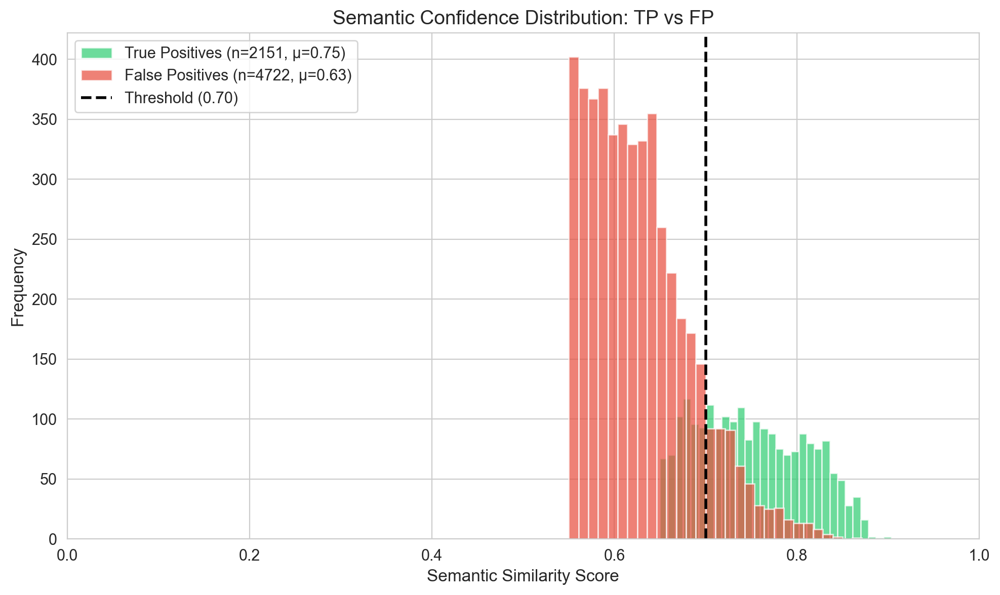
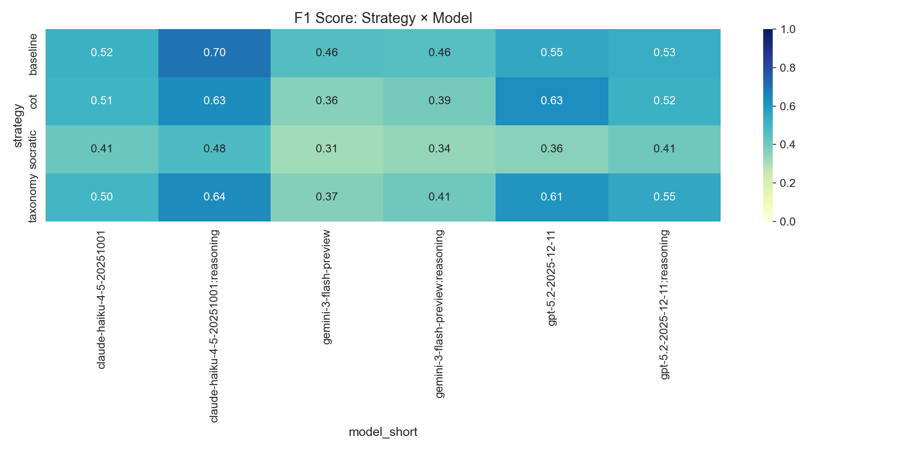
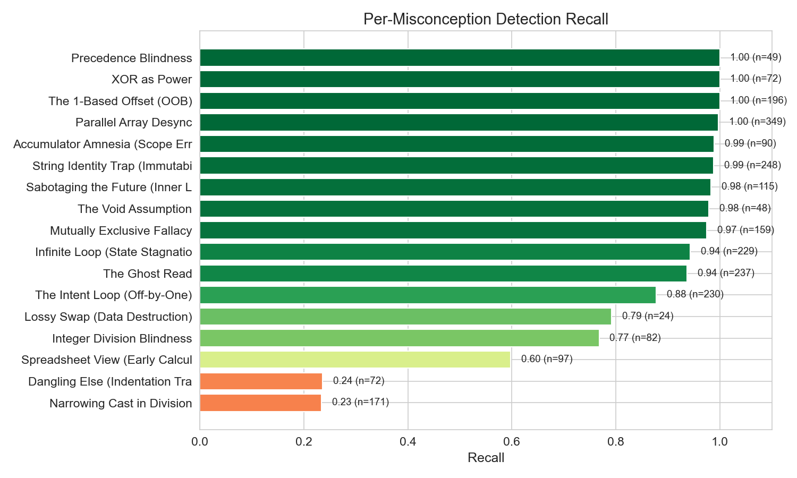
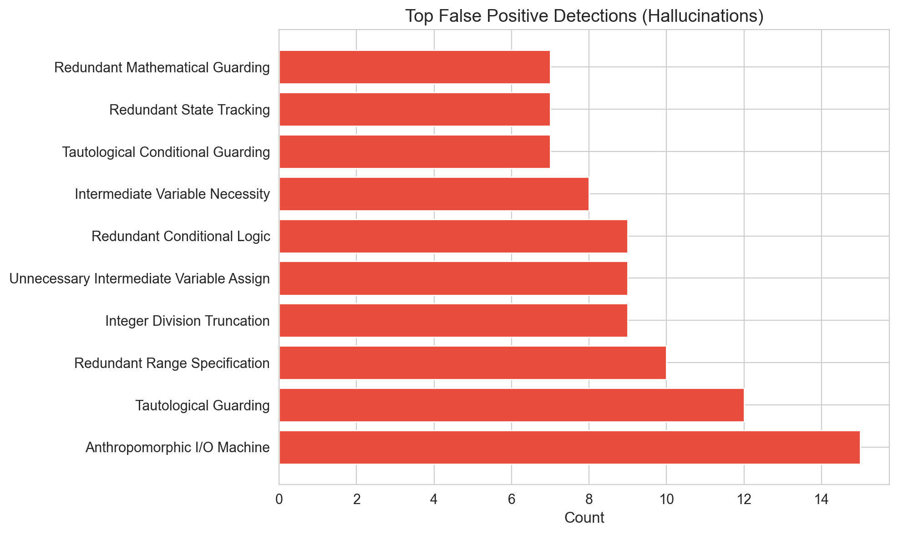

# Multi-Assignment LLM Misconception Detection Report
_Generated: 2025-12-22T22:24:48.238657+00:00_

## Executive Summary

This report evaluates LLM cognitive alignment with CS education theory by measuring
whether models can identify *student mental models* (Notional Machines), not just surface-level bugs.

**Key Finding:** Semantic embedding matching reveals the gap between detecting *what* is wrong
versus understanding *why* the student thought it was right.

---

## Dataset Summary
- **Total Students:** 300
- **Assignments:** a1 (Variables), a2 (Loops), a3 (Arrays)
- **Semantic Threshold:** Cosine Similarity ≥ 0.65
- **Noise Floor:** Detections with score < 0.55 are filtered as 'pedantic'
- **Seeds:** 1765081374,1765128549,1765142264

## Overall Metrics (with 95% Confidence Intervals)

| Metric | Value | 95% CI | Std Error |
|--------|-------|--------|-----------|
| True Positives | 2151 | — | — |
| False Positives | 4722 | — | — |
| False Negatives | 317 | — | — |
| **Precision** | **0.313** | [0.302, 0.324] | 0.0056 |
| **Recall** | **0.872** | [0.858, 0.885] | 0.0066 |
| **F1 Score** | **0.461** | [0.448, 0.473] | 0.0064 |

## Cross-Assignment Comparison (RQ1: Complexity Gradient)

> Does LLM performance degrade as conceptual complexity increases?

| Assignment | Focus | TP | FP | FN | Precision | Recall | F1 |
|------------|-------|----|----|----|-----------| -------|-----|
| a1 | Variables/Math | 551 | 2253 | 205 | 0.197 | 0.729 | 0.310 |
| a2 | Loops/Control | 792 | 1503 | 103 | 0.345 | 0.885 | 0.497 |
| a3 | Arrays/Strings | 808 | 966 | 9 | 0.455 | 0.989 | 0.624 |

## Performance by Prompting Strategy

| Strategy | TP | FP | FN | Precision | Recall | F1 |
|----------|----|----|----|-----------| -------|-----|
| baseline | 500 | 825 | 82 | 0.377 | 0.859 | 0.524 |
| cot | 529 | 1019 | 94 | 0.342 | 0.849 | 0.487 |
| socratic | 589 | 1873 | 71 | 0.239 | 0.892 | 0.377 |
| taxonomy | 533 | 1005 | 70 | 0.347 | 0.884 | 0.498 |

### Statistical Significance (McNemar's Test)

> Paired comparison since the same student code is analyzed by all strategies.

| Comparison | χ² | p-value | Significant? | Interpretation |
|------------|-----|---------|--------------|----------------|
| baseline vs cot | 9.47 | 0.0021 | ✓ Yes | baseline wins 46 cases, cot wins 20 cases (statist |
| baseline vs socratic | — | 1.0000 | ✗ No | baseline wins 30 cases, socratic wins 29 cases (no |
| baseline vs taxonomy | 0.68 | 0.4094 | ✗ No | baseline wins 32 cases, taxonomy wins 40 cases (no |
| cot vs socratic | 8.11 | 0.0044 | ✓ Yes | cot wins 23 cases, socratic wins 48 cases (statist |
| cot vs taxonomy | 12.66 | 0.0004 | ✓ Yes | cot wins 26 cases, taxonomy wins 60 cases (statist |
| socratic vs taxonomy | 1.05 | 0.3057 | ✗ No | socratic wins 26 cases, taxonomy wins 35 cases (no |

### Omnibus Test (Cochran's Q)

- **Q Statistic:** 13.10
- **Degrees of Freedom:** 3
- **p-value:** 0.004429
- **Conclusion:** Significant differences exist between strategies

## Performance by Model

| Model | TP | FP | FN | Precision | Recall | F1 |
|-------|----|----|----|-----------|--------|-----|
| claude-haiku-4-5-20251001 | 348 | 683 | 80 | 0.338 | 0.813 | 0.477 |
| claude-haiku-4-5-20251001:reasoning | 330 | 389 | 55 | 0.459 | 0.857 | 0.598 |
| gemini-3-flash-preview | 334 | 1101 | 47 | 0.233 | 0.877 | 0.368 |
| gemini-3-flash-preview:reasoning | 346 | 1026 | 43 | 0.252 | 0.889 | 0.393 |
| gpt-5.2-2025-12-11 | 394 | 733 | 46 | 0.350 | 0.895 | 0.503 |
| gpt-5.2-2025-12-11:reasoning | 399 | 790 | 46 | 0.336 | 0.897 | 0.488 |

## Notional Machine Category Detection (RQ2)

> Which mental model categories are easier/harder for LLMs to detect?
> This is the core finding: Surface errors (Syntax) vs Deep errors (State).

| Category | Recall | N | Difficulty |
|----------|--------|---|------------|
|  | 0.000 | 0 | **Hard** |
| The Fluid Type Machine | 0.407 | 253 | **Hard** |
| The Reactive State Machine | 0.598 | 97 | Medium |
| The Independent Switch | 0.745 | 231 | Easy |
| The Teleological Control Machine | 0.934 | 664 | Easy |
| The Anthropomorphic I/O Machine | 0.937 | 237 | Easy |
| The Void Machine | 0.979 | 48 | Easy |
| The Semantic Bond Machine | 0.984 | 373 | Easy |
| The Mutable String Machine | 0.988 | 248 | Easy |
| The Algebraic Syntax Machine | 1.000 | 121 | Easy |
| The Human Index Machine | 1.000 | 196 | Easy |

## Semantic Alignment Analysis (The 'Understanding' Metric)

> How confident is the semantic match? Higher scores = LLM truly understood the mental model.

| Metric | True Positives | False Positives |
|--------|----------------|-----------------|
| Count | 2151 | 4722 |
| Mean Score | 0.750 | 0.628 |
| Std Dev | 0.059 | 0.056 |
| Median | 0.745 | 0.619 |

### Score Separation Test (Mann-Whitney U)

- **U Statistic:** 9444362.00
- **p-value:** 0.000000
- **Interpretation:** TP scores significantly higher than FP scores

- **Effect Size (Cliff's Delta):** 0.860 (Large)

## Strategy × Model Heatmap

## Per-Misconception Detection Rates

| ID | Name | Category | Recall | N |
|----|------|----------|--------|---|
| NM_TYP_02 | Narrowing Cast in Division | The Fluid Type Machine | 0.23 | 171 |
| NM_LOGIC_02 | Dangling Else (Indentation Trap) | The Independent Switch | 0.24 | 72 |
| NM_STATE_01 | Spreadsheet View (Early Calculation | The Reactive State Machin | 0.60 | 97 |
| NM_TYP_01 | Integer Division Blindness | The Fluid Type Machine | 0.77 | 82 |
| NM_MEM_05 | Lossy Swap (Data Destruction) | The Semantic Bond Machine | 0.79 | 24 |
| NM_FLOW_02 | The Intent Loop (Off-by-One) | The Teleological Control  | 0.88 | 230 |
| NM_IO_02 | The Ghost Read | The Anthropomorphic I/O M | 0.94 | 237 |
| NM_FLOW_03 | Infinite Loop (State Stagnation) | The Teleological Control  | 0.94 | 229 |
| NM_LOGIC_01 | Mutually Exclusive Fallacy | The Independent Switch | 0.97 | 159 |
| NM_API_01 | The Void Assumption | The Void Machine | 0.98 | 48 |
| NM_FLOW_04 | Sabotaging the Future (Inner Loop M | The Teleological Control  | 0.98 | 115 |
| NM_MEM_03 | String Identity Trap (Immutability) | The Mutable String Machin | 0.99 | 248 |
| NM_FLOW_01 | Accumulator Amnesia (Scope Error) | The Teleological Control  | 0.99 | 90 |
| NM_MEM_01 | Parallel Array Desync | The Semantic Bond Machine | 1.00 | 349 |
| NM_MEM_04 | The 1-Based Offset (OOB) | The Human Index Machine | 1.00 | 196 |
| NM_SYN_01 | XOR as Power | The Algebraic Syntax Mach | 1.00 | 72 |
| NM_SYN_02 | Precedence Blindness | The Algebraic Syntax Mach | 1.00 | 49 |

## Detection Filtering Pipeline

> Shows how many detections were filtered at each stage before evaluation.

| Stage | Count | % of Raw |
|-------|-------|----------|
| Raw Detections | 9843 | 100% |
| Null-Template Filtered | 180 | 1.8% |
| Noise Floor Filtered (< 0.55) | 2790 | 28.3% |
| **Evaluated Detections** | **6873** | **69.8%** |

> **Note:** 'Noise Floor Filtered' detections are pedantic observations (e.g., 'didn't close Scanner')
> that have low semantic similarity to any ground truth misconception and are not counted as hallucinations.

## False Positive Analysis (Hallucinations)

> These are misconceptions the LLM 'invented' that don't match any ground truth.
> Note: Only detections above the noise floor are counted here.

---

## Methodology Notes

- **Semantic Matching:** Uses OpenAI `text-embedding-3-large` to embed both LLM explanations and ground truth student thinking.
- **Match Threshold:** Cosine similarity ≥ 0.65 required for a True Positive.
- **Noise Floor:** Detections with similarity < 0.55 are filtered as 'pedantic' noise, not counted as hallucinations.
- **Bootstrap CI:** 1000 resamples with replacement for confidence intervals.
- **McNemar's Test:** Paired comparison with continuity correction.
