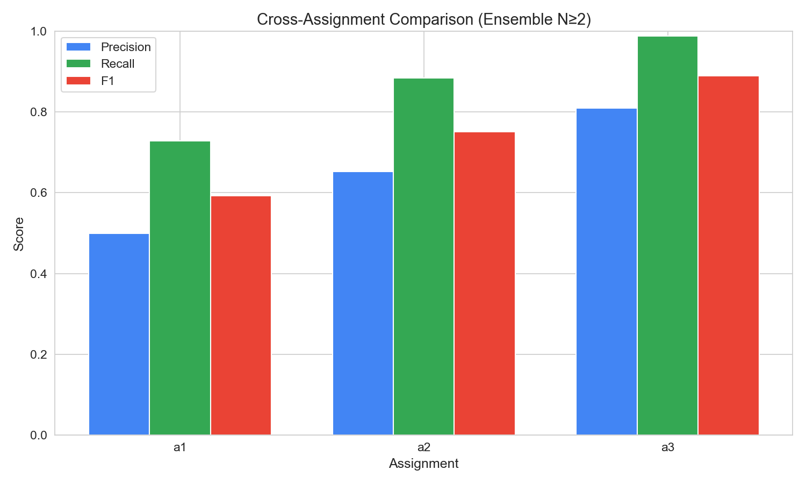
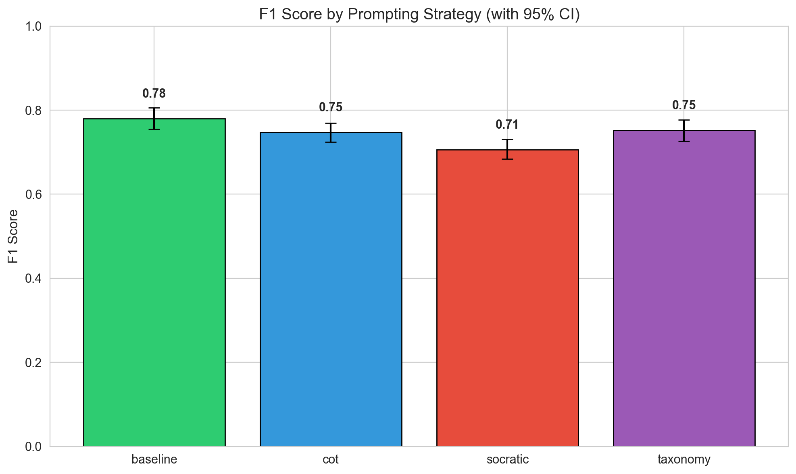
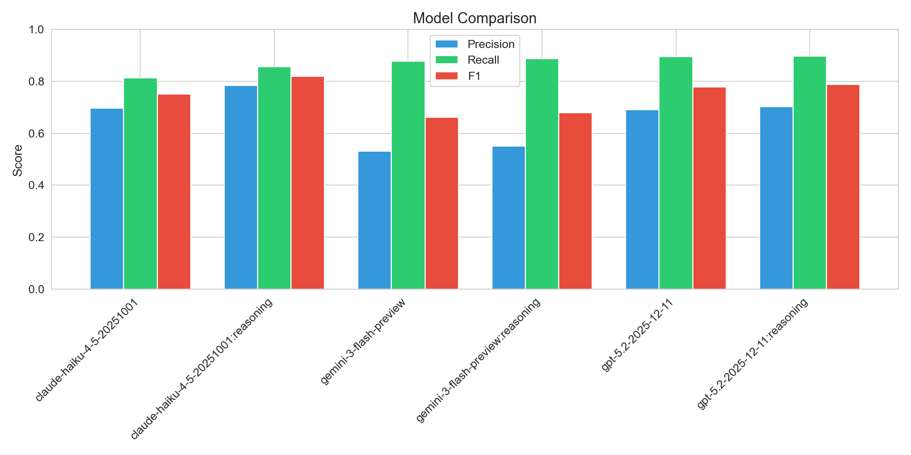
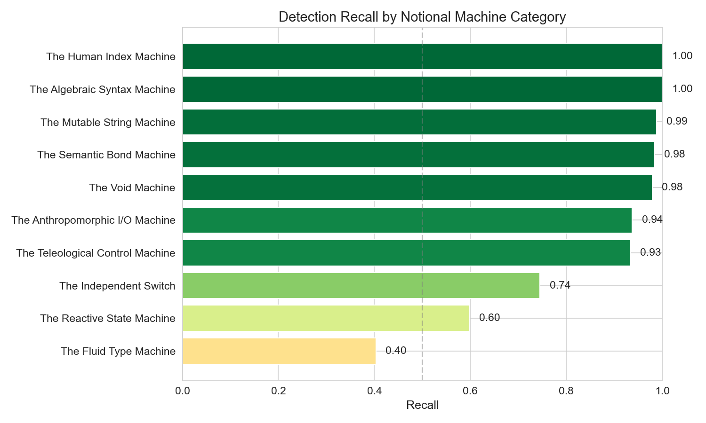

# Analysis 3: Ensemble Voting Report
_Generated: 2025-12-22T22:35:04.782670+00:00_

## Executive Summary

This report applies **Ensemble Voting** with threshold N≥2.
A detection is only counted if at least 2 strategies agree on the same misconception.

**Goal:** Reduce hallucinations by filtering one-off detections that only one strategy sees.

---

## Configuration
- **Total Students:** 300
- **Ensemble Threshold:** 2/4 strategies must agree
- **Semantic Threshold:** Cosine Similarity ≥ 0.65
- **Noise Floor:** Detections with score < 0.55 filtered
- **Seeds:** 1765081374,1765128549,1765142264

## Before vs After Ensemble Filtering

| Metric | Before | After | Change |
|--------|--------|-------|--------|
| Precision | 0.313 | 0.649 | +33.6% |
| Recall | 0.872 | 0.871 | -0.1% |
| F1 Score | 0.461 | 0.744 | +28.3% |
| TP | 2151 | 2150 | -1 |
| FP | 4722 | 1164 | -3558 |
| FN | 317 | 318 | +1 |

## Overall Metrics (with 95% Confidence Intervals)

| Metric | Value | 95% CI | Std Error |
|--------|-------|--------|-----------|
| True Positives | 2150 | — | — |
| False Positives | 1164 | — | — |
| False Negatives | 318 | — | — |
| **Precision** | **0.649** | [0.633, 0.666] | 0.0085 |
| **Recall** | **0.871** | [0.857, 0.885] | 0.0069 |
| **F1 Score** | **0.744** | [0.731, 0.757] | 0.0066 |

## Cross-Assignment Comparison (Ensemble)

| Assignment | Focus | TP | FP | FN | Precision | Recall | F1 |
|------------|-------|----|----|----|-----------| -------|-----|
| a1 | Variables/Math | 550 | 553 | 206 | 0.499 | 0.728 | 0.592 |
| a2 | Loops/Control | 792 | 421 | 103 | 0.653 | 0.885 | 0.751 |
| a3 | Arrays/Strings | 808 | 190 | 9 | 0.810 | 0.989 | 0.890 |

## Performance by Strategy (Ensemble)

| Strategy | TP | FP | FN | Precision | Recall | F1 |
|----------|----|----|----|-----------| -------|-----|
| baseline | 500 | 200 | 82 | 0.714 | 0.859 | 0.780 |
| cot | 528 | 263 | 95 | 0.668 | 0.848 | 0.747 |
| socratic | 589 | 419 | 71 | 0.584 | 0.892 | 0.706 |
| taxonomy | 533 | 282 | 70 | 0.654 | 0.884 | 0.752 |

## Performance by Model (Ensemble)

| Model | TP | FP | FN | Precision | Recall | F1 |
|-------|----|----|----|-----------|--------|-----|
| claude-haiku-4-5-20251001 | 348 | 151 | 80 | 0.697 | 0.813 | 0.751 |
| claude-haiku-4-5-20251001:reasoning | 330 | 91 | 55 | 0.784 | 0.857 | 0.819 |
| gemini-3-flash-preview | 334 | 295 | 47 | 0.531 | 0.877 | 0.661 |
| gemini-3-flash-preview:reasoning | 345 | 281 | 44 | 0.551 | 0.887 | 0.680 |
| gpt-5.2-2025-12-11 | 394 | 177 | 46 | 0.690 | 0.895 | 0.779 |
| gpt-5.2-2025-12-11:reasoning | 399 | 169 | 46 | 0.702 | 0.897 | 0.788 |

## Notional Machine Category Detection (Ensemble)

| Category | Recall | N | Difficulty |
|----------|--------|---|------------|
|  | 0.000 | 0 | **Hard** |
| The Fluid Type Machine | 0.403 | 253 | **Hard** |
| The Reactive State Machine | 0.598 | 97 | Medium |
| The Independent Switch | 0.745 | 231 | Easy |
| The Teleological Control Machine | 0.934 | 664 | Easy |
| The Anthropomorphic I/O Machine | 0.937 | 237 | Easy |
| The Void Machine | 0.979 | 48 | Easy |
| The Semantic Bond Machine | 0.984 | 373 | Easy |
| The Mutable String Machine | 0.988 | 248 | Easy |
| The Algebraic Syntax Machine | 1.000 | 121 | Easy |
| The Human Index Machine | 1.000 | 196 | Easy |

---

## Methodology Notes

- **Ensemble Voting:** Detection counted only if ≥2 strategies agree
- **Semantic Matching:** Uses OpenAI `text-embedding-3-large`
- **Match Threshold:** Cosine similarity ≥ 0.65
- **Noise Floor:** Detections < 0.55 filtered
- **Bootstrap CI:** 1000 resamples
