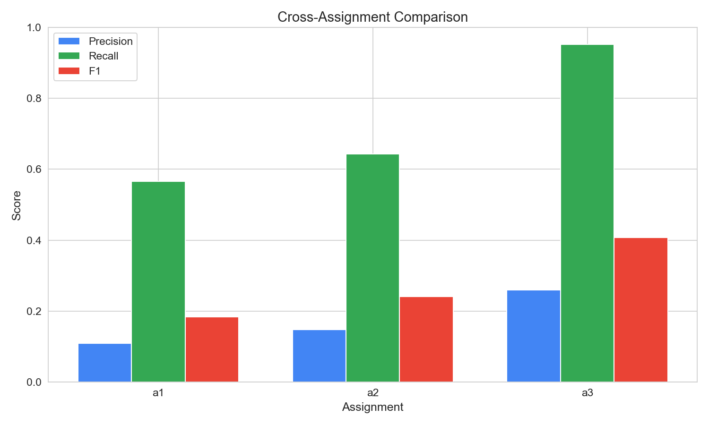
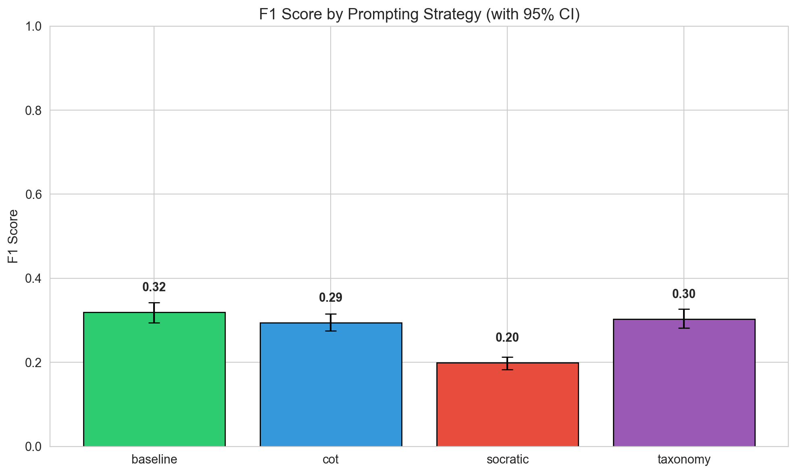
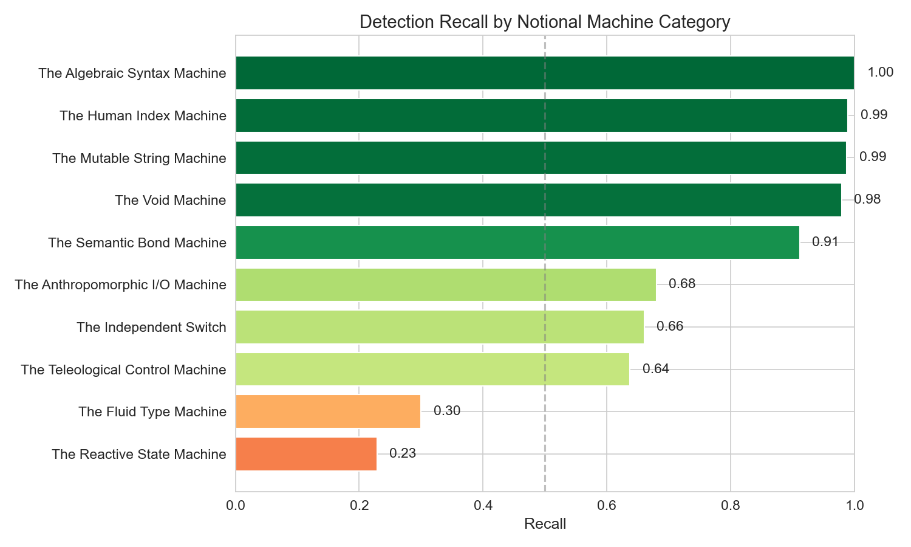
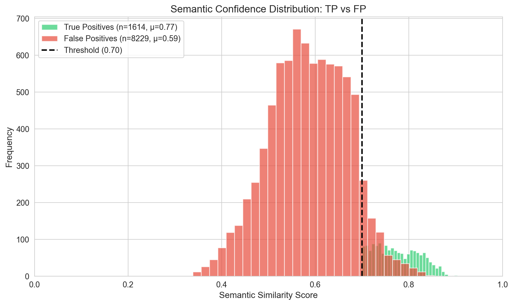
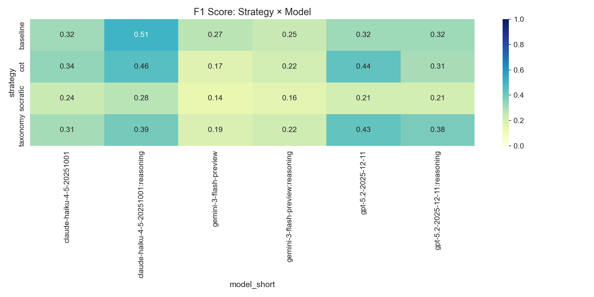
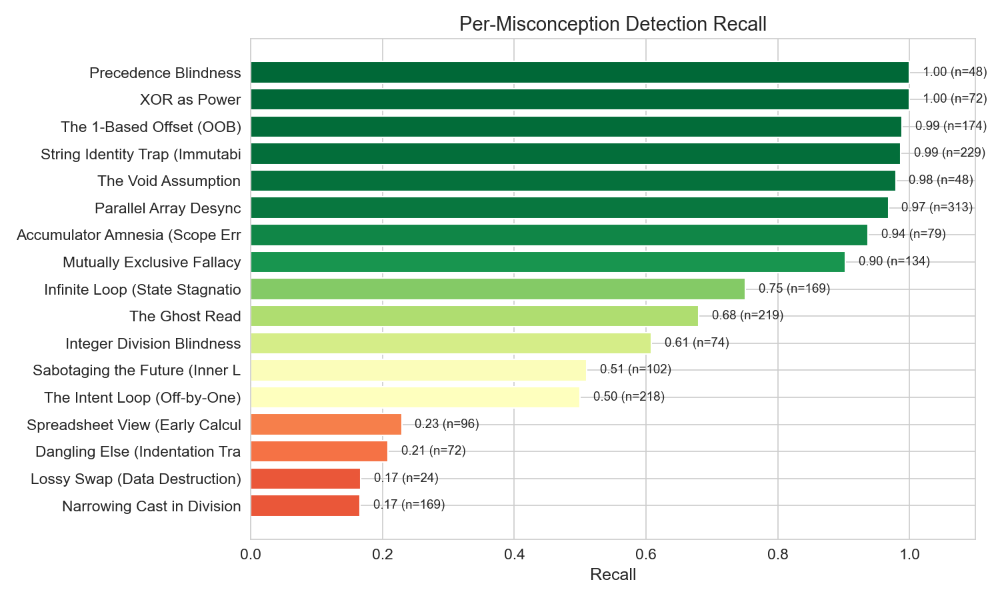
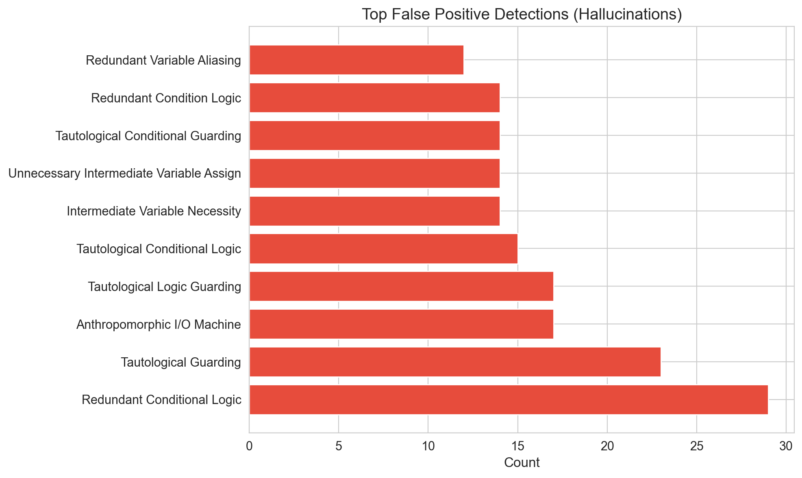

# Multi-Assignment LLM Misconception Detection Report
_Generated: 2025-12-22T22:03:30.396502+00:00_

## Executive Summary

This report evaluates LLM cognitive alignment with CS education theory by measuring
whether models can identify *student mental models* (Notional Machines), not just surface-level bugs.

**Key Finding:** Semantic embedding matching reveals the gap between detecting *what* is wrong
versus understanding *why* the student thought it was right.

---

## Dataset Summary
- **Total Students:** 300
- **Assignments:** a1 (Variables), a2 (Loops), a3 (Arrays)
- **Matching Method:** Semantic Embedding (Cosine Similarity ≥ 0.70)
- **Seeds:** 1765081374,1765128549,1765142264

## Overall Metrics (with 95% Confidence Intervals)

| Metric | Value | 95% CI | Std Error |
|--------|-------|--------|-----------|
| True Positives | 1614 | — | — |
| False Positives | 8229 | — | — |
| False Negatives | 626 | — | — |
| **Precision** | **0.164** | [0.157, 0.171] | 0.0037 |
| **Recall** | **0.721** | [0.702, 0.740] | 0.0095 |
| **F1 Score** | **0.267** | [0.257, 0.277] | 0.0053 |

## Cross-Assignment Comparison (RQ1: Complexity Gradient)

> Does LLM performance degrade as conceptual complexity increases?

| Assignment | Focus | TP | FP | FN | Precision | Recall | F1 |
|------------|-------|----|----|----|-----------| -------|-----|
| a1 | Variables/Math | 411 | 3349 | 315 | 0.109 | 0.566 | 0.183 |
| a2 | Loops/Control | 498 | 2867 | 276 | 0.148 | 0.643 | 0.241 |
| a3 | Arrays/Strings | 705 | 2013 | 35 | 0.259 | 0.953 | 0.408 |

## Performance by Prompting Strategy

| Strategy | TP | FP | FN | Precision | Recall | F1 |
|----------|----|----|----|-----------| -------|-----|
| baseline | 385 | 1484 | 161 | 0.206 | 0.705 | 0.319 |
| cot | 405 | 1784 | 158 | 0.185 | 0.719 | 0.294 |
| socratic | 426 | 3282 | 157 | 0.115 | 0.731 | 0.199 |
| taxonomy | 398 | 1679 | 150 | 0.192 | 0.726 | 0.303 |

### Statistical Significance (McNemar's Test)

> Paired comparison since the same student code is analyzed by all strategies.

| Comparison | χ² | p-value | Significant? | Interpretation |
|------------|-----|---------|--------------|----------------|
| baseline vs cot | 2.01 | 0.1561 | ✗ No | baseline wins 49 cases, cot wins 35 cases (not sig |
| baseline vs socratic | 0.18 | 0.6680 | ✗ No | baseline wins 46 cases, socratic wins 41 cases (no |
| baseline vs taxonomy | 0.49 | 0.4839 | ✗ No | baseline wins 46 cases, taxonomy wins 54 cases (no |
| cot vs socratic | 0.62 | 0.4305 | ✗ No | cot wins 47 cases, socratic wins 56 cases (not sig |
| cot vs taxonomy | 4.24 | 0.0395 | ✓ Yes | cot wins 41 cases, taxonomy wins 63 cases (statist |
| socratic vs taxonomy | 1.73 | 0.1878 | ✗ No | socratic wins 35 cases, taxonomy wins 48 cases (no |

### Omnibus Test (Cochran's Q)

- **Q Statistic:** 1.39
- **Degrees of Freedom:** 3
- **p-value:** 0.707210
- **Conclusion:** No significant differences between strategies

## Performance by Model

| Model | TP | FP | FN | Precision | Recall | F1 |
|-------|----|----|----|-----------|--------|-----|
| claude-haiku-4-5-20251001 | 284 | 1263 | 111 | 0.184 | 0.719 | 0.292 |
| claude-haiku-4-5-20251001:reasoning | 261 | 705 | 104 | 0.270 | 0.715 | 0.392 |
| gemini-3-flash-preview | 232 | 1923 | 128 | 0.108 | 0.644 | 0.184 |
| gemini-3-flash-preview:reasoning | 245 | 1798 | 112 | 0.120 | 0.686 | 0.204 |
| gpt-5.2-2025-12-11 | 301 | 1213 | 85 | 0.199 | 0.780 | 0.317 |
| gpt-5.2-2025-12-11:reasoning | 291 | 1327 | 86 | 0.180 | 0.772 | 0.292 |

## Notional Machine Category Detection (RQ2)

> Which mental model categories are easier/harder for LLMs to detect?
> This is the core finding: Surface errors (Syntax) vs Deep errors (State).

| Category | Recall | N | Difficulty |
|----------|--------|---|------------|
|  | 0.000 | 0 | **Hard** |
| The Reactive State Machine | 0.229 | 96 | **Hard** |
| The Fluid Type Machine | 0.300 | 243 | **Hard** |
| The Teleological Control Machine | 0.637 | 568 | Medium |
| The Independent Switch | 0.660 | 206 | Medium |
| The Anthropomorphic I/O Machine | 0.680 | 219 | Medium |
| The Semantic Bond Machine | 0.911 | 337 | Easy |
| The Void Machine | 0.979 | 48 | Easy |
| The Mutable String Machine | 0.987 | 229 | Easy |
| The Human Index Machine | 0.989 | 174 | Easy |
| The Algebraic Syntax Machine | 1.000 | 120 | Easy |

## Semantic Alignment Analysis (The 'Understanding' Metric)

> How confident is the semantic match? Higher scores = LLM truly understood the mental model.

| Metric | True Positives | False Positives |
|--------|----------------|-----------------|
| Count | 1614 | 8229 |
| Mean Score | 0.774 | 0.586 |
| Std Dev | 0.047 | 0.084 |
| Median | 0.769 | 0.586 |

### Score Separation Test (Mann-Whitney U)

- **U Statistic:** 13025280.00
- **p-value:** 0.000000
- **Interpretation:** TP scores significantly higher than FP scores

- **Effect Size (Cliff's Delta):** 0.961 (Large)

## Strategy × Model Heatmap

## Per-Misconception Detection Rates

| ID | Name | Category | Recall | N |
|----|------|----------|--------|---|
| NM_TYP_02 | Narrowing Cast in Division | The Fluid Type Machine | 0.17 | 169 |
| NM_MEM_05 | Lossy Swap (Data Destruction) | The Semantic Bond Machine | 0.17 | 24 |
| NM_LOGIC_02 | Dangling Else (Indentation Trap) | The Independent Switch | 0.21 | 72 |
| NM_STATE_01 | Spreadsheet View (Early Calculation | The Reactive State Machin | 0.23 | 96 |
| NM_FLOW_02 | The Intent Loop (Off-by-One) | The Teleological Control  | 0.50 | 218 |
| NM_FLOW_04 | Sabotaging the Future (Inner Loop M | The Teleological Control  | 0.51 | 102 |
| NM_TYP_01 | Integer Division Blindness | The Fluid Type Machine | 0.61 | 74 |
| NM_IO_02 | The Ghost Read | The Anthropomorphic I/O M | 0.68 | 219 |
| NM_FLOW_03 | Infinite Loop (State Stagnation) | The Teleological Control  | 0.75 | 169 |
| NM_LOGIC_01 | Mutually Exclusive Fallacy | The Independent Switch | 0.90 | 134 |
| NM_FLOW_01 | Accumulator Amnesia (Scope Error) | The Teleological Control  | 0.94 | 79 |
| NM_MEM_01 | Parallel Array Desync | The Semantic Bond Machine | 0.97 | 313 |
| NM_API_01 | The Void Assumption | The Void Machine | 0.98 | 48 |
| NM_MEM_03 | String Identity Trap (Immutability) | The Mutable String Machin | 0.99 | 229 |
| NM_MEM_04 | The 1-Based Offset (OOB) | The Human Index Machine | 0.99 | 174 |
| NM_SYN_01 | XOR as Power | The Algebraic Syntax Mach | 1.00 | 72 |
| NM_SYN_02 | Precedence Blindness | The Algebraic Syntax Mach | 1.00 | 48 |

## False Positive Analysis (Hallucinations)

> These are misconceptions the LLM 'invented' that don't match any ground truth.

---

## Methodology Notes

- **Semantic Matching:** Uses OpenAI `text-embedding-3-large` to embed both LLM explanations and ground truth student thinking.
- **Threshold:** Cosine similarity ≥ 0.70 required for a True Positive.
- **Bootstrap CI:** 1000 resamples with replacement for confidence intervals.
- **McNemar's Test:** Paired comparison with continuity correction.
