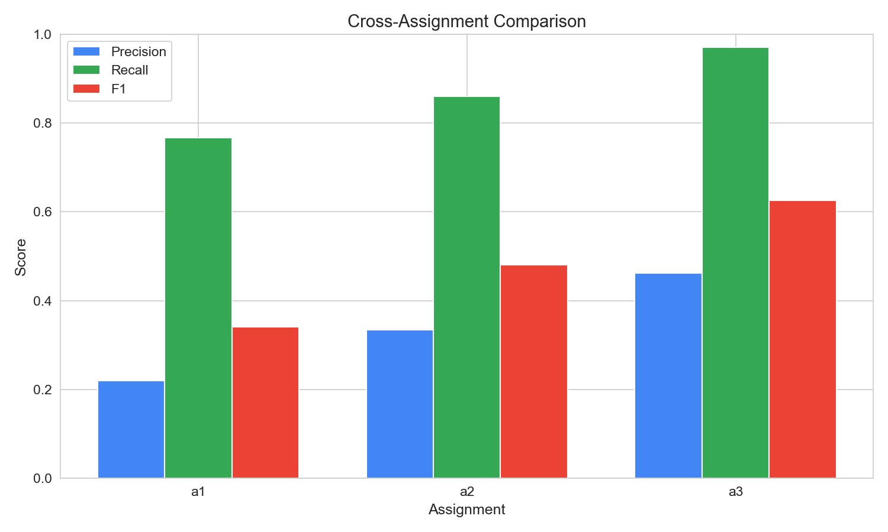
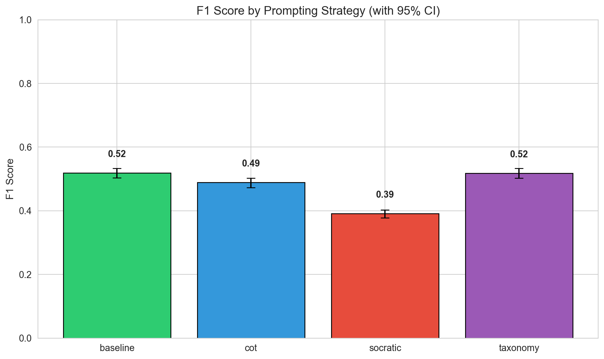
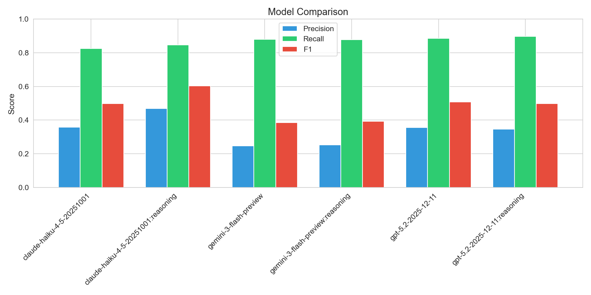
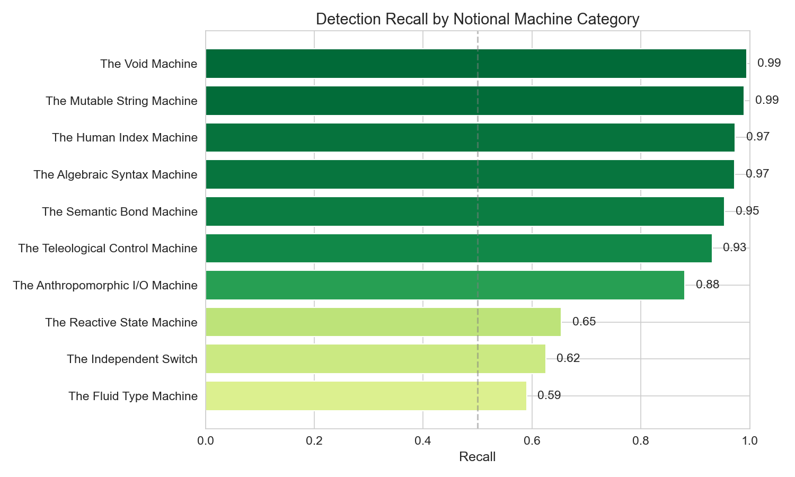

# Multi-Assignment LLM Misconception Detection Report
_Generated: 2025-12-31T01:01:49.312724+00:00_

## Executive Summary

This report evaluates LLM cognitive alignment with CS education theory by measuring
whether models can identify *student mental models* (Notional Machines), not just surface-level bugs.

**Key Finding:** Semantic embedding matching reveals the gap between detecting *what* is wrong
versus understanding *why* the student thought it was right.

---

## Dataset Summary
- **Total Students:** 300
- **Assignments:** a1 (Variables), a2 (Loops), a3 (Arrays)
- **Semantic Threshold:** Cosine Similarity ≥ 0.65
- **Noise Floor:** Detections with score < 0.55 are filtered as 'pedantic'
- **Seeds:** 1766905633,1766908848,1766912544

## Overall Metrics (with 95% Confidence Intervals)

| Metric | Value | 95% CI | Std Error |
|--------|-------|--------|-----------|
| True Positives | 6745 | — | — |
| False Positives | 14236 | — | — |
| False Negatives | 1022 | — | — |
| **Precision** | **0.322** | [0.315, 0.328] | 0.0033 |
| **Recall** | **0.868** | [0.861, 0.876] | 0.0040 |
| **F1 Score** | **0.469** | [0.462, 0.476] | 0.0037 |

## Cross-Assignment Comparison (RQ1: Complexity Gradient)

> Does LLM performance degrade as conceptual complexity increases?

| Assignment | Focus | TP | FP | FN | Precision | Recall | F1 |
|------------|-------|----|----|----|-----------| -------|-----|
| a1 | Variables/Math | 1796 | 6392 | 545 | 0.219 | 0.767 | 0.341 |
| a2 | Loops/Control | 2501 | 4989 | 403 | 0.334 | 0.861 | 0.481 |
| a3 | Arrays/Strings | 2448 | 2855 | 74 | 0.462 | 0.971 | 0.626 |

## Performance by Prompting Strategy

| Strategy | TP | FP | FN | Precision | Recall | F1 |
|----------|----|----|----|-----------| -------|-----|
| baseline | 1544 | 2592 | 273 | 0.373 | 0.850 | 0.519 |
| cot | 1644 | 3124 | 310 | 0.345 | 0.841 | 0.489 |
| socratic | 1874 | 5599 | 232 | 0.251 | 0.890 | 0.391 |
| taxonomy | 1683 | 2921 | 207 | 0.366 | 0.890 | 0.518 |

### Statistical Significance (McNemar's Test)

> Paired comparison since the same student code is analyzed by all strategies.

| Comparison | χ² | p-value | Significant? | Interpretation |
|------------|-----|---------|--------------|----------------|
| baseline vs cot | 23.58 | 0.0000 | ✓ Yes | baseline wins 161 cases, cot wins 84 cases (statis |
| baseline vs socratic | 0.07 | 0.7915 | ✗ No | baseline wins 117 cases, socratic wins 112 cases ( |
| baseline vs taxonomy | 19.52 | 0.0000 | ✓ Yes | baseline wins 81 cases, taxonomy wins 149 cases (s |
| cot vs socratic | 16.16 | 0.0001 | ✓ Yes | cot wins 120 cases, socratic wins 192 cases (stati |
| cot vs taxonomy | 71.26 | — | ✓ Yes | cot wins 73 cases, taxonomy wins 218 cases (statis |
| socratic vs taxonomy | 21.69 | 0.0000 | ✓ Yes | socratic wins 83 cases, taxonomy wins 156 cases (s |

### Omnibus Test (Cochran's Q)

- **Q Statistic:** 57.59
- **Degrees of Freedom:** 3
- **p-value:** 0.000000
- **Conclusion:** Significant differences exist between strategies

## Performance by Model

| Model | TP | FP | FN | Precision | Recall | F1 |
|-------|----|----|----|-----------|--------|-----|
| claude-haiku-4-5-20251001 | 1112 | 1993 | 236 | 0.358 | 0.825 | 0.499 |
| claude-haiku-4-5-20251001:reasoning | 1021 | 1154 | 185 | 0.469 | 0.847 | 0.604 |
| gemini-3-flash-preview | 1102 | 3368 | 152 | 0.247 | 0.879 | 0.385 |
| gemini-3-flash-preview:reasoning | 1096 | 3252 | 154 | 0.252 | 0.877 | 0.392 |
| gpt-5.2-2025-12-11 | 1195 | 2166 | 155 | 0.356 | 0.885 | 0.507 |
| gpt-5.2-2025-12-11:reasoning | 1219 | 2303 | 140 | 0.346 | 0.897 | 0.499 |

## Notional Machine Category Detection (RQ2)

> Which mental model categories are easier/harder for LLMs to detect?
> This is the core finding: Surface errors (Syntax) vs Deep errors (State).

| Category | Recall | N | Difficulty |
|----------|--------|---|------------|
| The Fluid Type Machine | 0.590 | 883 | Medium |
| The Independent Switch | 0.625 | 664 | Medium |
| The Reactive State Machine | 0.654 | 312 | Medium |
| The Anthropomorphic I/O Machine | 0.881 | 514 | Easy |
| The Teleological Control Machine | 0.931 | 2240 | Easy |
| The Semantic Bond Machine | 0.954 | 965 | Easy |
| The Algebraic Syntax Machine | 0.972 | 457 | Easy |
| The Human Index Machine | 0.973 | 841 | Easy |
| The Mutable String Machine | 0.990 | 716 | Easy |
| The Void Machine | 0.994 | 175 | Easy |

## Semantic Alignment Analysis (The 'Understanding' Metric)

> How confident is the semantic match? Higher scores = LLM truly understood the mental model.

| Metric | True Positives | False Positives |
|--------|----------------|-----------------|
| Count | 6745 | 14236 |
| Mean Score | 0.745 | 0.632 |
| Std Dev | 0.054 | 0.057 |
| Median | 0.743 | 0.624 |

### Score Separation Test (Mann-Whitney U)

- **U Statistic:** 88315993.00
- **p-value:** 0.000000
- **Interpretation:** TP scores significantly higher than FP scores

- **Effect Size (Cliff's Delta):** 0.840 (Large)

## Strategy × Model Heatmap

## Per-Misconception Detection Rates

| ID | Name | Category | Recall | N |
|----|------|----------|--------|---|
| NM_LOGIC_02 | Dangling Else (Indentation Trap) | The Independent Switch | 0.16 | 289 |
| NM_TYP_02 | Narrowing Cast in Division | The Fluid Type Machine | 0.31 | 458 |
| NM_STATE_01 | Spreadsheet View (Early Calculation | The Reactive State Machin | 0.65 | 312 |
| NM_IO_01 | Prompt-Logic Mismatch | The Anthropomorphic I/O M | 0.72 | 74 |
| NM_MEM_05 | Lossy Swap (Data Destruction) | The Semantic Bond Machine | 0.86 | 279 |
| NM_TYP_01 | Integer Division Blindness | The Fluid Type Machine | 0.90 | 425 |
| NM_FLOW_02 | The Intent Loop (Off-by-One) | The Teleological Control  | 0.90 | 698 |
| NM_IO_02 | The Ghost Read | The Anthropomorphic I/O M | 0.91 | 440 |
| NM_FLOW_04 | Sabotaging the Future (Inner Loop M | The Teleological Control  | 0.91 | 322 |
| NM_FLOW_03 | Infinite Loop (State Stagnation) | The Teleological Control  | 0.95 | 821 |
| NM_SYN_02 | Precedence Blindness | The Algebraic Syntax Mach | 0.96 | 336 |
| NM_FLOW_01 | Accumulator Amnesia (Scope Error) | The Teleological Control  | 0.97 | 399 |
| NM_MEM_04 | The 1-Based Offset (OOB) | The Human Index Machine | 0.97 | 841 |
| NM_LOGIC_01 | Mutually Exclusive Fallacy | The Independent Switch | 0.98 | 375 |
| NM_MEM_03 | String Identity Trap (Immutability) | The Mutable String Machin | 0.99 | 716 |
| NM_MEM_01 | Parallel Array Desync | The Semantic Bond Machine | 0.99 | 686 |
| NM_SYN_01 | XOR as Power | The Algebraic Syntax Mach | 0.99 | 121 |
| NM_API_01 | The Void Assumption | The Void Machine | 0.99 | 175 |

## Detection Filtering Pipeline

> Shows how many detections were filtered at each stage before evaluation.

| Stage | Count | % of Raw |
|-------|-------|----------|
| Raw Detections | 29164 | 100% |
| Null-Template Filtered | 634 | 2.2% |
| Noise Floor Filtered (< 0.55) | 7549 | 25.9% |
| **Evaluated Detections** | **20981** | **71.9%** |

> **Note:** 'Noise Floor Filtered' detections are pedantic observations (e.g., 'didn't close Scanner')
> that have low semantic similarity to any ground truth misconception and are not counted as hallucinations.

## False Positive Analysis (Hallucinations)

> These are misconceptions the LLM 'invented' that don't match any ground truth.
> Note: Only detections above the noise floor are counted here.

## Ensemble Voting Analysis

> Ensemble voting requires multiple agreeing sources before counting a detection.
> This trades recall for precision, reducing hallucinations.

### Comparison: Raw vs Ensemble Methods

| Method | Precision | Recall | F1 | Precision Gain | Recall Loss |
|--------|-----------|--------|-----|----------------|-------------|
| **Raw (No Ensemble)** | 0.321 | 0.868 | 0.469 | — | — |
| **Strategy Ensemble (≥2/4)** | 0.640 | 0.868 | 0.737 | +0.319 | +0.000 |
| **Model Ensemble (≥2/6)** | 0.684 | 0.862 | 0.763 | +0.363 | +0.006 |

### Interpretation

- **Best Ensemble Method:** Model Ensemble (F1 = 0.763)
- **Strategy Ensemble:** Requires ≥2 of 4 prompting strategies to agree on the same misconception
- **Model Ensemble:** Requires ≥2 of 6 models to agree on the same misconception

> **Key Finding:** Ensemble voting improves F1 by 0.294 through precision gains.

---

## Methodology Notes

- **Semantic Matching:** Uses OpenAI `text-embedding-3-large` to embed both LLM explanations and ground truth student thinking.
- **Match Threshold:** Cosine similarity ≥ 0.65 required for a True Positive.
- **Noise Floor:** Detections with similarity < 0.55 are filtered as 'pedantic' noise, not counted as hallucinations.
- **Bootstrap CI:** 1000 resamples with replacement for confidence intervals.
- **McNemar's Test:** Paired comparison with continuity correction.
- **Strategy Ensemble:** Detection validated if ≥2/4 strategies agree on same misconception for same student/question.
- **Model Ensemble:** Detection validated if ≥2/6 models agree on same misconception for same student/question/strategy.
