# TRACER: LLM Cognitive Alignment Analysis

## Taxonomic Research of Aligned Cognitive Error Recognition

_Generated: 2026-01-05T00:54:29.639941+00:00_

---

## Executive Summary

This report evaluates **LLM cognitive alignment** with CS education theory by measuring
whether models can identify *student mental models* (Notional Machines), not just surface-level bugs.

**Dataset:** 300 students × 3 assignments × 4 strategies × 6 models

### Key Metrics

| Metric | Value | 95% CI |
|--------|-------|--------|
| **Precision** | **0.322** | [0.315, 0.328] |
| **Recall** | **0.909** | [0.903, 0.916] |
| **F1 Score** | **0.475** | [0.468, 0.482] |

**Raw Counts:** TP=6,745 | FP=14,236 | FN=674

### Key Findings

1. **Ensemble Voting** improves F1 by +0.048 through precision gains
2. **Detection Gap:** 'The Independent Switch' (63%) vs 'The Void Machine' (99%)
3. **Semantic Matching** effectively separates TPs from FPs (large effect size)

---

## 1. Methodology Validation

### 1.1 Threshold Sensitivity Analysis

> Demonstrates robustness of threshold selection across parameter grid.

**Optimal Configuration:** Semantic=0.55, Noise Floor=0.6, F1=0.629

**Current Configuration:** Semantic=0.65, Noise Floor=0.55

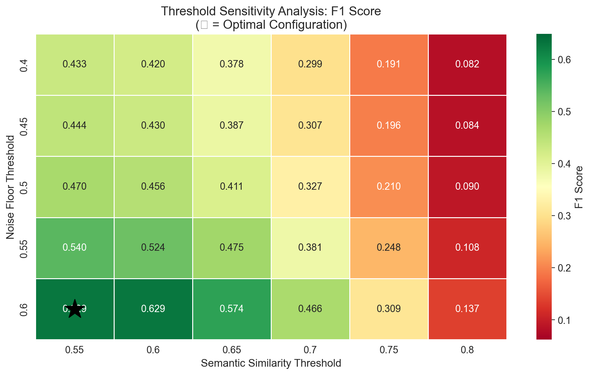

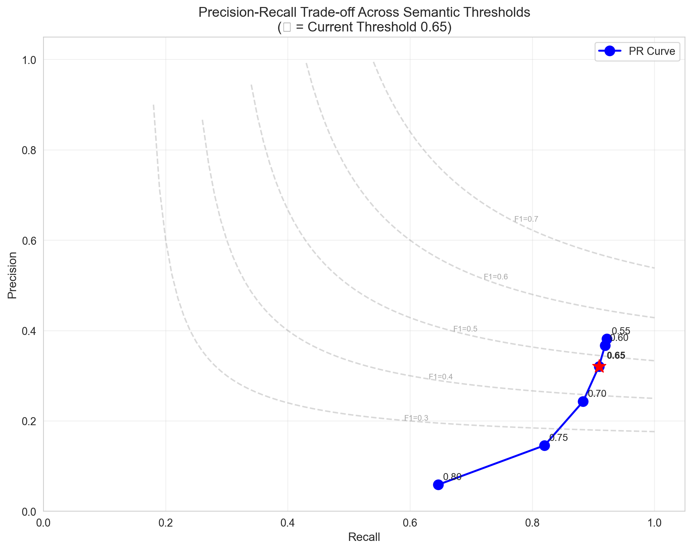

### 1.2 Semantic Matching Validation

> Validates that semantic similarity effectively discriminates TPs from FPs.

| Metric | True Positives | False Positives |
|--------|----------------|-----------------|
| Count | 6,745 | 14,236 |
| Mean Score | 0.745 | 0.632 |
| Std Dev | 0.054 | 0.057 |

**Effect Size (Cliff's Delta):** 0.840 (Large)

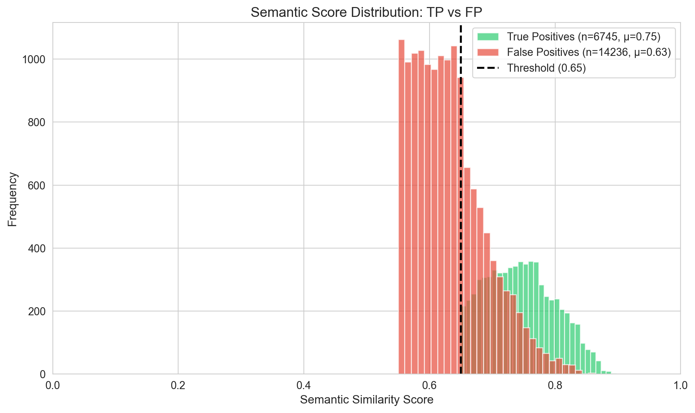

---

## 2. Main Findings

### 2.1 The Detection Gap: Structural vs Semantic Misconceptions (RQ2)

> Core finding: LLMs excel at detecting structural errors but struggle with semantic mental model failures.

| Category Type | Mean Recall | N Categories |
|---------------|-------------|--------------|
| **Structural** | **0.986** | 6 |
| **Semantic** | **0.771** | 4 |
| **Gap** | **+0.215** | — |

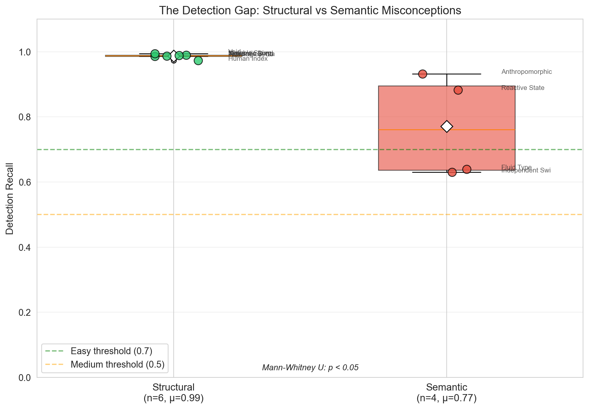

#### Per-Category Breakdown

| Category | Type | Recall | N | Difficulty |
|----------|------|--------|---|------------|
| The Independent Switch | Semantic | 0.630 | 659 | Medium |
| The Fluid Type Machine | Semantic | 0.639 | 815 | Medium |
| The Reactive State Machine | Semantic | 0.883 | 231 | Easy |
| The Anthropomorphic I/O Machine | Semantic | 0.932 | 486 | Easy |
| The Human Index Machine | Structural | 0.973 | 841 | Easy |
| The Teleological Control Machine | Structural | 0.986 | 2115 | Easy |
| The Algebraic Syntax Machine | Structural | 0.987 | 450 | Easy |
| The Semantic Bond Machine | Structural | 0.989 | 931 | Easy |
| The Mutable String Machine | Structural | 0.990 | 716 | Easy |
| The Void Machine | Structural | 0.994 | 175 | Easy |

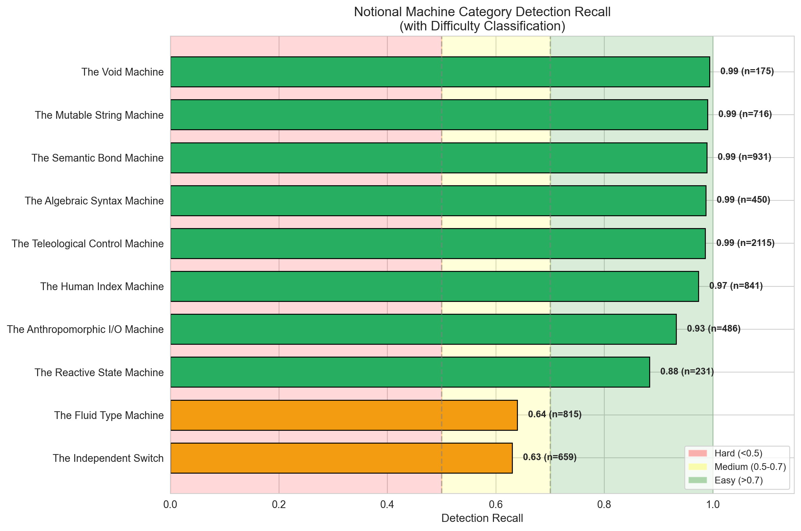

### 2.2 Per-Misconception Analysis

> Individual misconception detection rates reveal specific diagnostic gaps.

#### Misconceptions Requiring Human Oversight (Bottom 5)

| ID | Name | Category | Recall | N |
|----|------|----------|--------|---|
| NM_LOGIC_02 | Dangling Else (Indentation Trap) | The Independent Switch | 0.16 | 287 |
| NM_TYP_02 | Narrowing Cast in Division | The Fluid Type Machine | 0.33 | 426 |
| NM_IO_01 | Prompt-Logic Mismatch | The Anthropomorphic I/O M | 0.84 | 63 |
| NM_STATE_01 | Spreadsheet View (Early Calculation | The Reactive State Machin | 0.88 | 231 |
| NM_IO_02 | The Ghost Read | The Anthropomorphic I/O M | 0.95 | 423 |

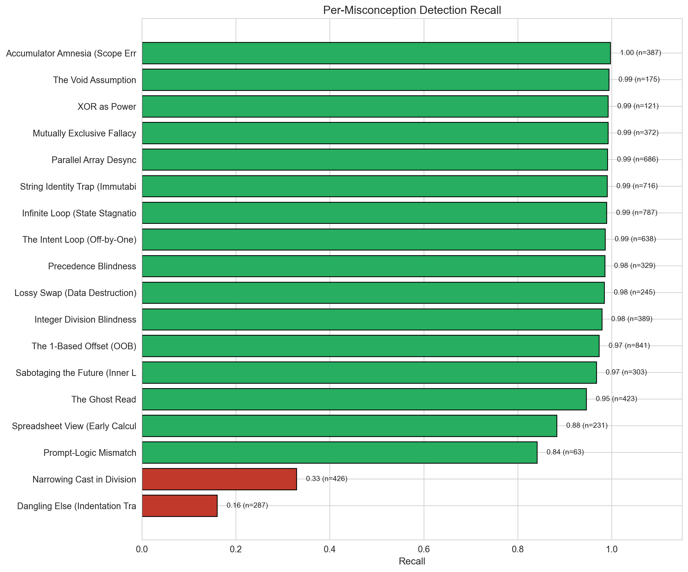

### 2.3 Ensemble Voting Effect

> Ensemble voting requires multiple agreeing sources, trading recall for precision.

| Method | Precision | Recall | F1 | Precision Gain |
|--------|-----------|--------|-----|----------------|
| Raw (No Ensemble) | 0.321 | 0.909 | 0.475 | — |
| Strategy Ensemble (≥2/4) | 0.342 | 0.909 | 0.497 | +0.021 |
| Model Ensemble (≥2/6) | 0.368 | 0.905 | 0.523 | +0.047 |

**Best Method:** Model Ensemble (F1 = 0.523, +0.048 over raw)

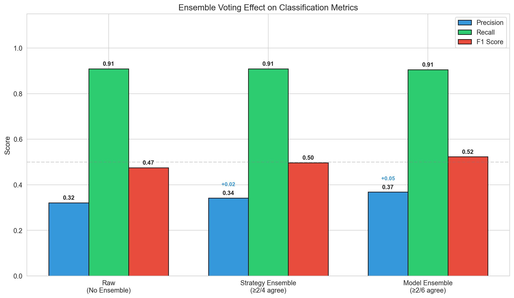

---

## 3. Comparative Analysis

### 3.1 Prompting Strategy Comparison

| Strategy | TP | FP | FN | Precision | Recall | F1 |
|----------|----|----|----|-----------| -------|-----|
| baseline | 1544 | 2592 | 169 | 0.373 | 0.901 | 0.528 |
| cot | 1644 | 3124 | 218 | 0.345 | 0.883 | 0.496 |
| socratic | 1874 | 5599 | 147 | 0.251 | 0.927 | 0.395 |
| taxonomy | 1683 | 2921 | 140 | 0.366 | 0.923 | 0.524 |

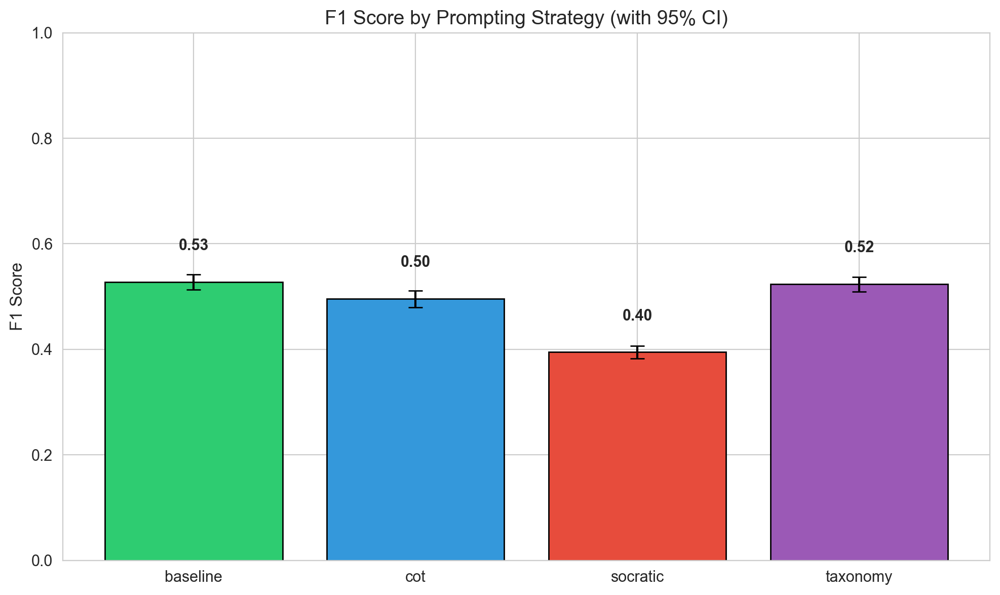

#### Statistical Significance (McNemar's Test)

| Comparison | χ² | p-value | Significant? |
|------------|-----|---------|--------------|
| baseline vs cot | 23.58 | 0.0000 | Yes |
| baseline vs socratic | 0.07 | 0.7915 | No |
| baseline vs taxonomy | 19.52 | 0.0000 | Yes |
| cot vs socratic | 16.16 | 0.0001 | Yes |
| cot vs taxonomy | 71.26 | 0.0000 | Yes |
| socratic vs taxonomy | 21.69 | 0.0000 | Yes |

#### Omnibus Test (Cochran's Q)

- **Q Statistic:** 57.59
- **p-value:** 0.000000
- **Conclusion:** Significant differences exist

### 3.2 Model Comparison

| Model | TP | FP | FN | Precision | Recall | F1 |
|-------|----|----|----|-----------|--------|-----|
| claude-haiku-4-5-20251001:reasoning | 1021 | 1154 | 128 | 0.469 | 0.889 | 0.614 |
| gpt-5.2-2025-12-11 | 1195 | 2166 | 102 | 0.356 | 0.921 | 0.513 |
| claude-haiku-4-5-20251001 | 1112 | 1993 | 172 | 0.358 | 0.866 | 0.507 |
| gpt-5.2-2025-12-11:reasoning | 1219 | 2303 | 88 | 0.346 | 0.933 | 0.505 |
| gemini-3-flash-preview:reasoning | 1096 | 3252 | 92 | 0.252 | 0.923 | 0.396 |
| gemini-3-flash-preview | 1102 | 3368 | 92 | 0.247 | 0.923 | 0.389 |

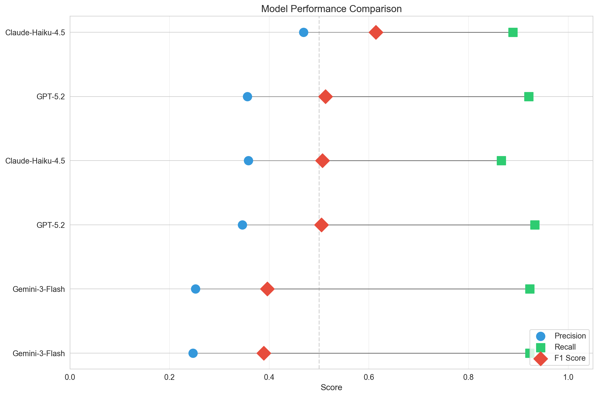

### 3.3 Strategy × Model Interaction

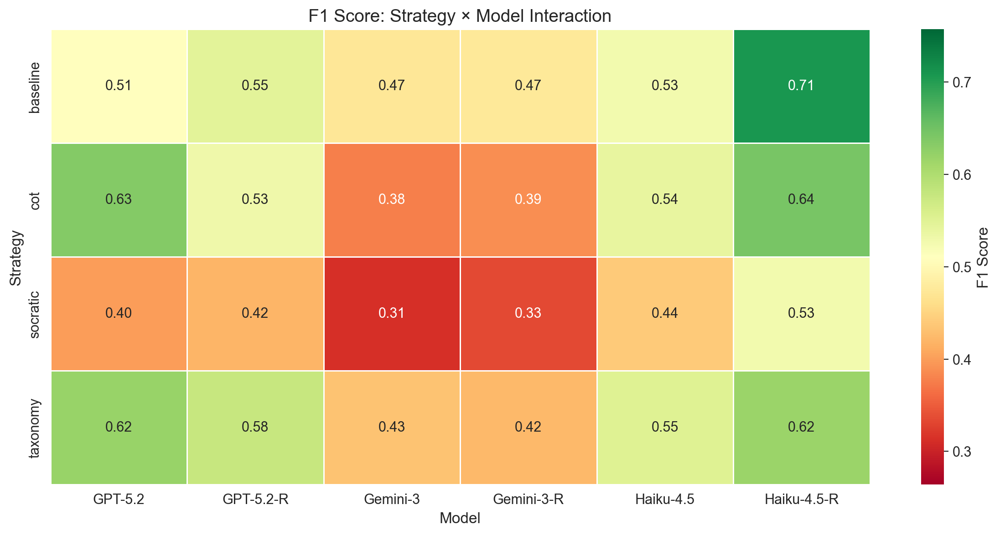

---

## 4. Assignment Complexity Gradient (RQ1)

> Does LLM performance vary with conceptual complexity?

| Assignment | Focus | TP | FP | FN | Precision | Recall | F1 |
|------------|-------|----|----|----|-----------|--------|-----|
| a1 | Variables/Math | 1796 | 6392 | 361 | 0.219 | 0.833 | 0.347 |
| a2 | Loops/Control | 2501 | 4989 | 273 | 0.334 | 0.902 | 0.487 |
| a3 | Arrays/Strings | 2448 | 2855 | 40 | 0.462 | 0.984 | 0.628 |

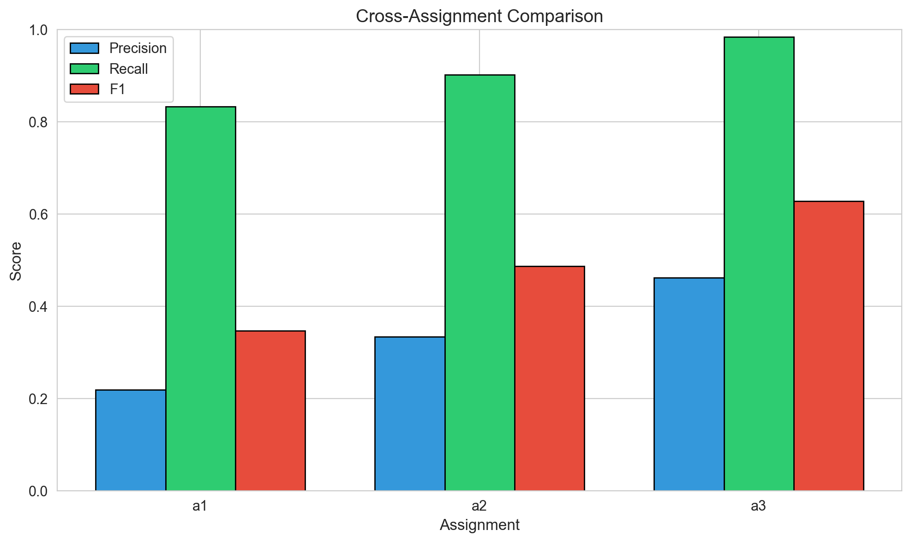

---

## 5. Error Analysis

### 5.1 False Positive Breakdown

| FP Type | Count | % of FPs | Description |
|---------|-------|----------|-------------|
| FP_CLEAN | 10,338 | 72.6% | Detected misconception in correct code |
| FP_WRONG | 1,182 | 8.3% | Detected wrong misconception (misclassification) |
| FP_HALLUCINATION | 2,716 | 19.1% | Invented non-existent misconception |

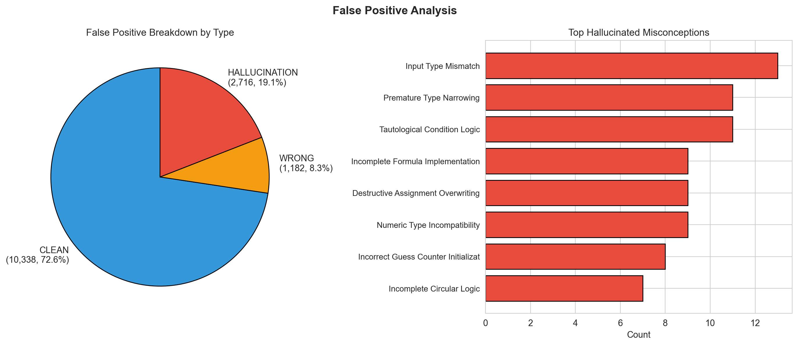

### 5.2 Detection Filtering Pipeline

| Stage | Count | % of Raw |
|-------|-------|----------|
| Raw Detections | 29,164 | 100% |
| Null-Template Filtered | 634 | 2.2% |
| Noise Floor Filtered (<0.55) | 219 | 0.8% |
| **Evaluated** | **28,311** | **97.1%** |

### 5.3 Confidence Calibration

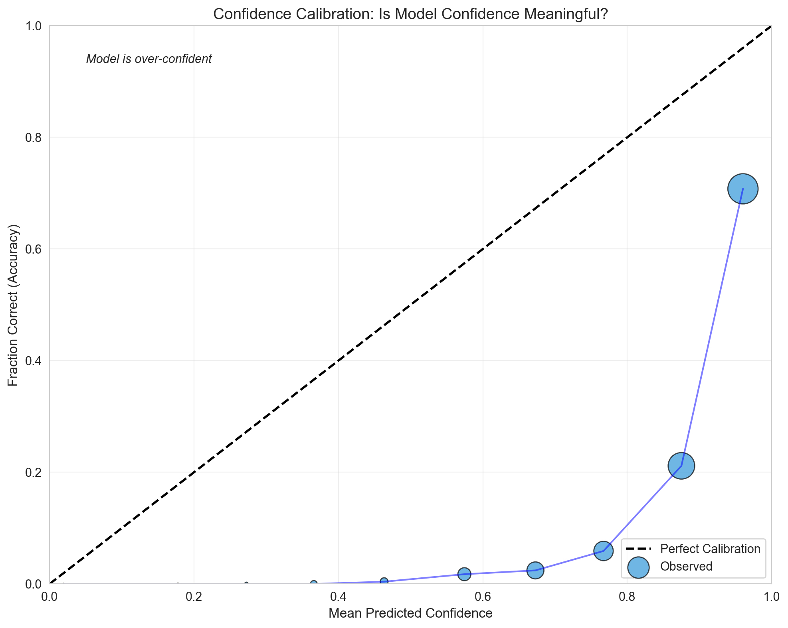

---

## 6. Methodology Notes

### 6.1 Semantic Matching
- **Embedding Model:** OpenAI `text-embedding-3-large`
- **Match Threshold:** Cosine similarity ≥ 0.65
- **Noise Floor:** Detections < 0.55 filtered as pedantic

### 6.2 Statistical Tests
- **Bootstrap CI:** 1000 resamples with replacement
- **McNemar's Test:** Paired comparison with continuity correction
- **Cochran's Q:** Omnibus test for k-related samples
- **Cliff's Delta:** Non-parametric effect size

### 6.3 Ensemble Methods
- **Strategy Ensemble:** ≥2/4 prompting strategies must agree
- **Model Ensemble:** ≥2/6 models must agree

---

## Appendix: Complete Data Tables

### A.1 Complete Per-Misconception Results

| ID | Name | Category | TP | FN | Recall |
|----|------|----------|----|----|--------|
| NM_LOGIC_02 | Dangling Else (Indentation Trap) | The Independent Switch | 46 | 241 | 0.160 |
| NM_TYP_02 | Narrowing Cast in Division | The Fluid Type Machine | 140 | 286 | 0.329 |
| NM_IO_01 | Prompt-Logic Mismatch | The Anthropomorphic I/O Machin | 53 | 10 | 0.841 |
| NM_STATE_01 | Spreadsheet View (Early Calculation) | The Reactive State Machine | 204 | 27 | 0.883 |
| NM_IO_02 | The Ghost Read | The Anthropomorphic I/O Machin | 400 | 23 | 0.946 |
| NM_FLOW_04 | Sabotaging the Future (Inner Loop Mod) | The Teleological Control Machi | 293 | 10 | 0.967 |
| NM_MEM_04 | The 1-Based Offset (OOB) | The Human Index Machine | 818 | 23 | 0.973 |
| NM_TYP_01 | Integer Division Blindness | The Fluid Type Machine | 381 | 8 | 0.979 |
| NM_MEM_05 | Lossy Swap (Data Destruction) | The Semantic Bond Machine | 241 | 4 | 0.984 |
| NM_SYN_02 | Precedence Blindness | The Algebraic Syntax Machine | 324 | 5 | 0.985 |
| NM_FLOW_02 | The Intent Loop (Off-by-One) | The Teleological Control Machi | 629 | 9 | 0.986 |
| NM_FLOW_03 | Infinite Loop (State Stagnation) | The Teleological Control Machi | 778 | 9 | 0.989 |
| NM_MEM_03 | String Identity Trap (Immutability) | The Mutable String Machine | 709 | 7 | 0.990 |
| NM_MEM_01 | Parallel Array Desync | The Semantic Bond Machine | 680 | 6 | 0.991 |
| NM_LOGIC_01 | Mutually Exclusive Fallacy | The Independent Switch | 369 | 3 | 0.992 |
| NM_SYN_01 | XOR as Power | The Algebraic Syntax Machine | 120 | 1 | 0.992 |
| NM_API_01 | The Void Assumption | The Void Machine | 174 | 1 | 0.994 |
| NM_FLOW_01 | Accumulator Amnesia (Scope Error) | The Teleological Control Machi | 386 | 1 | 0.997 |
