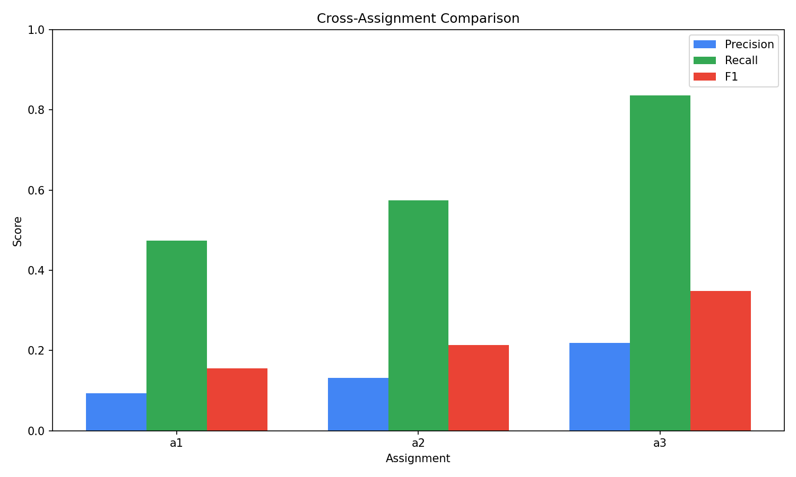
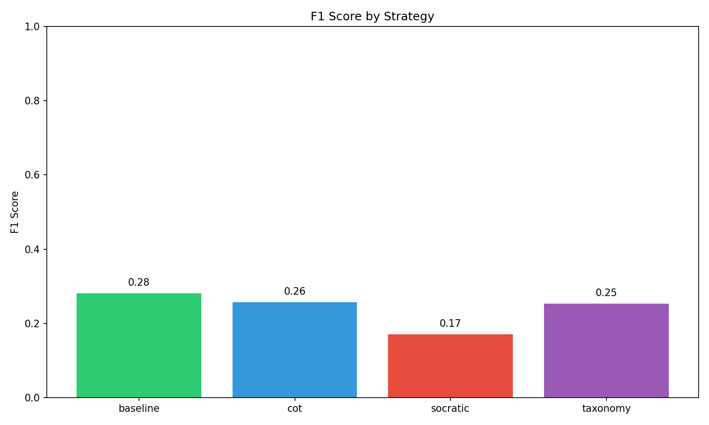
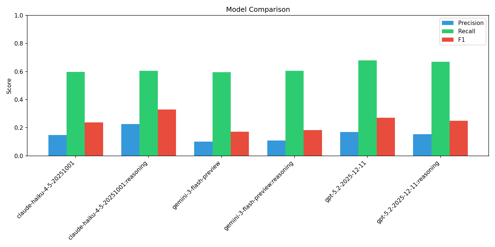
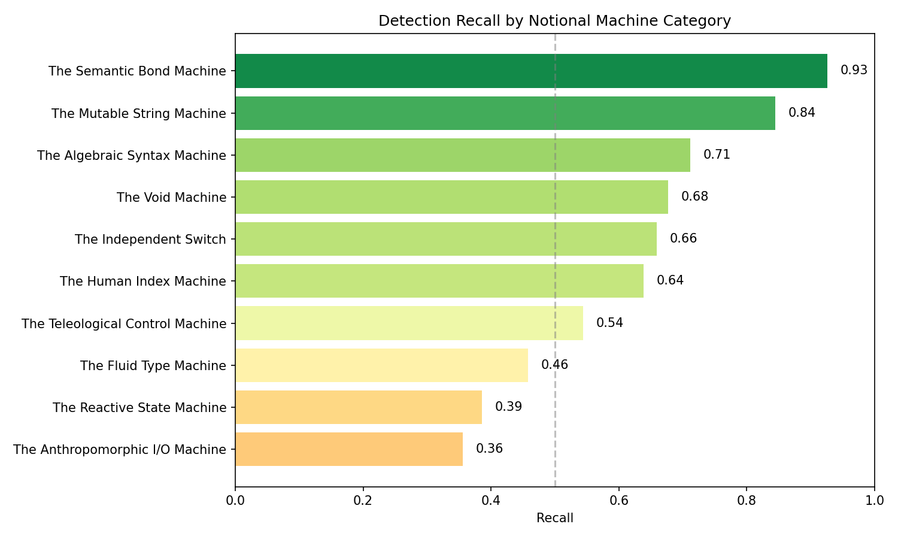
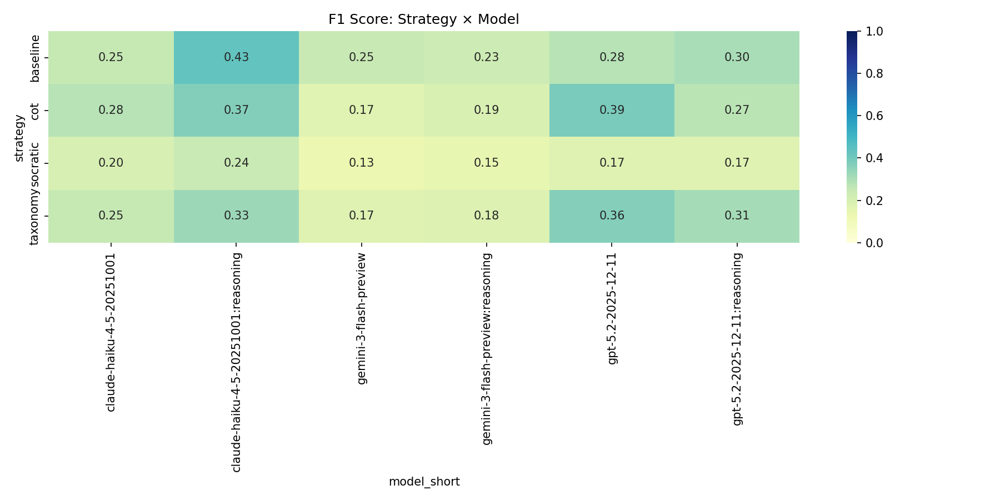
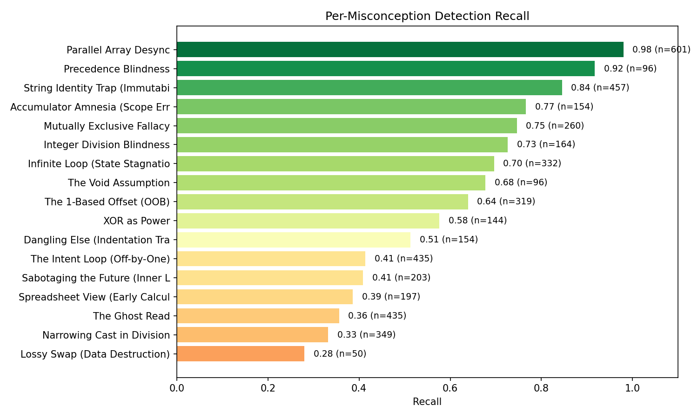
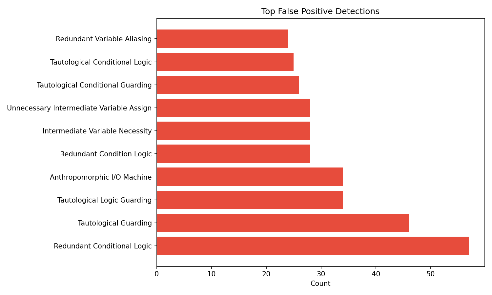

# Multi-Assignment LLM Misconception Detection Report
_Generated: 2025-12-21T08:28:58.429816+00:00_

## Dataset Summary
- **Total Students:** 300
- **Assignments:** a1, a2, a3
- **Match Mode:** all
- **Seeds:** 1765081374,1765128549,1765142264

## Overall Metrics
| Metric | Value |
|--------|-------|
| True Positives | 2780 |
| False Positives | 16906 |
| False Negatives | 1666 |
| **Precision** | **0.141** |
| **Recall** | **0.625** |
| **F1 Score** | **0.230** |

## Cross-Assignment Comparison
| Assignment | TP | FP | FN | Precision | Recall | F1 |
|------------|----|----|----|-----------| -------|-----|
| a1 | 702 | 6818 | 779 | 0.093 | 0.474 | 0.156 |
| a2 | 885 | 5845 | 653 | 0.132 | 0.575 | 0.214 |
| a3 | 1193 | 4243 | 234 | 0.219 | 0.836 | 0.348 |

## Performance by Strategy
| Strategy | TP | FP | FN | Precision | Recall | F1 |
|----------|----|----|----|-----------| -------|-----|
| baseline | 678 | 3060 | 412 | 0.181 | 0.622 | 0.281 |
| cot | 706 | 3672 | 414 | 0.161 | 0.630 | 0.257 |
| socratic | 734 | 6682 | 413 | 0.099 | 0.640 | 0.171 |
| taxonomy | 662 | 3492 | 427 | 0.159 | 0.608 | 0.253 |

## Performance by Model
| Model | TP | FP | FN | Precision | Recall | F1 |
|-------|----|----|----|-----------|--------|-----|
| claude-haiku-4-5-20251001 | 457 | 2637 | 308 | 0.148 | 0.597 | 0.237 |
| claude-haiku-4-5-20251001:reasoning | 438 | 1494 | 285 | 0.227 | 0.606 | 0.330 |
| gemini-3-flash-preview | 434 | 3876 | 296 | 0.101 | 0.595 | 0.172 |
| gemini-3-flash-preview:reasoning | 442 | 3644 | 289 | 0.108 | 0.605 | 0.184 |
| gpt-5.2-2025-12-11 | 512 | 2516 | 242 | 0.169 | 0.679 | 0.271 |
| gpt-5.2-2025-12-11:reasoning | 497 | 2739 | 246 | 0.154 | 0.669 | 0.250 |

## Notional Machine Category Detection (RQ2)

> This table shows which mental model categories are easier/harder for LLMs to detect.

| Category | Recall | N |
|----------|--------|---|
|  | 0.000 | 0 |
| The Anthropomorphic I/O Machine | 0.356 | 435 |
| The Reactive State Machine | 0.386 | 197 |
| The Fluid Type Machine | 0.458 | 513 |
| The Teleological Control Machine | 0.544 | 1124 |
| The Human Index Machine | 0.639 | 319 |
| The Independent Switch | 0.659 | 414 |
| The Void Machine | 0.677 | 96 |
| The Algebraic Syntax Machine | 0.712 | 240 |
| The Mutable String Machine | 0.845 | 457 |
| The Semantic Bond Machine | 0.926 | 651 |

## Strategy × Model Heatmap

## Per-Misconception Detection Rates
| ID | Name | Category | Recall | N |
|----|------|----------|--------|---|
| NM_MEM_05 | Lossy Swap (Data Destruction) | The Semantic Bond Machine | 0.28 | 50 |
| NM_TYP_02 | Narrowing Cast in Division | The Fluid Type Machine | 0.33 | 349 |
| NM_IO_02 | The Ghost Read | The Anthropomorphic I/O M | 0.36 | 435 |
| NM_STATE_01 | Spreadsheet View (Early Calculation | The Reactive State Machin | 0.39 | 197 |
| NM_FLOW_04 | Sabotaging the Future (Inner Loop M | The Teleological Control  | 0.41 | 203 |
| NM_FLOW_02 | The Intent Loop (Off-by-One) | The Teleological Control  | 0.41 | 435 |
| NM_LOGIC_02 | Dangling Else (Indentation Trap) | The Independent Switch | 0.51 | 154 |
| NM_SYN_01 | XOR as Power | The Algebraic Syntax Mach | 0.58 | 144 |
| NM_MEM_04 | The 1-Based Offset (OOB) | The Human Index Machine | 0.64 | 319 |
| NM_API_01 | The Void Assumption | The Void Machine | 0.68 | 96 |
| NM_FLOW_03 | Infinite Loop (State Stagnation) | The Teleological Control  | 0.70 | 332 |
| NM_TYP_01 | Integer Division Blindness | The Fluid Type Machine | 0.73 | 164 |
| NM_LOGIC_01 | Mutually Exclusive Fallacy | The Independent Switch | 0.75 | 260 |
| NM_FLOW_01 | Accumulator Amnesia (Scope Error) | The Teleological Control  | 0.77 | 154 |
| NM_MEM_03 | String Identity Trap (Immutability) | The Mutable String Machin | 0.84 | 457 |
| NM_SYN_02 | Precedence Blindness | The Algebraic Syntax Mach | 0.92 | 96 |
| NM_MEM_01 | Parallel Array Desync | The Semantic Bond Machine | 0.98 | 601 |

## False Positive Analysis

