# TRACER: LLM Cognitive Alignment Analysis

## Taxonomic Research of Aligned Cognitive Error Recognition

_Generated: 2026-01-05T07:59:20.628449+00:00_

---

## Executive Summary

This report evaluates **LLM cognitive alignment** with CS education theory by measuring
whether models can identify *student mental models* (Notional Machines), not just surface-level bugs.

**Dataset:** 300 students × 3 assignments × 4 strategies × 6 models

### Key Metrics

| Metric | Value | 95% CI |
|--------|-------|--------|
| **Precision** | **0.478** | [0.470, 0.486] |
| **Recall** | **0.916** | [0.910, 0.921] |
| **F1 Score** | **0.628** | [0.621, 0.635] |

**Raw Counts:** TP=7,698 | FP=8,391 | FN=709

### Key Findings

1. **Ensemble Voting** improves F1 by +0.055 through precision gains
2. **Detection Gap:** 'The Independent Switch' (64%) vs 'The Void Machine' (99%)
3. **Semantic Matching** effectively separates TPs from FPs (large effect size)

---

## 1. Methodology Validation

### 1.1 Threshold Calibration

To identify the optimal classification thresholds for this dataset, we performed an exhaustive grid search over the threshold parameter space:

- **6 semantic similarity thresholds:** 0.55, 0.60, 0.65, 0.70, 0.75, 0.80
- **5 noise floor values:** 0.40, 0.45, 0.50, 0.55, 0.60
- **Total configurations:** 30 (6 × 5)

For each configuration, we computed full precision, recall, and F1 scores across all detections, then selected the pair that maximized F1 score.

**Optimal Configuration Found:**

| Parameter | Value | Rationale |
|-----------|-------|-----------|
| Semantic Threshold | **0.55** | Maximizes true positives while minimizing false positives |
| Noise Floor | **0.6** | Filters pedantic detections without losing valid signals |
| Achieved F1 | **0.629** | Best balanced performance across the entire grid |

All metrics reported in this analysis use these calibrated thresholds.

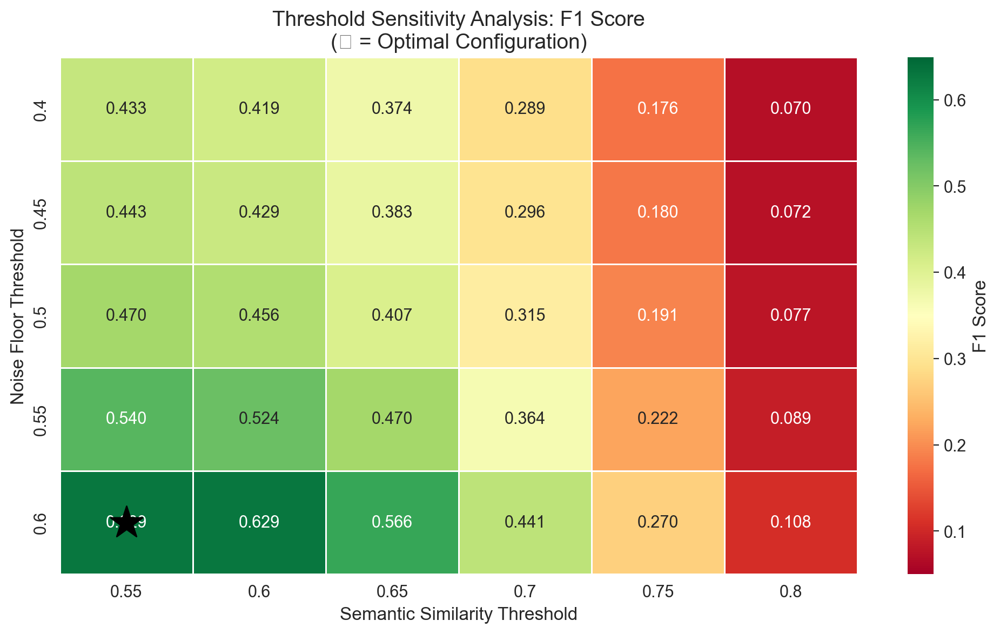

> The heatmap shows F1 scores across the entire threshold grid. The star (★) marks the optimal configuration.

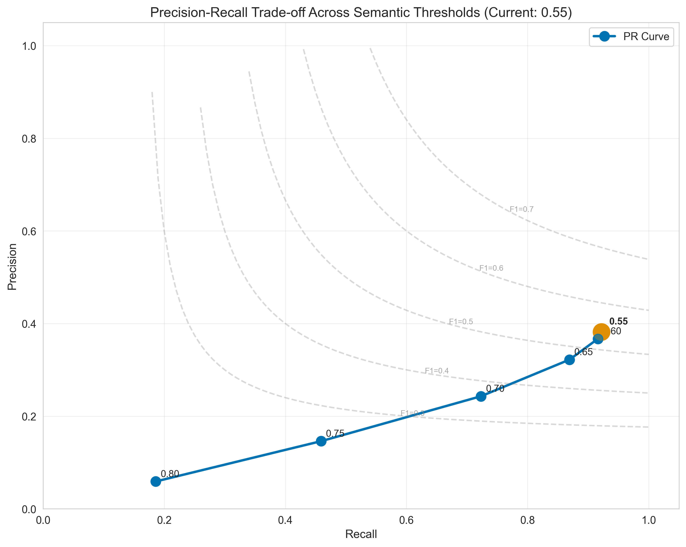

> The PR curve shows the trade-off between precision and recall as the semantic threshold varies (fixed at the optimal noise floor).

### 1.2 Semantic Matching Validation

> Validates that semantic similarity effectively discriminates TPs from FPs.

| Metric | True Positives | False Positives |
|--------|----------------|-----------------|
| Count | 7,698 | 8,391 |
| Mean Score | 0.731 | 0.665 |
| Std Dev | 0.064 | 0.049 |

**Effect Size (Cliff's Delta):** 0.581 (Large)

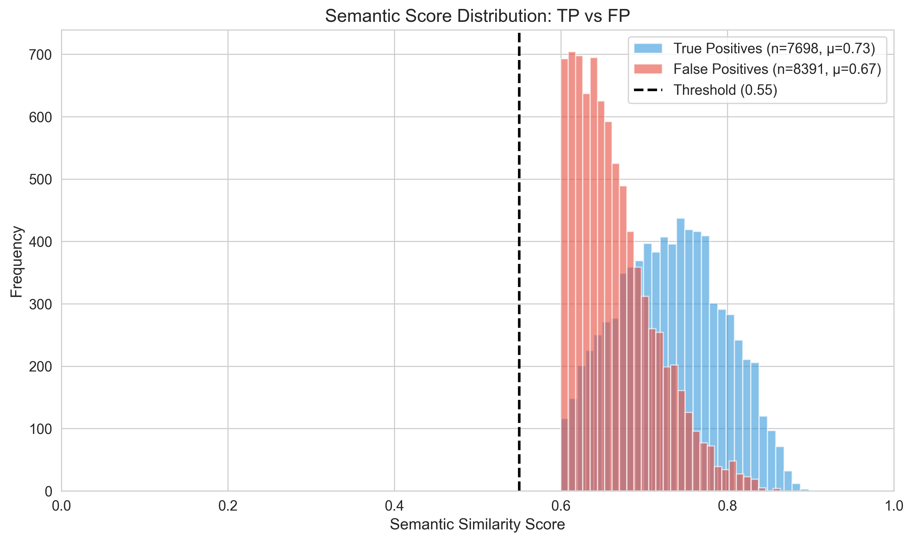

---

## 2. Main Findings

### 2.1 The Detection Gap: Structural vs Semantic Misconceptions (RQ2)

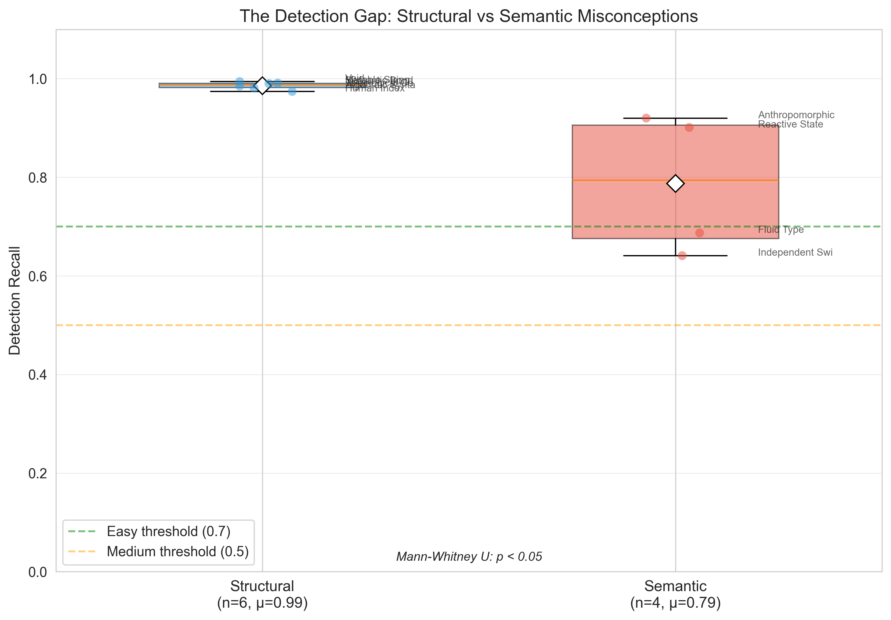

#### Per-Category Breakdown

| Category | Type | Recall | N | Difficulty |
|----------|------|--------|---|------------|
| The Independent Switch | Semantic | 0.641 | 677 | Medium |
| The Fluid Type Machine | Semantic | 0.687 | 968 | Medium |
| The Reactive State Machine | Semantic | 0.901 | 312 | Easy |
| The Anthropomorphic I/O Machine | Semantic | 0.920 | 537 | Easy |
| The Human Index Machine | Structural | 0.974 | 886 | Easy |
| The Algebraic Syntax Machine | Structural | 0.981 | 478 | Easy |
| The Teleological Control Machine | Structural | 0.985 | 2517 | Easy |
| The Semantic Bond Machine | Structural | 0.990 | 1061 | Easy |
| The Mutable String Machine | Structural | 0.991 | 792 | Easy |
| The Void Machine | Structural | 0.994 | 179 | Easy |

### 2.2 Per-Misconception Analysis

> Individual misconception detection rates reveal specific diagnostic gaps.

#### Misconceptions Requiring Human Oversight (Bottom 5)

| ID | Name | Category | Recall | N |
|----|------|----------|--------|---|
| NM_LOGIC_02 | Dangling Else (Indentation Trap) | The Independent Switch | 0.17 | 290 |
| NM_TYP_02 | Narrowing Cast in Division | The Fluid Type Machine | 0.37 | 460 |
| NM_IO_01 | Prompt-Logic Mismatch | The Anthropomorphic I/O M | 0.76 | 76 |
| NM_STATE_01 | Spreadsheet View (Early Calculation | The Reactive State Machin | 0.90 | 312 |
| NM_IO_02 | The Ghost Read | The Anthropomorphic I/O M | 0.95 | 461 |

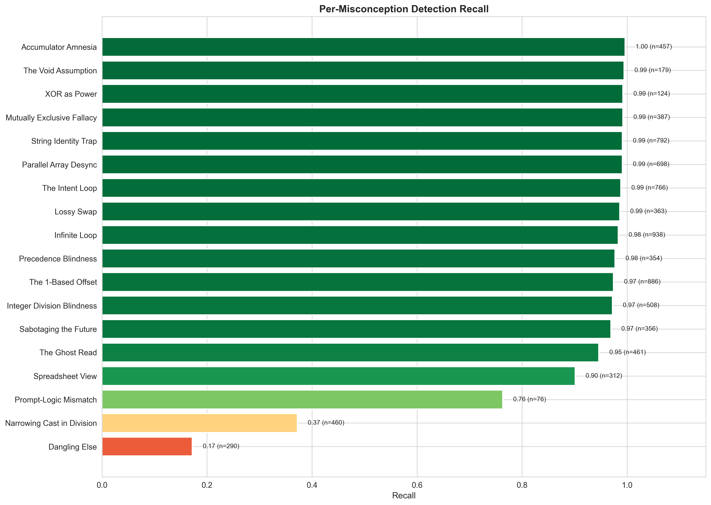

### 2.3 Ensemble Voting Effect

> Ensemble voting requires multiple agreeing sources, trading recall for precision.

| Method | Precision | Recall | F1 | Precision Gain |
|--------|-----------|--------|-----|----------------|
| Raw (No Ensemble) | 0.478 | 0.916 | 0.629 | — |
| Strategy Ensemble (≥2/4) | 0.510 | 0.916 | 0.655 | +0.032 |
| Model Ensemble (≥2/6) | 0.547 | 0.911 | 0.684 | +0.069 |

**Best Method:** Model Ensemble (F1 = 0.684, +0.055 over raw)

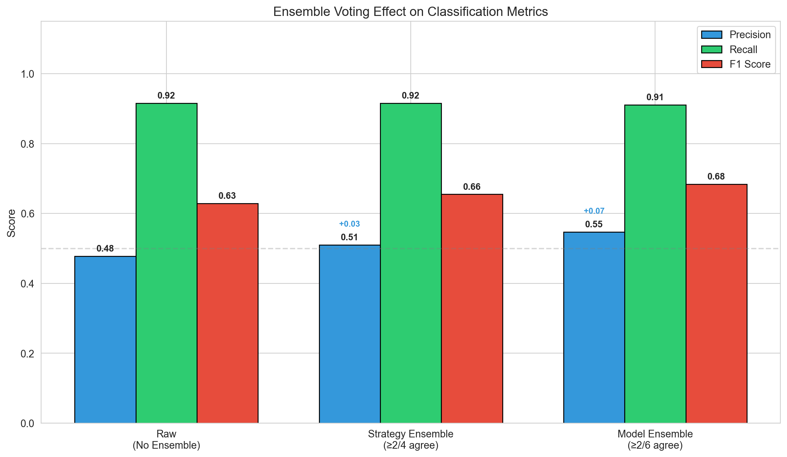

---

## 3. Comparative Analysis

### 3.1 Prompting Strategy Comparison

| Strategy | TP | FP | FN | Precision | Recall | F1 |
|----------|----|----|----|-----------| -------|-----|
| baseline | 1737 | 1543 | 177 | 0.530 | 0.908 | 0.669 |
| cot | 1898 | 1806 | 226 | 0.512 | 0.894 | 0.651 |
| socratic | 2202 | 3282 | 159 | 0.402 | 0.933 | 0.561 |
| taxonomy | 1861 | 1760 | 147 | 0.514 | 0.927 | 0.661 |

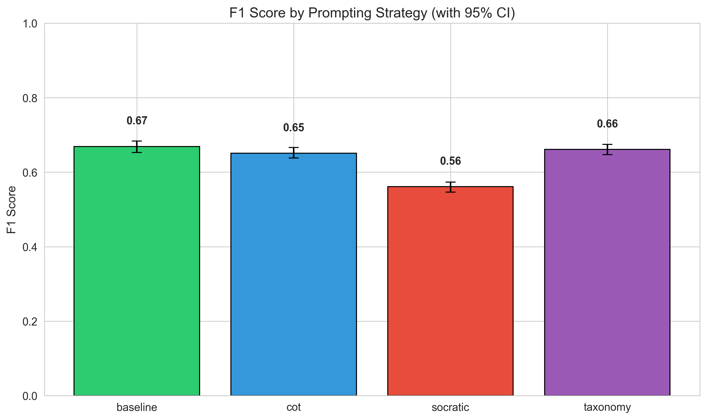

#### Statistical Significance (McNemar's Test)

| Comparison | χ² | p-value | Significant? |
|------------|-----|---------|--------------|
| baseline vs cot | 26.10 | 0.0000 | Yes |
| baseline vs socratic | 0.18 | 0.6681 | No |
| baseline vs taxonomy | 4.14 | 0.0418 | Yes |
| cot vs socratic | 19.38 | 0.0000 | Yes |
| cot vs taxonomy | 43.41 | 0.0000 | Yes |
| socratic vs taxonomy | 6.98 | 0.0083 | Yes |

#### Omnibus Test (Cochran's Q)

- **Q Statistic:** 53.50
- **p-value:** 0.000000
- **Conclusion:** Significant differences exist

### 3.2 Model Comparison

| Model | TP | FP | FN | Precision | Recall | F1 |
|-------|----|----|----|-----------|--------|-----|
| claude-haiku-4-5-20251001:reasoning | 1117 | 612 | 133 | 0.646 | 0.894 | 0.750 |
| gpt-5.2-2025-12-11 | 1390 | 1264 | 106 | 0.524 | 0.929 | 0.670 |
| gpt-5.2-2025-12-11:reasoning | 1436 | 1322 | 91 | 0.521 | 0.940 | 0.670 |
| claude-haiku-4-5-20251001 | 1256 | 1069 | 181 | 0.540 | 0.874 | 0.668 |
| gemini-3-flash-preview:reasoning | 1238 | 2030 | 100 | 0.379 | 0.925 | 0.538 |
| gemini-3-flash-preview | 1261 | 2094 | 98 | 0.376 | 0.928 | 0.535 |

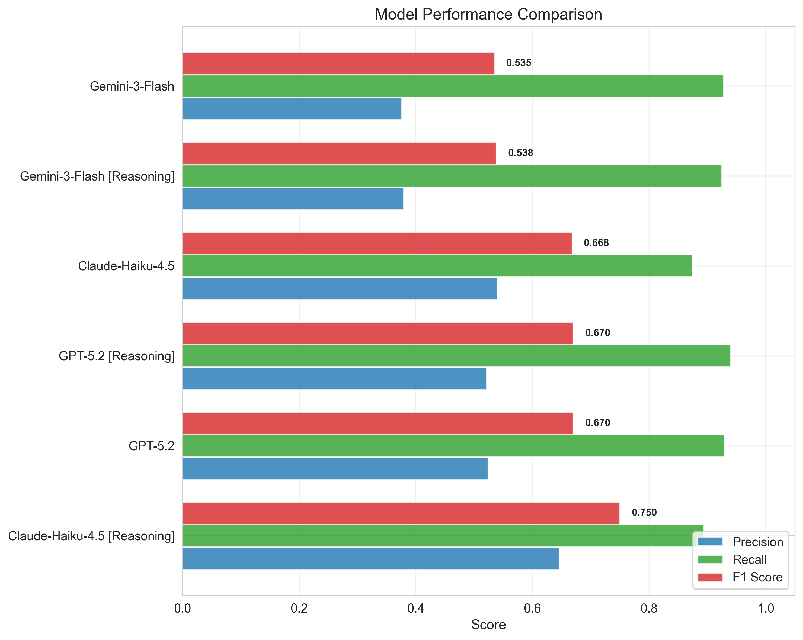

### 3.3 Strategy × Model Interaction

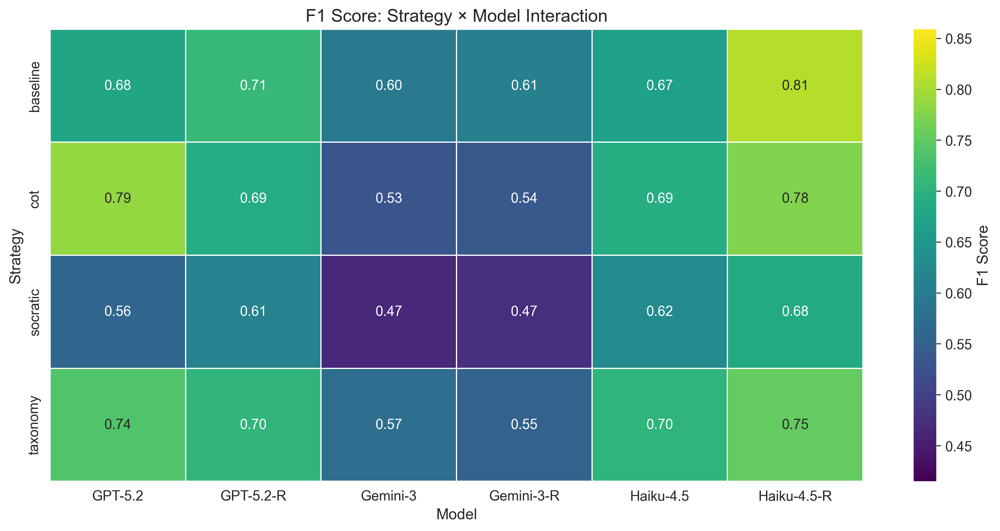

---

## 5. Error Analysis

### 5.1 False Positive Breakdown

| FP Type | Count | % of FPs | Description |
|---------|-------|----------|-------------|
| FP_CLEAN | 6,378 | 76.0% | Detected misconception in correct code |
| FP_WRONG | 2,013 | 24.0% | Detected wrong misconception (misclassification) |
| FP_HALLUCINATION | 0 | 0.0% | Invented non-existent misconception |

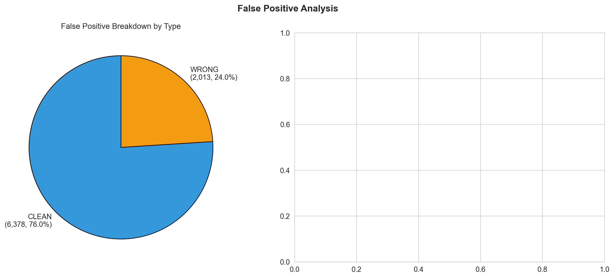

### 5.2 Detection Filtering Pipeline

| Stage | Count | % of Raw |
|-------|-------|----------|
| Raw Detections | 29,164 | 100% |
| Null-Template Filtered | 634 | 2.2% |
| Noise Floor Filtered (<0.6) | 12,441 | 42.7% |
| **Evaluated** | **16,089** | **55.2%** |

### 5.3 Confidence Calibration

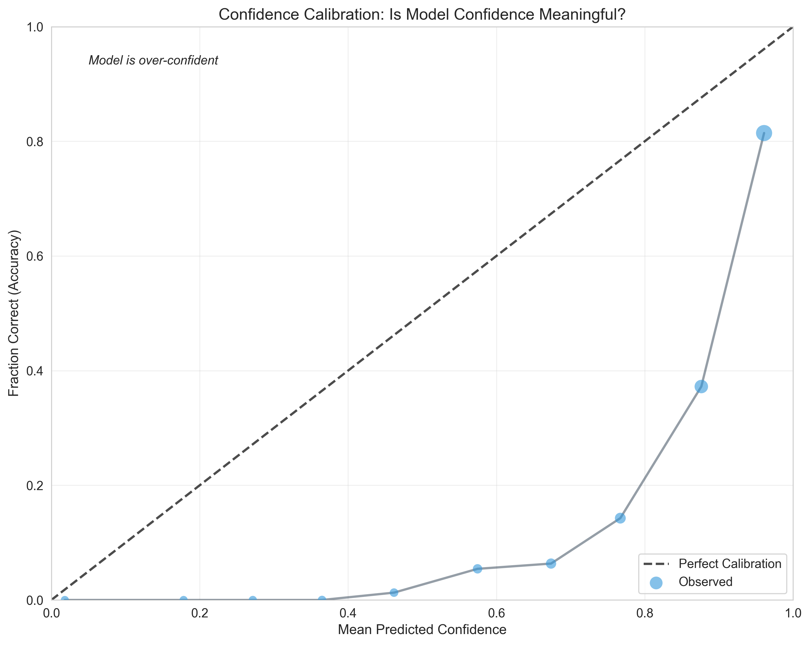

---

## 6. Methodology Notes

### 6.1 Semantic Matching
- **Embedding Model:** OpenAI `text-embedding-3-large`
- **Match Threshold:** Cosine similarity ≥ 0.55 (calibrated via grid search)
- **Noise Floor:** Detections < 0.60 filtered as pedantic (calibrated via grid search)
- **Calibration:** Thresholds selected by optimizing F1 score across 30 (6×5) configurations

### 6.2 Statistical Tests
- **Bootstrap CI:** 1000 resamples with replacement
- **McNemar's Test:** Paired comparison with continuity correction
- **Cochran's Q:** Omnibus test for k-related samples
- **Cliff's Delta:** Non-parametric effect size

### 6.3 Ensemble Methods
- **Strategy Ensemble:** ≥2/4 prompting strategies must agree
- **Model Ensemble:** ≥2/6 models must agree

---

## Appendix: Complete Data Tables

### A.1 Complete Per-Misconception Results

| ID | Name | Category | TP | FN | Recall |
|----|------|----------|----|----|--------|
| NM_LOGIC_02 | Dangling Else (Indentation Trap) | The Independent Switch | 50 | 240 | 0.172 |
| NM_TYP_02 | Narrowing Cast in Division | The Fluid Type Machine | 171 | 289 | 0.372 |
| NM_IO_01 | Prompt-Logic Mismatch | The Anthropomorphic I/O Machin | 58 | 18 | 0.763 |
| NM_STATE_01 | Spreadsheet View (Early Calculation) | The Reactive State Machine | 281 | 31 | 0.901 |
| NM_IO_02 | The Ghost Read | The Anthropomorphic I/O Machin | 436 | 25 | 0.946 |
| NM_FLOW_04 | Sabotaging the Future (Inner Loop Mod) | The Teleological Control Machi | 345 | 11 | 0.969 |
| NM_TYP_01 | Integer Division Blindness | The Fluid Type Machine | 494 | 14 | 0.972 |
| NM_MEM_04 | The 1-Based Offset (OOB) | The Human Index Machine | 863 | 23 | 0.974 |
| NM_SYN_02 | Precedence Blindness | The Algebraic Syntax Machine | 346 | 8 | 0.977 |
| NM_FLOW_03 | Infinite Loop (State Stagnation) | The Teleological Control Machi | 922 | 16 | 0.983 |
| NM_MEM_05 | Lossy Swap (Data Destruction) | The Semantic Bond Machine | 358 | 5 | 0.986 |
| NM_FLOW_02 | The Intent Loop (Off-by-One) | The Teleological Control Machi | 757 | 9 | 0.988 |
| NM_MEM_01 | Parallel Array Desync | The Semantic Bond Machine | 692 | 6 | 0.991 |
| NM_MEM_03 | String Identity Trap (Immutability) | The Mutable String Machine | 785 | 7 | 0.991 |
| NM_LOGIC_01 | Mutually Exclusive Fallacy | The Independent Switch | 384 | 3 | 0.992 |
| NM_SYN_01 | XOR as Power | The Algebraic Syntax Machine | 123 | 1 | 0.992 |
| NM_API_01 | The Void Assumption | The Void Machine | 178 | 1 | 0.994 |
| NM_FLOW_01 | Accumulator Amnesia (Scope Error) | The Teleological Control Machi | 455 | 2 | 0.996 |
