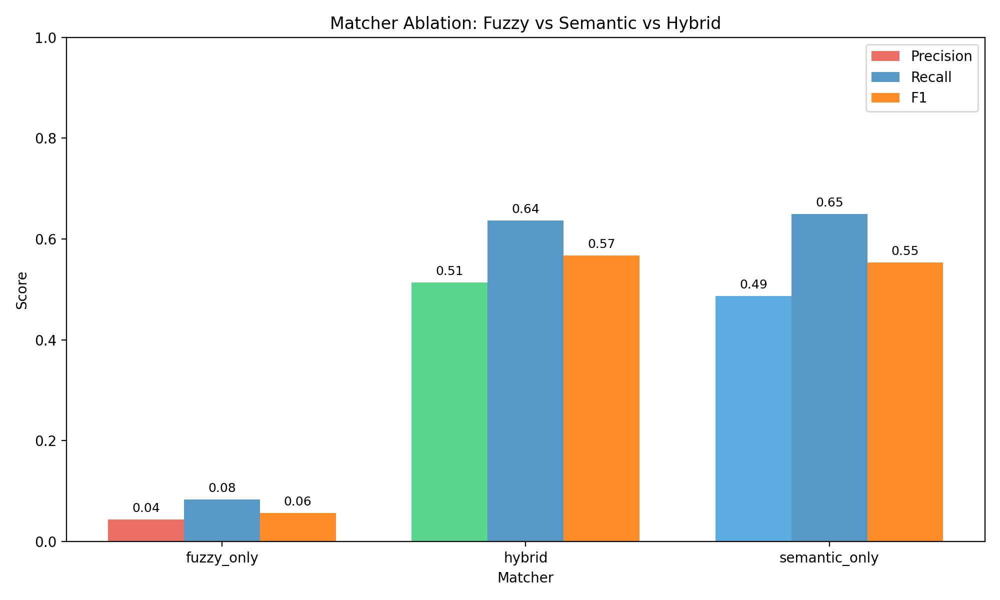
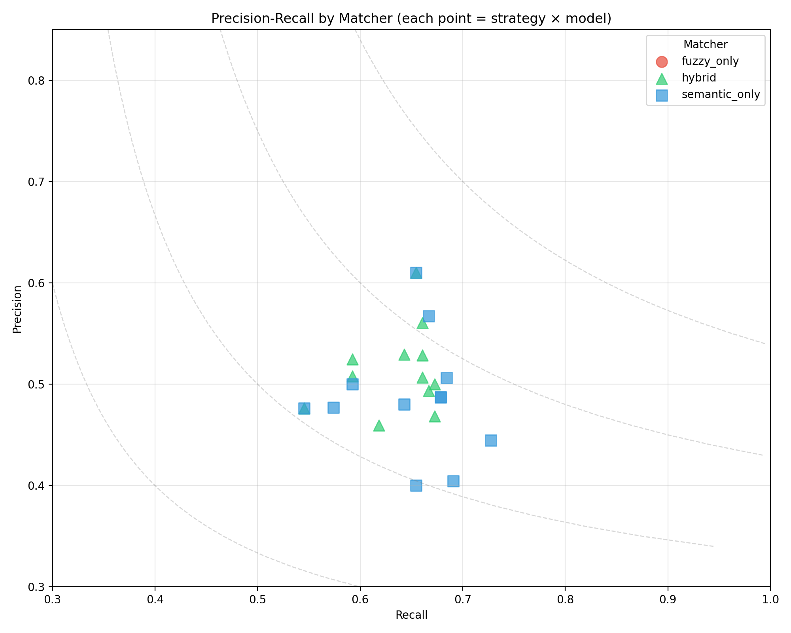
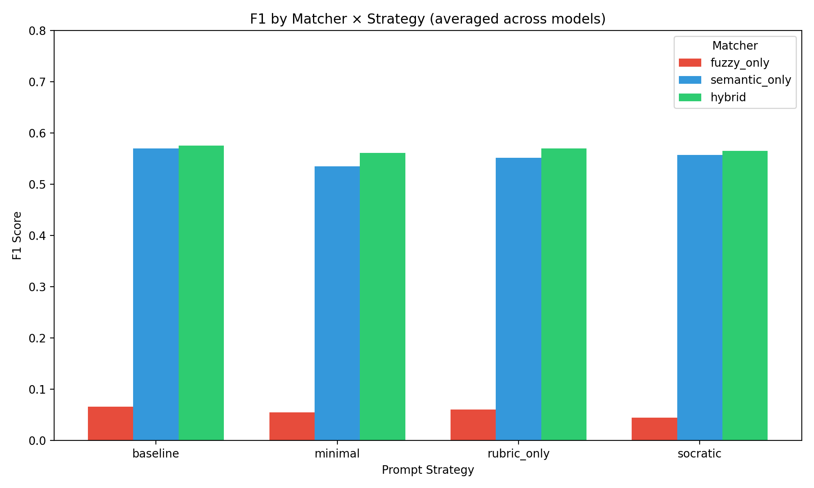
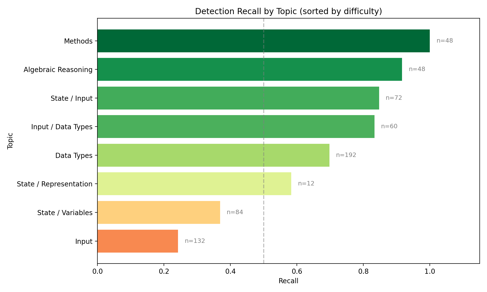
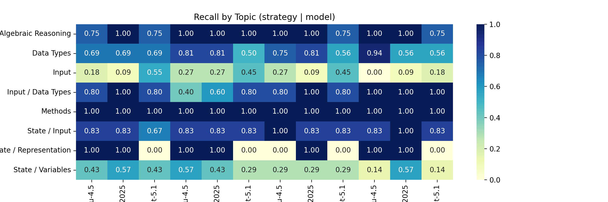
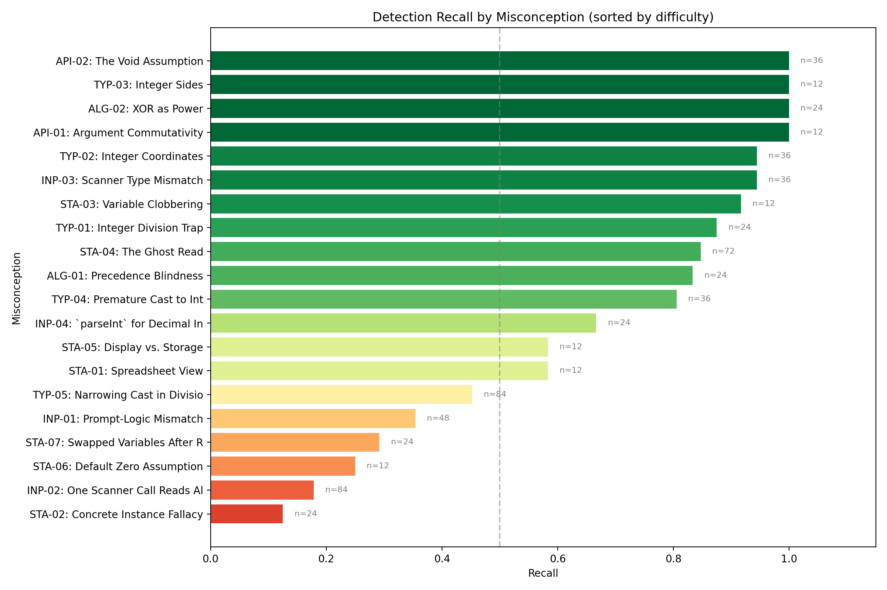
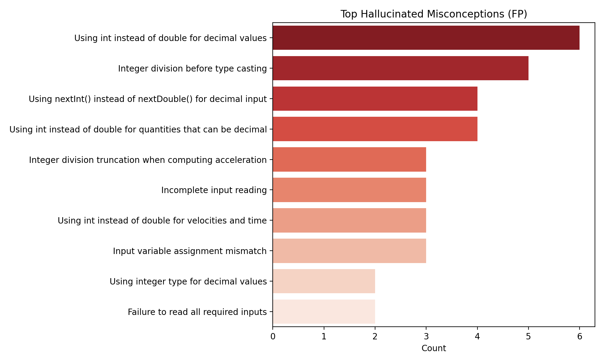

# LLM Misconception Detection: Analysis Report
_Generated: 2025-12-05T03:46:22.175951+00:00_

## Dataset & Run Configuration

### Dataset Summary
- **Assignment:** A2 – Kinematics & Geometry (CS1)
- **Students:** 60
- **Questions:** 4 (Q1, Q2, Q3, Q4)
- **Total files:** 240
- **Seeded files:** 54 (22.5%)
- **Clean files:** 186 (77.5%)
- **Detection opportunities:** 648

### Run Configuration
- **Generation seed:** 1764930900
- **Generation model:** gpt-5.1-2025-11-13
- **Match mode:** all (ablation)
- **Embedding model:** text-embedding-3-large (OpenAI)
- **Detection models:** GPT-5.1, Gemini-2.5-Flash-Preview, Haiku-4.5
- **Strategies:** baseline, minimal, rubric_only, socratic

## Executive Highlights
- **Matcher Ablation Study**: Comparing fuzzy_only, semantic_only, and hybrid matchers.
- Bootstrap CIs included for statistical rigor.
- Same detection data, different matching strategies.

## Matcher Ablation: Fuzzy vs Semantic vs Hybrid

### Summary (averaged across strategies and models)
| Matcher | Total TP | Total FP | Total FN | Avg Precision | Avg Recall | Avg F1 |
|---------|----------|----------|----------|---------------|------------|--------|
| fuzzy_only | 54 | 1187 | 594 | 0.044 | 0.083 | 0.056 |
| hybrid | 423 | 404 | 241 | 0.514 | 0.637 | 0.568 |
| semantic_only | 432 | 468 | 233 | 0.487 | 0.649 | 0.553 |

### Precision-Recall by Matcher

### Matcher × Strategy Distribution

### Full Results Table
| Matcher | Strategy | Model | TP | FP | FN | Precision | Recall | F1 | CI (F1) |
|---------|----------|-------|----|----|----|-----------|--------|----|---------|
| fuzzy_only | baseline | claude-haiku-4.5 | 7 | 115 | 47 | 0.057 | 0.130 | 0.080 | 0.02–0.13 |
| fuzzy_only | baseline | gemini-2.5-flash-preview-09-2025 | 7 | 105 | 47 | 0.062 | 0.130 | 0.084 | 0.04–0.14 |
| fuzzy_only | baseline | gpt-5.1 | 2 | 61 | 52 | 0.032 | 0.037 | 0.034 | 0.00–0.09 |
| fuzzy_only | minimal | claude-haiku-4.5 | 6 | 116 | 48 | 0.049 | 0.111 | 0.068 | 0.02–0.13 |
| fuzzy_only | minimal | gemini-2.5-flash-preview-09-2025 | 6 | 190 | 48 | 0.031 | 0.111 | 0.048 | 0.02–0.08 |
| fuzzy_only | minimal | gpt-5.1 | 3 | 69 | 51 | 0.042 | 0.056 | 0.048 | 0.00–0.10 |
| fuzzy_only | rubric_only | claude-haiku-4.5 | 7 | 86 | 47 | 0.075 | 0.130 | 0.095 | 0.03–0.17 |
| fuzzy_only | rubric_only | gemini-2.5-flash-preview-09-2025 | 5 | 126 | 49 | 0.038 | 0.093 | 0.054 | 0.01–0.10 |
| fuzzy_only | rubric_only | gpt-5.1 | 2 | 69 | 52 | 0.028 | 0.037 | 0.032 | 0.00–0.08 |
| fuzzy_only | socratic | claude-haiku-4.5 | 6 | 67 | 48 | 0.082 | 0.111 | 0.094 | 0.03–0.17 |
| fuzzy_only | socratic | gemini-2.5-flash-preview-09-2025 | 2 | 116 | 52 | 0.017 | 0.037 | 0.023 | 0.00–0.06 |
| fuzzy_only | socratic | gpt-5.1 | 1 | 67 | 53 | 0.015 | 0.019 | 0.016 | 0.00–0.05 |
| hybrid | baseline | claude-haiku-4.5 | 34 | 40 | 21 | 0.459 | 0.618 | 0.527 | 0.42–0.64 |
| hybrid | baseline | gemini-2.5-flash-preview-09-2025 | 38 | 39 | 19 | 0.494 | 0.667 | 0.567 | 0.45–0.67 |
| hybrid | baseline | gpt-5.1 | 36 | 23 | 19 | 0.610 | 0.655 | 0.632 | 0.52–0.73 |
| hybrid | minimal | claude-haiku-4.5 | 37 | 37 | 18 | 0.500 | 0.673 | 0.574 | 0.47–0.67 |
| hybrid | minimal | gemini-2.5-flash-preview-09-2025 | 37 | 42 | 18 | 0.468 | 0.673 | 0.552 | 0.44–0.66 |
| hybrid | minimal | gpt-5.1 | 32 | 29 | 22 | 0.525 | 0.593 | 0.557 | 0.44–0.68 |
| hybrid | rubric_only | claude-haiku-4.5 | 37 | 33 | 19 | 0.529 | 0.661 | 0.587 | 0.49–0.71 |
| hybrid | rubric_only | gemini-2.5-flash-preview-09-2025 | 37 | 36 | 19 | 0.507 | 0.661 | 0.574 | 0.46–0.68 |
| hybrid | rubric_only | gpt-5.1 | 32 | 31 | 22 | 0.508 | 0.593 | 0.547 | 0.42–0.65 |
| hybrid | socratic | claude-haiku-4.5 | 37 | 29 | 19 | 0.561 | 0.661 | 0.607 | 0.50–0.70 |
| hybrid | socratic | gemini-2.5-flash-preview-09-2025 | 36 | 32 | 20 | 0.529 | 0.643 | 0.581 | 0.46–0.70 |
| hybrid | socratic | gpt-5.1 | 30 | 33 | 25 | 0.476 | 0.545 | 0.508 | 0.39–0.63 |
| semantic_only | baseline | claude-haiku-4.5 | 36 | 54 | 19 | 0.400 | 0.655 | 0.497 | 0.40–0.60 |
| semantic_only | baseline | gemini-2.5-flash-preview-09-2025 | 39 | 38 | 18 | 0.506 | 0.684 | 0.582 | 0.47–0.70 |
| semantic_only | baseline | gpt-5.1 | 36 | 23 | 19 | 0.610 | 0.655 | 0.632 | 0.51–0.74 |
| semantic_only | minimal | claude-haiku-4.5 | 40 | 50 | 15 | 0.444 | 0.727 | 0.552 | 0.44–0.65 |
| semantic_only | minimal | gemini-2.5-flash-preview-09-2025 | 38 | 56 | 17 | 0.404 | 0.691 | 0.510 | 0.41–0.62 |
| semantic_only | minimal | gpt-5.1 | 32 | 32 | 22 | 0.500 | 0.593 | 0.542 | 0.42–0.66 |
| semantic_only | rubric_only | claude-haiku-4.5 | 38 | 40 | 18 | 0.487 | 0.679 | 0.567 | 0.48–0.66 |
| semantic_only | rubric_only | gemini-2.5-flash-preview-09-2025 | 38 | 40 | 18 | 0.487 | 0.679 | 0.567 | 0.46–0.68 |
| semantic_only | rubric_only | gpt-5.1 | 31 | 34 | 23 | 0.477 | 0.574 | 0.521 | 0.41–0.64 |
| semantic_only | socratic | claude-haiku-4.5 | 38 | 29 | 19 | 0.567 | 0.667 | 0.613 | 0.51–0.71 |
| semantic_only | socratic | gemini-2.5-flash-preview-09-2025 | 36 | 39 | 20 | 0.480 | 0.643 | 0.550 | 0.44–0.67 |
| semantic_only | socratic | gpt-5.1 | 30 | 33 | 25 | 0.476 | 0.545 | 0.508 | 0.39–0.63 |

## Topic Difficulty (Recall)
| Topic | Recall | N |
|-------|--------|---|
| Input | 0.242 | 132 |
| State / Variables | 0.369 | 84 |
| State / Representation | 0.583 | 12 |
| Data Types | 0.698 | 192 |
| Input / Data Types | 0.833 | 60 |
| State / Input | 0.847 | 72 |
| Algebraic Reasoning | 0.917 | 48 |
| Methods | 1.000 | 48 |

## Topic Heatmap

## Per-Misconception Detection Rates

Detection recall for each seeded misconception, sorted by difficulty (hardest to detect at top):

| ID | Misconception | Category | Recall | N |
|----|---------------|----------|--------|---|
| STA-02 | Concrete Instance Fallacy | State / Variables | 0.12 | 24 |
| INP-02 | One Scanner Call Reads All | Input | 0.18 | 84 |
| STA-06 | Default Zero Assumption | State / Variables | 0.25 | 12 |
| STA-07 | Swapped Variables After Read | State / Variables | 0.29 | 24 |
| INP-01 | Prompt-Logic Mismatch | Input | 0.35 | 48 |
| TYP-05 | Narrowing Cast in Division | Data Types | 0.45 | 84 |
| STA-01 | Spreadsheet View | State / Variables | 0.58 | 12 |
| STA-05 | Display vs. Storage | State / Representation | 0.58 | 12 |
| INP-04 | `parseInt` for Decimal Input | Input / Data Types | 0.67 | 24 |
| TYP-04 | Premature Cast to Int | Data Types | 0.81 | 36 |
| ALG-01 | Precedence Blindness | Algebraic Reasoning | 0.83 | 24 |
| STA-04 | The Ghost Read | State / Input | 0.85 | 72 |
| TYP-01 | Integer Division Trap | Data Types | 0.88 | 24 |
| STA-03 | Variable Clobbering | State / Variables | 0.92 | 12 |
| INP-03 | Scanner Type Mismatch | Input / Data Types | 0.94 | 36 |
| TYP-02 | Integer Coordinates | Data Types | 0.94 | 36 |
| API-01 | Argument Commutativity | Methods | 1.00 | 12 |
| ALG-02 | XOR as Power | Algebraic Reasoning | 1.00 | 24 |
| TYP-03 | Integer Sides | Data Types | 1.00 | 12 |
| API-02 | The Void Assumption | Methods | 1.00 | 36 |

## Hallucination Analysis

- **Using nextInt() instead of nextDouble() for decimal input** (21 times)
- **Using int instead of double for decimal values** (19 times)
- **Using int instead of double for quantities that can be decimal** (12 times)
- **Integer division before type casting** (12 times)
- **Input variable assignment mismatch** (11 times)

## Methods
- Data: 60 students × 4 questions (seeded/clean) with manifest-driven ground truth.
- Detection: GPT-5.1, Gemini-2.5-Flash-Preview, Haiku-4.5 across strategies (baseline, minimal, rubric_only, socratic).
- Matching: Ablation comparing fuzzy-only, semantic-only (text-embedding-3-large), and hybrid (fuzzy + semantic + topic prior).
- Metrics: Precision/Recall/F1 with bootstrap CIs; agreement via κ; significance via McNemar where applicable.

## Agreement & Significance
- baseline (claude-haiku-4.5 vs gemini-2.5-flash-preview-09-2025): κ=0.604, McNemar p=0.6353 (stat=0.225) | table={'both_correct': 29, 'only_a': 4, 'only_b': 6, 'both_wrong': 15}
- baseline (claude-haiku-4.5 vs gpt-5.1): κ=0.524, McNemar p=0.6650 (stat=0.188) | table={'both_correct': 28, 'only_a': 5, 'only_b': 7, 'both_wrong': 14}
- baseline (gemini-2.5-flash-preview-09-2025 vs gpt-5.1): κ=0.269, McNemar p=0.9062 (stat=0.014) | table={'both_correct': 26, 'only_a': 9, 'only_b': 9, 'both_wrong': 10}
- minimal (claude-haiku-4.5 vs gemini-2.5-flash-preview-09-2025): κ=0.583, McNemar p=0.8744 (stat=0.025) | table={'both_correct': 31, 'only_a': 5, 'only_b': 5, 'both_wrong': 13}
- minimal (claude-haiku-4.5 vs gpt-5.1): κ=0.447, McNemar p=0.3496 (stat=0.875) | table={'both_correct': 27, 'only_a': 9, 'only_b': 5, 'both_wrong': 13}
- minimal (gemini-2.5-flash-preview-09-2025 vs gpt-5.1): κ=0.447, McNemar p=0.3496 (stat=0.875) | table={'both_correct': 27, 'only_a': 9, 'only_b': 5, 'both_wrong': 13}
- rubric_only (claude-haiku-4.5 vs gemini-2.5-flash-preview-09-2025): κ=0.513, McNemar p=0.8852 (stat=0.021) | table={'both_correct': 29, 'only_a': 6, 'only_b': 6, 'both_wrong': 13}
- rubric_only (claude-haiku-4.5 vs gpt-5.1): κ=0.412, McNemar p=0.5186 (stat=0.417) | table={'both_correct': 26, 'only_a': 9, 'only_b': 6, 'both_wrong': 13}
- rubric_only (gemini-2.5-flash-preview-09-2025 vs gpt-5.1): κ=0.412, McNemar p=0.5186 (stat=0.417) | table={'both_correct': 26, 'only_a': 9, 'only_b': 6, 'both_wrong': 13}
- socratic (claude-haiku-4.5 vs gemini-2.5-flash-preview-09-2025): κ=0.559, McNemar p=0.8802 (stat=0.023) | table={'both_correct': 29, 'only_a': 6, 'only_b': 5, 'both_wrong': 14}
- socratic (claude-haiku-4.5 vs gpt-5.1): κ=0.621, McNemar p=0.0820 (stat=3.025) | table={'both_correct': 27, 'only_a': 8, 'only_b': 2, 'both_wrong': 17}
- socratic (gemini-2.5-flash-preview-09-2025 vs gpt-5.1): κ=0.434, McNemar p=0.2453 (stat=1.350) | table={'both_correct': 24, 'only_a': 10, 'only_b': 5, 'both_wrong': 15}