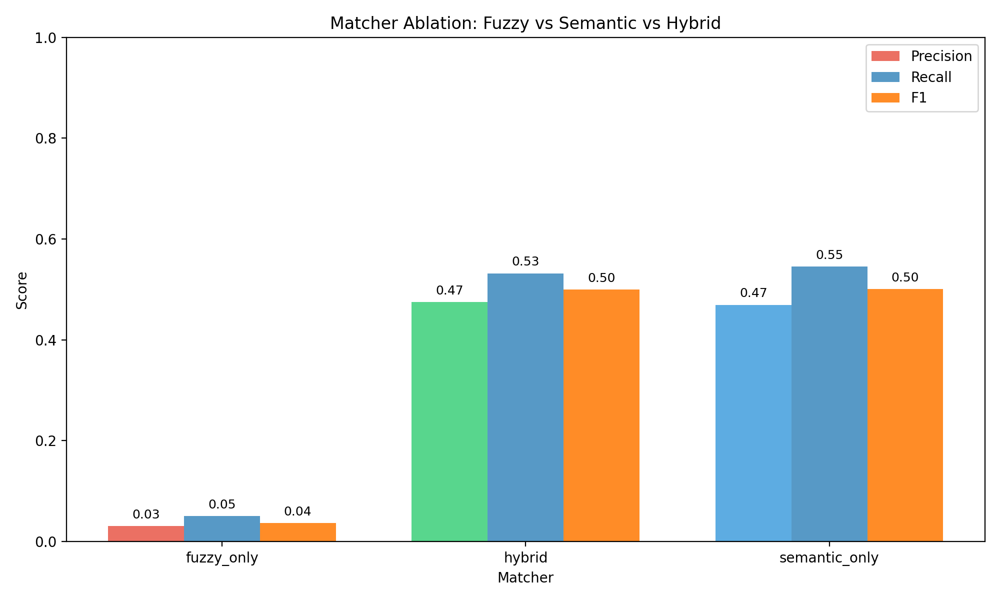
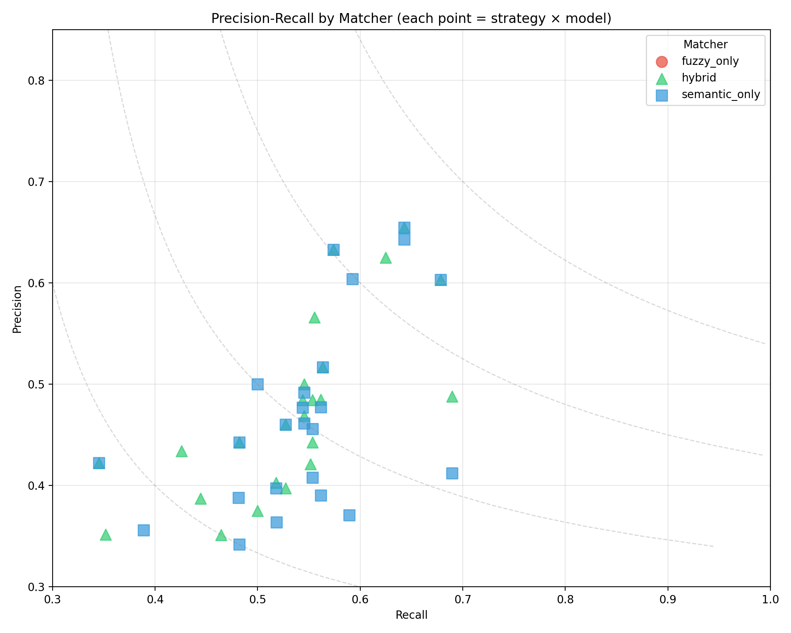
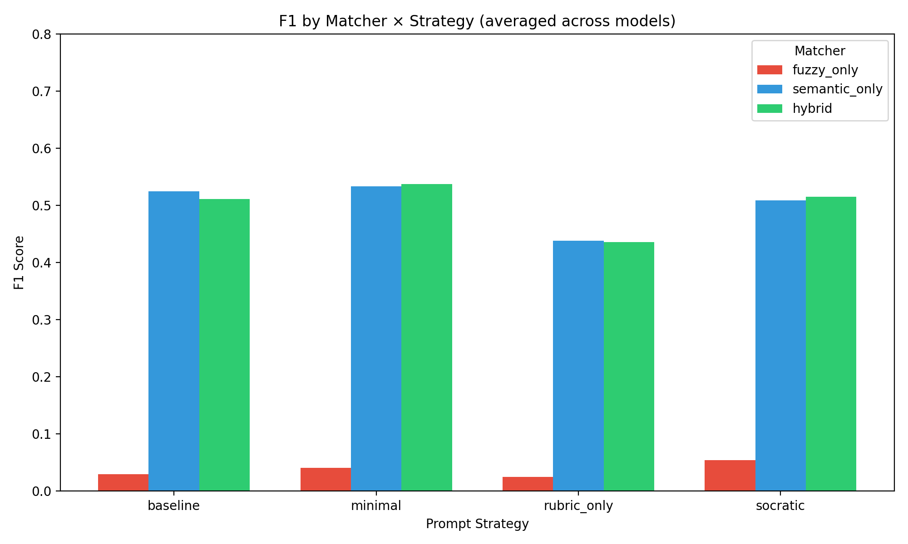
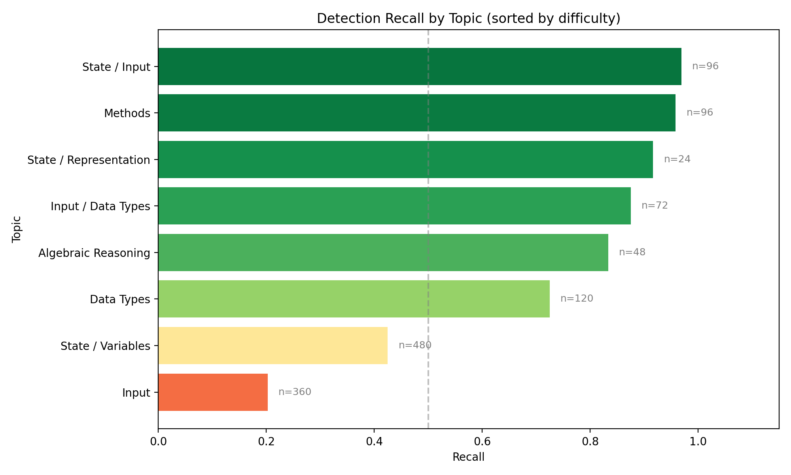
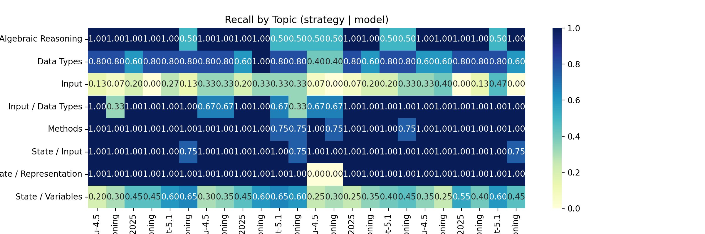
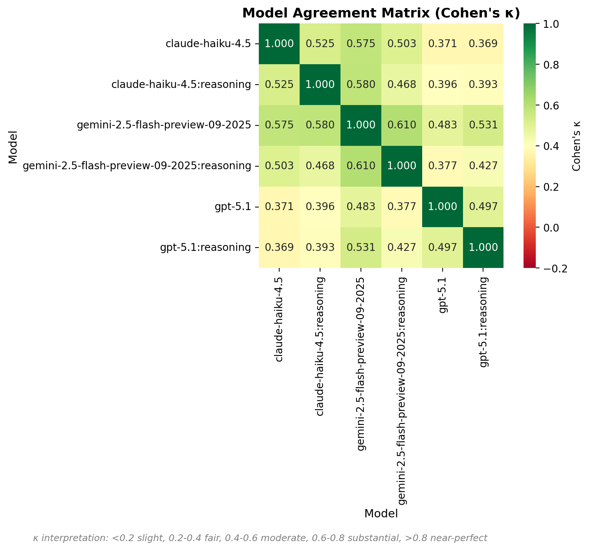
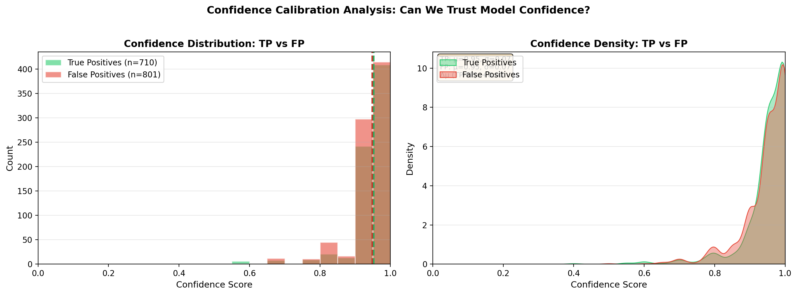
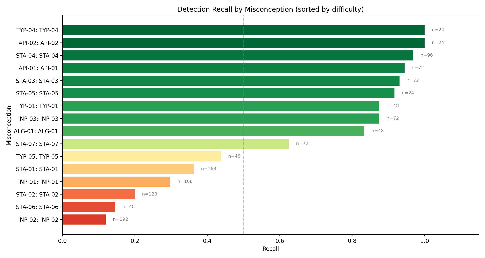
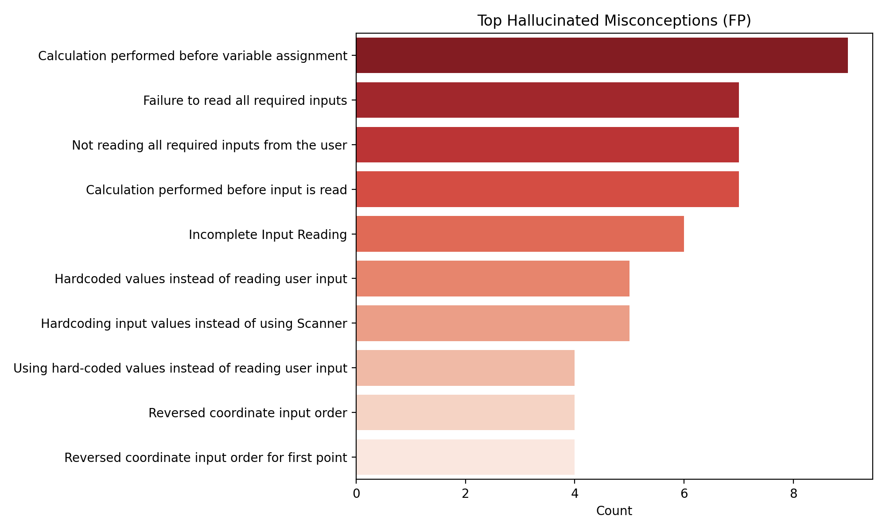

# LLM Misconception Detection: Analysis Report
_Generated: 2025-12-05T08:31:06.117580+00:00_

## Dataset & Run Configuration

### Dataset Summary
- **Assignment:** A2 – Kinematics & Geometry (CS1)
- **Students:** 60
- **Questions:** 4 (Q1, Q2, Q3, Q4)
- **Total files:** 240
- **Seeded files:** 54 (22.5%)
- **Clean files:** 186 (77.5%)
- **Detection opportunities:** 1296

### Run Configuration
- **Generation seed:** 1764945678
- **Generation model:** gpt-5.1-2025-11-13
- **Match mode:** all (ablation)
- **Embedding model:** text-embedding-3-large (OpenAI)
- **Detection models:** GPT-5.1, Gemini-2.5-Flash-Preview, Haiku-4.5
- **Strategies:** baseline, minimal, rubric_only, socratic

## Executive Highlights
- **Matcher Ablation Study**: Comparing fuzzy_only, semantic_only, and hybrid matchers.
- Bootstrap CIs included for statistical rigor.
- Same detection data, different matching strategies.

## Matcher Ablation: Fuzzy vs Semantic vs Hybrid

### Summary (averaged across strategies and models)
| Matcher | Total TP | Total FP | Total FN | Avg Precision | Avg Recall | Avg F1 |
|---------|----------|----------|----------|---------------|------------|--------|
| fuzzy_only | 66 | 2332 | 1230 | 0.031 | 0.051 | 0.037 |
| hybrid | 710 | 801 | 622 | 0.475 | 0.532 | 0.500 |
| semantic_only | 727 | 857 | 605 | 0.470 | 0.545 | 0.501 |

### Precision-Recall by Matcher

### Matcher × Strategy Distribution

### Full Results Table
| Matcher | Strategy | Model | TP | FP | FN | Precision | Recall | F1 | CI (F1) |
|---------|----------|-------|----|----|----|-----------|--------|----|---------|
| fuzzy_only | baseline | claude-haiku-4.5 | 2 | 96 | 52 | 0.020 | 0.037 | 0.026 | 0.00–0.06 |
| fuzzy_only | baseline | claude-haiku-4.5:reasoning | 2 | 53 | 52 | 0.036 | 0.037 | 0.037 | 0.00–0.09 |
| fuzzy_only | baseline | gemini-2.5-flash-preview-09-2025 | 3 | 109 | 51 | 0.027 | 0.056 | 0.036 | 0.00–0.08 |
| fuzzy_only | baseline | gemini-2.5-flash-preview-09-2025:reasoning | 2 | 117 | 52 | 0.017 | 0.037 | 0.023 | 0.00–0.06 |
| fuzzy_only | baseline | gpt-5.1 | 2 | 58 | 52 | 0.033 | 0.037 | 0.035 | 0.00–0.09 |
| fuzzy_only | baseline | gpt-5.1:reasoning | 1 | 51 | 53 | 0.019 | 0.019 | 0.019 | 0.00–0.06 |
| fuzzy_only | minimal | claude-haiku-4.5 | 6 | 118 | 48 | 0.048 | 0.111 | 0.067 | 0.02–0.12 |
| fuzzy_only | minimal | claude-haiku-4.5:reasoning | 6 | 65 | 48 | 0.085 | 0.111 | 0.096 | 0.03–0.17 |
| fuzzy_only | minimal | gemini-2.5-flash-preview-09-2025 | 4 | 179 | 50 | 0.022 | 0.074 | 0.034 | 0.01–0.07 |
| fuzzy_only | minimal | gemini-2.5-flash-preview-09-2025:reasoning | 2 | 261 | 52 | 0.008 | 0.037 | 0.013 | 0.00–0.03 |
| fuzzy_only | minimal | gpt-5.1 | 1 | 67 | 53 | 0.015 | 0.019 | 0.016 | 0.00–0.05 |
| fuzzy_only | minimal | gpt-5.1:reasoning | 1 | 64 | 53 | 0.015 | 0.019 | 0.017 | 0.00–0.05 |
| fuzzy_only | rubric_only | claude-haiku-4.5 | 1 | 72 | 53 | 0.014 | 0.019 | 0.016 | 0.00–0.05 |
| fuzzy_only | rubric_only | claude-haiku-4.5:reasoning | 0 | 45 | 54 | 0.000 | 0.000 | 0.000 | 0.00–0.00 |
| fuzzy_only | rubric_only | gemini-2.5-flash-preview-09-2025 | 3 | 147 | 51 | 0.020 | 0.056 | 0.029 | 0.00–0.06 |
| fuzzy_only | rubric_only | gemini-2.5-flash-preview-09-2025:reasoning | 2 | 156 | 52 | 0.013 | 0.037 | 0.019 | 0.00–0.05 |
| fuzzy_only | rubric_only | gpt-5.1 | 3 | 66 | 51 | 0.043 | 0.056 | 0.049 | 0.00–0.10 |
| fuzzy_only | rubric_only | gpt-5.1:reasoning | 2 | 63 | 52 | 0.031 | 0.037 | 0.034 | 0.00–0.09 |
| fuzzy_only | socratic | claude-haiku-4.5 | 6 | 74 | 48 | 0.075 | 0.111 | 0.090 | 0.03–0.17 |
| fuzzy_only | socratic | claude-haiku-4.5:reasoning | 5 | 67 | 49 | 0.069 | 0.093 | 0.079 | 0.03–0.15 |
| fuzzy_only | socratic | gemini-2.5-flash-preview-09-2025 | 3 | 104 | 51 | 0.028 | 0.056 | 0.037 | 0.00–0.08 |
| fuzzy_only | socratic | gemini-2.5-flash-preview-09-2025:reasoning | 4 | 166 | 50 | 0.024 | 0.074 | 0.036 | 0.01–0.07 |
| fuzzy_only | socratic | gpt-5.1 | 2 | 71 | 52 | 0.027 | 0.037 | 0.031 | 0.00–0.08 |
| fuzzy_only | socratic | gpt-5.1:reasoning | 3 | 63 | 51 | 0.045 | 0.056 | 0.050 | 0.00–0.12 |
| hybrid | baseline | claude-haiku-4.5 | 24 | 38 | 30 | 0.387 | 0.444 | 0.414 | 0.30–0.54 |
| hybrid | baseline | claude-haiku-4.5:reasoning | 23 | 30 | 31 | 0.434 | 0.426 | 0.430 | 0.31–0.56 |
| hybrid | baseline | gemini-2.5-flash-preview-09-2025 | 32 | 34 | 25 | 0.485 | 0.561 | 0.520 | 0.39–0.66 |
| hybrid | baseline | gemini-2.5-flash-preview-09-2025:reasoning | 29 | 43 | 27 | 0.403 | 0.518 | 0.453 | 0.33–0.57 |
| hybrid | baseline | gpt-5.1 | 36 | 19 | 20 | 0.655 | 0.643 | 0.649 | 0.52–0.77 |
| hybrid | baseline | gpt-5.1:reasoning | 31 | 18 | 23 | 0.633 | 0.574 | 0.602 | 0.50–0.71 |
| hybrid | minimal | claude-haiku-4.5 | 29 | 44 | 26 | 0.397 | 0.527 | 0.453 | 0.33–0.56 |
| hybrid | minimal | claude-haiku-4.5:reasoning | 30 | 30 | 25 | 0.500 | 0.545 | 0.522 | 0.41–0.64 |
| hybrid | minimal | gemini-2.5-flash-preview-09-2025 | 31 | 39 | 25 | 0.443 | 0.554 | 0.492 | 0.36–0.62 |
| hybrid | minimal | gemini-2.5-flash-preview-09-2025:reasoning | 40 | 42 | 18 | 0.488 | 0.690 | 0.571 | 0.45–0.68 |
| hybrid | minimal | gpt-5.1 | 35 | 21 | 21 | 0.625 | 0.625 | 0.625 | 0.51–0.74 |
| hybrid | minimal | gpt-5.1:reasoning | 30 | 23 | 24 | 0.566 | 0.556 | 0.561 | 0.42–0.69 |
| hybrid | rubric_only | claude-haiku-4.5 | 19 | 35 | 35 | 0.352 | 0.352 | 0.352 | 0.22–0.48 |
| hybrid | rubric_only | claude-haiku-4.5:reasoning | 19 | 26 | 36 | 0.422 | 0.345 | 0.380 | 0.26–0.50 |
| hybrid | rubric_only | gemini-2.5-flash-preview-09-2025 | 26 | 48 | 30 | 0.351 | 0.464 | 0.400 | 0.28–0.51 |
| hybrid | rubric_only | gemini-2.5-flash-preview-09-2025:reasoning | 27 | 45 | 27 | 0.375 | 0.500 | 0.429 | 0.31–0.54 |
| hybrid | rubric_only | gpt-5.1 | 31 | 33 | 26 | 0.484 | 0.544 | 0.512 | 0.40–0.62 |
| hybrid | rubric_only | gpt-5.1:reasoning | 31 | 29 | 24 | 0.517 | 0.564 | 0.539 | 0.41–0.66 |
| hybrid | socratic | claude-haiku-4.5 | 30 | 34 | 25 | 0.469 | 0.545 | 0.504 | 0.39–0.62 |
| hybrid | socratic | claude-haiku-4.5:reasoning | 29 | 34 | 26 | 0.460 | 0.527 | 0.492 | 0.39–0.61 |
| hybrid | socratic | gemini-2.5-flash-preview-09-2025 | 31 | 33 | 25 | 0.484 | 0.554 | 0.517 | 0.40–0.64 |
| hybrid | socratic | gemini-2.5-flash-preview-09-2025:reasoning | 32 | 44 | 26 | 0.421 | 0.552 | 0.478 | 0.35–0.59 |
| hybrid | socratic | gpt-5.1 | 38 | 25 | 18 | 0.603 | 0.679 | 0.639 | 0.53–0.77 |
| hybrid | socratic | gpt-5.1:reasoning | 27 | 34 | 29 | 0.443 | 0.482 | 0.462 | 0.33–0.60 |
| semantic_only | baseline | claude-haiku-4.5 | 26 | 41 | 28 | 0.388 | 0.481 | 0.430 | 0.31–0.54 |
| semantic_only | baseline | claude-haiku-4.5:reasoning | 27 | 27 | 27 | 0.500 | 0.500 | 0.500 | 0.38–0.63 |
| semantic_only | baseline | gemini-2.5-flash-preview-09-2025 | 32 | 35 | 25 | 0.478 | 0.561 | 0.516 | 0.41–0.64 |
| semantic_only | baseline | gemini-2.5-flash-preview-09-2025:reasoning | 29 | 44 | 27 | 0.397 | 0.518 | 0.450 | 0.34–0.56 |
| semantic_only | baseline | gpt-5.1 | 36 | 19 | 20 | 0.655 | 0.643 | 0.649 | 0.53–0.76 |
| semantic_only | baseline | gpt-5.1:reasoning | 31 | 18 | 23 | 0.633 | 0.574 | 0.602 | 0.47–0.73 |
| semantic_only | minimal | claude-haiku-4.5 | 33 | 56 | 23 | 0.371 | 0.589 | 0.455 | 0.35–0.58 |
| semantic_only | minimal | claude-haiku-4.5:reasoning | 30 | 31 | 25 | 0.492 | 0.545 | 0.517 | 0.39–0.63 |
| semantic_only | minimal | gemini-2.5-flash-preview-09-2025 | 31 | 45 | 25 | 0.408 | 0.554 | 0.470 | 0.34–0.60 |
| semantic_only | minimal | gemini-2.5-flash-preview-09-2025:reasoning | 40 | 57 | 18 | 0.412 | 0.690 | 0.516 | 0.40–0.62 |
| semantic_only | minimal | gpt-5.1 | 36 | 20 | 20 | 0.643 | 0.643 | 0.643 | 0.51–0.76 |
| semantic_only | minimal | gpt-5.1:reasoning | 32 | 21 | 22 | 0.604 | 0.593 | 0.598 | 0.46–0.72 |
| semantic_only | rubric_only | claude-haiku-4.5 | 21 | 38 | 33 | 0.356 | 0.389 | 0.372 | 0.25–0.49 |
| semantic_only | rubric_only | claude-haiku-4.5:reasoning | 19 | 26 | 36 | 0.422 | 0.345 | 0.380 | 0.24–0.51 |
| semantic_only | rubric_only | gemini-2.5-flash-preview-09-2025 | 27 | 52 | 29 | 0.342 | 0.482 | 0.400 | 0.29–0.53 |
| semantic_only | rubric_only | gemini-2.5-flash-preview-09-2025:reasoning | 28 | 49 | 26 | 0.364 | 0.519 | 0.427 | 0.31–0.54 |
| semantic_only | rubric_only | gpt-5.1 | 31 | 34 | 26 | 0.477 | 0.544 | 0.508 | 0.39–0.64 |
| semantic_only | rubric_only | gpt-5.1:reasoning | 31 | 29 | 24 | 0.517 | 0.564 | 0.539 | 0.42–0.67 |
| semantic_only | socratic | claude-haiku-4.5 | 30 | 35 | 25 | 0.462 | 0.545 | 0.500 | 0.38–0.62 |
| semantic_only | socratic | claude-haiku-4.5:reasoning | 29 | 34 | 26 | 0.460 | 0.527 | 0.492 | 0.37–0.60 |
| semantic_only | socratic | gemini-2.5-flash-preview-09-2025 | 31 | 37 | 25 | 0.456 | 0.554 | 0.500 | 0.37–0.62 |
| semantic_only | socratic | gemini-2.5-flash-preview-09-2025:reasoning | 32 | 50 | 25 | 0.390 | 0.561 | 0.460 | 0.33–0.58 |
| semantic_only | socratic | gpt-5.1 | 38 | 25 | 18 | 0.603 | 0.679 | 0.639 | 0.50–0.74 |
| semantic_only | socratic | gpt-5.1:reasoning | 27 | 34 | 29 | 0.443 | 0.482 | 0.462 | 0.33–0.59 |

## Topic Difficulty (Recall)
| Topic | Recall | N |
|-------|--------|---|
| Input | 0.203 | 360 |
| State / Variables | 0.425 | 480 |
| Data Types | 0.725 | 120 |
| Algebraic Reasoning | 0.833 | 48 |
| Input / Data Types | 0.875 | 72 |
| State / Representation | 0.917 | 24 |
| Methods | 0.958 | 96 |
| State / Input | 0.969 | 96 |

## Topic Heatmap

## Topic Recall by Model

Grouped bar chart showing recall per topic, split by model. Reveals model-specific strengths and weaknesses.

## Model Agreement Matrix

Pairwise Cohen's κ between models. Higher values indicate correlated predictions; lower values suggest complementary errors (good for ensembles).

## Confidence Calibration Analysis

Distribution of model confidence scores for True Positives vs False Positives. A well-calibrated model should show higher confidence for TPs than FPs.

## Per-Misconception Detection Rates

Detection recall for each seeded misconception, sorted by difficulty (hardest to detect at top):

| ID | Misconception | Category | Recall | N |
|----|---------------|----------|--------|---|
| INP-02 | INP-02 | Input | 0.12 | 192 |
| STA-06 | STA-06 | State / Variables | 0.15 | 48 |
| STA-02 | STA-02 | State / Variables | 0.20 | 120 |
| INP-01 | INP-01 | Input | 0.30 | 168 |
| STA-01 | STA-01 | State / Variables | 0.36 | 168 |
| TYP-05 | TYP-05 | Data Types | 0.44 | 48 |
| STA-07 | STA-07 | State / Variables | 0.62 | 72 |
| ALG-01 | ALG-01 | Algebraic Reasoning | 0.83 | 48 |
| INP-03 | INP-03 | Input / Data Types | 0.88 | 72 |
| TYP-01 | TYP-01 | Data Types | 0.88 | 48 |
| STA-05 | STA-05 | State / Representation | 0.92 | 24 |
| STA-03 | STA-03 | State / Variables | 0.93 | 72 |
| API-01 | API-01 | Methods | 0.94 | 72 |
| STA-04 | STA-04 | State / Input | 0.97 | 96 |
| API-02 | API-02 | Methods | 1.00 | 24 |
| TYP-04 | TYP-04 | Data Types | 1.00 | 24 |

## Hallucination Analysis

- **Calculation performed before variable assignment** (27 times)
- **Not reading all required inputs from the user** (22 times)
- **Calculation performed before input is read** (21 times)
- **Failure to read all required inputs** (21 times)
- **Incomplete Input Reading** (18 times)

## Methods
- Data: 60 students × 4 questions (seeded/clean) with manifest-driven ground truth.
- Detection: GPT-5.1, Gemini-2.5-Flash-Preview, Haiku-4.5 across strategies (baseline, minimal, rubric_only, socratic).
- Matching: Ablation comparing fuzzy-only, semantic-only (text-embedding-3-large), and hybrid (fuzzy + semantic + topic prior).
- Metrics: Precision/Recall/F1 with bootstrap CIs; agreement via κ; significance via McNemar where applicable.

## Agreement & Significance
- baseline (claude-haiku-4.5 vs claude-haiku-4.5:reasoning): κ=0.586, McNemar p=0.8802 (stat=0.023) | table={'both_correct': 18, 'only_a': 6, 'only_b': 5, 'both_wrong': 25}
- baseline (claude-haiku-4.5 vs gemini-2.5-flash-preview-09-2025): κ=0.596, McNemar p=0.1748 (stat=1.841) | table={'both_correct': 21, 'only_a': 3, 'only_b': 8, 'both_wrong': 22}
- baseline (claude-haiku-4.5 vs gemini-2.5-flash-preview-09-2025:reasoning): κ=0.593, McNemar p=0.4510 (stat=0.568) | table={'both_correct': 20, 'only_a': 4, 'only_b': 7, 'both_wrong': 23}
- baseline (claude-haiku-4.5 vs gpt-5.1): κ=0.424, McNemar p=0.0175 (stat=5.641) | table={'both_correct': 21, 'only_a': 3, 'only_b': 13, 'both_wrong': 17}
- baseline (claude-haiku-4.5 vs gpt-5.1:reasoning): κ=0.453, McNemar p=0.0933 (stat=2.817) | table={'both_correct': 20, 'only_a': 4, 'only_b': 11, 'both_wrong': 19}
- baseline (claude-haiku-4.5:reasoning vs gemini-2.5-flash-preview-09-2025): κ=0.634, McNemar p=0.0820 (stat=3.025) | table={'both_correct': 21, 'only_a': 2, 'only_b': 8, 'both_wrong': 23}
- baseline (claude-haiku-4.5:reasoning vs gemini-2.5-flash-preview-09-2025:reasoning): κ=0.704, McNemar p=0.2159 (stat=1.531) | table={'both_correct': 21, 'only_a': 2, 'only_b': 6, 'both_wrong': 25}
- baseline (claude-haiku-4.5:reasoning vs gpt-5.1): κ=0.536, McNemar p=0.0036 (stat=8.481) | table={'both_correct': 22, 'only_a': 1, 'only_b': 12, 'both_wrong': 19}
- baseline (claude-haiku-4.5:reasoning vs gpt-5.1:reasoning): κ=0.420, McNemar p=0.0608 (stat=3.516) | table={'both_correct': 19, 'only_a': 4, 'only_b': 12, 'both_wrong': 19}
- baseline (gemini-2.5-flash-preview-09-2025 vs gemini-2.5-flash-preview-09-2025:reasoning): κ=0.630, McNemar p=0.6353 (stat=0.225) | table={'both_correct': 23, 'only_a': 6, 'only_b': 4, 'both_wrong': 21}
- baseline (gemini-2.5-flash-preview-09-2025 vs gpt-5.1): κ=0.509, McNemar p=0.2120 (stat=1.558) | table={'both_correct': 25, 'only_a': 4, 'only_b': 9, 'both_wrong': 16}
- baseline (gemini-2.5-flash-preview-09-2025 vs gpt-5.1:reasoning): κ=0.551, McNemar p=0.6650 (stat=0.188) | table={'both_correct': 24, 'only_a': 5, 'only_b': 7, 'both_wrong': 18}
- baseline (gemini-2.5-flash-preview-09-2025:reasoning vs gpt-5.1): κ=0.593, McNemar p=0.0500 (stat=3.841) | table={'both_correct': 25, 'only_a': 2, 'only_b': 9, 'both_wrong': 18}
- baseline (gemini-2.5-flash-preview-09-2025:reasoning vs gpt-5.1:reasoning): κ=0.407, McNemar p=0.3816 (stat=0.766) | table={'both_correct': 21, 'only_a': 6, 'only_b': 10, 'both_wrong': 17}
- baseline (gpt-5.1 vs gpt-5.1:reasoning): κ=0.499, McNemar p=0.4881 (stat=0.481) | table={'both_correct': 26, 'only_a': 8, 'only_b': 5, 'both_wrong': 15}
- minimal (claude-haiku-4.5 vs claude-haiku-4.5:reasoning): κ=0.443, McNemar p=0.8973 (stat=0.017) | table={'both_correct': 21, 'only_a': 7, 'only_b': 8, 'both_wrong': 18}
- minimal (claude-haiku-4.5 vs gemini-2.5-flash-preview-09-2025): κ=0.443, McNemar p=0.8973 (stat=0.017) | table={'both_correct': 21, 'only_a': 7, 'only_b': 8, 'both_wrong': 18}
- minimal (claude-haiku-4.5 vs gemini-2.5-flash-preview-09-2025:reasoning): κ=0.250, McNemar p=0.0935 (stat=2.812) | table={'both_correct': 22, 'only_a': 6, 'only_b': 14, 'both_wrong': 12}
- minimal (claude-haiku-4.5 vs gpt-5.1): κ=0.216, McNemar p=0.3261 (stat=0.964) | table={'both_correct': 20, 'only_a': 8, 'only_b': 13, 'both_wrong': 13}
- minimal (claude-haiku-4.5 vs gpt-5.1:reasoning): κ=0.256, McNemar p=0.7373 (stat=0.113) | table={'both_correct': 19, 'only_a': 9, 'only_b': 11, 'both_wrong': 15}
- minimal (claude-haiku-4.5:reasoning vs gemini-2.5-flash-preview-09-2025): κ=0.553, McNemar p=0.8852 (stat=0.021) | table={'both_correct': 23, 'only_a': 6, 'only_b': 6, 'both_wrong': 19}
- minimal (claude-haiku-4.5:reasoning vs gemini-2.5-flash-preview-09-2025:reasoning): κ=0.127, McNemar p=0.1753 (stat=1.837) | table={'both_correct': 21, 'only_a': 8, 'only_b': 15, 'both_wrong': 10}
- minimal (claude-haiku-4.5:reasoning vs gpt-5.1): κ=0.397, McNemar p=0.3816 (stat=0.766) | table={'both_correct': 23, 'only_a': 6, 'only_b': 10, 'both_wrong': 15}
- minimal (claude-haiku-4.5:reasoning vs gpt-5.1:reasoning): κ=0.216, McNemar p=0.9131 (stat=0.012) | table={'both_correct': 19, 'only_a': 10, 'only_b': 11, 'both_wrong': 14}
- minimal (gemini-2.5-flash-preview-09-2025 vs gemini-2.5-flash-preview-09-2025:reasoning): κ=0.430, McNemar p=0.0933 (stat=2.817) | table={'both_correct': 25, 'only_a': 4, 'only_b': 11, 'both_wrong': 14}
- minimal (gemini-2.5-flash-preview-09-2025 vs gpt-5.1): κ=0.322, McNemar p=0.4094 (stat=0.681) | table={'both_correct': 22, 'only_a': 7, 'only_b': 11, 'both_wrong': 14}
- minimal (gemini-2.5-flash-preview-09-2025 vs gpt-5.1:reasoning): κ=0.365, McNemar p=0.9035 (stat=0.015) | table={'both_correct': 21, 'only_a': 8, 'only_b': 9, 'both_wrong': 16}
- minimal (gemini-2.5-flash-preview-09-2025:reasoning vs gpt-5.1): κ=0.080, McNemar p=0.6022 (stat=0.272) | table={'both_correct': 23, 'only_a': 13, 'only_b': 10, 'both_wrong': 8}
- minimal (gemini-2.5-flash-preview-09-2025:reasoning vs gpt-5.1:reasoning): κ=0.231, McNemar p=0.2188 (stat=1.512) | table={'both_correct': 23, 'only_a': 13, 'only_b': 7, 'both_wrong': 11}
- minimal (gpt-5.1 vs gpt-5.1:reasoning): κ=0.506, McNemar p=0.4881 (stat=0.481) | table={'both_correct': 25, 'only_a': 8, 'only_b': 5, 'both_wrong': 16}
- rubric_only (claude-haiku-4.5 vs claude-haiku-4.5:reasoning): κ=0.712, McNemar p=0.8501 (stat=0.036) | table={'both_correct': 15, 'only_a': 4, 'only_b': 3, 'both_wrong': 32}
- rubric_only (claude-haiku-4.5 vs gemini-2.5-flash-preview-09-2025): κ=0.579, McNemar p=0.1748 (stat=1.841) | table={'both_correct': 16, 'only_a': 3, 'only_b': 8, 'both_wrong': 27}
- rubric_only (claude-haiku-4.5 vs gemini-2.5-flash-preview-09-2025:reasoning): κ=0.630, McNemar p=0.0177 (stat=5.625) | table={'both_correct': 18, 'only_a': 1, 'only_b': 9, 'both_wrong': 26}
- rubric_only (claude-haiku-4.5 vs gpt-5.1): κ=0.450, McNemar p=0.0282 (stat=4.817) | table={'both_correct': 16, 'only_a': 3, 'only_b': 12, 'both_wrong': 23}
- rubric_only (claude-haiku-4.5 vs gpt-5.1:reasoning): κ=0.390, McNemar p=0.0109 (stat=6.485) | table={'both_correct': 16, 'only_a': 3, 'only_b': 14, 'both_wrong': 21}
- rubric_only (claude-haiku-4.5:reasoning vs gemini-2.5-flash-preview-09-2025): κ=0.692, McNemar p=0.0518 (stat=3.781) | table={'both_correct': 17, 'only_a': 1, 'only_b': 7, 'both_wrong': 29}
- rubric_only (claude-haiku-4.5:reasoning vs gemini-2.5-flash-preview-09-2025:reasoning): κ=0.593, McNemar p=0.0104 (stat=6.568) | table={'both_correct': 17, 'only_a': 1, 'only_b': 10, 'both_wrong': 26}
- rubric_only (claude-haiku-4.5:reasoning vs gpt-5.1): κ=0.488, McNemar p=0.0111 (stat=6.446) | table={'both_correct': 16, 'only_a': 2, 'only_b': 12, 'both_wrong': 24}
- rubric_only (claude-haiku-4.5:reasoning vs gpt-5.1:reasoning): κ=0.429, McNemar p=0.0040 (stat=8.266) | table={'both_correct': 16, 'only_a': 2, 'only_b': 14, 'both_wrong': 22}
- rubric_only (gemini-2.5-flash-preview-09-2025 vs gemini-2.5-flash-preview-09-2025:reasoning): κ=0.741, McNemar p=0.3447 (stat=0.893) | table={'both_correct': 22, 'only_a': 2, 'only_b': 5, 'both_wrong': 25}
- rubric_only (gemini-2.5-flash-preview-09-2025 vs gpt-5.1): κ=0.705, McNemar p=0.2159 (stat=1.531) | table={'both_correct': 22, 'only_a': 2, 'only_b': 6, 'both_wrong': 24}
- rubric_only (gemini-2.5-flash-preview-09-2025 vs gpt-5.1:reasoning): κ=0.634, McNemar p=0.0820 (stat=3.025) | table={'both_correct': 22, 'only_a': 2, 'only_b': 8, 'both_wrong': 22}
- rubric_only (gemini-2.5-flash-preview-09-2025:reasoning vs gpt-5.1): κ=0.519, McNemar p=0.8897 (stat=0.019) | table={'both_correct': 21, 'only_a': 6, 'only_b': 7, 'both_wrong': 20}
- rubric_only (gemini-2.5-flash-preview-09-2025:reasoning vs gpt-5.1:reasoning): κ=0.519, McNemar p=0.4881 (stat=0.481) | table={'both_correct': 22, 'only_a': 5, 'only_b': 8, 'both_wrong': 19}
- rubric_only (gpt-5.1 vs gpt-5.1:reasoning): κ=0.702, McNemar p=0.5959 (stat=0.281) | table={'both_correct': 25, 'only_a': 3, 'only_b': 5, 'both_wrong': 21}
- socratic (claude-haiku-4.5 vs claude-haiku-4.5:reasoning): κ=0.740, McNemar p=0.8501 (stat=0.036) | table={'both_correct': 25, 'only_a': 4, 'only_b': 3, 'both_wrong': 22}
- socratic (claude-haiku-4.5 vs gemini-2.5-flash-preview-09-2025): κ=0.628, McNemar p=0.8744 (stat=0.025) | table={'both_correct': 24, 'only_a': 5, 'only_b': 5, 'both_wrong': 20}
- socratic (claude-haiku-4.5 vs gemini-2.5-flash-preview-09-2025:reasoning): κ=0.517, McNemar p=0.8897 (stat=0.019) | table={'both_correct': 22, 'only_a': 7, 'only_b': 6, 'both_wrong': 19}
- socratic (claude-haiku-4.5 vs gpt-5.1): κ=0.506, McNemar p=0.0714 (stat=3.250) | table={'both_correct': 26, 'only_a': 3, 'only_b': 10, 'both_wrong': 15}
- socratic (claude-haiku-4.5 vs gpt-5.1:reasoning): κ=0.632, McNemar p=0.2684 (stat=1.225) | table={'both_correct': 22, 'only_a': 7, 'only_b': 3, 'both_wrong': 22}
- socratic (claude-haiku-4.5:reasoning vs gemini-2.5-flash-preview-09-2025): κ=0.443, McNemar p=0.8973 (stat=0.017) | table={'both_correct': 21, 'only_a': 7, 'only_b': 8, 'both_wrong': 18}
- socratic (claude-haiku-4.5:reasoning vs gemini-2.5-flash-preview-09-2025:reasoning): κ=0.481, McNemar p=0.8937 (stat=0.018) | table={'both_correct': 21, 'only_a': 7, 'only_b': 7, 'both_wrong': 19}
- socratic (claude-haiku-4.5:reasoning vs gpt-5.1): κ=0.250, McNemar p=0.0935 (stat=2.812) | table={'both_correct': 22, 'only_a': 6, 'only_b': 14, 'both_wrong': 12}
- socratic (claude-haiku-4.5:reasoning vs gpt-5.1:reasoning): κ=0.446, McNemar p=0.5186 (stat=0.417) | table={'both_correct': 19, 'only_a': 9, 'only_b': 6, 'both_wrong': 20}
- socratic (gemini-2.5-flash-preview-09-2025 vs gemini-2.5-flash-preview-09-2025:reasoning): κ=0.666, McNemar p=0.8676 (stat=0.028) | table={'both_correct': 24, 'only_a': 5, 'only_b': 4, 'both_wrong': 21}
- socratic (gemini-2.5-flash-preview-09-2025 vs gpt-5.1): κ=0.430, McNemar p=0.0933 (stat=2.817) | table={'both_correct': 25, 'only_a': 4, 'only_b': 11, 'both_wrong': 14}
- socratic (gemini-2.5-flash-preview-09-2025 vs gpt-5.1:reasoning): κ=0.779, McNemar p=0.1530 (stat=2.042) | table={'both_correct': 24, 'only_a': 5, 'only_b': 1, 'both_wrong': 24}
- socratic (gemini-2.5-flash-preview-09-2025:reasoning vs gpt-5.1): κ=0.325, McNemar p=0.0771 (stat=3.125) | table={'both_correct': 23, 'only_a': 5, 'only_b': 13, 'both_wrong': 13}
- socratic (gemini-2.5-flash-preview-09-2025:reasoning vs gpt-5.1:reasoning): κ=0.668, McNemar p=0.4047 (stat=0.694) | table={'both_correct': 22, 'only_a': 6, 'only_b': 3, 'both_wrong': 23}
- socratic (gpt-5.1 vs gpt-5.1:reasoning): κ=0.458, McNemar p=0.0067 (stat=7.350) | table={'both_correct': 23, 'only_a': 13, 'only_b': 2, 'both_wrong': 16}