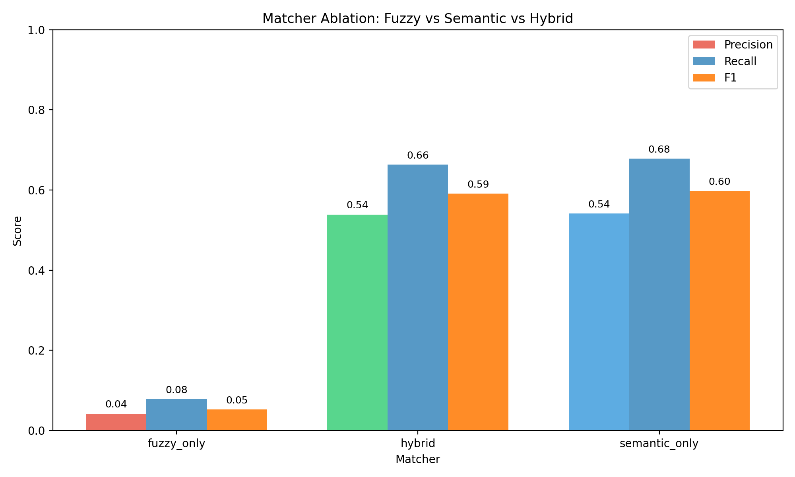
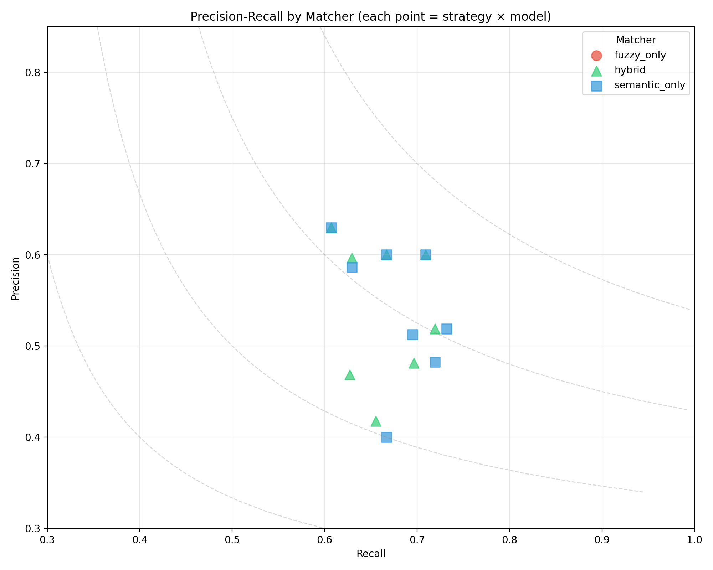
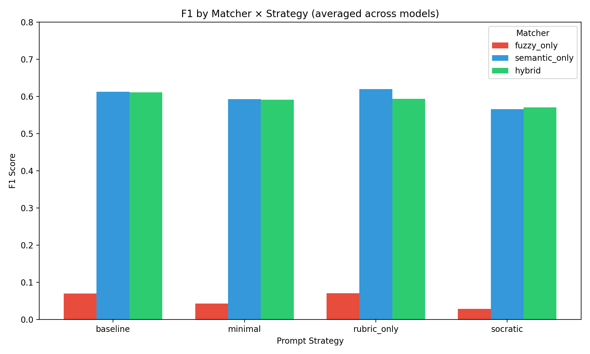
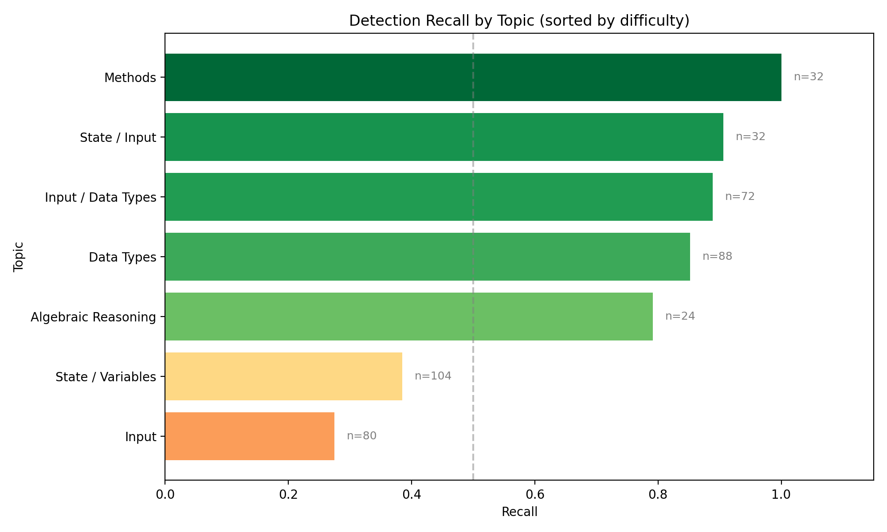
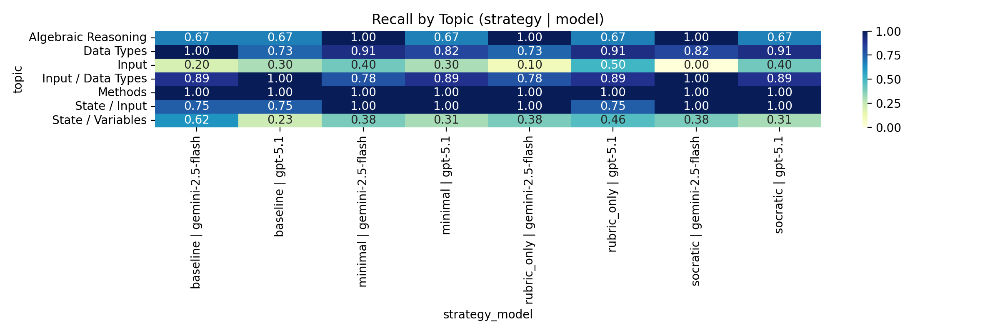
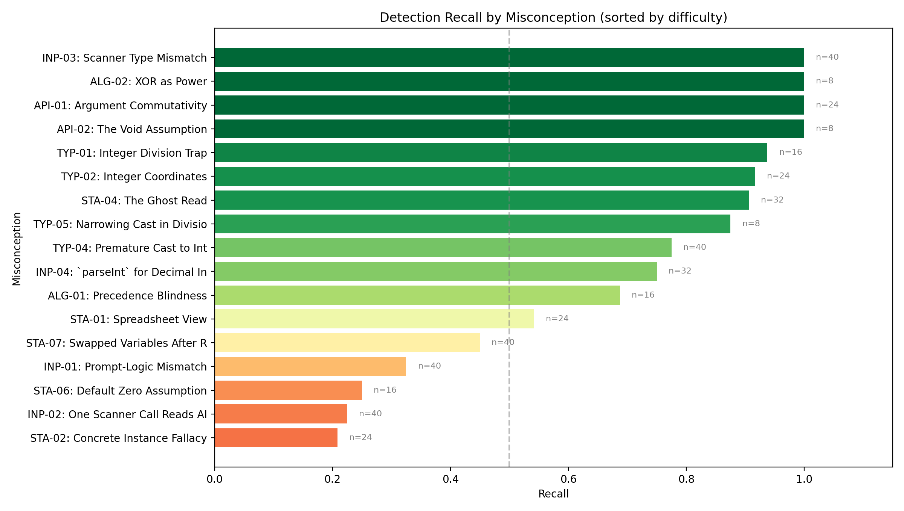
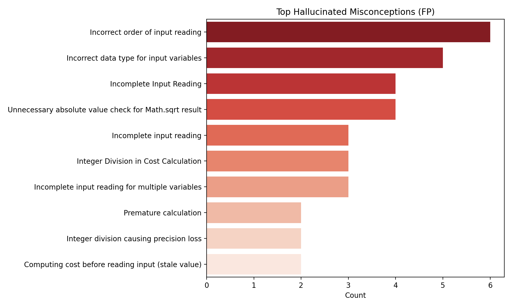

# LLM Misconception Detection: Analysis Report
_Generated: 2025-12-04T20:11:25.612334+00:00_

## Dataset & Run Configuration

### Dataset Summary
- **Assignment:** A2 – Kinematics & Geometry (CS1)
- **Students:** 60
- **Questions:** 4 (Q1, Q2, Q3, Q4)
- **Total files:** 240
- **Seeded files:** 54 (22.5%)
- **Clean files:** 186 (77.5%)
- **Detection opportunities:** 432

### Run Configuration
- **Generation seed:** 1764863751
- **Generation model:** gpt-5.1-2025-11-13
- **Match mode:** all (ablation)
- **Embedding model:** text-embedding-3-large (OpenAI)
- **Detection models:** GPT-5.1, Gemini 2.5 Flash
- **Strategies:** baseline, minimal, rubric_only, socratic

## Executive Highlights
- **Matcher Ablation Study**: Comparing fuzzy_only, semantic_only, and hybrid matchers.
- Bootstrap CIs included for statistical rigor.
- Same detection data, different matching strategies.

## Matcher Ablation: Fuzzy vs Semantic vs Hybrid

### Summary (averaged across strategies and models)
| Matcher       | Total TP | Total FP | Total FN | Avg Precision | Avg Recall | Avg F1 |
| ------------- | -------- | -------- | -------- | ------------- | ---------- | ------ |
| fuzzy_only    | 34       | 798      | 400      | 0.042         | 0.078      | 0.053  |
| hybrid        | 298      | 268      | 151      | 0.539         | 0.664      | 0.591  |
| semantic_only | 304      | 272      | 144      | 0.541         | 0.678      | 0.598  |

### Precision-Recall by Matcher

### Matcher × Strategy Distribution

### Full Results Table
| Matcher       | Strategy    | Model            | TP  | FP  | FN  | Precision | Recall | F1    | CI (F1)   |
| ------------- | ----------- | ---------------- | --- | --- | --- | --------- | ------ | ----- | --------- |
| fuzzy_only    | baseline    | gemini-2.5-flash | 6   | 118 | 48  | 0.048     | 0.111  | 0.067 | 0.02–0.12 |
| fuzzy_only    | baseline    | gpt-5.1          | 4   | 53  | 50  | 0.070     | 0.074  | 0.072 | 0.02–0.15 |
| fuzzy_only    | minimal     | gemini-2.5-flash | 6   | 160 | 49  | 0.036     | 0.109  | 0.054 | 0.01–0.11 |
| fuzzy_only    | minimal     | gpt-5.1          | 2   | 69  | 52  | 0.028     | 0.037  | 0.032 | 0.00–0.08 |
| fuzzy_only    | rubric_only | gemini-2.5-flash | 4   | 118 | 50  | 0.033     | 0.074  | 0.045 | 0.01–0.09 |
| fuzzy_only    | rubric_only | gpt-5.1          | 6   | 66  | 48  | 0.083     | 0.111  | 0.095 | 0.03–0.17 |
| fuzzy_only    | socratic    | gemini-2.5-flash | 6   | 147 | 49  | 0.039     | 0.109  | 0.058 | 0.01–0.12 |
| fuzzy_only    | socratic    | gpt-5.1          | 0   | 67  | 54  | 0.000     | 0.000  | 0.000 | 0.00–0.00 |
| hybrid        | baseline    | gemini-2.5-flash | 41  | 38  | 16  | 0.519     | 0.719  | 0.603 | 0.49–0.71 |
| hybrid        | baseline    | gpt-5.1          | 34  | 20  | 22  | 0.630     | 0.607  | 0.618 | 0.50–0.73 |
| hybrid        | minimal     | gemini-2.5-flash | 39  | 42  | 17  | 0.481     | 0.696  | 0.569 | 0.48–0.67 |
| hybrid        | minimal     | gpt-5.1          | 34  | 23  | 20  | 0.596     | 0.630  | 0.613 | 0.50–0.72 |
| hybrid        | rubric_only | gemini-2.5-flash | 37  | 42  | 22  | 0.468     | 0.627  | 0.536 | 0.42–0.68 |
| hybrid        | rubric_only | gpt-5.1          | 39  | 26  | 16  | 0.600     | 0.709  | 0.650 | 0.54–0.75 |
| hybrid        | socratic    | gemini-2.5-flash | 38  | 53  | 20  | 0.418     | 0.655  | 0.510 | 0.43–0.61 |
| hybrid        | socratic    | gpt-5.1          | 36  | 24  | 18  | 0.600     | 0.667  | 0.632 | 0.52–0.75 |
| semantic_only | baseline    | gemini-2.5-flash | 41  | 38  | 15  | 0.519     | 0.732  | 0.607 | 0.49–0.72 |
| semantic_only | baseline    | gpt-5.1          | 34  | 20  | 22  | 0.630     | 0.607  | 0.618 | 0.50–0.73 |
| semantic_only | minimal     | gemini-2.5-flash | 41  | 44  | 16  | 0.482     | 0.719  | 0.577 | 0.46–0.69 |
| semantic_only | minimal     | gpt-5.1          | 34  | 24  | 20  | 0.586     | 0.630  | 0.607 | 0.49–0.71 |
| semantic_only | rubric_only | gemini-2.5-flash | 41  | 39  | 18  | 0.512     | 0.695  | 0.590 | 0.49–0.71 |
| semantic_only | rubric_only | gpt-5.1          | 39  | 26  | 16  | 0.600     | 0.709  | 0.650 | 0.55–0.76 |
| semantic_only | socratic    | gemini-2.5-flash | 38  | 57  | 19  | 0.400     | 0.667  | 0.500 | 0.40–0.59 |
| semantic_only | socratic    | gpt-5.1          | 36  | 24  | 18  | 0.600     | 0.667  | 0.632 | 0.51–0.74 |

## Topic Difficulty (Recall)
| Topic               | Recall | N   |
| ------------------- | ------ | --- |
| Input               | 0.275  | 80  |
| State / Variables   | 0.385  | 104 |
| Algebraic Reasoning | 0.792  | 24  |
| Data Types          | 0.852  | 88  |
| Input / Data Types  | 0.889  | 72  |
| State / Input       | 0.906  | 32  |
| Methods             | 1.000  | 32  |

## Topic Heatmap

## Per-Misconception Detection Rates

Detection recall for each seeded misconception, sorted by difficulty (hardest to detect at top):

| ID     | Misconception                | Category            | Recall | N   |
| ------ | ---------------------------- | ------------------- | ------ | --- |
| STA-02 | Concrete Instance Fallacy    | State / Variables   | 0.21   | 24  |
| INP-02 | One Scanner Call Reads All   | Input               | 0.23   | 40  |
| STA-06 | Default Zero Assumption      | State / Variables   | 0.25   | 16  |
| INP-01 | Prompt-Logic Mismatch        | Input               | 0.33   | 40  |
| STA-07 | Swapped Variables After Read | State / Variables   | 0.45   | 40  |
| STA-01 | Spreadsheet View             | State / Variables   | 0.54   | 24  |
| ALG-01 | Precedence Blindness         | Algebraic Reasoning | 0.69   | 16  |
| INP-04 | `parseInt` for Decimal Input | Input / Data Types  | 0.75   | 32  |
| TYP-04 | Premature Cast to Int        | Data Types          | 0.78   | 40  |
| TYP-05 | Narrowing Cast in Division   | Data Types          | 0.88   | 8   |
| STA-04 | The Ghost Read               | State / Input       | 0.91   | 32  |
| TYP-02 | Integer Coordinates          | Data Types          | 0.92   | 24  |
| TYP-01 | Integer Division Trap        | Data Types          | 0.94   | 16  |
| API-02 | The Void Assumption          | Methods             | 1.00   | 8   |
| API-01 | Argument Commutativity       | Methods             | 1.00   | 24  |
| ALG-02 | XOR as Power                 | Algebraic Reasoning | 1.00   | 8   |
| INP-03 | Scanner Type Mismatch        | Input / Data Types  | 1.00   | 40  |

## Hallucination Analysis

- **Incorrect order of input reading** (18 times)
- **Incorrect data type for input variables** (17 times)
- **Incorrect Scanner method for double input** (13 times)
- **Incomplete Input Reading** (12 times)
- **Unnecessary absolute value check for Math.sqrt result** (12 times)

## Methods
- Data: 60 students × 4 questions (seeded/clean) with manifest-driven ground truth.
- Detection: GPT-5.1 and Gemini 2.5 Flash across strategies (baseline, minimal, rubric_only, socratic).
- Matching: Ablation comparing fuzzy-only, semantic-only (text-embedding-3-large), and hybrid (fuzzy + semantic + topic prior).
- Metrics: Precision/Recall/F1 with bootstrap CIs; agreement via κ; significance via McNemar where applicable.

## Agreement & Significance
- baseline: κ=0.279, McNemar p=0.1949 (stat=1.681) | table={'both_correct': 26, 'only_a': 12, 'only_b': 6, 'both_wrong': 10}
- minimal: κ=0.385, McNemar p=0.5186 (stat=0.417) | table={'both_correct': 28, 'only_a': 9, 'only_b': 6, 'both_wrong': 11}
- rubric_only: κ=0.279, McNemar p=0.1949 (stat=1.681) | table={'both_correct': 26, 'only_a': 6, 'only_b': 12, 'both_wrong': 10}
- socratic: κ=0.514, McNemar p=0.6650 (stat=0.188) | table={'both_correct': 29, 'only_a': 5, 'only_b': 7, 'both_wrong': 13}