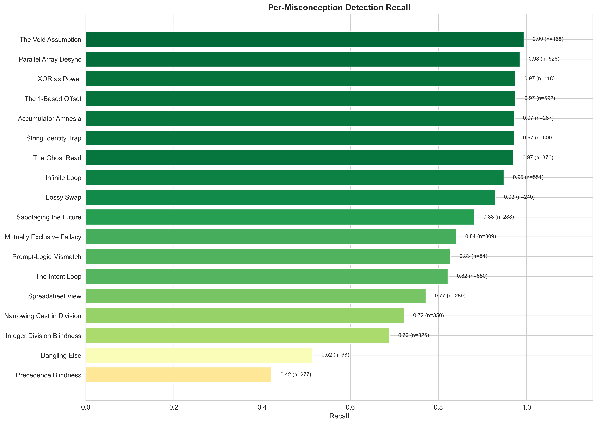

# TRACER: LLM Cognitive Alignment Analysis

## Taxonomic Research of Aligned Cognitive Error Recognition

_Generated: 2026-01-07T11:17:54.913383+00:00_

---

## Executive Summary

This report evaluates **LLM cognitive alignment** with CS education theory by measuring
whether models can identify *student mental models* (Notional Machines), not just surface-level bugs.

**Dataset:** 300 students × 3 assignments × 4 strategies × 6 models

**Validation:** 5-fold stratified cross-validation by Notional Machine category (seed 42)

### Cross-Validation Results

| Metric | Mean | Std Dev | 95% CI (approx) |
|--------|------|---------|-----------------|
| **Precision** | **0.577** | ±0.029 | [0.521, 0.633] |
| **Recall** | **0.872** | ±0.016 | [0.841, 0.903] |
| **F1 Score** | **0.694** | ±0.024 | [0.646, 0.742] |
| **Specificity** | **0.848** | ±0.012 | [0.824, 0.872] |

**Raw Counts (aggregated):** TP=5,305 | FP=3,884 | FN=775 | TN=18,836

### Key Findings

1. **Ensemble Voting** improves F1 by +0.067 through precision gains
2. **Detection Gap:** 'The Algebraic Syntax Machine' (59%) vs 'The Void Machine' (99%)
3. **Semantic Matching** effectively separates TPs from FPs (large effect size)

---

## 1. Methodology Validation

### 1.0 Cross-Validation Fold Breakdown

> Each fold uses 80% of files for threshold calibration (dev) and 20% for evaluation (test).
> Stratification by Notional Machine category ensures balanced representation across folds.

| Fold | Dev Files | Test Files | Sem. Thresh | Noise Floor | Dev F1 | Test F1 | Test Spec | Gap F1 |
|------|-----------|------------|-------------|-------------|--------|---------|-----------|--------|
| 1 | 957 | 243 | 0.55 | 0.60 | 0.691 | 0.707 | 0.837 | -0.016 ✓ |
| 2 | 958 | 242 | 0.55 | 0.60 | 0.691 | 0.708 | 0.840 | -0.017 ✓ |
| 3 | 960 | 240 | 0.55 | 0.60 | 0.692 | 0.705 | 0.864 | -0.013 ✓ |
| 4 | 962 | 238 | 0.55 | 0.60 | 0.705 | 0.651 | 0.842 | +0.054 ⚠ |
| 5 | 963 | 237 | 0.55 | 0.60 | 0.694 | 0.700 | 0.859 | -0.006 ✓ |

**Generalization Analysis:**

- **Mean Dev-Test Gap:** +0.000 ± 0.030
- **Mean Dev-Test Specificity Gap:** +0.000 ± 0.015
- **Interpretation:** Excellent generalization (thresholds transfer well)
- **Threshold Consistency:** All folds selected same thresholds

### 1.1 Threshold Calibration

To identify the optimal classification thresholds for this dataset, we performed an exhaustive grid search over the threshold parameter space:

- **6 semantic similarity thresholds:** 0.55, 0.60, 0.65, 0.70, 0.75, 0.80
- **5 noise floor values:** 0.40, 0.45, 0.50, 0.55, 0.60
- **Total configurations:** 30 (6 × 5)

Thresholds were calibrated on the **dev split** and applied to the held-out **test split**.

For each configuration, we computed full precision, recall, and F1 scores across all detections, then selected the pair that maximized F1 score.

**Optimal Configuration Found:**

| Parameter | Value | Rationale |
|-----------|-------|-----------|
| Semantic Threshold | **0.55** | Maximizes true positives while minimizing false positives |
| Noise Floor | **0.6** | Filters pedantic detections without losing valid signals |
| Achieved F1 | **0.691** | Best balanced performance across the entire grid |

All metrics reported in this analysis use these calibrated thresholds.

> The heatmap shows F1 scores across the entire threshold grid. The star (★) marks the optimal configuration.

### 1.2 Semantic Matching Validation

> Validates that semantic similarity effectively discriminates TPs from FPs.

| Metric | True Positives | False Positives |
|--------|----------------|-----------------|
| Count | 5,305 | 3,884 |
| Mean Score | 0.705 | 0.648 |
| Std Dev | 0.053 | 0.037 |

**Effect Size (Cliff's Delta):** 0.616 (Large)

---

## 2. Main Findings

### 2.1 The Detection Gap: Structural vs Semantic Misconceptions (RQ2)

#### Per-Category Breakdown

| Category | Type | Recall | N | Difficulty |
|----------|------|--------|---|------------|
| The Algebraic Syntax Machine | Structural | 0.587 | 395 | Medium |
| The Fluid Type Machine | Semantic | 0.707 | 675 | Easy |
| The Reactive State Machine | Semantic | 0.772 | 289 | Easy |
| The Independent Switch | Semantic | 0.782 | 377 | Easy |
| The Teleological Control Machine | Structural | 0.895 | 1776 | Easy |
| The Anthropomorphic I/O Machine | Semantic | 0.950 | 440 | Easy |
| The Semantic Bond Machine | Structural | 0.967 | 768 | Easy |
| The Mutable String Machine | Structural | 0.972 | 600 | Easy |
| The Human Index Machine | Structural | 0.975 | 592 | Easy |
| The Void Machine | Structural | 0.994 | 168 | Easy |

### 2.2 Per-Misconception Analysis

> Individual misconception detection rates reveal specific diagnostic gaps.

#### Misconceptions Requiring Human Oversight (Bottom 5)

| ID | Name | Category | Recall | N |
|----|------|----------|--------|---|
| NM_SYN_02 | Precedence Blindness | The Algebraic Syntax Mach | 0.42 | 277 |
| NM_LOGIC_02 | Dangling Else (Indentation Trap) | The Independent Switch | 0.52 | 68 |
| NM_TYP_01 | Integer Division Blindness | The Fluid Type Machine | 0.69 | 325 |
| NM_TYP_02 | Narrowing Cast in Division | The Fluid Type Machine | 0.72 | 350 |
| NM_STATE_01 | Spreadsheet View (Early Calculation | The Reactive State Machin | 0.77 | 289 |

### 2.3 Ensemble Voting Effect

> Ensemble voting requires multiple agreeing sources, trading recall for precision.

| Method | Precision | Recall | F1 | Precision Gain |
|--------|-----------|--------|-----|----------------|
| Raw (No Ensemble) | 0.577 | 0.873 | 0.695 | — |
| Strategy Ensemble (≥2/4) | 0.625 | 0.872 | 0.728 | +0.048 |
| Model Ensemble (≥2/6) | 0.682 | 0.864 | 0.762 | +0.105 |

**Best Method:** Model Ensemble (F1 = 0.762, +0.067 over raw)

---

## 3. Comparative Analysis

### 3.1 Prompting Strategy Comparison

| Strategy | TP | FP | FN | Precision | Recall | F1 |
|----------|----|----|----|-----------| -------|-----|
| baseline | 1327 | 736 | 209 | 0.643 | 0.864 | 0.737 |
| cot | 1280 | 861 | 245 | 0.598 | 0.839 | 0.698 |
| socratic | 1346 | 1493 | 145 | 0.474 | 0.903 | 0.622 |
| taxonomy | 1352 | 794 | 176 | 0.630 | 0.885 | 0.736 |

> Grouped bar chart comparing 7 metrics across 4 prompting strategies. Each metric shows 4 bars side-by-side (baseline, chain-of-thought, socratic, taxonomy-guided). The diagnostic ceiling line (0.7) marks the threshold below which human oversight is required.

#### Statistical Significance (McNemar's Test)

| Comparison | χ² | p-value | Significant? |
|------------|-----|---------|--------------|
| baseline vs cot | 9.00 | 0.0027 | Yes |
| baseline vs socratic | 1.52 | 0.2174 | No |
| baseline vs taxonomy | 2.41 | 0.1206 | No |
| cot vs socratic | 15.88 | 0.0001 | Yes |
| cot vs taxonomy | 18.81 | 0.0000 | Yes |
| socratic vs taxonomy | 0.10 | 0.7469 | No |

#### Omnibus Test (Cochran's Q)

- **Q Statistic:** 26.22
- **p-value:** 0.000009
- **Conclusion:** Significant differences exist

### 3.2 Model Comparison

| Model | TP | FP | FN | Precision | Recall | F1 |
|-------|----|----|----|-----------|--------|-----|
| claude-haiku-4-5-20251001:reasoning | 906 | 261 | 124 | 0.776 | 0.880 | 0.825 |
| claude-haiku-4-5-20251001 | 837 | 486 | 185 | 0.633 | 0.819 | 0.714 |
| gpt-5.2-2025-12-11:reasoning | 853 | 565 | 143 | 0.602 | 0.856 | 0.707 |
| gpt-5.2-2025-12-11 | 842 | 575 | 153 | 0.594 | 0.846 | 0.698 |
| gemini-3-flash-preview:reasoning | 943 | 967 | 78 | 0.494 | 0.924 | 0.643 |
| gemini-3-flash-preview | 924 | 1030 | 92 | 0.473 | 0.909 | 0.622 |

---

## 4. Assignment Complexity Gradient (RQ1)

> Does LLM performance vary with conceptual complexity?

| Assignment | Focus | TP | FP | FN | Precision | Recall | F1 |
|------------|-------|----|----|----|-----------|--------|-----|
| a1 | Variables/Math | 1517 | 1493 | 450 | 0.504 | 0.771 | 0.610 |
| a2 | Loops/Control | 1885 | 1518 | 268 | 0.554 | 0.876 | 0.679 |
| a3 | Arrays/Strings | 1903 | 873 | 57 | 0.686 | 0.971 | 0.804 |

---

## 5. Error Analysis

### 5.1 False Positive Breakdown

| FP Type | Count | % of FPs | Description |
|---------|-------|----------|-------------|
| FP_CLEAN | 3,364 | 86.6% | Detected misconception in correct code |
| FP_WRONG | 520 | 13.4% | Detected wrong misconception (misclassification) |
| FP_HALLUCINATION | 0 | 0.0% | Invented non-existent misconception |

> The flow diagram shows how detections move through the classification pipeline, from total scored detections through to final outcomes (TP, FP_CLEAN, FP_WRONG, FN).

### 5.2 Detection Filtering Pipeline

| Stage | Count | % of Raw |
|-------|-------|----------|
| Raw Detections | 29,164 | 100% |
| Null-Template Filtered | 634 | 2.2% |
| Noise Floor Filtered (<0.6) | 16,819 | 57.7% |
| **Evaluated** | **11,711** | **40.2%** |

---

## 6. Methodology Notes

### 6.1 Semantic Matching
- **Embedding Model:** OpenAI `text-embedding-3-large`
- **Match Threshold:** Cosine similarity ≥ 0.55 (calibrated via grid search)
- **Noise Floor:** Detections < 0.60 filtered as pedantic (calibrated via grid search)
- **Calibration:** Thresholds selected by optimizing F1 score across 30 (6×5) configurations

### 6.2 Statistical Tests
- **Bootstrap CI:** 1000 resamples with replacement
- **McNemar's Test:** Paired comparison with continuity correction
- **Cochran's Q:** Omnibus test for k-related samples
- **Cliff's Delta:** Non-parametric effect size

### 6.3 Ensemble Methods
- **Strategy Ensemble:** ≥2/4 prompting strategies must agree
- **Model Ensemble:** ≥2/6 models must agree

---

## Appendix: Complete Data Tables

### A.1 Complete Per-Misconception Results

| ID | Name | Category | TP | FN | Recall |
|----|------|----------|----|----|--------|
| NM_SYN_02 | Precedence Blindness | The Algebraic Syntax Machine | 117 | 160 | 0.422 |
| NM_LOGIC_02 | Dangling Else (Indentation Trap) | The Independent Switch | 35 | 33 | 0.515 |
| NM_TYP_01 | Integer Division Blindness | The Fluid Type Machine | 224 | 101 | 0.689 |
| NM_TYP_02 | Narrowing Cast in Division | The Fluid Type Machine | 253 | 97 | 0.723 |
| NM_STATE_01 | Spreadsheet View (Early Calculation) | The Reactive State Machine | 223 | 66 | 0.772 |
| NM_FLOW_02 | The Intent Loop (Off-by-One) | The Teleological Control Machi | 534 | 116 | 0.822 |
| NM_IO_01 | Prompt-Logic Mismatch | The Anthropomorphic I/O Machin | 53 | 11 | 0.828 |
| NM_LOGIC_01 | Mutually Exclusive Fallacy | The Independent Switch | 260 | 49 | 0.841 |
| NM_FLOW_04 | Sabotaging the Future (Inner Loop Mod) | The Teleological Control Machi | 254 | 34 | 0.882 |
| NM_MEM_05 | Lossy Swap (Data Destruction) | The Semantic Bond Machine | 223 | 17 | 0.929 |
| NM_FLOW_03 | Infinite Loop (State Stagnation) | The Teleological Control Machi | 523 | 28 | 0.949 |
| NM_IO_02 | The Ghost Read | The Anthropomorphic I/O Machin | 365 | 11 | 0.971 |
| NM_MEM_03 | String Identity Trap (Immutability) | The Mutable String Machine | 583 | 17 | 0.972 |
| NM_FLOW_01 | Accumulator Amnesia (Scope Error) | The Teleological Control Machi | 279 | 8 | 0.972 |
| NM_MEM_04 | The 1-Based Offset (OOB) | The Human Index Machine | 577 | 15 | 0.975 |
| NM_SYN_01 | XOR as Power | The Algebraic Syntax Machine | 115 | 3 | 0.975 |
| NM_MEM_01 | Parallel Array Desync | The Semantic Bond Machine | 520 | 8 | 0.985 |
| NM_API_01 | The Void Assumption | The Void Machine | 167 | 1 | 0.994 |
