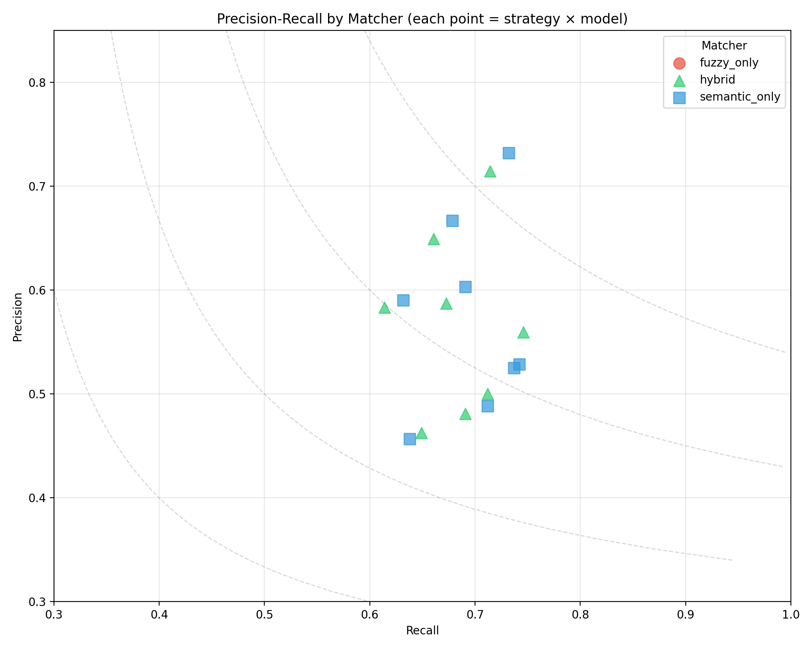
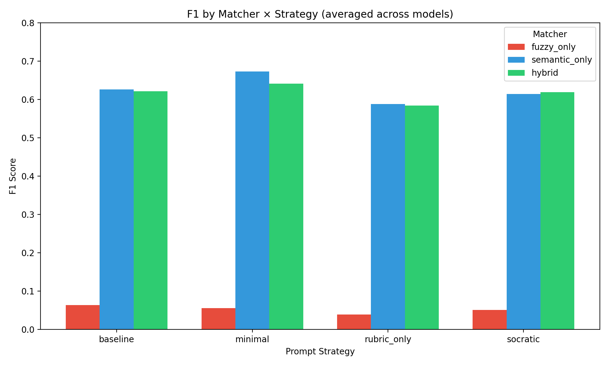
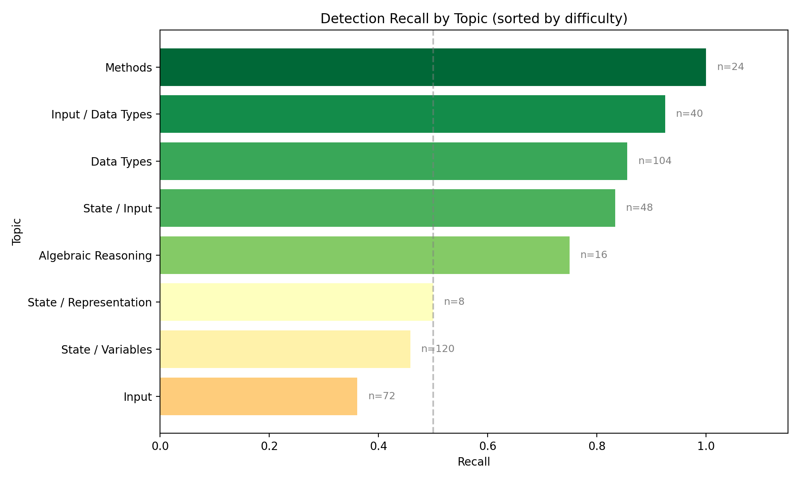
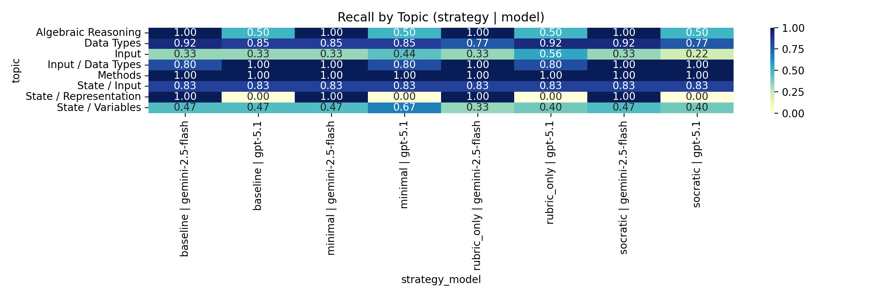

# LLM Misconception Detection: Analysis Report
_Generated: 2025-12-04T21:31:12.144081+00:00_

## Dataset & Run Configuration

### Dataset Summary
- **Assignment:** A2 – Kinematics & Geometry (CS1)
- **Students:** 60
- **Questions:** 4 (Q1, Q2, Q3, Q4)
- **Total files:** 240
- **Seeded files:** 54 (22.5%)
- **Clean files:** 186 (77.5%)
- **Detection opportunities:** 432

### Run Configuration
- **Generation seed:** 1764910377
- **Generation model:** gpt-5.1-2025-11-13
- **Match mode:** all (ablation)
- **Embedding model:** text-embedding-3-large (OpenAI)
- **Detection models:** GPT-5.1, Gemini 2.5 Flash
- **Strategies:** baseline, minimal, rubric_only, socratic

## Executive Highlights
- **Matcher Ablation Study**: Comparing fuzzy_only, semantic_only, and hybrid matchers.
- Bootstrap CIs included for statistical rigor.
- Same detection data, different matching strategies.

## Matcher Ablation: Fuzzy vs Semantic vs Hybrid

### Summary (averaged across strategies and models)
| Matcher | Total TP | Total FP | Total FN | Avg Precision | Avg Recall | Avg F1 |
|---------|----------|----------|----------|---------------|------------|--------|
| fuzzy_only | 36 | 770 | 397 | 0.039 | 0.083 | 0.052 |
| hybrid | 313 | 250 | 145 | 0.567 | 0.682 | 0.616 |
| semantic_only | 320 | 251 | 140 | 0.574 | 0.695 | 0.625 |

### Precision-Recall by Matcher

### Matcher × Strategy Distribution

### Full Results Table
| Matcher | Strategy | Model | TP | FP | FN | Precision | Recall | F1 | CI (F1) |
|---------|----------|-------|----|----|----|-----------|--------|----|---------|
| fuzzy_only | baseline | gemini-2.5-flash | 11 | 107 | 43 | 0.093 | 0.204 | 0.128 | 0.07–0.20 |
| fuzzy_only | baseline | gpt-5.1 | 0 | 61 | 54 | 0.000 | 0.000 | 0.000 | 0.00–0.00 |
| fuzzy_only | minimal | gemini-2.5-flash | 8 | 142 | 47 | 0.053 | 0.145 | 0.078 | 0.02–0.14 |
| fuzzy_only | minimal | gpt-5.1 | 2 | 66 | 52 | 0.029 | 0.037 | 0.033 | 0.00–0.08 |
| fuzzy_only | rubric_only | gemini-2.5-flash | 4 | 117 | 50 | 0.033 | 0.074 | 0.046 | 0.01–0.09 |
| fuzzy_only | rubric_only | gpt-5.1 | 2 | 71 | 52 | 0.027 | 0.037 | 0.031 | 0.00–0.08 |
| fuzzy_only | socratic | gemini-2.5-flash | 7 | 139 | 47 | 0.048 | 0.130 | 0.070 | 0.02–0.11 |
| fuzzy_only | socratic | gpt-5.1 | 2 | 67 | 52 | 0.029 | 0.037 | 0.033 | 0.00–0.08 |
| hybrid | baseline | gemini-2.5-flash | 42 | 42 | 17 | 0.500 | 0.712 | 0.587 | 0.47–0.70 |
| hybrid | baseline | gpt-5.1 | 37 | 20 | 19 | 0.649 | 0.661 | 0.655 | 0.54–0.76 |
| hybrid | minimal | gemini-2.5-flash | 38 | 41 | 17 | 0.481 | 0.691 | 0.567 | 0.46–0.67 |
| hybrid | minimal | gpt-5.1 | 40 | 16 | 16 | 0.714 | 0.714 | 0.714 | 0.59–0.81 |
| hybrid | rubric_only | gemini-2.5-flash | 37 | 43 | 20 | 0.463 | 0.649 | 0.540 | 0.43–0.65 |
| hybrid | rubric_only | gpt-5.1 | 37 | 26 | 18 | 0.587 | 0.673 | 0.627 | 0.51–0.73 |
| hybrid | socratic | gemini-2.5-flash | 47 | 37 | 16 | 0.560 | 0.746 | 0.639 | 0.53–0.73 |
| hybrid | socratic | gpt-5.1 | 35 | 25 | 22 | 0.583 | 0.614 | 0.598 | 0.47–0.71 |
| semantic_only | baseline | gemini-2.5-flash | 42 | 44 | 17 | 0.488 | 0.712 | 0.579 | 0.46–0.68 |
| semantic_only | baseline | gpt-5.1 | 38 | 19 | 18 | 0.667 | 0.679 | 0.673 | 0.56–0.79 |
| semantic_only | minimal | gemini-2.5-flash | 42 | 38 | 15 | 0.525 | 0.737 | 0.613 | 0.51–0.71 |
| semantic_only | minimal | gpt-5.1 | 41 | 15 | 15 | 0.732 | 0.732 | 0.732 | 0.62–0.84 |
| semantic_only | rubric_only | gemini-2.5-flash | 37 | 44 | 21 | 0.457 | 0.638 | 0.532 | 0.41–0.65 |
| semantic_only | rubric_only | gpt-5.1 | 38 | 25 | 17 | 0.603 | 0.691 | 0.644 | 0.53–0.75 |
| semantic_only | socratic | gemini-2.5-flash | 46 | 41 | 16 | 0.529 | 0.742 | 0.617 | 0.51–0.71 |
| semantic_only | socratic | gpt-5.1 | 36 | 25 | 21 | 0.590 | 0.632 | 0.610 | 0.49–0.72 |

## Topic Difficulty (Recall)
| Topic | Recall | N |
|-------|--------|---|
| Input | 0.361 | 72 |
| State / Variables | 0.458 | 120 |
| State / Representation | 0.500 | 8 |
| Algebraic Reasoning | 0.750 | 16 |
| State / Input | 0.833 | 48 |
| Data Types | 0.856 | 104 |
| Input / Data Types | 0.925 | 40 |
| Methods | 1.000 | 24 |

## Topic Heatmap

## Per-Misconception Detection Rates

Detection recall for each seeded misconception, sorted by difficulty (hardest to detect at top):

| ID | Misconception | Category | Recall | N |
|----|---------------|----------|--------|---|
| TYP-05 | Narrowing Cast in Division | Data Types | 0.00 | 8 |
| STA-06 | Default Zero Assumption | State / Variables | 0.00 | 8 |
| INP-02 | One Scanner Call Reads All | Input | 0.16 | 32 |
| STA-02 | Concrete Instance Fallacy | State / Variables | 0.30 | 56 |
| STA-05 | Display vs. Storage | State / Representation | 0.50 | 8 |
| INP-01 | Prompt-Logic Mismatch | Input | 0.53 | 40 |
| STA-01 | Spreadsheet View | State / Variables | 0.55 | 40 |
| ALG-01 | Precedence Blindness | Algebraic Reasoning | 0.75 | 16 |
| STA-04 | The Ghost Read | State / Input | 0.83 | 48 |
| TYP-04 | Premature Cast to Int | Data Types | 0.88 | 32 |
| INP-03 | Scanner Type Mismatch | Input / Data Types | 0.92 | 24 |
| TYP-01 | Integer Division Trap | Data Types | 0.94 | 32 |
| INP-04 | `parseInt` for Decimal Input | Input / Data Types | 0.94 | 16 |
| TYP-02 | Integer Coordinates | Data Types | 0.96 | 24 |
| API-02 | The Void Assumption | Methods | 1.00 | 24 |
| TYP-03 | Integer Sides | Data Types | 1.00 | 8 |
| STA-03 | Variable Clobbering | State / Variables | 1.00 | 16 |

## Hallucination Analysis

- **Calculation before input** (23 times)
- **Hardcoding Input Values Instead of Reading from User** (21 times)
- **Hardcoded input values** (16 times)
- **Hardcoding Input Values** (12 times)
- **Incorrect input parsing for multiple values on one line** (12 times)

## Methods
- Data: 60 students × 4 questions (seeded/clean) with manifest-driven ground truth.
- Detection: GPT-5.1 and Gemini 2.5 Flash across strategies (baseline, minimal, rubric_only, socratic).
- Matching: Ablation comparing fuzzy-only, semantic-only (text-embedding-3-large), and hybrid (fuzzy + semantic + topic prior).
- Metrics: Precision/Recall/F1 with bootstrap CIs; agreement via κ; significance via McNemar where applicable.

## Agreement & Significance
- baseline: κ=0.501, McNemar p=0.6650 (stat=0.188) | table={'both_correct': 30, 'only_a': 7, 'only_b': 5, 'both_wrong': 12}
- minimal: κ=0.346, McNemar p=0.8973 (stat=0.017) | table={'both_correct': 30, 'only_a': 7, 'only_b': 8, 'both_wrong': 9}
- rubric_only: κ=0.432, McNemar p=0.6885 (stat=0.161) | table={'both_correct': 28, 'only_a': 6, 'only_b': 8, 'both_wrong': 12}
- socratic: κ=0.359, McNemar p=0.1691 (stat=1.891) | table={'both_correct': 27, 'only_a': 11, 'only_b': 5, 'both_wrong': 11}