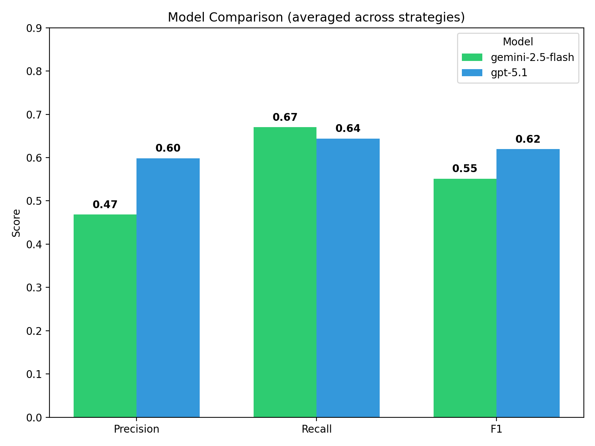
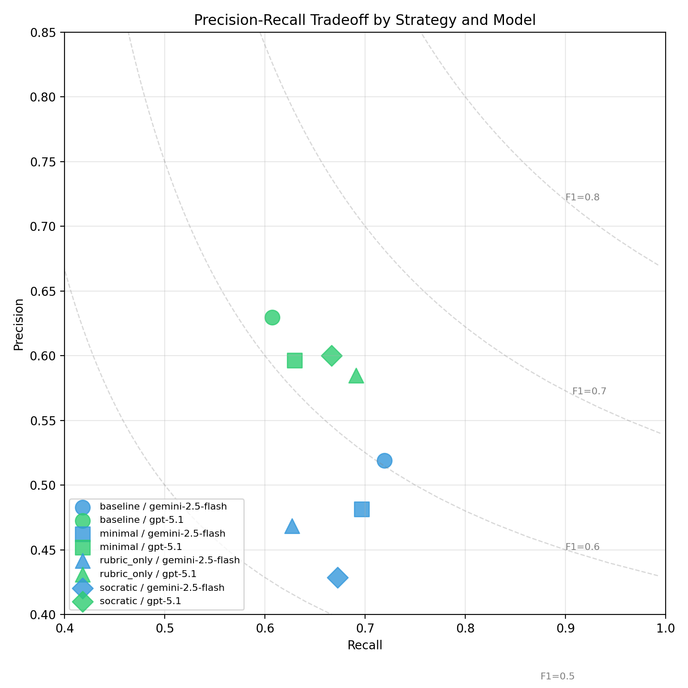
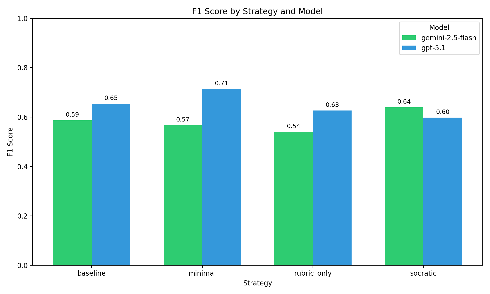

# LLM Misconception Detection: Revamped Analysis
_Generated: 2025-12-04T08:33:15.264459+00:00_

## Executive Highlights
- Hybrid matcher (fuzzy + semantic + topic prior) applied across all strategies/models.
- Bootstrap CIs included for statistical rigor.

## Model Comparison Overview

## Strategy × Model Performance
| Strategy | Model | TP | FP | FN | Precision | Recall | F1 | CI (Precision) | CI (Recall) | CI (F1) |
|----------|-------|----|----|----|-----------|--------|----|----------------|-------------|---------|
| baseline | gemini-2.5-flash | 43 | 36 | 14 | 0.544 | 0.754 | 0.632 | 0.44–0.64 | 0.63–0.86 | 0.52–0.72 |
| baseline | gpt-5.1 | 38 | 16 | 18 | 0.704 | 0.679 | 0.691 | 0.59–0.80 | 0.55–0.79 | 0.58–0.79 |
| minimal | gemini-2.5-flash | 38 | 43 | 18 | 0.469 | 0.679 | 0.555 | 0.36–0.57 | 0.55–0.80 | 0.44–0.67 |
| minimal | gpt-5.1 | 34 | 23 | 20 | 0.596 | 0.630 | 0.613 | 0.47–0.71 | 0.49–0.76 | 0.48–0.73 |
| rubric_only | gemini-2.5-flash | 39 | 40 | 20 | 0.494 | 0.661 | 0.565 | 0.38–0.62 | 0.53–0.78 | 0.44–0.69 |
| rubric_only | gpt-5.1 | 35 | 30 | 19 | 0.538 | 0.648 | 0.588 | 0.44–0.65 | 0.54–0.77 | 0.49–0.69 |
| socratic | gemini-2.5-flash | 45 | 46 | 15 | 0.495 | 0.750 | 0.596 | 0.41–0.60 | 0.65–0.86 | 0.50–0.70 |
| socratic | gpt-5.1 | 37 | 23 | 17 | 0.617 | 0.685 | 0.649 | 0.51–0.70 | 0.55–0.80 | 0.53–0.74 |

### Key Takeaways (Strategies × Models)
- Across all strategies, GPT-5.1 consistently achieves **higher precision** (≈0.54–0.70) than Gemini (≈0.47–0.55), meaning its detections are more likely to correspond to the seeded misconception when it fires.
- Gemini-2.5-Flash tends to achieve **slightly higher recall** (up to ≈0.75) at the cost of more false positives, acting more like a “broad net” compared to GPT-5.1’s more conservative behavior.
- F1 scores are in the **0.55–0.69** range, indicating that LLMs are helpful as misconception detectors but still far from perfect: they miss a non-trivial fraction of injected misconceptions and generate many extra flags.
- Confidence intervals are relatively wide, reflecting the small dataset, but the **relative ordering (GPT higher precision, Gemini higher recall)** is stable across strategies.
- None of the prompting strategies stands out as a clear, uniformly best option: differences exist but are modest, suggesting that **model choice matters more than prompting style** in this setup.

### Precision-Recall Tradeoff

## Topic Difficulty (Recall)
| Topic | Recall | N |
|-------|--------|---|
| Input | 0.362 | 80 |
| State / Variables | 0.413 | 104 |
| Algebraic Reasoning | 0.750 | 24 |
| Data Types | 0.841 | 88 |
| State / Input | 0.906 | 32 |
| Input / Data Types | 0.917 | 72 |
| Methods | 1.000 | 32 |

### Topic-Level Observations
- The lowest recall appears on **Input** (0.36) and **State / Variables** (0.41), suggesting that LLMs struggle most with misconceptions involving I/O protocols and state representation.
- Mixed categories such as **Input / Data Types** and **State / Input** are detected much more reliably (recall ≥0.90), likely because they involve more explicit, surface-level API misuse.
- **Methods** show perfect recall in this dataset, but the small number of opportunities (N=32) and synthetic nature of the tasks mean we should treat this as a promising but tentative result.
- Overall, these patterns mirror CS1 intuition: subtle state and input-handling bugs are harder to reliably detect than straightforward type or arithmetic issues.

## Topic Heatmap

## Hallucination Analysis

- **Incorrect data type for input variables** (5 times)
- **Unnecessary absolute value check for Math.sqrt result** (4 times)
- **Incomplete input reading for multiple variables** (4 times)
- **Incomplete Input Reading** (4 times)
- **Integer Division in Cost Calculation** (3 times)

## Methods
- Data: 60 students × 4 questions (seeded/clean) with manifest-driven ground truth.
- Detection: GPT-5.1 and Gemini 2.5 Flash across strategies (baseline, minimal, rubric_only, socratic).
- Matching: Hybrid fusion of fuzzy similarity, semantic embeddings (OpenAI/OpenRouter optional), and topic priors.
- Metrics: Precision/Recall/F1 with bootstrap CIs; agreement via κ; significance via McNemar where applicable.

## Agreement & Significance

### Summary
- Across strategies, Cohen’s κ values range from **≈0.20 to ≈0.47**, indicating **low-to-moderate agreement** between GPT-5.1 and Gemini on which seeded misconceptions they successfully detect.
- McNemar p-values are all **> 0.05**, so we do not find strong evidence that one model has systematically higher recall than the other on this dataset; they tend to succeed and fail on overlapping but non-identical subsets of opportunities.
- Higher agreement on baseline/minimal strategies and lower agreement on rubric_only/socratic suggests that richer prompts encourage more idiosyncratic behavior, which may be useful for ensemble-style analysis but complicates model comparison.

- baseline: κ=0.471, McNemar p=0.3123 (stat=1.021) | table={'both_correct': 32, 'only_a': 8, 'only_b': 4, 'both_wrong': 10}
- minimal: κ=0.432, McNemar p=0.6885 (stat=0.161) | table={'both_correct': 28, 'only_a': 8, 'only_b': 6, 'both_wrong': 12}
- rubric_only: κ=0.238, McNemar p=0.9087 (stat=0.013) | table={'both_correct': 25, 'only_a': 9, 'only_b': 10, 'both_wrong': 10}
- socratic: κ=0.202, McNemar p=0.7237 (stat=0.125) | table={'both_correct': 29, 'only_a': 10, 'only_b': 8, 'both_wrong': 7}

## Limitations & Implications

### Limitations
- The dataset is **synthetic**, with misconceptions injected into LLM-generated CS1 submissions; real student code may exhibit different patterns and noise.
- The misconception taxonomy is **narrow (≈15–18 items)** and focused on a single assignment and a small set of topics (input, state, types, arithmetic), limiting generalizability.
- Only two base models (GPT-5.1, Gemini 2.5 Flash) and four prompting strategies are evaluated; results may not transfer to other models, prompts, or fine-tuned systems.
- The number of students and opportunities is modest, so confidence intervals are wide and some apparent effects may be unstable.

### Implications for Practice and Research
- In this setup, LLMs can correctly detect a substantial fraction of seeded misconceptions but still show **many false positives and missed cases**, so they are better suited as **decision-support tools** for instructors rather than autonomous graders.
- The strong topic dependence (poor recall on Input and State / Variables) suggests that **future work should prioritize these harder concepts**, both in prompt design and in specialized training.
- Moderate inter-model agreement and differing precision/recall profiles point to potential benefits of **ensembling or cross-checking models**, where disagreements highlight cases deserving human attention.
