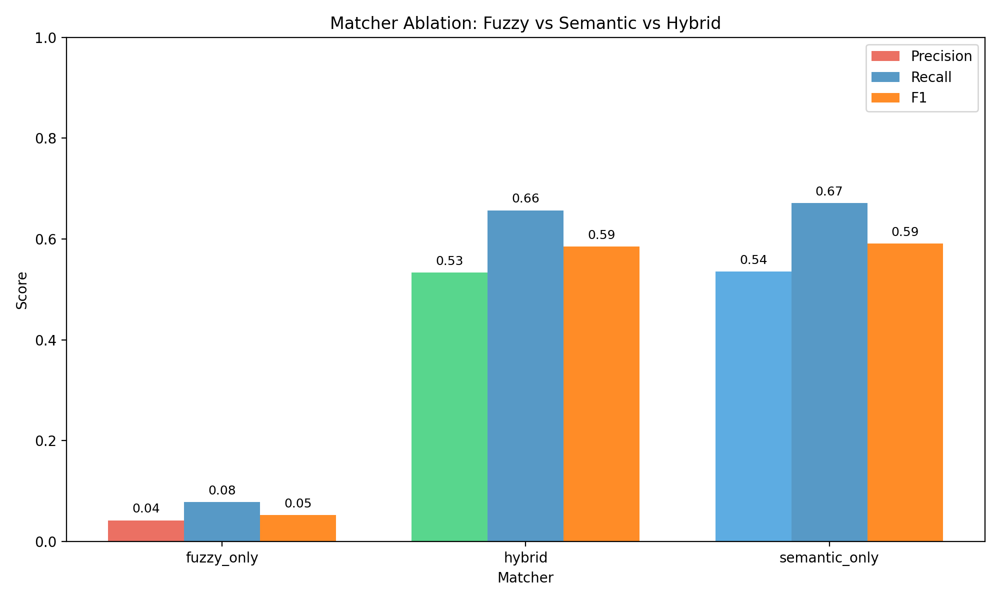
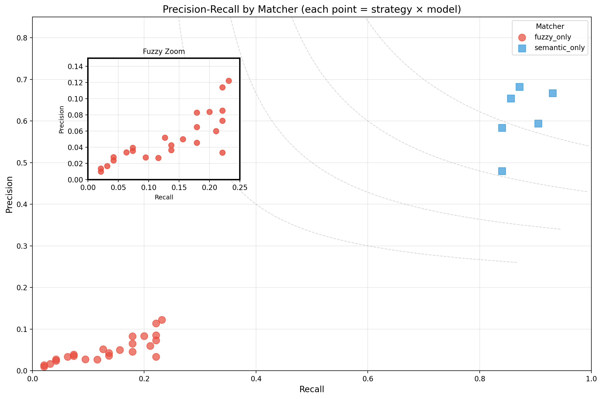
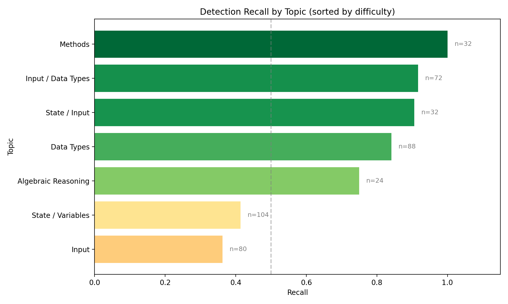
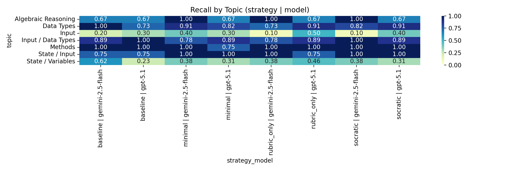
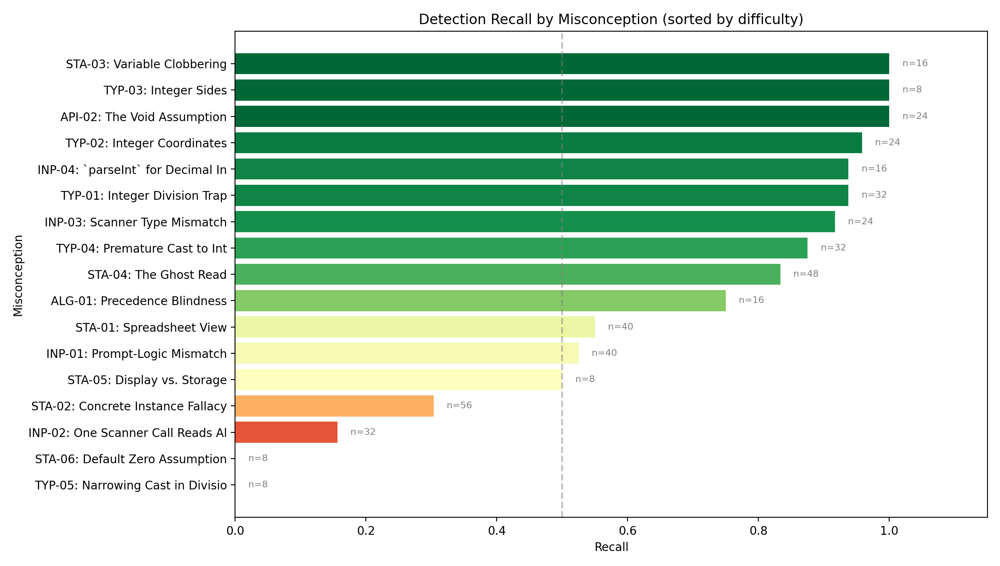
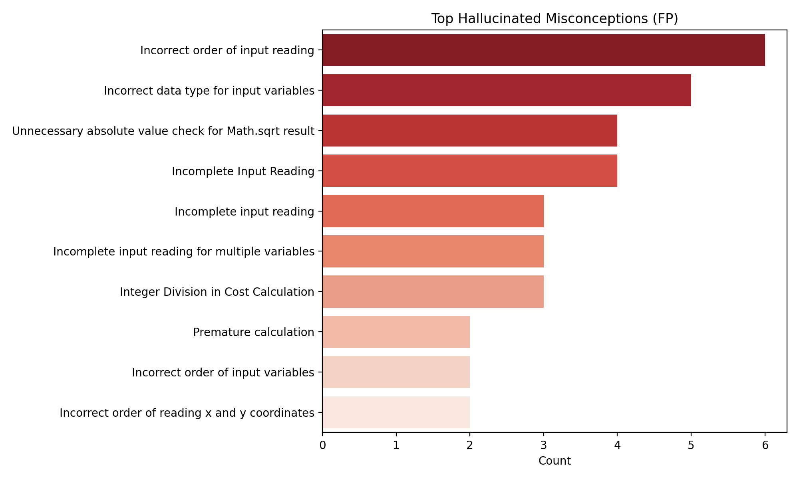

# LLM Misconception Detection: Analysis Report
_Generated: 2025-12-04T19:05:21.850654+00:00_

## Executive Highlights
- **Matcher Ablation Study**: Comparing fuzzy_only, semantic_only, and hybrid matchers.
- Bootstrap CIs included for statistical rigor.
- Same detection data, different matching strategies.

## Matcher Ablation: Fuzzy vs Semantic vs Hybrid

### Summary (averaged across strategies and models)
| Matcher | Total TP | Total FP | Total FN | Avg Precision | Avg Recall | Avg F1 |
|---------|----------|----------|----------|---------------|------------|--------|
| fuzzy_only | 34 | 798 | 400 | 0.042 | 0.078 | 0.053 |
| hybrid | 295 | 271 | 154 | 0.533 | 0.657 | 0.585 |
| semantic_only | 301 | 275 | 147 | 0.536 | 0.671 | 0.592 |

### Precision-Recall by Matcher

### Full Results Table
| Matcher | Strategy | Model | TP | FP | FN | Precision | Recall | F1 | CI (F1) |
|---------|----------|-------|----|----|----|-----------|--------|----|---------|
| fuzzy_only | baseline | gemini-2.5-flash | 6 | 118 | 48 | 0.048 | 0.111 | 0.067 | 0.02–0.12 |
| fuzzy_only | baseline | gpt-5.1 | 4 | 53 | 50 | 0.070 | 0.074 | 0.072 | 0.02–0.15 |
| fuzzy_only | minimal | gemini-2.5-flash | 6 | 160 | 49 | 0.036 | 0.109 | 0.054 | 0.01–0.11 |
| fuzzy_only | minimal | gpt-5.1 | 2 | 69 | 52 | 0.028 | 0.037 | 0.032 | 0.00–0.08 |
| fuzzy_only | rubric_only | gemini-2.5-flash | 4 | 118 | 50 | 0.033 | 0.074 | 0.045 | 0.01–0.09 |
| fuzzy_only | rubric_only | gpt-5.1 | 6 | 66 | 48 | 0.083 | 0.111 | 0.095 | 0.03–0.17 |
| fuzzy_only | socratic | gemini-2.5-flash | 6 | 147 | 49 | 0.039 | 0.109 | 0.058 | 0.01–0.12 |
| fuzzy_only | socratic | gpt-5.1 | 0 | 67 | 54 | 0.000 | 0.000 | 0.000 | 0.00–0.00 |
| hybrid | baseline | gemini-2.5-flash | 40 | 39 | 17 | 0.506 | 0.702 | 0.588 | 0.47–0.69 |
| hybrid | baseline | gpt-5.1 | 34 | 20 | 22 | 0.630 | 0.607 | 0.618 | 0.50–0.73 |
| hybrid | minimal | gemini-2.5-flash | 39 | 42 | 17 | 0.481 | 0.696 | 0.569 | 0.48–0.67 |
| hybrid | minimal | gpt-5.1 | 33 | 24 | 21 | 0.579 | 0.611 | 0.595 | 0.48–0.71 |
| hybrid | rubric_only | gemini-2.5-flash | 37 | 42 | 22 | 0.468 | 0.627 | 0.536 | 0.42–0.68 |
| hybrid | rubric_only | gpt-5.1 | 38 | 27 | 17 | 0.585 | 0.691 | 0.633 | 0.53–0.73 |
| hybrid | socratic | gemini-2.5-flash | 38 | 53 | 20 | 0.418 | 0.655 | 0.510 | 0.43–0.61 |
| hybrid | socratic | gpt-5.1 | 36 | 24 | 18 | 0.600 | 0.667 | 0.632 | 0.52–0.75 |
| semantic_only | baseline | gemini-2.5-flash | 40 | 39 | 16 | 0.506 | 0.714 | 0.593 | 0.47–0.71 |
| semantic_only | baseline | gpt-5.1 | 34 | 20 | 22 | 0.630 | 0.607 | 0.618 | 0.50–0.73 |
| semantic_only | minimal | gemini-2.5-flash | 41 | 44 | 16 | 0.482 | 0.719 | 0.577 | 0.46–0.69 |
| semantic_only | minimal | gpt-5.1 | 33 | 25 | 21 | 0.569 | 0.611 | 0.589 | 0.47–0.70 |
| semantic_only | rubric_only | gemini-2.5-flash | 41 | 39 | 18 | 0.512 | 0.695 | 0.590 | 0.49–0.71 |
| semantic_only | rubric_only | gpt-5.1 | 38 | 27 | 17 | 0.585 | 0.691 | 0.633 | 0.53–0.75 |
| semantic_only | socratic | gemini-2.5-flash | 38 | 57 | 19 | 0.400 | 0.667 | 0.500 | 0.40–0.59 |
| semantic_only | socratic | gpt-5.1 | 36 | 24 | 18 | 0.600 | 0.667 | 0.632 | 0.51–0.74 |

## Topic Difficulty (Recall)
| Topic | Recall | N |
|-------|--------|---|
| Input | 0.263 | 80 |
| State / Variables | 0.375 | 104 |
| Algebraic Reasoning | 0.792 | 24 |
| Data Types | 0.852 | 88 |
| Input / Data Types | 0.889 | 72 |
| State / Input | 0.906 | 32 |
| Methods | 0.969 | 32 |

## Topic Heatmap

## Per-Misconception Detection Rates

Detection recall for each seeded misconception, sorted by difficulty (hardest to detect at top):

| ID | Misconception | Category | Recall | N |
|----|---------------|----------|--------|---|
| INP-02 | One Scanner Call Reads All | Input | 0.20 | 40 |
| STA-02 | Concrete Instance Fallacy | State / Variables | 0.21 | 24 |
| STA-06 | Default Zero Assumption | State / Variables | 0.25 | 16 |
| INP-01 | Prompt-Logic Mismatch | Input | 0.33 | 40 |
| STA-07 | Swapped Variables After Read | State / Variables | 0.42 | 40 |
| STA-01 | Spreadsheet View | State / Variables | 0.54 | 24 |
| ALG-01 | Precedence Blindness | Algebraic Reasoning | 0.69 | 16 |
| INP-04 | `parseInt` for Decimal Input | Input / Data Types | 0.75 | 32 |
| TYP-04 | Premature Cast to Int | Data Types | 0.78 | 40 |
| TYP-05 | Narrowing Cast in Division | Data Types | 0.88 | 8 |
| STA-04 | The Ghost Read | State / Input | 0.91 | 32 |
| TYP-02 | Integer Coordinates | Data Types | 0.92 | 24 |
| TYP-01 | Integer Division Trap | Data Types | 0.94 | 16 |
| API-01 | Argument Commutativity | Methods | 0.96 | 24 |
| API-02 | The Void Assumption | Methods | 1.00 | 8 |
| ALG-02 | XOR as Power | Algebraic Reasoning | 1.00 | 8 |
| INP-03 | Scanner Type Mismatch | Input / Data Types | 1.00 | 40 |

## Hallucination Analysis

- **Incorrect order of input reading** (18 times)
- **Incorrect data type for input variables** (17 times)
- **Incorrect Scanner method for double input** (13 times)
- **Unnecessary absolute value check for Math.sqrt result** (12 times)
- **Incomplete Input Reading** (12 times)

## Methods
- Data: 60 students × 4 questions (seeded/clean) with manifest-driven ground truth.
- Detection: GPT-5.1 and Gemini 2.5 Flash across strategies (baseline, minimal, rubric_only, socratic).
- Matching: Ablation comparing fuzzy-only, semantic-only (text-embedding-3-large), and hybrid (fuzzy + semantic + topic prior).
- Metrics: Precision/Recall/F1 with bootstrap CIs; agreement via κ; significance via McNemar where applicable.

## Agreement & Significance
- baseline: κ=0.324, McNemar p=0.2751 (stat=1.191) | table={'both_correct': 26, 'only_a': 11, 'only_b': 6, 'both_wrong': 11}
- minimal: κ=0.354, McNemar p=0.3816 (stat=0.766) | table={'both_correct': 27, 'only_a': 10, 'only_b': 6, 'both_wrong': 11}
- rubric_only: κ=0.244, McNemar p=0.3019 (stat=1.066) | table={'both_correct': 25, 'only_a': 7, 'only_b': 12, 'both_wrong': 10}
- socratic: κ=0.514, McNemar p=0.6650 (stat=0.188) | table={'both_correct': 29, 'only_a': 5, 'only_b': 7, 'both_wrong': 13}